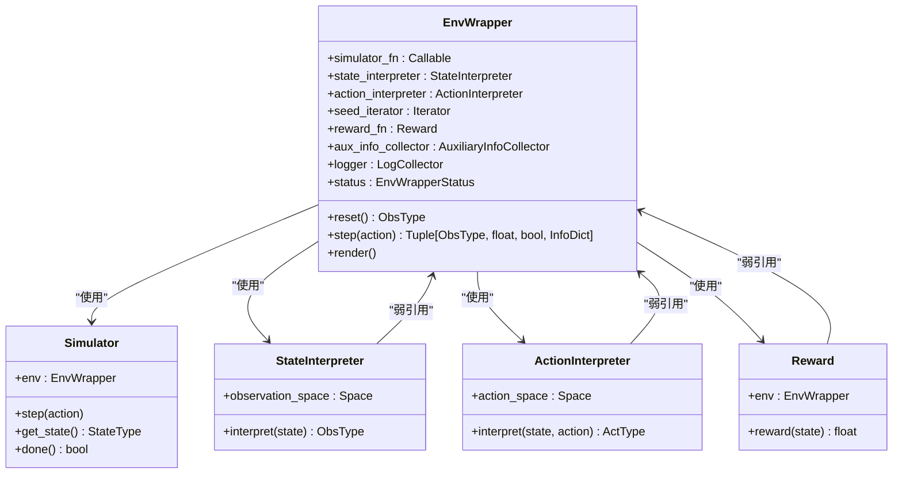
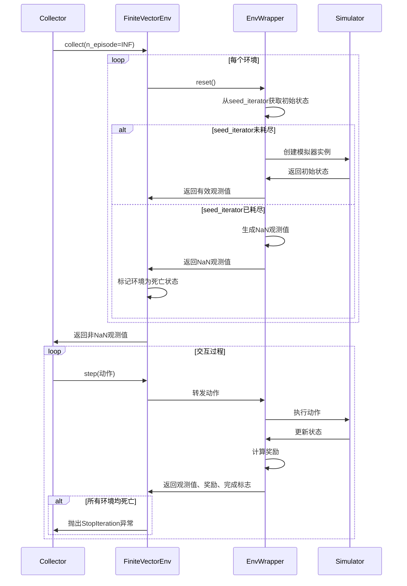
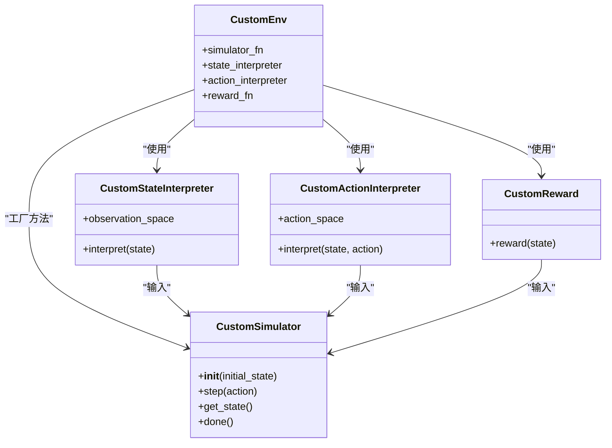
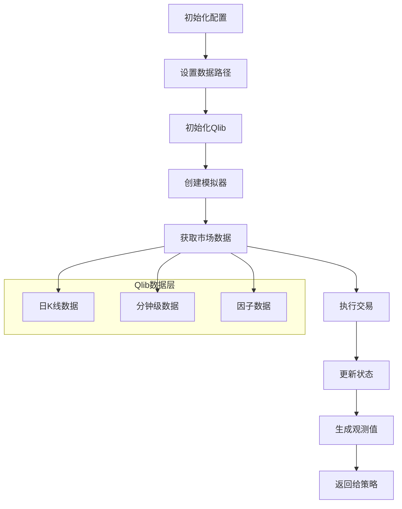
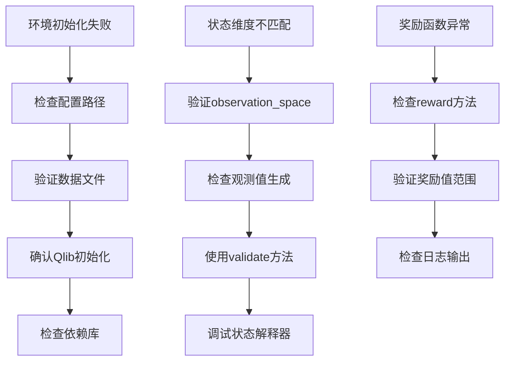
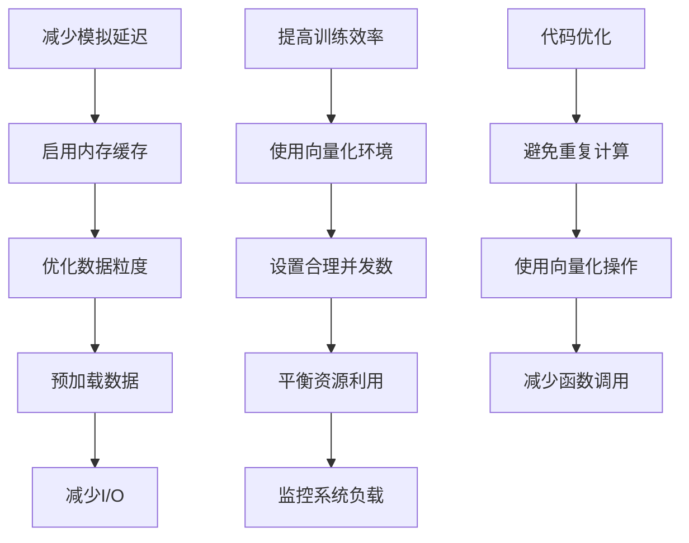

# 环境封装机制

<cite>
**本文档中引用的文件**  
- [env_wrapper.py](file://qlib/rl/utils/env_wrapper.py)
- [finite_env.py](file://qlib/rl/utils/finite_env.py)
- [simulator.py](file://qlib/rl/simulator.py)
- [interpreter.py](file://qlib/rl/interpreter.py)
- [reward.py](file://qlib/rl/reward.py)
- [integration.py](file://qlib/rl/data/integration.py)
- [simulator_qlib.py](file://qlib/rl/order_execution/simulator_qlib.py)
- [state.py](file://qlib/rl/order_execution/state.py)
</cite>

## 目录
1. [引言](#引言)
2. [环境封装设计](#环境封装设计)
3. [有限时间步长控制](#有限时间步长控制)
4. [自定义交易环境构建](#自定义交易环境构建)
5. [Qlib数据层集成](#qlib数据层集成)
6. [常见问题排查](#常见问题排查)
7. [性能优化建议](#性能优化建议)
8. [结论](#结论)

## 引言

Qlib的强化学习框架通过环境封装机制将金融交易场景抽象为符合OpenAI Gym标准的接口。该机制的核心是`EnvWrapper`类，它作为连接强化学习策略与金融模拟器的桥梁，实现了标准化的交互协议。通过将模拟器、状态解释器、动作解释器和奖励函数等组件进行封装，开发者可以专注于策略设计而无需关心底层实现细节。这种设计模式不仅提高了代码的可重用性，还确保了与主流强化学习框架（如Tianshou）的兼容性。

**环境封装机制**通过分层架构实现了金融交易环境的模块化设计。最底层是基于Qlib回测工具的模拟器，负责执行具体的交易逻辑；中间层是解释器，负责在策略与模拟器之间进行数据格式转换；最上层是环境包装器，提供标准的Gym接口。这种分层设计使得各个组件可以独立开发和测试，同时也便于不同策略之间的迁移和比较。

## 环境封装设计

`EnvWrapper`类作为Qlib强化学习环境的核心封装，继承自`gym.Env`并实现了标准的强化学习接口。该类通过组合模式将多个组件（模拟器、状态解释器、动作解释器、奖励函数等）集成到一个统一的环境中。在初始化过程中，`EnvWrapper`会为各个组件建立弱引用，避免循环引用问题，同时确保组件可以在不同环境之间复用。

**代码路径**  
- [env_wrapper.py](file://qlib/rl/utils/env_wrapper.py#L51-L251)
- [simulator.py](file://qlib/rl/simulator.py#L21-L76)

`EnvWrapper`的`reset`方法负责初始化模拟器并生成初始状态。该方法首先从`seed_iterator`中获取初始状态，然后调用`simulator_fn`创建相应的模拟器实例。如果`seed_iterator`为空，则生成一个无效的（NaN）观测值，表示环境已耗尽。`step`方法则实现了强化学习的标准交互流程：接收策略动作、通过动作解释器转换为模拟器可接受的格式、更新模拟器状态、获取新的观测值和奖励。

## 有限时间步长控制

`finite_env.py`文件实现了有限时间步长控制机制，解决了在向量化环境中如何优雅地处理环境耗尽的问题。该机制的核心是`FiniteVectorEnv`类，它继承自Tianshou的`BaseVectorEnv`并扩展了对有限数据流的支持。当单个环境耗尽时，`FiniteVectorEnv`会自动将其标记为"死亡"状态，并在后续的`reset`和`step`操作中跳过该环境。

**代码路径**  
- [finite_env.py](file://qlib/rl/utils/finite_env.py#L89-L370)
- [env_wrapper.py](file://qlib/rl/utils/env_wrapper.py#L146-L194)

该机制通过`generate_nan_observation`和`check_nan_observation`函数实现。当环境耗尽时，`generate_nan_observation`会根据观测空间的定义生成一个包含NaN值的观测值，而`check_nan_observation`则用于检测这种特殊观测值。`FiniteVectorEnv`在收集到所有环境的观测值后，会过滤掉包含NaN的观测值，并仅对存活的环境进行后续操作。当所有环境都耗尽时，会抛出`StopIteration`异常，通知收集器停止收集。

## 自定义交易环境构建

构建自定义交易环境的关键在于继承和扩展基础封装类。开发者需要实现四个核心组件：模拟器、状态解释器、动作解释器和奖励函数。以单资产订单执行为例，`SingleAssetOrderExecution`类作为模拟器，负责执行具体的交易逻辑；`CurrentStepStateInterpreter`作为状态解释器，将模拟器状态转换为策略可理解的观测值；`TwapRelativeActionInterpreter`作为动作解释器，将策略输出的动作转换为具体的交易指令。

**代码路径**  
- [simulator_qlib.py](file://qlib/rl/order_execution/simulator_qlib.py#L19-L142)
- [state.py](file://qlib/rl/order_execution/state.py#L70-L102)
- [interpreter.py](file://qlib/rl/interpreter.py#L35-L98)

状态空间的定义通过`observation_space`属性实现，通常使用Gym的`spaces`模块来定义。例如，可以定义一个包含市场行情、账户信息和订单状态的字典空间。动作空间的定义类似，可以是离散的（如买入、卖出、持有）或连续的（如交易比例）。奖励函数的注入通过`reward_fn`参数实现，开发者可以自定义奖励计算逻辑，如基于收益率、风险调整收益或交易成本的奖励。

## Qlib数据层集成

环境封装层与Qlib数据层的集成主要通过`init_qlib`函数实现。该函数负责初始化Qlib的配置，包括数据路径、特征列和日历提供者等。在`SingleAssetOrderExecution`模拟器的初始化过程中，会调用`init_qlib`来设置数据源，确保模拟器能够实时获取市场行情和因子数据。

**代码路径**  
- [integration.py](file://qlib/rl/data/integration.py#L18-L83)
- [simulator_qlib.py](file://qlib/rl/order_execution/simulator_qlib.py#L70-L71)

`init_qlib`函数接受一个包含配置信息的字典，其中包括不同时间粒度的数据路径（如`provider_uri_day`、`provider_uri_1min`）和特征列（如`feature_columns_today`、`feature_columns_yesterday`）。这些配置信息会被传递给Qlib的`init`函数，用于设置数据提供者和特征提供者。一旦Qlib初始化完成，模拟器就可以通过Qlib的API访问历史行情和实时数据。

## 常见问题排查

环境初始化失败通常由以下原因导致：配置文件路径错误、数据文件缺失或Qlib初始化失败。检查`qlib_config`中的`provider_uri`路径是否正确，确保数据文件存在且格式正确。如果使用相对路径，需要确认工作目录是否正确。此外，检查`init_qlib`函数的调用是否在模拟器创建之前完成。

状态维度不匹配问题通常出现在状态解释器的实现中。确保`observation_space`定义的维度与实际生成的观测值维度一致。使用`validate`方法可以自动检查观测值是否符合定义的空间。如果使用字典空间，确保所有键都存在且类型正确。对于数组空间，检查形状和数据类型是否匹配。

**代码路径**  
- [env_wrapper.py](file://qlib/rl/utils/env_wrapper.py#L240-L245)
- [interpreter.py](file://qlib/rl/interpreter.py#L48-L50)

奖励函数异常可能由数值溢出或除零错误引起。在`reward`方法中添加适当的边界检查和异常处理可以提高鲁棒性。使用`log`方法记录关键变量的值有助于调试。此外，确保奖励函数不会引入未来信息泄漏，特别是在使用滚动窗口统计量时。

## 性能优化建议

减少模拟延迟的关键在于优化数据访问和计算效率。首先，启用Qlib的内存缓存功能，避免重复读取相同的数据。其次，合理设置数据粒度，对于不需要高频率数据的场景，使用日K线而非分钟线数据。此外，可以预加载常用数据到内存中，减少I/O开销。

并行化是提高训练效率的有效手段。使用`FiniteSubprocVectorEnv`或`FiniteShmemVectorEnv`可以实现多进程并行环境模拟。通过`vectorize_env`辅助函数可以方便地创建向量化环境。合理设置并发数，通常建议设置为CPU核心数的70-80%，以平衡资源利用率和上下文切换开销。

**代码路径**  
- [finite_env.py](file://qlib/rl/utils/finite_env.py#L313-L370)
- [env_wrapper.py](file://qlib/rl/utils/env_wrapper.py#L117-L119)

在代码层面，避免在循环中进行重复计算，尽量使用向量化操作替代循环。对于复杂的数学运算，考虑使用NumPy或Cython进行优化。此外，合理使用弱引用可以避免内存泄漏，特别是在长时间运行的训练任务中。定期监控内存使用情况，及时释放不再需要的对象。

## 结论

Qlib的环境封装机制通过分层设计和模块化架构，成功地将复杂的金融交易场景抽象为标准化的强化学习环境。`EnvWrapper`类作为核心组件，实现了Gym接口并集成了模拟器、解释器和奖励函数等关键模块。有限时间步长控制机制通过`FiniteVectorEnv`类解决了向量化环境中环境耗尽的问题，确保了训练过程的稳定性和可靠性。

自定义交易环境的构建过程清晰明了，开发者只需实现模拟器、状态解释器、动作解释器和奖励函数四个组件即可。与Qlib数据层的深度集成使得环境能够实时获取高质量的市场行情和因子数据，为策略训练提供了坚实的基础。通过遵循本文档提供的最佳实践和优化建议，可以有效提升环境的性能和稳定性，为金融强化学习研究和应用提供强有力的支持。