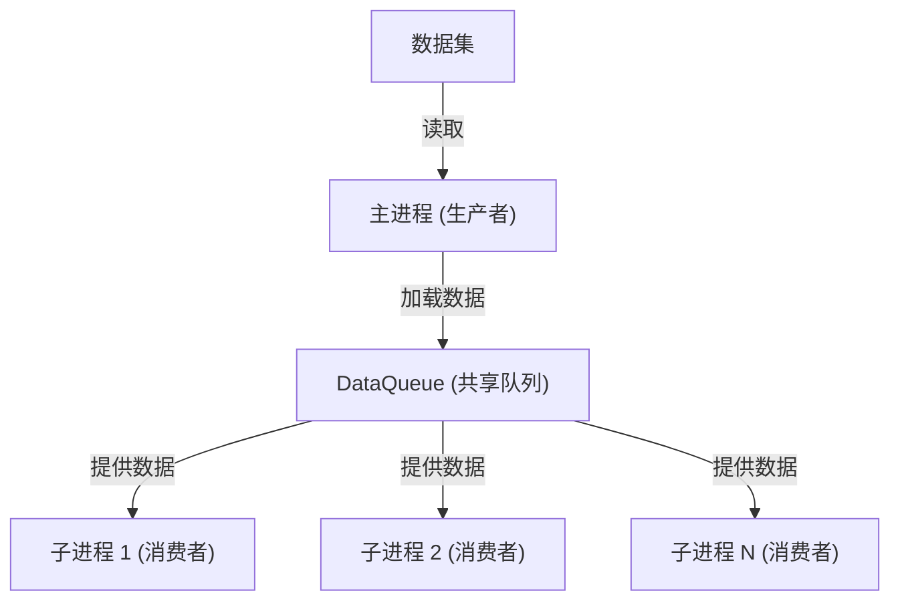
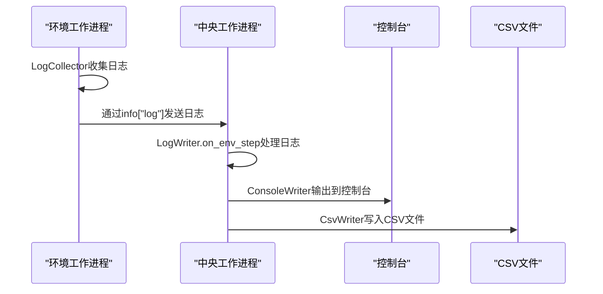

# 辅助功能模块

<cite>
**本文档中引用的文件**  
- [aux_info.py](file://qlib/rl/aux_info.py)
- [data_queue.py](file://qlib/rl/utils/data_queue.py)
- [log.py](file://qlib/rl/utils/log.py)
- [test_data_queue.py](file://tests/rl/test_data_queue.py)
- [test_logger.py](file://tests/rl/test_logger.py)
- [vessel.py](file://qlib/rl/trainer/vessel.py)
</cite>

## 目录
1. [引言](#引言)
2. [辅助信息注入机制](#辅助信息注入机制)
3. [多进程数据队列机制](#多进程数据队列机制)
4. [日志记录系统](#日志记录系统)
5. [实际应用与扩展](#实际应用与扩展)
6. [典型问题与解决方案](#典型问题与解决方案)
7. [总结](#总结)

## 引言

在强化学习训练框架中，除了核心的策略、奖励和环境模拟器之外，辅助功能模块在构建稳定、可复现的实验中扮演着至关重要的角色。本文档系统性地文档化QLib强化学习框架中的三个核心辅助组件：`aux_info.py`中的辅助信息注入机制、`data_queue.py`中的多进程数据缓冲与同步机制，以及`log.py`提供的分布式日志记录接口。这些组件共同确保了训练过程的高效性、透明性和可调试性。

## 辅助信息注入机制

`aux_info.py`文件定义了`AuxiliaryInfoCollector`类，其设计目的是在强化学习训练过程中，将非交易状态信息（如风险指标、持仓统计、市场状态标记等）注入到环境的状态中，从而增强策略的决策能力。

该机制的核心是一个泛型类`AuxiliaryInfoCollector`，它接受两个类型参数：`StateType`（模拟器状态类型）和`AuxInfoType`（辅助信息类型）。用户可以通过继承此类并重写`collect`方法来实现自定义的辅助信息收集逻辑。`collect`方法接收一个来自`simulator.get_state()`的模拟器状态作为输入，并返回需要注入的辅助信息。

在多智能体强化学习（Multi-agent RL）场景中，这种机制尤为有用，因为它允许为每个智能体收集和注入特定的上下文信息，而这些信息可能不直接包含在交易状态中。例如，可以注入整个投资组合的风险敞口、市场波动率指标或宏观经济信号，使策略能够基于更全面的上下文做出决策。

**Section sources**
- [aux_info.py](file://qlib/rl/aux_info.py#L21-L43)

## 多进程数据队列机制

`data_queue.py`文件实现了`DataQueue`类，该类为多进程训练场景提供了高效的数据缓冲与同步机制，确保了环境与模型之间的高效通信。

`DataQueue`的设计遵循生产者-消费者模式。主进程作为生产者，从给定的`dataset`中读取数据并将其放入一个共享队列中。多个子进程（消费者）则从该队列中检索数据点。`DataQueue`利用PyTorch的`DataLoader`来实现数据加载和多进程处理，同时通过`multiprocessing.Queue`进行进程间通信。

关键特性包括：
- **可配置的重复次数**：`repeat`参数控制数据集被迭代的次数，`-1`表示无限循环。
- **随机化**：`shuffle`参数允许数据以随机顺序读取。
- **并发加载**：`producer_num_workers`参数指定用于数据加载的并发工作进程数。
- **队列大小限制**：`queue_maxsize`参数防止队列无限增长，避免内存溢出。若未指定，系统会根据CPU核心数自动设置一个合理的默认值。

`DataQueue`是短暂的（ephemeral），当`repeat`次数耗尽时，必须创建一个新的实例。它通过`with`语句管理资源，确保在使用完毕后正确清理。`activate()`方法启动一个守护线程来运行生产者逻辑，而`cleanup()`方法则负责在退出时清空队列并释放资源。

在实际应用中，`DataQueue`常用于为训练、验证和测试阶段提供初始状态。例如，在`vessel.py`中，`train_seed_iterator`方法使用`DataQueue`为训练过程提供无限循环且随机打乱的初始状态流。



**Diagram sources**
- [data_queue.py](file://qlib/rl/utils/data_queue.py#L24-L188)

**Section sources**
- [data_queue.py](file://qlib/rl/utils/data_queue.py#L24-L188)
- [test_data_queue.py](file://tests/rl/test_data_queue.py#L39-L57)
- [vessel.py](file://qlib/rl/trainer/vessel.py#L147-L161)

## 日志记录系统

`log.py`文件提供了一套完整的分布式日志记录系统，由`LogCollector`和`LogWriter`两个核心组件构成，支持对训练过程的全面监控与调试。

### 分布式日志架构

该系统采用分布式架构：
- **`LogCollector`**：运行在每个环境工作进程中。它负责从模拟器状态中收集日志信息，并将这些信息以字典的形式添加到`env.step()`返回的`info`字段的`"log"`键下。
- **`LogWriter`**：运行在中央工作进程中。它负责解码从各个`LogCollector`收集到的字典，并将日志写入控制台、文件或TensorBoard等后端。

两者通过`env.step()`返回的`info`字典中的`"log"`字段进行通信，实现了进程间日志信息的传递。

### 核心组件

**`LogCollector`**：
- 提供了多种`add_*`方法来记录不同类型的日志，如`add_scalar`（标量）、`add_string`（字符串）、`add_array`（数组/数据框）和`add_any`（任意对象）。
- 支持日志级别（`LogLevel`），包括`DEBUG`、`PERIODIC`、`INFO`和`CRITICAL`，可以根据`min_loglevel`参数过滤日志，优化网络和管道流量。
- 在每一步开始时，必须调用`reset()`方法来清除上一步的收集内容。

**`LogWriter`**：
- 是一个基类，定义了日志处理的通用接口。具体的实现类（如`ConsoleWriter`、`CsvWriter`）负责将日志写入不同的目标。
- 维护了关于训练过程的运行时信息，如`episode_count`（回合计数）、`step_count`（步数计数）、`episode_rewards`（回合奖励）和`episode_logs`（回合日志）。
- 通过`on_env_step`和`on_env_reset`等回调方法，在环境的每一步和重置时被触发，负责聚合和处理日志。

### 具体实现

- **`ConsoleWriter`**：将日志周期性地输出到控制台。它为每个指标维护一个平均值计数器，显示格式为`<名称> <最新值> (<平均值>)`，便于实时监控训练进度。
- **`CsvWriter`**：将每个回合的聚合指标转储到`result.csv`文件中，便于后续分析。
- **`LogBuffer`**：将所有数值指标保留在内存中，并通过回调函数通知训练器，适用于在训练过程中动态跟踪指标。



**Diagram sources**
- [log.py](file://qlib/rl/utils/log.py#L58-L523)

**Section sources**
- [log.py](file://qlib/rl/utils/log.py#L58-L523)
- [test_logger.py](file://tests/rl/test_logger.py#L70-L86)

## 实际应用与扩展

### 扩展辅助信息机制

要扩展`aux_info`机制以支持自定义风险信号注入，可以创建一个继承自`AuxiliaryInfoCollector`的子类。例如，可以实现一个`RiskSignalCollector`，它在`collect`方法中计算并返回当前持仓的VaR（风险价值）或波动率。

```python
class RiskSignalCollector(AuxiliaryInfoCollector[StateType, Dict[str, float]]):
    def collect(self, simulator_state: StateType) -> Dict[str, float]:
        # 计算风险指标
        var = self.calculate_var(simulator_state.position)
        volatility = self.calculate_volatility(simulator_state.market_data)
        return {"VaR": var, "volatility": volatility}
```

然后，将此收集器集成到环境包装器（`EnvWrapper`）中，使其在每一步都调用并注入这些风险信号。

### 集成示例

在`test_logger.py`的测试用例中，展示了`LogCollector`和`LogWriter`的完整集成流程：
1. 创建一个`SimpleEnv`，在其`step`方法中使用`LogCollector`记录标量和数组。
2. 使用`vectorize_env`函数创建一个向量化环境，并将`ConsoleWriter`和`CsvWriter`作为日志写入器传入。
3. 启动一个`Collector`进行数据收集。
4. `LogWriter`自动聚合日志，并将结果输出到控制台和CSV文件。

## 典型问题与解决方案

### 信息延迟

**问题**：在多进程环境中，由于进程间通信的开销，日志或辅助信息可能会出现延迟，导致监控信息滞后于实际训练状态。

**解决方案**：
- 优化`DataQueue`的`queue_maxsize`和`producer_num_workers`参数，确保数据流的平滑。
- 对于关键的实时监控，可以考虑在主进程中增加一个轻量级的监控代理，直接从共享内存中读取状态，减少通信延迟。

### 队列阻塞

**问题**：`DataQueue`可能因为消费者处理速度慢于生产者而被填满，导致生产者阻塞，进而影响整个训练流程。

**解决方案**：
- **合理设置队列大小**：避免设置过大的`queue_maxsize`，防止内存耗尽；同时避免过小，导致频繁阻塞。
- **异常处理与清理**：`DataQueue`的`cleanup`方法设计了健壮的清理逻辑，通过多次尝试清空队列并等待潜在的数据到达，确保在异常退出时能正确释放资源。
- **监控队列状态**：在生产者逻辑中增加对`self._done.value`的检查，一旦收到终止信号，立即停止生产，防止向已关闭的队列中写入数据。

## 总结

`aux_info.py`、`data_queue.py`和`log.py`这三个辅助功能模块是QLib强化学习框架稳定性和可扩展性的基石。辅助信息注入机制为策略提供了超越交易状态的丰富上下文；多进程数据队列机制确保了在高并发训练场景下的高效数据流；而分布式日志系统则为实验的监控、调试和复现提供了强有力的支持。通过深入理解这些组件的设计与实现，开发者可以更有效地构建和优化复杂的强化学习交易策略。