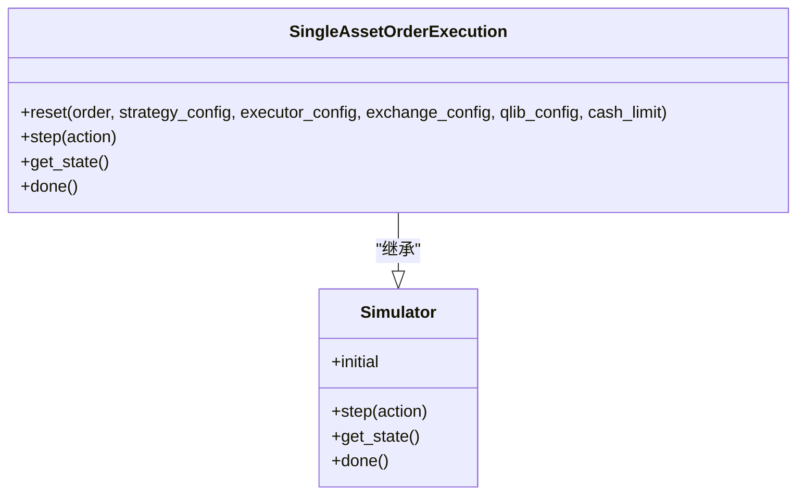
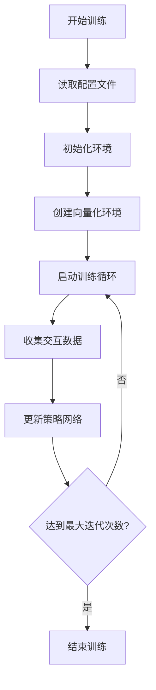
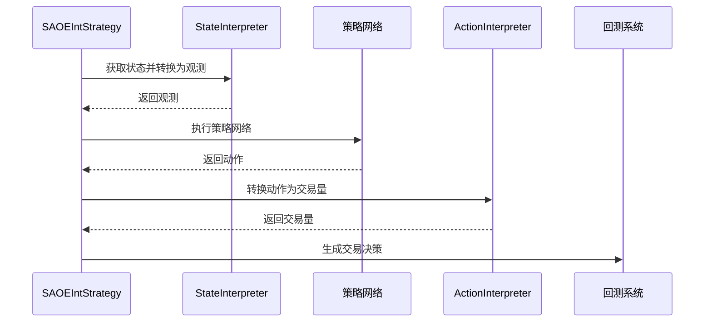
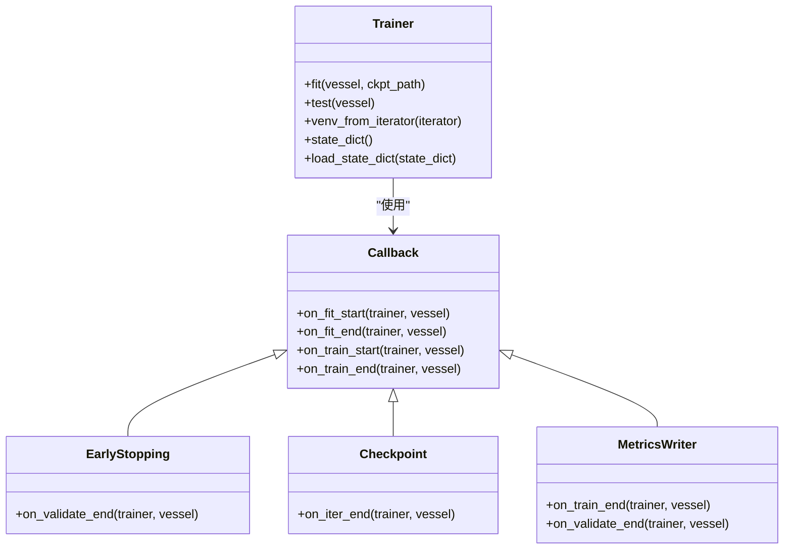

# 强化学习模型

<cite>
**本文档引用的文件**   
- [policy.py](file://qlib/rl/order_execution/policy.py)
- [reward.py](file://qlib/rl/order_execution/reward.py)
- [state.py](file://qlib/rl/order_execution/state.py)
- [simulator_qlib.py](file://qlib/rl/order_execution/simulator_qlib.py)
- [interpreter.py](file://qlib/rl/order_execution/interpreter.py)
- [env_wrapper.py](file://qlib/rl/utils/env_wrapper.py)
- [finite_env.py](file://qlib/rl/utils/finite_env.py)
- [trainer.py](file://qlib/rl/trainer/trainer.py)
- [train_ppo.yml](file://examples/rl_order_execution/exp_configs/train_ppo.yml)
- [train_opds.yml](file://examples/rl_order_execution/exp_configs/train_opds.yml)
- [network.py](file://qlib/rl/order_execution/network.py)
- [strategy.py](file://qlib/rl/order_execution/strategy.py)
- [callbacks.py](file://qlib/rl/trainer/callbacks.py)
</cite>

## 目录
1. [简介](#简介)
2. [核心组件协同机制](#核心组件协同机制)
3. [训练配置与算法实现](#训练配置与算法实现)
4. [策略到交易指令的映射](#策略到交易指令的映射)
5. [环境封装与回调机制](#环境封装与回调机制)
6. [开发路径与扩展潜力](#开发路径与扩展潜力)

## 简介
Qlib框架中的强化学习模型为订单执行等连续决策场景提供了完整的解决方案。该框架通过策略网络、奖励函数、状态空间和模拟器的协同工作，实现了在交易成本优化中的高级算法应用。通过分析rl/order_execution目录下的核心组件，可以深入理解PPO、OPDS等算法如何在实际交易场景中实现。

## 核心组件协同机制

### 策略网络（policy.py）
策略网络是强化学习模型的核心决策组件，负责根据当前状态生成最优动作。在Qlib中，策略网络通过继承Tianshou框架的BasePolicy类实现，并针对订单执行场景进行了专门优化。

策略网络包含三种主要类型：
- **AllOne**: 非学习型策略，输出恒定值，适用于TWAP等基线策略
- **PPO**: 基于近端策略优化算法的策略网络，支持离散动作空间
- **DQN**: 基于深度Q网络的策略网络，同样支持离散动作空间

PPO策略网络通过PPOActor和PPOCritic两个子网络实现，其中PPOActor负责生成动作概率分布，PPOCritic负责评估状态价值。这种架构设计允许策略网络在训练过程中同时优化策略和价值函数。

**Section sources**
- [policy.py](file://qlib/rl/order_execution/policy.py#L1-L238)

### 奖励函数（reward.py）
奖励函数是强化学习模型的指导信号，直接影响策略的学习方向。Qlib提供了两种主要的奖励函数实现：

**PAPenaltyReward**: 鼓励更高的价格优势（PA），但惩罚在短时间内大量交易的行为。其奖励计算公式为：(PA_t * vol_t / target - vol_t^2 * penalty)，通过平衡价格优势和交易冲击来优化交易成本。

**PPOReward**: 基于论文"An End-to-End Optimal Trade Execution Framework based on Proximal Policy Optimization"提出的奖励函数。该奖励函数在交易完成时计算VWAP与TWAP的价格比率，根据比率大小返回-1.0、0.0或1.0的奖励值。

奖励函数的设计充分考虑了金融交易的特殊性，通过惩罚过度集中的交易行为来避免市场冲击，同时鼓励获得更好的执行价格。

**Section sources**
- [reward.py](file://qlib/rl/order_execution/reward.py#L1-L100)

### 状态空间（state.py）
状态空间定义了强化学习模型的观测输入，是策略决策的基础。Qlib中的状态空间通过SAOEState类实现，包含了订单执行过程中的关键信息：

- **订单信息**: 当前处理的订单详情
- **时间信息**: 当前时间和步骤
- **持仓信息**: 当前剩余待执行的交易量
- **历史记录**: 历史交易执行情况和步骤记录
- **回测数据**: 包含完整交易日数据的回测数据源
- **时间索引**: 交易日内的所有时间点索引

状态空间的设计考虑了金融时间序列的特性，通过提供完整的历史信息和未来数据的隔离机制（通过_mask_future_info方法），确保了模型训练的合理性和实用性。

**Section sources**
- [state.py](file://qlib/rl/order_execution/state.py#L1-L102)

### 模拟器（simulator_qlib.py）
模拟器是连接强化学习模型与真实交易环境的桥梁。Qlib中的SingleAssetOrderExecution模拟器基于Qlib回测工具实现，提供了真实的市场环境模拟。

模拟器的主要功能包括：
- **环境初始化**: 根据订单信息初始化交易环境
- **状态获取**: 提供当前交易状态的完整信息
- **动作执行**: 执行策略生成的交易动作
- **完成判断**: 判断交易是否完成

模拟器通过collect_data_loop机制与Qlib的回测系统集成，能够真实模拟市场交易过程，包括价格发现、成交量限制等市场微观结构特征。

**Diagram sources**
- [simulator_qlib.py](file://qlib/rl/order_execution/simulator_qlib.py#L1-L142)

## 训练配置与算法实现

### 训练配置文件分析
通过分析train_ppo.yml和train_opds.yml两个训练配置文件，可以深入了解PPO和OPDS算法的实现细节。

**PPO算法配置特点**:
- 使用PPOReward作为奖励函数
- 状态解释器采用FullHistoryStateInterpreter，考虑完整的历史信息
- 动作解释器采用CategoricalActionInterpreter，将离散动作转换为连续交易量
- 网络结构采用Recurrent架构，适合处理时间序列数据

**OPDS算法配置特点**:
- 使用PAPenaltyReward作为奖励函数
- 其他配置与PPO基本相同，体现了算法的通用性

**Section sources**
- [train_ppo.yml](file://examples/rl_order_execution/exp_configs/train_ppo.yml#L1-L68)
- [train_opds.yml](file://examples/rl_order_execution/exp_configs/train_opds.yml#L1-L67)

## 策略到交易指令的映射

### 解释器机制（interpreter.py）
解释器是连接强化学习策略与具体交易指令的关键组件。Qlib提供了两种主要的解释器：

**状态解释器**:
- **FullHistoryStateInterpreter**: 考虑完整历史信息的状态解释器，提供包括处理后的数据、交易状态、时间信息等在内的完整观测空间
- **CurrentStepStateInterpreter**: 仅考虑当前步骤的状态解释器，适用于不需要历史信息的简单策略

**动作解释器**:
- **CategoricalActionInterpreter**: 将离散策略动作转换为连续交易量，支持预定义的动作值列表或自动生成等分动作值
- **TwapRelativeActionInterpreter**: 将连续比率转换为交易量，比率相对于剩余交易日的TWAP策略

解释器机制的设计体现了模块化思想，允许用户根据具体需求选择合适的解释器组合，实现从抽象策略到具体交易指令的灵活映射。

**Section sources**
- [interpreter.py](file://qlib/rl/order_execution/interpreter.py#L1-L258)

### 与回测系统集成
强化学习策略通过SAOEIntStrategy类与Qlib回测系统集成。该策略类继承自SAOEStrategy，实现了完整的交易决策流程：

1. **状态获取**: 通过get_saoe_state_by_order方法获取当前订单的状态
2. **观测转换**: 使用状态解释器将状态转换为策略网络的输入
3. **策略执行**: 调用策略网络生成动作
4. **动作转换**: 使用动作解释器将策略动作转换为实际交易量
5. **交易决策生成**: 创建包含具体交易指令的TradeDecisionWithDetails对象

这种集成方式确保了强化学习策略能够无缝接入Qlib的回测框架，实现从研究到实盘的平滑过渡。

**Diagram sources**
- [strategy.py](file://qlib/rl/order_execution/strategy.py#L1-L552)

## 环境封装与回调机制

### 环境封装（env_wrapper.py）
环境封装器EnvWrapper是强化学习框架的核心组件，它将模拟器、状态解释器、动作解释器和奖励函数等组件封装成标准的Gym环境接口。

EnvWrapper的主要特性包括：
- **标准化接口**: 实现Gym.Env接口，兼容各种强化学习算法库
- **状态管理**: 维护环境状态，包括当前步骤、完成状态、历史记录等
- **组件集成**: 协调各个组件的工作流程
- **日志记录**: 集成日志收集功能，便于调试和分析

环境封装器的设计遵循了单一职责原则，将复杂的环境管理逻辑集中在一个组件中，提高了代码的可维护性和可扩展性。

**Section sources**
- [env_wrapper.py](file://qlib/rl/utils/env_wrapper.py#L1-L251)

### 有限环境模拟（finite_env.py）
有限环境模拟器FiniteVectorEnv解决了并行环境中的种子队列耗尽问题。当数据队列耗尽时，它会生成特殊的"NaN观测"来标记环境的终止状态。

该组件的主要功能包括：
- **工作进程管理**: 跟踪活跃的工作进程ID
- **观测处理**: 检测和处理无效观测
- **日志收集**: 集成日志写入功能
- **异常处理**: 通过StopIteration异常通知训练循环结束

有限环境模拟器的设计考虑了分布式训练的实际需求，确保了在不同并行模式下的一致行为。

**Section sources**
- [finite_env.py](file://qlib/rl/utils/finite_env.py#L1-L370)

### 训练器（trainer.py）
训练器Trainer是整个强化学习训练流程的控制中心。它负责协调数据收集、策略更新、验证和检查点保存等任务。

训练器的核心特性包括：
- **迭代式训练**: 以"收集"为基本迭代单位，而非传统的"epoch"
- **回调机制**: 支持多种回调函数，如EarlyStopping、Checkpoint、MetricsWriter等
- **状态管理**: 提供完整的状态保存和恢复功能
- **并行支持**: 通过vectorize_env函数支持多种并行环境

训练器的设计借鉴了PyTorch Lightning的理念，但针对强化学习的特点进行了专门优化，提供了更符合强化学习工作流的API。

**Diagram sources**
- [trainer.py](file://qlib/rl/trainer/trainer.py#L1-L356)
- [callbacks.py](file://qlib/rl/trainer/callbacks.py#L1-L292)

## 开发路径与扩展潜力

### 完整开发路径
从环境定义到在线部署的完整开发路径包括以下步骤：

1. **环境定义**: 定义状态空间、动作空间和奖励函数
2. **策略设计**: 选择合适的策略网络架构和算法
3. **训练配置**: 编写训练配置文件，设置超参数
4. **模型训练**: 执行训练流程，监控训练过程
5. **模型验证**: 在验证集上评估模型性能
6. **回测验证**: 在真实市场环境中进行回测
7. **在线部署**: 将训练好的模型部署到生产环境

### 扩展潜力
该框架在以下场景具有良好的扩展潜力：

**算法交易**:
- 可以扩展到多资产交易场景
- 支持更复杂的订单类型和交易策略
- 可以集成市场预测模型作为状态输入

**投资组合再平衡**:
- 支持多资产组合的协同优化
- 可以考虑资产间的相关性
- 支持风险约束的优化

**其他金融场景**:
- 适用于做市商策略
- 可用于风险管理决策
- 支持高频交易策略

框架的模块化设计使其能够灵活适应不同的应用场景，通过替换或扩展特定组件即可实现新的功能，体现了良好的可扩展性和可维护性。