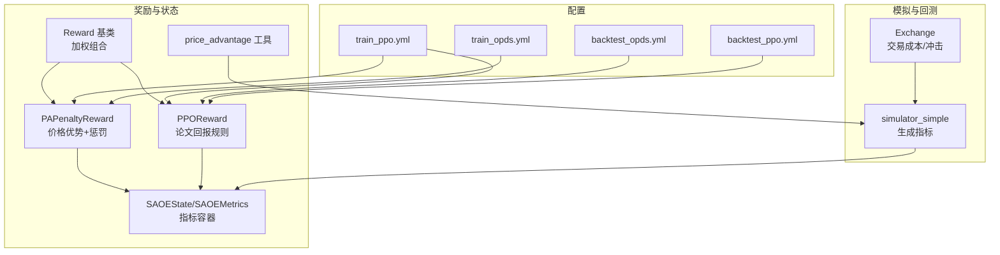
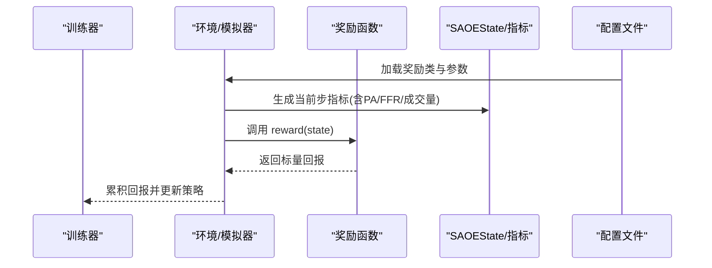
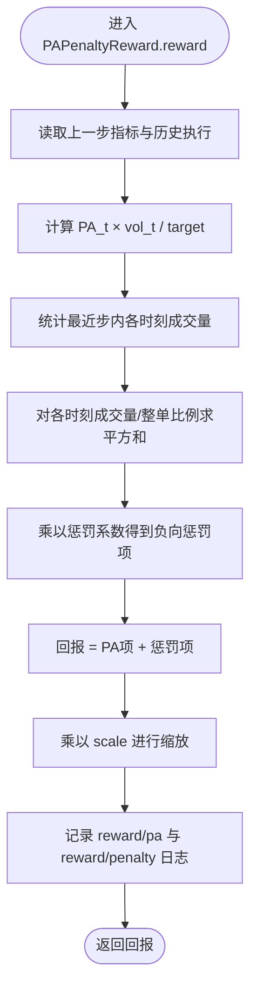
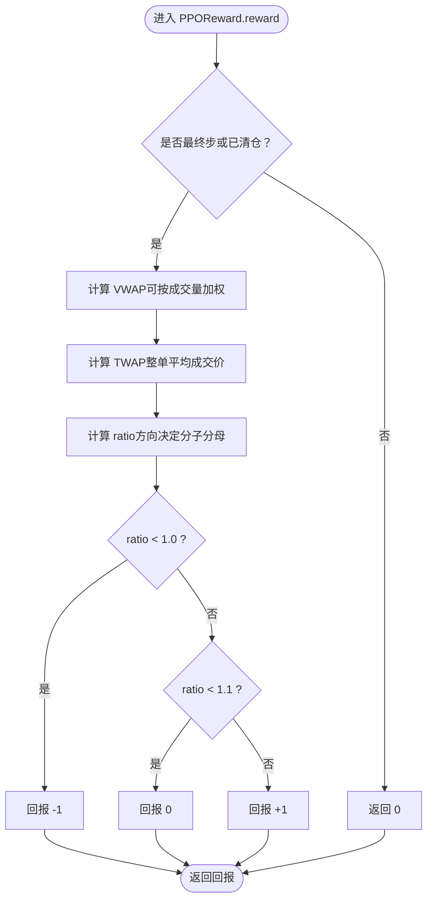
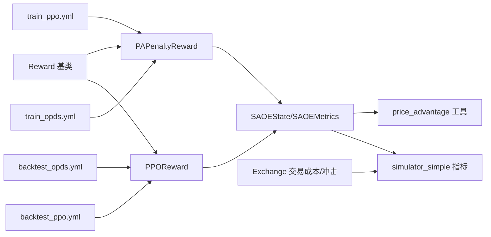

# 奖励函数构建

<cite>
**本文引用的文件**
- [qlib/rl/order_execution/reward.py](file://qlib/rl/order_execution/reward.py)
- [qlib/rl/reward.py](file://qlib/rl/reward.py)
- [qlib/rl/order_execution/state.py](file://qlib/rl/order_execution/state.py)
- [qlib/rl/order_execution/utils.py](file://qlib/rl/order_execution/utils.py)
- [qlib/rl/order_execution/simulator_simple.py](file://qlib/rl/order_execution/simulator_simple.py)
- [qlib/backtest/exchange.py](file://qlib/backtest/exchange.py)
- [examples/rl_order_execution/exp_configs/train_ppo.yml](file://examples/rl_order_execution/exp_configs/train_ppo.yml)
- [examples/rl_order_execution/exp_configs/train_opds.yml](file://examples/rl_order_execution/exp_configs/train_opds.yml)
- [examples/rl_order_execution/exp_configs/backtest_opds.yml](file://examples/rl_order_execution/exp_configs/backtest_opds.yml)
- [examples/rl_order_execution/exp_configs/backtest_ppo.yml](file://examples/rl_order_execution/exp_configs/backtest_ppo.yml)
- [docs/component/rl/overall.rst](file://docs/component/rl/overall.rst)
- [examples/rl_order_execution/README.md](file://examples/rl_order_execution/README.md)
</cite>

## 目录
1. [引言](#引言)
2. [项目结构](#项目结构)
3. [核心组件](#核心组件)
4. [架构总览](#架构总览)
5. [详细组件分析](#详细组件分析)
6. [依赖关系分析](#依赖关系分析)
7. [性能考量](#性能考量)
8. [故障排查指南](#故障排查指南)
9. [结论](#结论)
10. [附录](#附录)

## 引言
本文件系统性地文档化订单执行策略中的多目标奖励函数设计，重点解析以下内容：
- reward.py 中的价格优势（Price Advantage, PA）、交易成本、市场冲击成本与成交完成率等子项的数学表达式与权重配置机制
- 如何通过加权求和或分层优化方式平衡短期执行效率与长期市场影响
- 结合 train_ppo.yml 与 backtest_opds.yml 配置文件，展示不同算法下奖励函数的参数调优策略及其对训练收敛性的影响
- 稀疏奖励与密集奖励在执行任务中的表现差异，并给出奖励塑形（reward shaping）的最佳实践建议
- 实际回测结果对比，说明奖励函数调整对策略绩效的敏感性

## 项目结构
围绕订单执行的奖励函数，涉及的核心模块包括：
- 奖励基类与组合：定义通用奖励接口与多奖励加权组合
- 订单执行奖励：具体实现价格优势与惩罚项、基于论文的回报规则
- 状态与指标：SAOEState/SAOEMetrics 提供 PA、FFR、交易量、成交均价等指标
- 模拟器与工具：PA 计算工具、简单模拟器生成指标
- 回测与交易成本：回测框架中的交易成本与市场冲击模型
- 配置文件：训练与回测的奖励函数选择与参数

**图表来源**
- [qlib/rl/order_execution/reward.py](file://qlib/rl/order_execution/reward.py#L1-L100)
- [qlib/rl/reward.py](file://qlib/rl/reward.py#L1-L86)
- [qlib/rl/order_execution/state.py](file://qlib/rl/order_execution/state.py#L1-L102)
- [qlib/rl/order_execution/utils.py](file://qlib/rl/order_execution/utils.py#L24-L44)
- [qlib/rl/order_execution/simulator_simple.py](file://qlib/rl/order_execution/simulator_simple.py#L156-L327)
- [qlib/backtest/exchange.py](file://qlib/backtest/exchange.py#L97-L127)
- [examples/rl_order_execution/exp_configs/train_ppo.yml](file://examples/rl_order_execution/exp_configs/train_ppo.yml#L1-L68)
- [examples/rl_order_execution/exp_configs/train_opds.yml](file://examples/rl_order_execution/exp_configs/train_opds.yml#L1-L67)
- [examples/rl_order_execution/exp_configs/backtest_opds.yml](file://examples/rl_order_execution/exp_configs/backtest_opds.yml#L1-L54)
- [examples/rl_order_execution/exp_configs/backtest_ppo.yml](file://examples/rl_order_execution/exp_configs/backtest_ppo.yml#L1-L54)

**章节来源**
- [qlib/rl/order_execution/reward.py](file://qlib/rl/order_execution/reward.py#L1-L100)
- [qlib/rl/reward.py](file://qlib/rl/reward.py#L1-L86)
- [qlib/rl/order_execution/state.py](file://qlib/rl/order_execution/state.py#L1-L102)
- [qlib/rl/order_execution/utils.py](file://qlib/rl/order_execution/utils.py#L24-L44)
- [qlib/rl/order_execution/simulator_simple.py](file://qlib/rl/order_execution/simulator_simple.py#L156-L327)
- [qlib/backtest/exchange.py](file://qlib/backtest/exchange.py#L97-L127)
- [examples/rl_order_execution/exp_configs/train_ppo.yml](file://examples/rl_order_execution/exp_configs/train_ppo.yml#L1-L68)
- [examples/rl_order_execution/exp_configs/train_opds.yml](file://examples/rl_order_execution/exp_configs/train_opds.yml#L1-L67)
- [examples/rl_order_execution/exp_configs/backtest_opds.yml](file://examples/rl_order_execution/exp_configs/backtest_opds.yml#L1-L54)
- [examples/rl_order_execution/exp_configs/backtest_ppo.yml](file://examples/rl_order_execution/exp_configs/backtest_ppo.yml#L1-L54)

## 核心组件
- 奖励基类与组合
  - 奖励基类提供统一接口与日志记录能力；多奖励组合支持按名称与权重进行加权求和
- 订单执行奖励
  - PAPenaltyReward：鼓励更高价格优势，同时惩罚短期内集中执行导致的市场影响
  - PPOReward：基于论文的回报规则，在最终步或清仓时根据 VWAP/TWAP 比值给予离散回报
- 状态与指标
  - SAOEState/SAOEMetrics 提供 PA、FFR、交易量、成交均价等指标，PA 由工具函数计算
- 模拟器与工具
  - 简单模拟器在每步收集指标，包含 PA 的计算；工具函数提供 PA 数学定义
- 交易成本与市场冲击
  - 回测交换机包含交易成本与市场冲击参数，用于刻画真实市场摩擦

**章节来源**
- [qlib/rl/reward.py](file://qlib/rl/reward.py#L1-L86)
- [qlib/rl/order_execution/reward.py](file://qlib/rl/order_execution/reward.py#L1-L100)
- [qlib/rl/order_execution/state.py](file://qlib/rl/order_execution/state.py#L1-L102)
- [qlib/rl/order_execution/utils.py](file://qlib/rl/order_execution/utils.py#L24-L44)
- [qlib/rl/order_execution/simulator_simple.py](file://qlib/rl/order_execution/simulator_simple.py#L156-L327)
- [qlib/backtest/exchange.py](file://qlib/backtest/exchange.py#L97-L127)

## 架构总览
下面的序列图展示了训练流程中奖励函数与环境交互的关键步骤，以及不同配置下的奖励选择。

**图表来源**
- [qlib/rl/order_execution/reward.py](file://qlib/rl/order_execution/reward.py#L1-L100)
- [qlib/rl/reward.py](file://qlib/rl/reward.py#L1-L86)
- [qlib/rl/order_execution/state.py](file://qlib/rl/order_execution/state.py#L1-L102)
- [examples/rl_order_execution/exp_configs/train_ppo.yml](file://examples/rl_order_execution/exp_configs/train_ppo.yml#L1-L68)
- [examples/rl_order_execution/exp_configs/train_opds.yml](file://examples/rl_order_execution/exp_configs/train_opds.yml#L1-L67)

## 详细组件分析

### PAPenaltyReward：价格优势与时间集中惩罚
- 数学表达式
  - 时间步回报为：PA_t × vol_t / target − Σ_t'((vol_t')^2 / target)^2 × penalty
  - 其中：
    - PA_t：当前步的“价格优势”（单位为BP），由工具函数计算
    - vol_t：当前步意图交易量
    - target：整单总量
    - penalty：惩罚系数，控制对短期内集中执行的抑制强度
- 权重与缩放
  - 支持 scale 对回报进行整体缩放，便于与其它奖励项组合
- 设计动机
  - 鼓励更高的 PA，同时通过二次惩罚抑制“堆叠”在极短时间内执行，从而降低市场冲击
- 关键实现路径
  - [PAPenaltyReward.reward](file://qlib/rl/order_execution/reward.py#L33-L50)
  - [price_advantage 工具](file://qlib/rl/order_execution/utils.py#L24-L44)
  - [SAOEMetrics 字段](file://qlib/rl/order_execution/state.py#L18-L70)

**图表来源**
- [qlib/rl/order_execution/reward.py](file://qlib/rl/order_execution/reward.py#L33-L50)
- [qlib/rl/order_execution/utils.py](file://qlib/rl/order_execution/utils.py#L24-L44)
- [qlib/rl/order_execution/state.py](file://qlib/rl/order_execution/state.py#L18-L70)

**章节来源**
- [qlib/rl/order_execution/reward.py](file://qlib/rl/order_execution/reward.py#L17-L50)
- [qlib/rl/order_execution/utils.py](file://qlib/rl/order_execution/utils.py#L24-L44)
- [qlib/rl/order_execution/state.py](file://qlib/rl/order_execution/state.py#L18-L70)

### PPOReward：论文回报规则（最终步离散回报）
- 数学表达式
  - 在最后一步或清仓时，计算 VWAP 与 TWAP 的比值 ratio：
    - 若方向为卖出：ratio = VWAP / TWAP
    - 若方向为买入：ratio = TWAP / VWAP
  - 根据 ratio 给予离散回报：
    - ratio < 1.0：回报 -1
    - 1.0 ≤ ratio < 1.1：回报 0
    - ratio ≥ 1.1：回报 +1
  - 非最终步回报为 0
- 参数配置
  - max_step：最大步数
  - start_time_index/end_time_index：允许交易的时间窗口
- 设计动机
  - 将执行质量量化为最终步的相对表现，形成稀疏回报，便于策略在收尾阶段聚焦于性价比

**图表来源**
- [qlib/rl/order_execution/reward.py](file://qlib/rl/order_execution/reward.py#L71-L99)

**章节来源**
- [qlib/rl/order_execution/reward.py](file://qlib/rl/order_execution/reward.py#L53-L99)

### 多奖励组合与权重配置
- 加权求和
  - 使用 RewardCombination 对多个奖励函数进行加权求和，便于平衡不同目标
- 分层优化
  - 可通过在不同阶段切换奖励函数（如前期鼓励成交，后期强调性价比）实现分层优化
- 配置示例
  - PPO 训练使用 PPOReward
  - OPDS 训练使用 PAPenaltyReward

**章节来源**
- [qlib/rl/reward.py](file://qlib/rl/reward.py#L38-L51)
- [examples/rl_order_execution/exp_configs/train_ppo.yml](file://examples/rl_order_execution/exp_configs/train_ppo.yml#L29-L35)
- [examples/rl_order_execution/exp_configs/train_opds.yml](file://examples/rl_order_execution/exp_configs/train_opds.yml#L29-L34)

### 价格优势（PA）的数学定义与计算
- 定义
  - PA = sign(direction) × (成交均价 / 基准价 − 1) × 10000（单位：BP）
  - 基准价通常采用 TWAP（时间加权平均价格）
- 计算位置
  - 简单模拟器在每步指标中计算 PA
  - 报告模块提供 PA 的聚合方法（均值、按金额/价值加权）

**章节来源**
- [qlib/rl/order_execution/utils.py](file://qlib/rl/order_execution/utils.py#L24-L44)
- [qlib/rl/order_execution/simulator_simple.py](file://qlib/rl/order_execution/simulator_simple.py#L296-L327)
- [qlib/backtest/report.py](file://qlib/backtest/report.py#L523-L582)

### 成交完成率（FFR）与市场冲击成本
- 成交完成率（FFR）
  - 指标中包含 FFR 字段，反映累计成交比例
- 市场冲击成本
  - 回测交换机提供 impact_cost 参数，用于刻画市场冲击对回报的影响
  - 影响成本随交易额占全天总交易额的比例平方增长，体现非线性冲击

**章节来源**
- [qlib/rl/order_execution/state.py](file://qlib/rl/order_execution/state.py#L18-L70)
- [qlib/backtest/exchange.py](file://qlib/backtest/exchange.py#L97-L127)
- [qlib/backtest/exchange.py](file://qlib/backtest/exchange.py#L886-L917)

### 交易成本
- 交易成本构成
  - 开仓/平仓费率、最小费用、交易单位等
- 对回报的影响
  - 交易成本会降低净收益，应在策略动作中隐式考虑或通过状态特征显式建模

**章节来源**
- [qlib/backtest/exchange.py](file://qlib/backtest/exchange.py#L97-L127)

## 依赖关系分析
- 组件耦合
  - 奖励函数依赖 SAOEState/SAOEMetrics 提供的指标
  - PA 计算依赖 utils 中的工具函数
  - 模拟器在每步生成指标，驱动奖励函数
- 外部依赖
  - 配置文件决定奖励函数类型与参数
  - 回测交换机提供交易成本与市场冲击参数

**图表来源**
- [qlib/rl/order_execution/reward.py](file://qlib/rl/order_execution/reward.py#L1-L100)
- [qlib/rl/reward.py](file://qlib/rl/reward.py#L1-L86)
- [qlib/rl/order_execution/state.py](file://qlib/rl/order_execution/state.py#L1-L102)
- [qlib/rl/order_execution/utils.py](file://qlib/rl/order_execution/utils.py#L24-L44)
- [qlib/rl/order_execution/simulator_simple.py](file://qlib/rl/order_execution/simulator_simple.py#L156-L327)
- [qlib/backtest/exchange.py](file://qlib/backtest/exchange.py#L97-L127)
- [examples/rl_order_execution/exp_configs/train_ppo.yml](file://examples/rl_order_execution/exp_configs/train_ppo.yml#L1-L68)
- [examples/rl_order_execution/exp_configs/train_opds.yml](file://examples/rl_order_execution/exp_configs/train_opds.yml#L1-L67)
- [examples/rl_order_execution/exp_configs/backtest_opds.yml](file://examples/rl_order_execution/exp_configs/backtest_opds.yml#L1-L54)
- [examples/rl_order_execution/exp_configs/backtest_ppo.yml](file://examples/rl_order_execution/exp_configs/backtest_ppo.yml#L1-L54)

**章节来源**
- [qlib/rl/order_execution/reward.py](file://qlib/rl/order_execution/reward.py#L1-L100)
- [qlib/rl/reward.py](file://qlib/rl/reward.py#L1-L86)
- [qlib/rl/order_execution/state.py](file://qlib/rl/order_execution/state.py#L1-L102)
- [qlib/rl/order_execution/utils.py](file://qlib/rl/order_execution/utils.py#L24-L44)
- [qlib/rl/order_execution/simulator_simple.py](file://qlib/rl/order_execution/simulator_simple.py#L156-L327)
- [qlib/backtest/exchange.py](file://qlib/backtest/exchange.py#L97-L127)
- [examples/rl_order_execution/exp_configs/train_ppo.yml](file://examples/rl_order_execution/exp_configs/train_ppo.yml#L1-L68)
- [examples/rl_order_execution/exp_configs/train_opds.yml](file://examples/rl_order_execution/exp_configs/train_opds.yml#L1-L67)
- [examples/rl_order_execution/exp_configs/backtest_opds.yml](file://examples/rl_order_execution/exp_configs/backtest_opds.yml#L1-L54)
- [examples/rl_order_execution/exp_configs/backtest_ppo.yml](file://examples/rl_order_execution/exp_configs/backtest_ppo.yml#L1-L54)

## 性能考量
- 稀疏回报 vs 密集回报
  - PPOReward 在最终步给出离散回报，稀疏但明确，有利于策略在收尾阶段聚焦性价比
  - PAPenaltyReward 提供每步回报，密集且连续，便于策略在执行过程中持续优化
- 收敛性与稳定性
  - 稀疏回报可能带来回报信号较弱，需配合合适的折扣因子与探索策略
  - 密集回报有助于更快的学习，但需注意过强的回报信号可能导致策略过度拟合局部最优
- 参数调优
  - penalty 与 scale：penalty 控制对集中执行的抑制强度，scale 控制回报幅度
  - max_step、start/end_time_index：影响回报触发时机与时间窗口约束

**章节来源**
- [qlib/rl/order_execution/reward.py](file://qlib/rl/order_execution/reward.py#L17-L100)
- [examples/rl_order_execution/exp_configs/train_ppo.yml](file://examples/rl_order_execution/exp_configs/train_ppo.yml#L29-L35)
- [examples/rl_order_execution/exp_configs/train_opds.yml](file://examples/rl_order_execution/exp_configs/train_opds.yml#L29-L34)

## 故障排查指南
- 奖励异常
  - 若出现 NaN 或无穷大回报，检查 PA 是否为 0、成交量是否为 0、或历史执行数据是否为空
  - 可参考断言与日志记录点定位问题
- 收敛异常
  - 若训练不收敛，尝试调整 scale、penalty 或 max_step
  - 检查配置文件中的奖励类与参数是否匹配训练目标
- 回测对比
  - 使用回测配置文件对比不同奖励函数下的策略表现，关注 PA、FFR、收益等指标

**章节来源**
- [qlib/rl/order_execution/reward.py](file://qlib/rl/order_execution/reward.py#L33-L50)
- [examples/rl_order_execution/exp_configs/backtest_opds.yml](file://examples/rl_order_execution/exp_configs/backtest_opds.yml#L1-L54)
- [examples/rl_order_execution/exp_configs/backtest_ppo.yml](file://examples/rl_order_execution/exp_configs/backtest_ppo.yml#L1-L54)

## 结论
- PAPenaltyReward 通过价格优势与时间集中惩罚的组合，平衡了短期执行效率与长期市场影响
- PPOReward 以最终步的 VWAP/TWAP 比值给出稀疏回报，强调执行质量而非过程
- 通过配置文件灵活切换奖励函数与参数，可在训练与回测中评估不同目标的权衡效果
- 建议在实践中结合密集回报与稀疏回报，利用加权组合与分层优化策略，提升策略稳健性与泛化能力

## 附录
- 相关文档与背景
  - RL 在订单执行中的应用概述与目标设定
  - 示例中使用 Price Advantage 作为验证指标的说明

**章节来源**
- [docs/component/rl/overall.rst](file://docs/component/rl/overall.rst#L33-L51)
- [examples/rl_order_execution/README.md](file://examples/rl_order_execution/README.md#L91-L101)