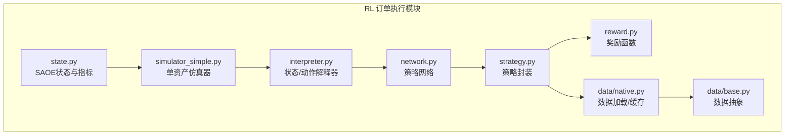
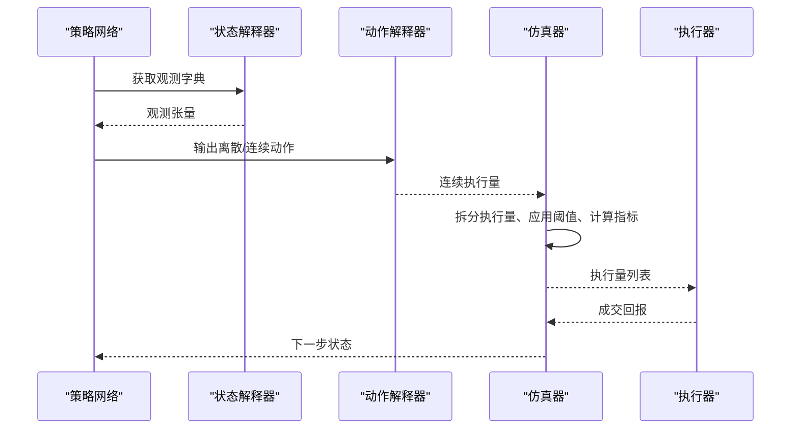
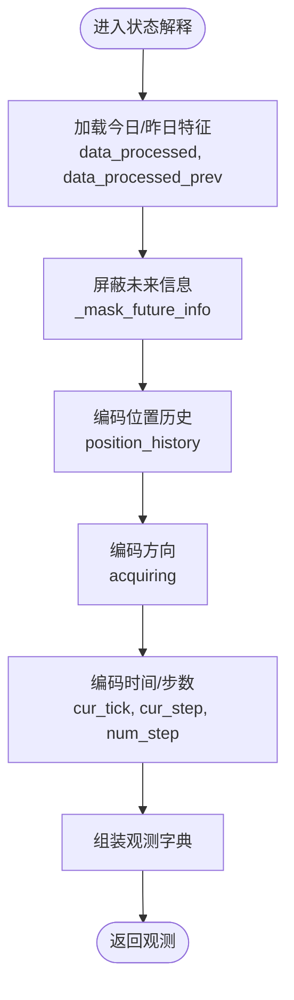
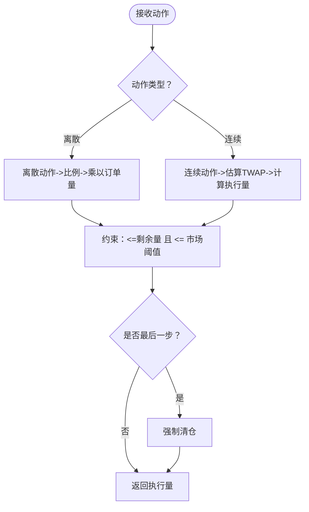
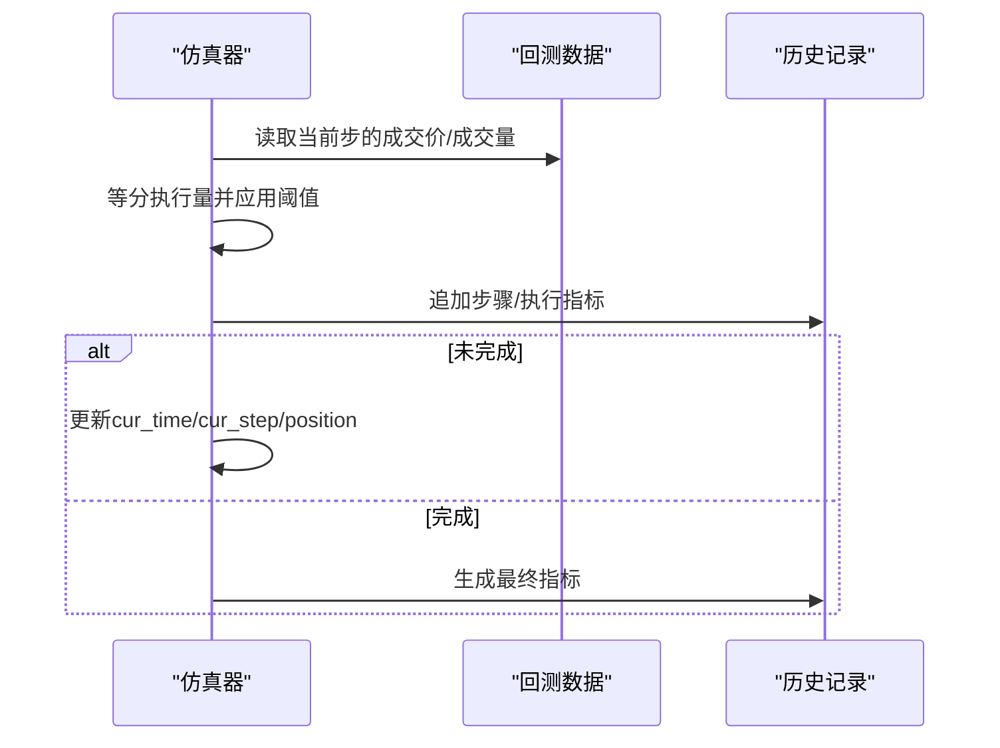
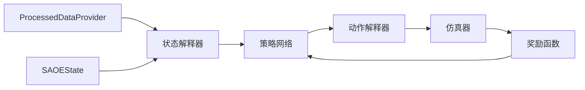

# 状态与动作设计

<cite>
**本文引用的文件**
- [state.py](file://qlib/rl/order_execution/state.py)
- [simulator_simple.py](file://qlib/rl/order_execution/simulator_simple.py)
- [interpreter.py](file://qlib/rl/order_execution/interpreter.py)
- [network.py](file://qlib/rl/order_execution/network.py)
- [reward.py](file://qlib/rl/order_execution/reward.py)
- [strategy.py](file://qlib/rl/order_execution/strategy.py)
- [base.py](file://qlib/rl/data/base.py)
- [native.py](file://qlib/rl/data/native.py)
- [__init__.py](file://qlib/rl/order_execution/__init__.py)
</cite>

## 目录
1. [引言](#引言)
2. [项目结构](#项目结构)
3. [核心组件](#核心组件)
4. [架构总览](#架构总览)
5. [详细组件分析](#详细组件分析)
6. [依赖关系分析](#依赖关系分析)
7. [性能考量](#性能考量)
8. [故障排查指南](#故障排查指南)
9. [结论](#结论)
10. [附录：扩展接口与示例路径](#附录扩展接口与示例路径)

## 引言
本文件聚焦于Qlib中订单执行策略的状态空间与动作空间设计，围绕以下目标展开：
- 解释state.py如何从原始市场数据（订单簿、成交量、价格序列）构建多维状态特征，包括时间序列滑动窗口处理、归一化方法、特征编码策略（如买卖价差、订单簿深度不平衡度、波动率估计）及其对策略学习稳定性的影响。
- 阐述动作空间的定义方式，包括离散动作（如市价单、限价单、撤单）与连续动作（如报价偏移量、执行速率）的建模选择。
- 结合simulator_simple.py中的环境模拟逻辑，解释状态转移机制和动作约束条件。
- 提供自定义状态特征的扩展接口说明，并通过实际代码片段路径展示如何注入新的市场信号。

## 项目结构
Qlib的RL订单执行模块位于qlib/rl/order_execution目录下，包含状态定义、解释器、网络、奖励、策略与数据适配等子模块。其关键文件如下：
- state.py：定义SAOE状态与指标的数据结构
- simulator_simple.py：单资产订单执行仿真器，负责状态转移与执行逻辑
- interpreter.py：状态解释器与动作解释器，将SAOE状态映射为观测与动作
- network.py：策略网络（如RNN/GRU）用于从观测提取特征
- reward.py：奖励函数，将状态转换为可优化信号
- strategy.py：策略封装，连接策略网络与交易执行
- data/base.py 与 data/native.py：数据抽象与加载，提供处理后的特征与原始行情

图表来源
- [state.py](file://qlib/rl/order_execution/state.py#L1-L102)
- [simulator_simple.py](file://qlib/rl/order_execution/simulator_simple.py#L1-L363)
- [interpreter.py](file://qlib/rl/order_execution/interpreter.py#L1-L258)
- [network.py](file://qlib/rl/order_execution/network.py#L1-L141)
- [reward.py](file://qlib/rl/order_execution/reward.py#L1-L100)
- [strategy.py](file://qlib/rl/order_execution/strategy.py#L1-L552)
- [base.py](file://qlib/rl/data/base.py#L1-L66)
- [native.py](file://qlib/rl/data/native.py#L1-L234)

章节来源
- [__init__.py](file://qlib/rl/order_execution/__init__.py#L1-L39)

## 核心组件
- SAOE状态与指标
  - SAOEMetrics：记录每步/每日的市场成交量、成交均价、策略意图量、已成交额、持仓剩余、完成比例FFR、相对基线的价格优势PA等
  - SAOEState：封装当前订单、时间、步数、剩余未执行量、历史执行与步骤记录、回测数据索引、ticks切片等
- 单资产仿真器SingleAssetOrderExecutionSimple
  - 负责按步推进，拆分执行量、应用成交量阈值、计算指标、维护历史与最终指标
- 状态解释器
  - FullHistoryStateInterpreter：输出全历史加工特征（今日/昨日）、当前tick/步、目标量、剩余量、位置历史等
  - CurrentStepStateInterpreter：仅输出当前步信息
- 动作解释器
  - CategoricalActionInterpreter：离散动作到连续执行量的映射，支持最后一步“清仓”
  - TwapRelativeActionInterpreter：连续动作，基于剩余步数与剩余量估算TWAP，输出执行量
- 策略网络
  - Recurrent：将“公开变量”（特征序列）与“私有变量”（位置与步数）分别用RNN编码，融合方向特征后输出策略输出
- 奖励函数
  - PAPenaltyReward：鼓励更高PA，同时惩罚短期内集中执行导致的波动
  - PPOReward：基于VWAP/TWAP比值的分类奖励

章节来源
- [state.py](file://qlib/rl/order_execution/state.py#L1-L102)
- [simulator_simple.py](file://qlib/rl/order_execution/simulator_simple.py#L1-L363)
- [interpreter.py](file://qlib/rl/order_execution/interpreter.py#L1-L258)
- [network.py](file://qlib/rl/order_execution/network.py#L1-L141)
- [reward.py](file://qlib/rl/order_execution/reward.py#L1-L100)
- [strategy.py](file://qlib/rl/order_execution/strategy.py#L1-L552)

## 架构总览
下面以序列图展示从策略到执行的关键流程，体现状态空间与动作空间的交互。

图表来源
- [strategy.py](file://qlib/rl/order_execution/strategy.py#L525-L552)
- [interpreter.py](file://qlib/rl/order_execution/interpreter.py#L199-L258)
- [simulator_simple.py](file://qlib/rl/order_execution/simulator_simple.py#L147-L230)

## 详细组件分析

### 状态空间设计：从原始市场数据到多维特征
- 原始数据来源
  - 处理后特征：由ProcessedDataProvider提供，包含今日与昨日特征矩阵，维度为[data_ticks, data_dim]
  - 原始行情：由BaseIntradayBacktestData提供，包含成交价、成交量、时间索引
- 时间序列滑动窗口与未来信息屏蔽
  - FullHistoryStateInterpreter在构造观测时，对“今日”特征使用_mask_future_info将当前时刻之后的数据置零，避免未来信息泄漏
  - 当前tick与步数通过ticks_index与cur_step进行编码，便于RNN/注意力模型捕捉时序模式
- 归一化与数值类型
  - canonicalize统一将观测转为32位浮点或整型，降低内存占用并提升数值稳定性
- 特征编码策略
  - 位置历史position_history：记录从初始到当前步的累计剩余量，作为策略决策的“记忆”
  - 方向编码acquiring：二值编码买卖方向，配合方向分支增强模型区分能力
  - 相对时间与步数：cur_tick/cur_step/num_step，帮助模型理解剩余时间与进度
- 指标与稳定性影响
  - PA（价格优势）与FFR（完成比例）作为状态的一部分，有助于策略平衡执行速度与价格成本
  - TWAP基准用于PA计算，使策略在不同市场条件下保持一致的比较基准

图表来源
- [interpreter.py](file://qlib/rl/order_execution/interpreter.py#L68-L148)
- [network.py](file://qlib/rl/order_execution/network.py#L69-L119)

章节来源
- [interpreter.py](file://qlib/rl/order_execution/interpreter.py#L68-L148)
- [network.py](file://qlib/rl/order_execution/network.py#L69-L119)
- [base.py](file://qlib/rl/data/base.py#L1-L66)
- [native.py](file://qlib/rl/data/native.py#L143-L234)

### 动作空间设计：离散与连续的权衡
- 离散动作（CategoricalActionInterpreter）
  - 将离散动作映射为[0,1]区间的比例，乘以订单总量得到执行量；在最后一步自动清仓
  - 优点：动作空间小、易于训练；缺点：可能无法精细控制报价偏移或执行速率
- 连续动作（TwapRelativeActionInterpreter）
  - 接收连续比例，基于剩余步数与剩余量估算TWAP，输出执行量
  - 优点：更灵活，能适应剩余时间变化；缺点：需要合理设置上限与惩罚项
- 动作约束与边界
  - 执行量不得超出剩余未执行量与市场成交量阈值
  - 最后一步确保全部剩余量被成交，避免“尾部偏差”

图表来源
- [interpreter.py](file://qlib/rl/order_execution/interpreter.py#L199-L258)
- [simulator_simple.py](file://qlib/rl/order_execution/simulator_simple.py#L269-L340)

章节来源
- [interpreter.py](file://qlib/rl/order_execution/interpreter.py#L199-L258)
- [simulator_simple.py](file://qlib/rl/order_execution/simulator_simple.py#L269-L340)

### 状态转移机制与环境模拟
- 步进逻辑
  - 每步根据ticks_per_step切片市场数据，等分为每个tick的执行量
  - 应用vol_threshold限制单tick最大执行量，最后一步补齐剩余量
  - 计算每步指标（平均成交价、交易价值、FFR、PA），更新历史与最终指标
- 终止条件
  - 剩余量小于阈值或到达订单结束时间
- 日志与可观测性
  - 在完成时输出历史步骤与执行记录，便于调试与分析

图表来源
- [simulator_simple.py](file://qlib/rl/order_execution/simulator_simple.py#L147-L230)
- [simulator_simple.py](file://qlib/rl/order_execution/simulator_simple.py#L296-L340)

章节来源
- [simulator_simple.py](file://qlib/rl/order_execution/simulator_simple.py#L147-L230)
- [simulator_simple.py](file://qlib/rl/order_execution/simulator_simple.py#L296-L340)

### 自定义状态特征的扩展接口
- 注入新市场信号的路径
  - 通过ProcessedDataProvider实现自定义特征加载，返回BaseIntradayProcessedData（today/yesterday）
  - 在FullHistoryStateInterpreter中读取并拼接到观测字典，确保未来信息屏蔽
  - 若需使用原始行情（如订单簿、波动率），可在state中扩展SAOEMetrics字段，并在仿真器中填充
- 具体步骤参考
  - 实现自定义特征加载：参考[HandlerProcessedDataProvider.get_data](file://qlib/rl/data/native.py#L203-L234)
  - 在状态解释器中使用：参考[FullHistoryStateInterpreter.interpret](file://qlib/rl/order_execution/interpreter.py#L68-L148)
  - 在仿真器中填充指标：参考[SingleAssetOrderExecutionSimple._metrics_collect](file://qlib/rl/order_execution/simulator_simple.py#L296-L340)

章节来源
- [native.py](file://qlib/rl/data/native.py#L203-L234)
- [interpreter.py](file://qlib/rl/order_execution/interpreter.py#L68-L148)
- [simulator_simple.py](file://qlib/rl/order_execution/simulator_simple.py#L296-L340)

## 依赖关系分析
- 组件耦合
  - 状态解释器依赖ProcessedDataProvider与SAOEState，输出观测空间
  - 动作解释器依赖SAOEState与动作空间，输出连续执行量
  - 仿真器持有SAOEState并维护历史与指标
  - 策略封装将解释器、网络与奖励串联，形成端到端闭环
- 外部依赖
  - 数据层通过BaseIntradayBacktestData与ProcessedDataProvider解耦
  - 策略网络使用PyTorch与tianshou Batch接口

图表来源
- [interpreter.py](file://qlib/rl/order_execution/interpreter.py#L1-L258)
- [strategy.py](file://qlib/rl/order_execution/strategy.py#L445-L552)
- [simulator_simple.py](file://qlib/rl/order_execution/simulator_simple.py#L1-L363)
- [reward.py](file://qlib/rl/order_execution/reward.py#L1-L100)
- [base.py](file://qlib/rl/data/base.py#L1-L66)

章节来源
- [interpreter.py](file://qlib/rl/order_execution/interpreter.py#L1-L258)
- [strategy.py](file://qlib/rl/order_execution/strategy.py#L445-L552)
- [simulator_simple.py](file://qlib/rl/order_execution/simulator_simple.py#L1-L363)
- [reward.py](file://qlib/rl/order_execution/reward.py#L1-L100)
- [base.py](file://qlib/rl/data/base.py#L1-L66)

## 性能考量
- 内存与数值精度
  - canonicalize统一为32位类型，减少显存占用并提高推理速度
- 计算复杂度
  - RNN分支对时间序列长度呈线性复杂度；Attention模块涉及注意力计算，适合短序列或局部关注
- 数据访问与缓存
  - 数据加载采用LRU缓存，避免重复读取同一股票/日期特征
- 训练稳定性
  - 奖励函数中对NaN/Inf进行断言，防止异常回报污染训练

## 故障排查指南
- 常见问题与定位
  - 执行量越界：检查vol_threshold与最后一步补齐逻辑
  - 未来信息泄漏：确认_mask_future_info是否正确应用
  - PA异常：检查baseline TWAP与方向编码
  - 奖励NaN/Inf：检查最近一步的执行分解与权重
- 关键断言与日志
  - 仿真器在完成时输出历史步骤与执行记录，便于定位异常
  - 奖励函数对NaN/Inf进行断言，便于快速发现异常状态

章节来源
- [simulator_simple.py](file://qlib/rl/order_execution/simulator_simple.py#L147-L230)
- [reward.py](file://qlib/rl/order_execution/reward.py#L1-L100)

## 结论
Qlib的订单执行RL框架通过清晰的状态与动作抽象，实现了从原始市场数据到策略决策的完整闭环。状态解释器将多源特征（处理后特征、历史位置、方向与时序）整合为稳定的观测空间；动作解释器提供了离散与连续两种建模选择，兼顾易训练与灵活性；仿真器严格控制状态转移与动作约束，保证策略学习的稳定性与可复现性。通过扩展数据提供器与指标体系，用户可以轻松注入新的市场信号，进一步提升策略的泛化能力。

## 附录：扩展接口与示例路径
- 注入新特征
  - 实现自定义特征加载：[HandlerProcessedDataProvider.get_data](file://qlib/rl/data/native.py#L203-L234)
  - 在状态解释器中使用：[FullHistoryStateInterpreter.interpret](file://qlib/rl/order_execution/interpreter.py#L68-L148)
- 扩展指标
  - 在SAOEMetrics中新增字段并在仿真器中填充：[SAOEMetrics](file://qlib/rl/order_execution/state.py#L18-L69)，[SingleAssetOrderExecutionSimple._metrics_collect](file://qlib/rl/order_execution/simulator_simple.py#L296-L340)
- 使用原始行情
  - 通过BaseIntradayBacktestData提供的get_deal_price/get_volume在仿真器中直接使用：[BaseIntradayBacktestData](file://qlib/rl/data/base.py#L10-L38)，[DataframeIntradayBacktestData](file://qlib/rl/data/native.py#L86-L109)