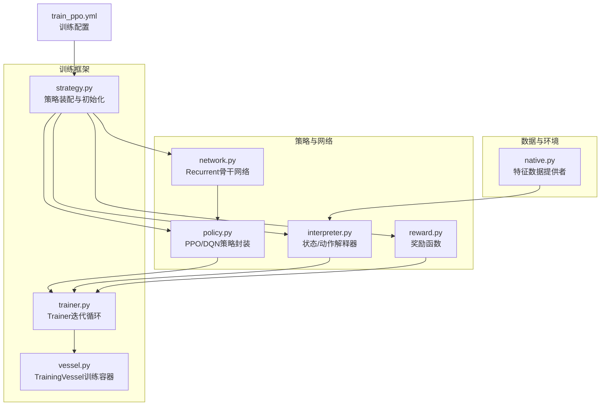
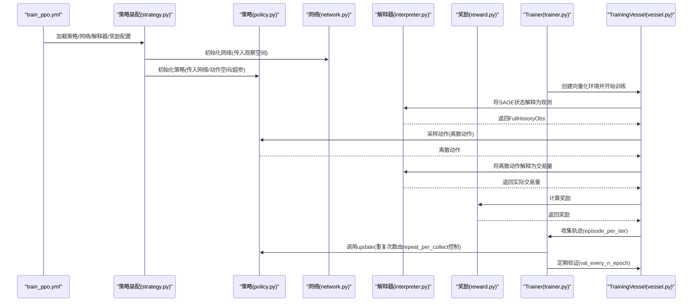
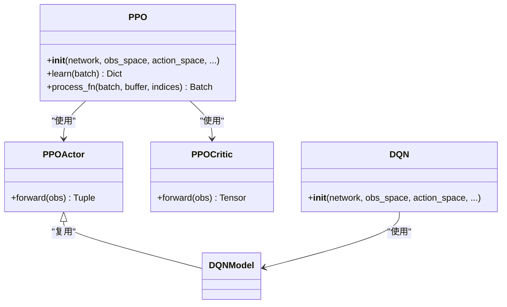
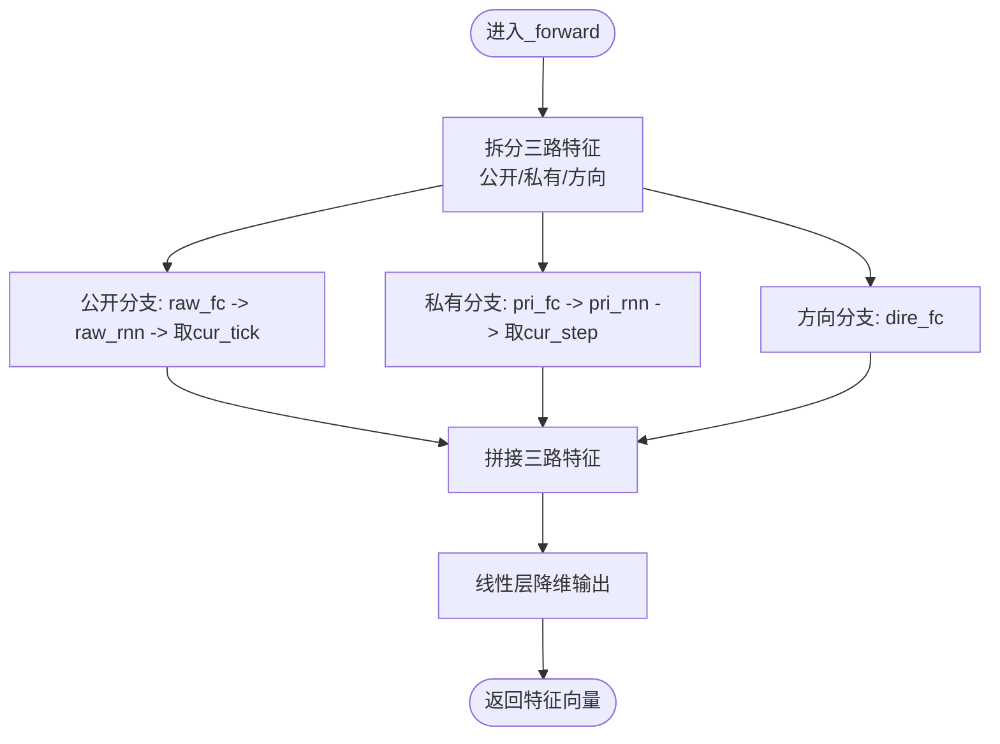
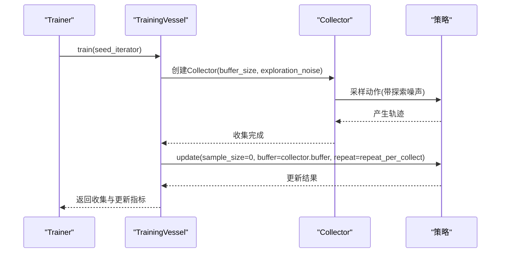
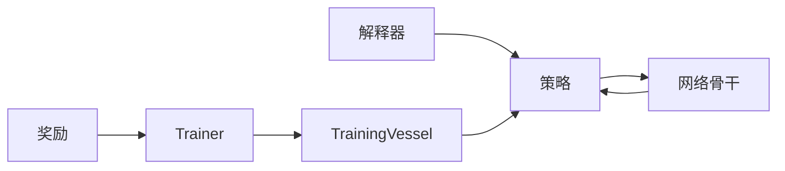

# 策略网络实现

<cite>
**本文引用的文件列表**
- [policy.py](file://qlib/rl/order_execution/policy.py)
- [network.py](file://qlib/rl/order_execution/network.py)
- [train_ppo.yml](file://examples/rl_order_execution/exp_configs/train_ppo.yml)
- [interpreter.py](file://qlib/rl/order_execution/interpreter.py)
- [reward.py](file://qlib/rl/order_execution/reward.py)
- [native.py](file://qlib/rl/data/native.py)
- [vessel.py](file://qlib/rl/trainer/vessel.py)
- [trainer.py](file://qlib/rl/trainer/trainer.py)
- [strategy.py](file://qlib/rl/order_execution/strategy.py)
</cite>

## 目录
1. [引言](#引言)
2. [项目结构](#项目结构)
3. [核心组件](#核心组件)
4. [架构总览](#架构总览)
5. [详细组件分析](#详细组件分析)
6. [依赖关系分析](#依赖关系分析)
7. [性能考虑](#性能考虑)
8. [故障排查指南](#故障排查指南)
9. [结论](#结论)
10. [附录](#附录)

## 引言
本文件围绕QLib中的订单执行策略，系统性解析PPO与DQN两类策略网络在该场景下的实现方式，重点覆盖：
- 策略类的继承结构与职责边界
- 动作分布建模（离散动作空间与分类分布）
- 价值函数估计与优势估计（GAE）设计
- 神经网络骨干选择（MLP/LSTM/GRU）及其对时序决策的支持
- 训练流程编排（rollout收集、PPO更新步数、验证与早停）
- 稳定性保障机制（梯度裁剪、KL散度约束等）
- 性能调优建议（批量大小、更新频率、探索率调度）

## 项目结构
本节聚焦与策略网络实现直接相关的核心模块与配置文件，展示其组织方式与交互关系。

图表来源
- [policy.py](file://qlib/rl/order_execution/policy.py#L1-L238)
- [network.py](file://qlib/rl/order_execution/network.py#L1-L141)
- [interpreter.py](file://qlib/rl/order_execution/interpreter.py#L1-L258)
- [reward.py](file://qlib/rl/order_execution/reward.py#L1-L100)
- [native.py](file://qlib/rl/data/native.py#L1-L234)
- [trainer.py](file://qlib/rl/trainer/trainer.py#L1-L356)
- [vessel.py](file://qlib/rl/trainer/vessel.py#L98-L218)
- [strategy.py](file://qlib/rl/order_execution/strategy.py#L467-L503)
- [train_ppo.yml](file://examples/rl_order_execution/exp_configs/train_ppo.yml#L1-L68)

章节来源
- [policy.py](file://qlib/rl/order_execution/policy.py#L1-L238)
- [network.py](file://qlib/rl/order_execution/network.py#L1-L141)
- [interpreter.py](file://qlib/rl/order_execution/interpreter.py#L1-L258)
- [reward.py](file://qlib/rl/order_execution/reward.py#L1-L100)
- [native.py](file://qlib/rl/data/native.py#L1-L234)
- [trainer.py](file://qlib/rl/trainer/trainer.py#L1-L356)
- [vessel.py](file://qlib/rl/trainer/vessel.py#L98-L218)
- [strategy.py](file://qlib/rl/order_execution/strategy.py#L467-L503)
- [train_ppo.yml](file://examples/rl_order_execution/exp_configs/train_ppo.yml#L1-L68)

## 核心组件
- 策略封装
  - PPO：基于tianshou的PPOPolicy，自动构建Actor/Critic，使用分类分布进行离散动作采样，支持GAE优势估计与裁剪。
  - DQN：基于tianshou的DQNPolicy，复用PPOActor作为Q网络，支持双Q与损失裁剪。
- 网络骨干
  - Recurrent：融合公开历史与私有状态的多源时序特征提取，支持RNN/LSTM/GRU三种RNN单元，具备方向特征分支，输出固定维度表征供策略头使用。
- 解释器
  - FullHistoryStateInterpreter：构造包含“今日/昨日”处理后特征、位置历史、当前步/时间索引、目标量等的全历史观测字典。
  - CategoricalActionInterpreter：将离散策略动作映射为连续交易量，支持最后一步强制成交剩余头寸。
- 奖励
  - PPOReward：在最后一步根据VWAP/TWAP比率给出离散奖励信号，鼓励更优执行质量。
- 数据提供
  - HandlerProcessedDataProvider：从pickle特征文件加载“今日/昨日”特征，供解释器拼接全历史输入。

章节来源
- [policy.py](file://qlib/rl/order_execution/policy.py#L69-L209)
- [network.py](file://qlib/rl/order_execution/network.py#L19-L120)
- [interpreter.py](file://qlib/rl/order_execution/interpreter.py#L68-L148)
- [reward.py](file://qlib/rl/order_execution/reward.py#L53-L100)
- [native.py](file://qlib/rl/data/native.py#L203-L234)

## 架构总览
下图展示了从配置到策略训练的整体流程，包括rollout收集、策略更新与验证。

图表来源
- [train_ppo.yml](file://examples/rl_order_execution/exp_configs/train_ppo.yml#L1-L68)
- [strategy.py](file://qlib/rl/order_execution/strategy.py#L467-L503)
- [policy.py](file://qlib/rl/order_execution/policy.py#L114-L158)
- [network.py](file://qlib/rl/order_execution/network.py#L19-L120)
- [interpreter.py](file://qlib/rl/order_execution/interpreter.py#L68-L148)
- [reward.py](file://qlib/rl/order_execution/reward.py#L53-L100)
- [trainer.py](file://qlib/rl/trainer/trainer.py#L188-L249)
- [vessel.py](file://qlib/rl/trainer/vessel.py#L164-L203)

## 详细组件分析

### PPO策略类与动作分布建模
- 继承结构
  - PPOActor：将共享骨干网络的特征映射为离散动作的概率分布（Softmax），用于分类分布采样。
  - PPOCritic：将共享骨干网络的特征映射为标量价值。
  - PPO：继承自tianshou的PPOPolicy，自动组合Actor/Critic与优化器；默认使用分类分布进行离散动作采样。
- 动作分布
  - 使用torch.distributions.Categorical，动作空间必须为离散（Discrete）。
  - 动作解释器CategoricalActionInterpreter将离散动作映射为连续交易量，确保最后一步成交剩余头寸。
- 价值函数与优势估计
  - 支持GAE(lambda)优势估计，通过gae_lambda参数控制偏差-方差权衡。
  - 支持价值裁剪（value_clip）与价值损失系数（vf_coef）。
- 稳定性机制
  - 梯度裁剪（max_grad_norm）防止爆炸梯度。
  - PPO裁剪（eps_clip）限制策略更新幅度。
  - 可选奖励归一化（reward_normalization）稳定学习。

图表来源
- [policy.py](file://qlib/rl/order_execution/policy.py#L69-L209)

章节来源
- [policy.py](file://qlib/rl/order_execution/policy.py#L69-L209)
- [interpreter.py](file://qlib/rl/order_execution/interpreter.py#L199-L231)

### DQN策略类与Q函数建模
- 网络复用
  - DQNModel = PPOActor，即DQN复用同一Q网络结构（共享骨干网络特征，输出每个动作的Q值）。
- 关键超参
  - estimation_step：n步回报估计，默认1。
  - target_update_freq：目标网络更新频率，默认0（不更新）。
  - is_double：是否使用双Q策略（Double DQN）。
  - clip_loss_grad：是否裁剪损失梯度。
- 训练流程
  - 通过策略的update接口完成多次更新（由训练容器控制）。

章节来源
- [policy.py](file://qlib/rl/order_execution/policy.py#L161-L209)

### Recurrent骨干网络与时序建模
- 结构要点
  - 公开变量分支(raw_rnn)：对“今日/昨日”处理后的序列特征进行编码，取当前tick对应的时间步表示。
  - 私有变量分支(pri_rnn)：对位置历史与步长比例进行编码，取当前step对应的时间步表示。
  - 方向特征分支(dire_fc)：对买卖方向进行编码，增强策略对方向敏感性。
  - 多源特征拼接后经线性层得到固定维度输出，供策略头使用。
- RNN类型与层数
  - 支持RNN/LSTM/GRU，可配置层数，batch_first=True，便于序列建模。
- 输入观测要求
  - FullHistoryObs至少包含[data_processed, data_processed_prev, acquiring, cur_tick, cur_step, num_step, target, position_history]等键。

图表来源
- [network.py](file://qlib/rl/order_execution/network.py#L69-L120)

章节来源
- [network.py](file://qlib/rl/order_execution/network.py#L19-L120)
- [interpreter.py](file://qlib/rl/order_execution/interpreter.py#L44-L54)

### 训练流程编排与稳定性保障
- 配置驱动
  - train_ppo.yml定义了仿真粒度、并发、动作/状态解释器、奖励、网络与策略类、训练超参（最大轮次、每收集回合episode数量、batch大小、重复更新次数、验证频率、检查点路径等）。
- 迭代循环
  - Trainer以“collect”为单位迭代，每次collect收集episode_per_iter条轨迹，随后调用策略update若干次（repeat_per_collect）。
  - TrainingVessel在训练阶段创建Collector，使用VectorReplayBuffer存储轨迹，并开启探索噪声。
- 稳定性机制
  - PPO：eps_clip、value_clip、vf_coef、reward_normalization、max_grad_norm。
  - DQN：clip_loss_grad、is_double、target_update_freq。
  - 训练容器：exploration_noise、buffer_size、update_kwargs等。

图表来源
- [trainer.py](file://qlib/rl/trainer/trainer.py#L188-L249)
- [vessel.py](file://qlib/rl/trainer/vessel.py#L164-L203)
- [train_ppo.yml](file://examples/rl_order_execution/exp_configs/train_ppo.yml#L56-L68)

章节来源
- [trainer.py](file://qlib/rl/trainer/trainer.py#L188-L249)
- [vessel.py](file://qlib/rl/trainer/vessel.py#L164-L203)
- [train_ppo.yml](file://examples/rl_order_execution/exp_configs/train_ppo.yml#L56-L68)

### 奖励函数与目标
- PPOReward
  - 在最后一步或头寸耗尽时，比较VWAP与TWAP的比率，给出离散奖励（负/零/正），鼓励更好的执行质量。
- PAPenaltyReward
  - 鼓励价格优势（PA），同时惩罚短期内集中交易导致的额外成本，通过平方项的惩罚项抑制极端集中下单。

章节来源
- [reward.py](file://qlib/rl/order_execution/reward.py#L53-L100)

## 依赖关系分析
- 组件耦合
  - 策略依赖网络输出维度（extractor.output_dim），并通过共享骨干减少参数冗余。
  - 解释器负责将SAOE状态转换为策略输入，动作解释器将策略动作映射为实际交易量。
  - 训练容器统一管理收集与更新流程，Trainer协调各阶段日志与回调。
- 外部依赖
  - tianshou的PPOPolicy/DQNPolicy提供算法骨架。
  - PyTorch优化器与分布模块用于训练与采样。

图表来源
- [policy.py](file://qlib/rl/order_execution/policy.py#L114-L209)
- [network.py](file://qlib/rl/order_execution/network.py#L19-L120)
- [interpreter.py](file://qlib/rl/order_execution/interpreter.py#L68-L148)
- [trainer.py](file://qlib/rl/trainer/trainer.py#L188-L249)
- [vessel.py](file://qlib/rl/trainer/vessel.py#L164-L203)

章节来源
- [policy.py](file://qlib/rl/order_execution/policy.py#L114-L209)
- [network.py](file://qlib/rl/order_execution/network.py#L19-L120)
- [interpreter.py](file://qlib/rl/order_execution/interpreter.py#L68-L148)
- [trainer.py](file://qlib/rl/trainer/trainer.py#L188-L249)
- [vessel.py](file://qlib/rl/trainer/vessel.py#L164-L203)

## 性能考虑
- 批量与更新频率
  - batch_size与repeat_per_collect共同决定每次更新的数据量与更新强度。较大的batch_size有助于稳定，但会增加内存占用；较高的repeat_per_collect可提升样本利用效率，但可能引入过拟合风险。
- 探索与噪声
  - 训练容器启用exploration_noise，有助于探索未知状态，但需与策略裁剪参数协同调整。
- 梯度与数值稳定
  - 合理设置max_grad_norm、eps_clip、value_clip与reward_normalization，避免梯度爆炸与策略漂移。
- 网络深度与时序长度
  - Recurrent的hidden_dim与rnn_num_layers影响表达能力；较长的历史序列（data_ticks、max_step）会增加计算与内存开销，需平衡信息量与效率。
- 数据缓存与I/O
  - 特征数据提供者采用LRU缓存，避免频繁磁盘读取；合理设置特征列与时间窗口可降低I/O压力。

[本节为通用指导，无需列出具体文件来源]

## 故障排查指南
- 观测泄漏
  - FullHistoryStateInterpreter会对未来数据进行掩码，确保不会泄露未来信息；若出现NaN/Inf奖励，检查解释器输出与奖励函数断言逻辑。
- 检查点加载
  - set_weight支持从checkpoint加载权重，若加载失败，尝试自动转换键名前缀后再加载。
- 训练不稳定
  - 若出现发散或震荡，优先降低学习率、增大eps_clip、启用reward_normalization、减小repeat_per_collect或增大batch_size。
- DQN未收敛
  - 检查target_update_freq是否为0（不更新目标网络可能导致不稳定）；必要时启用双Q（is_double）与clip_loss_grad。

章节来源
- [interpreter.py](file://qlib/rl/order_execution/interpreter.py#L149-L154)
- [policy.py](file://qlib/rl/order_execution/policy.py#L220-L238)
- [vessel.py](file://qlib/rl/trainer/vessel.py#L164-L203)

## 结论
本实现以清晰的策略封装与可插拔的网络骨干为核心，结合解释器与奖励函数，形成完整的订单执行RL闭环。PPO通过分类分布与GAE实现稳定的策略优化，DQN复用Q网络结构并支持双Q与损失裁剪。训练容器统一管理收集与更新流程，配合丰富的稳定性机制，能够在复杂市场环境中实现稳健的策略学习。通过合理配置训练超参与网络结构，可在执行质量与训练效率之间取得良好平衡。

[本节为总结性内容，无需列出具体文件来源]

## 附录
- 关键超参数参考（来自train_ppo.yml与策略构造）
  - 学习率：lr（示例：1e-4）
  - 折扣因子：discount_factor（PPO默认1.0，DQN默认0.99）
  - GAE参数：gae_lambda（PPO默认1.0）
  - 批量大小：batch_size（示例：1024）
  - 每收集回合episode数量：episode_per_collect（示例：10000）
  - 重复更新次数：repeat_per_collect（示例：25）
  - 验证频率：val_every_n_epoch（示例：4）
  - 检查点路径：checkpoint_path（示例：./outputs/ppo）

章节来源
- [train_ppo.yml](file://examples/rl_order_execution/exp_configs/train_ppo.yml#L49-L68)
- [policy.py](file://qlib/rl/order_execution/policy.py#L114-L158)
- [policy.py](file://qlib/rl/order_execution/policy.py#L173-L206)