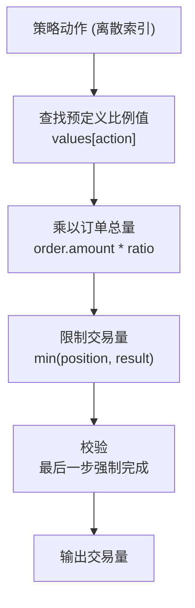
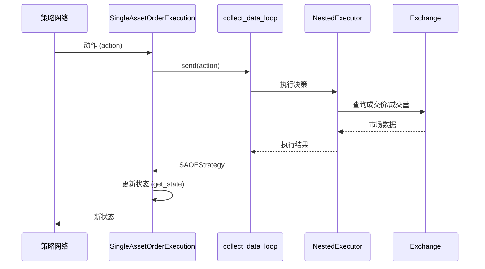
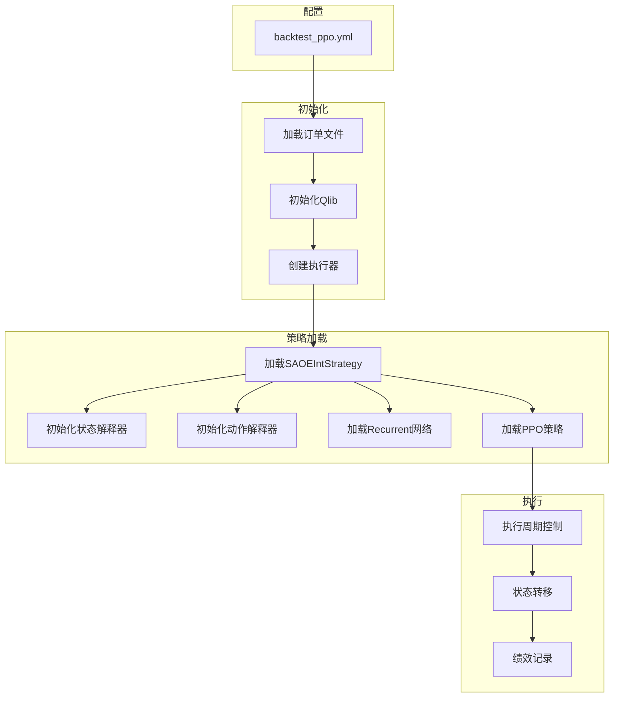
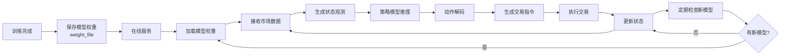
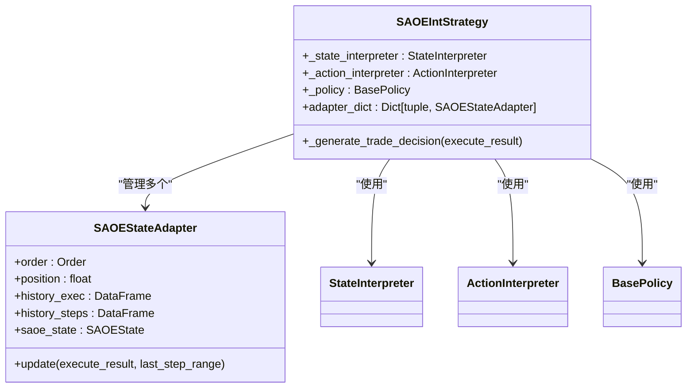

# 策略集成与执行流程

<cite>
**本文档引用的文件**  
- [interpreter.py](file://qlib/rl/order_execution/interpreter.py)
- [simulator_qlib.py](file://qlib/rl/order_execution/simulator_qlib.py)
- [backtest_ppo.yml](file://examples/rl_order_execution/exp_configs/backtest_ppo.yml)
- [state.py](file://qlib/rl/order_execution/state.py)
- [strategy.py](file://qlib/rl/order_execution/strategy.py)
- [network.py](file://qlib/rl/order_execution/network.py)
- [reward.py](file://qlib/rl/order_execution/reward.py)
- [native.py](file://qlib/rl/data/native.py)
- [single_order.py](file://qlib/rl/strategy/single_order.py)
- [backtest.py](file://qlib/backtest/backtest.py)
</cite>

## 目录
1. [引言](#引言)
2. [策略动作解码与指令生成](#策略动作解码与指令生成)
3. [回测引擎集成与订单模拟](#回测引擎集成与订单模拟)
4. [端到端回测流程](#端到端回测流程)
5. [模型部署与在线推理](#模型部署与在线推理)
6. [多资产执行与性能分析](#多资产执行与性能分析)
7. [结论](#结论)

## 引言

本文档系统性地阐述了强化学习订单执行策略与Qlib平台的集成机制。重点分析了如何将策略网络输出的动作向量解码为具体的交易指令，并通过Qlib的回测引擎实现订单簿模拟、成交撮合和持仓更新。文档结合配置文件展示了从环境初始化、策略加载到执行周期控制和绩效记录的完整回测流程，并提供了从训练到部署的迁移路径。

## 策略动作解码与指令生成

该模块的核心是`interpreter.py`文件中的`ActionInterpreter`类，它负责将策略网络输出的抽象动作转换为具体的交易指令。系统通过`CategoricalActionInterpreter`和`TwapRelativeActionInterpreter`两种解释器实现不同的解码逻辑。

`CategoricalActionInterpreter`将离散的动作索引映射为连续的交易量比例。其`interpret`方法接收策略动作和当前状态，将动作索引转换为预定义的比例值，再乘以订单总量得到实际交易量。该过程包含合法性校验，确保在最后一步强制完成剩余持仓。

**图示来源**
- [interpreter.py](file://qlib/rl/order_execution/interpreter.py#L199-L231)

**本节来源**
- [interpreter.py](file://qlib/rl/order_execution/interpreter.py#L199-L231)

## 回测引擎集成与订单模拟

`simulator_qlib.py`文件实现了与Qlib回测引擎的深度集成。`SingleAssetOrderExecution`类作为核心模拟器，通过`collect_data_loop`生成器与Qlib的执行器（executor）和策略（strategy）进行交互，实现了订单簿模拟、成交撮合和持仓更新。

模拟器的`step`方法是执行周期的核心。它通过向`_collect_data_loop`生成器发送动作值，驱动下层策略生成具体的交易决策。`_iter_strategy`方法负责迭代生成器，直到获取到`SAOEStrategy`对象，从而完成一次状态转移。

**图示来源**
- [simulator_qlib.py](file://qlib/rl/order_execution/simulator_qlib.py#L119-L137)
- [backtest.py](file://qlib/backtest/backtest.py#L53-L111)

**本节来源**
- [simulator_qlib.py](file://qlib/rl/order_execution/simulator_qlib.py#L19-L142)
- [backtest.py](file://qlib/backtest/backtest.py#L53-L111)

## 端到端回测流程

`backtest_ppo.yml`配置文件定义了端到端的策略回测流程。该流程从环境初始化开始，加载订单文件、数据源和交易所配置，然后加载策略、网络和策略模型，最后通过执行周期控制进行回测并记录绩效。

配置文件中的`strategies`部分定义了使用`SAOEIntStrategy`的强化学习策略。该策略通过`state_interpreter`和`action_interpreter`配置状态和动作的解释器，并通过`policy`配置PPO策略模型。`network`部分指定了`Recurrent`网络架构。

**图示来源**
- [backtest_ppo.yml](file://examples/rl_order_execution/exp_configs/backtest_ppo.yml#L1-L54)
- [strategy.py](file://qlib/rl/order_execution/strategy.py#L445-L552)

**本节来源**
- [backtest_ppo.yml](file://examples/rl_order_execution/exp_configs/backtest_ppo.yml#L1-L54)
- [train_ppo.yml](file://examples/rl_order_execution/exp_configs/train_ppo.yml#L1-L68)

## 模型部署与在线推理

从训练到部署的迁移路径包括模型序列化、在线推理接口和滚动更新机制。训练完成的PPO策略模型通过`weight_file`参数进行序列化和加载，实现了模型的持久化。

在线推理通过`SAOEIntStrategy`的`_generate_trade_decision`方法实现。该方法首先通过`_state_interpreter`将当前状态转换为观测值，然后通过策略模型生成动作，最后通过`_action_interpreter`将动作解码为交易量。滚动更新机制通过`workflow`模块实现，定期加载最新的模型权重。

**图示来源**
- [policy.py](file://qlib/rl/order_execution/policy.py#L114-L159)
- [strategy.py](file://qlib/rl/order_execution/strategy.py#L525-L552)

**本节来源**
- [policy.py](file://qlib/rl/order_execution/policy.py#L114-L159)
- [strategy.py](file://qlib/rl/order_execution/strategy.py#L445-L552)

## 多资产执行与性能分析

系统支持多资产执行场景，通过`SAOEStateAdapter`管理多个订单的状态。`adapter_dict`字典以订单的`key_by_day`为键存储每个订单的适配器，实现了对多个资产的并行处理。

性能瓶颈主要在于数据加载和状态更新。`HandlerProcessedDataProvider`使用LRU缓存优化了数据加载性能，而`SAOEStateAdapter`的`update`方法通过向量化操作优化了状态更新性能。风险控制通过`action_interpreter`的交易量限制和`exchange`的成交价校验实现。

**图示来源**
- [strategy.py](file://qlib/rl/order_execution/strategy.py#L71-L300)
- [state.py](file://qlib/rl/order_execution/state.py#L70-L102)

**本节来源**
- [strategy.py](file://qlib/rl/order_execution/strategy.py#L71-L300)
- [state.py](file://qlib/rl/order_execution/state.py#L70-L102)

## 结论

本文档详细阐述了强化学习订单执行策略与Qlib平台的集成机制。通过`interpreter.py`实现了策略动作到交易指令的解码，通过`simulator_qlib.py`实现了与Qlib回测引擎的深度集成。结合`backtest_ppo.yml`配置文件，展示了从训练到部署的完整流程。系统支持多资产执行，并通过缓存和向量化操作优化了性能，为高频交易策略的开发和部署提供了完整的解决方案。