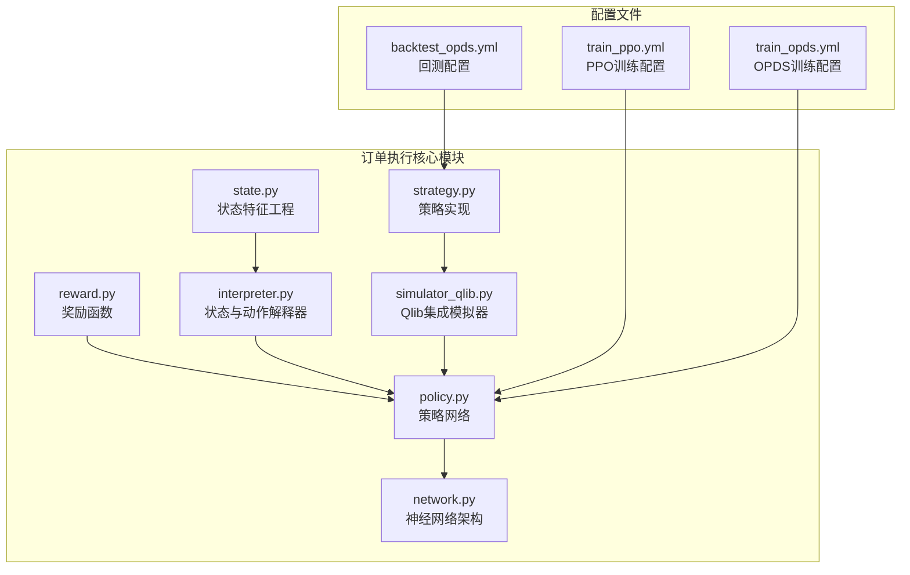
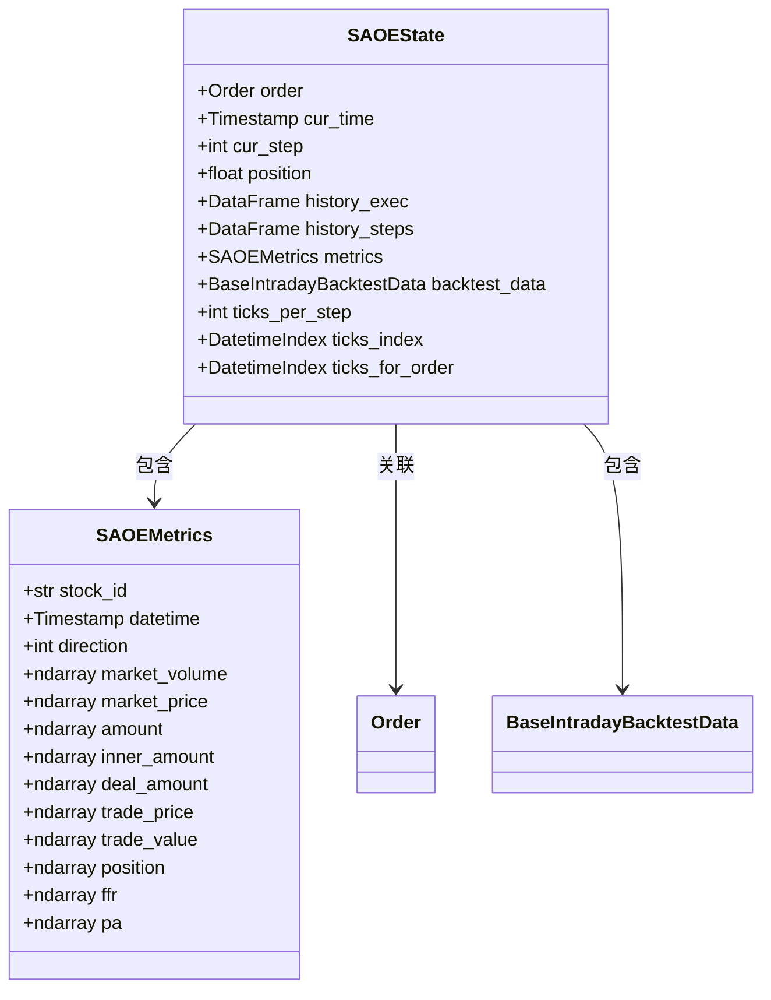
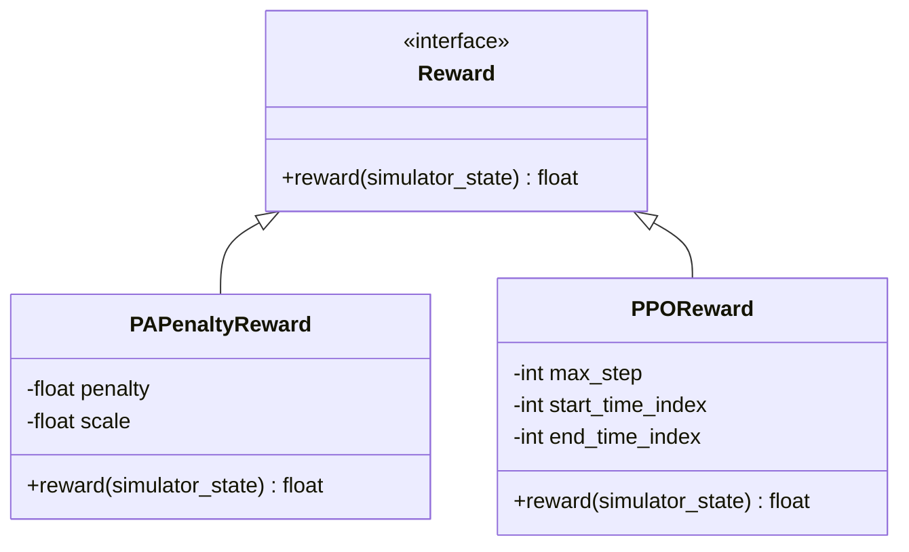
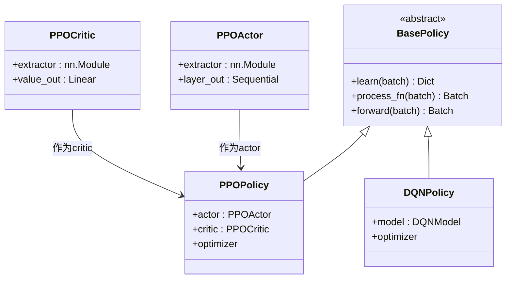
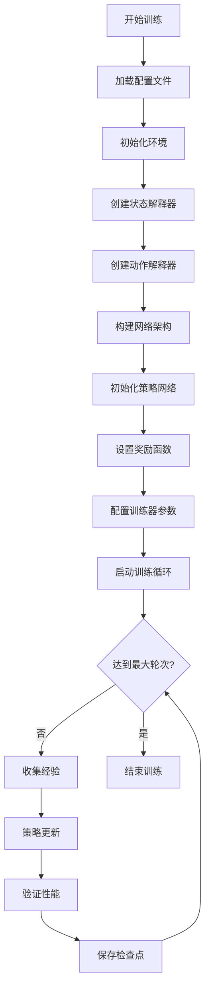
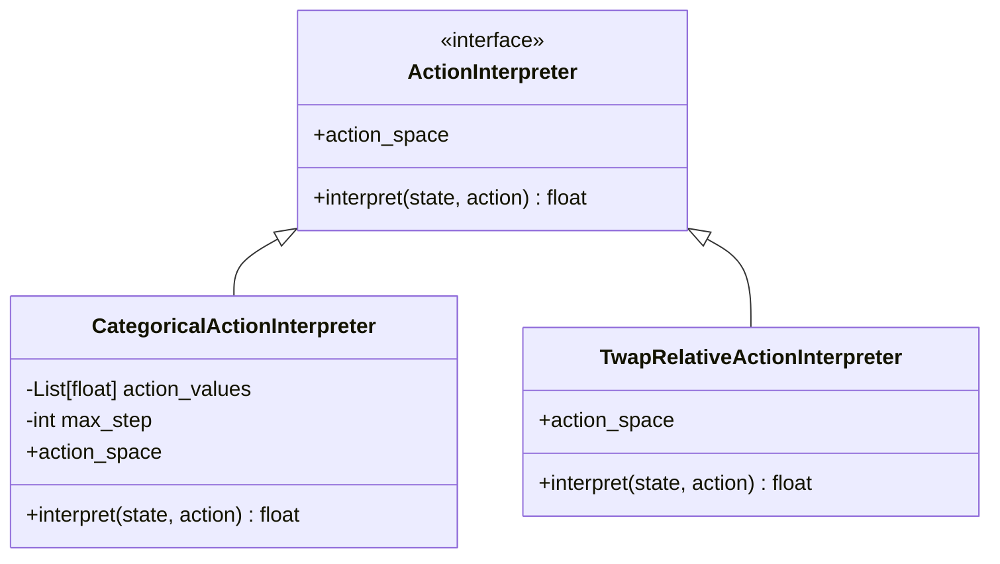
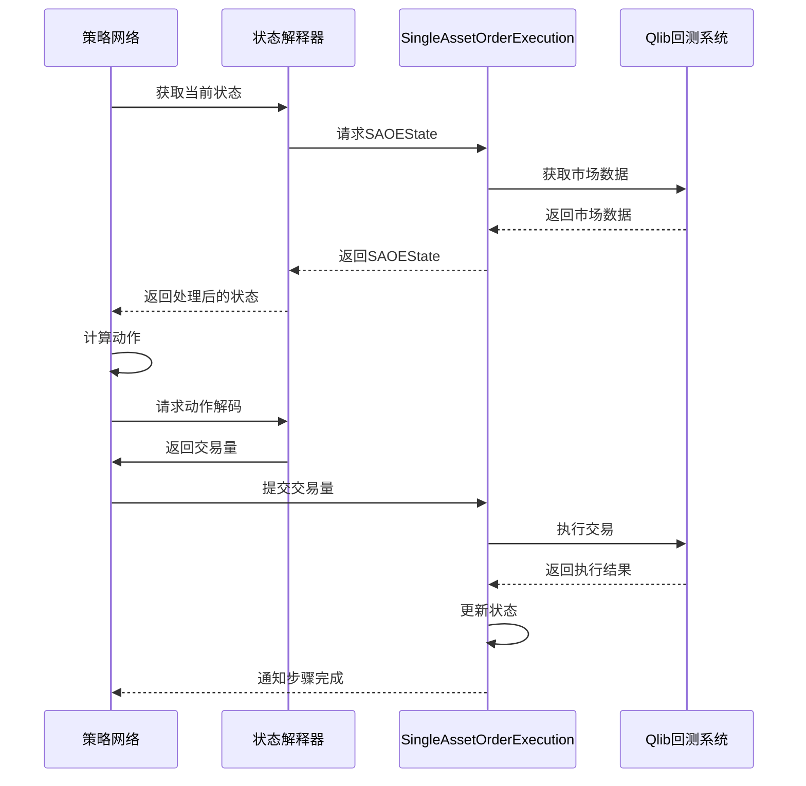
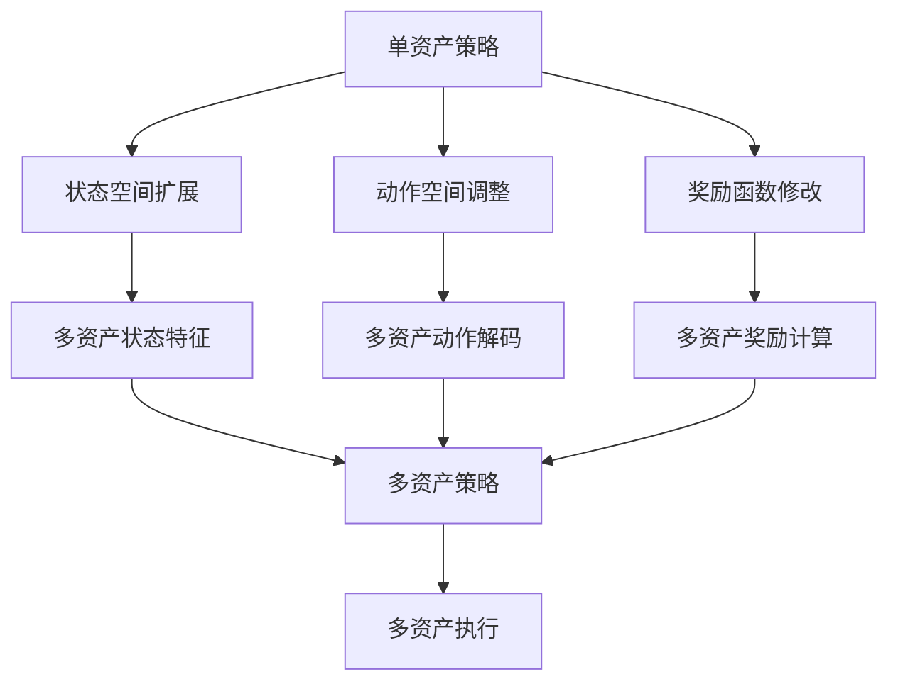
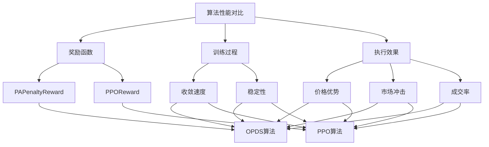

# 订单执行策略

<cite>
**本文档引用的文件**
- [state.py](file://qlib/rl/order_execution/state.py)
- [reward.py](file://qlib/rl/order_execution/reward.py)
- [policy.py](file://qlib/rl/order_execution/policy.py)
- [interpreter.py](file://qlib/rl/order_execution/interpreter.py)
- [simulator_qlib.py](file://qlib/rl/order_execution/simulator_qlib.py)
- [train_ppo.yml](file://examples/rl_order_execution/exp_configs/train_ppo.yml)
- [train_opds.yml](file://examples/rl_order_execution/exp_configs/train_opds.yml)
- [backtest_opds.yml](file://examples/rl_order_execution/exp_configs/backtest_opds.yml)
- [network.py](file://qlib/rl/order_execution/network.py)
- [strategy.py](file://qlib/rl/order_execution/strategy.py)
- [native.py](file://qlib/rl/data/native.py)
</cite>

## 目录
1. [项目结构](#项目结构)
2. [核心组件](#核心组件)
3. [状态特征工程](#状态特征工程)
4. [奖励函数设计](#奖励函数设计)
5. [策略网络架构](#策略网络架构)
6. [训练配置与流程](#训练配置与流程)
7. [动作解码与指令生成](#动作解码与指令生成)
8. [Qlib回测系统集成](#qlib回测系统集成)
9. [多资产策略迁移](#多资产策略迁移)
10. [算法性能对比分析](#算法性能对比分析)

## 项目结构

Qlib中基于强化学习的订单执行策略实现位于`qlib/rl/order_execution/`目录下，主要包含状态、奖励、策略、解释器、模拟器等核心组件。训练和回测配置文件位于`examples/rl_order_execution/exp_configs/`目录。

**图源**
- [state.py](file://qlib/rl/order_execution/state.py)
- [reward.py](file://qlib/rl/order_execution/reward.py)
- [policy.py](file://qlib/rl/order_execution/policy.py)
- [interpreter.py](file://qlib/rl/order_execution/interpreter.py)
- [simulator_qlib.py](file://qlib/rl/order_execution/simulator_qlib.py)
- [network.py](file://qlib/rl/order_execution/network.py)
- [strategy.py](file://qlib/rl/order_execution/strategy.py)
- [train_ppo.yml](file://examples/rl_order_execution/exp_configs/train_ppo.yml)
- [train_opds.yml](file://examples/rl_order_execution/exp_configs/train_opds.yml)
- [backtest_opds.yml](file://examples/rl_order_execution/exp_configs/backtest_opds.yml)

**本节来源**
- [state.py](file://qlib/rl/order_execution/state.py)
- [reward.py](file://qlib/rl/order_execution/reward.py)
- [policy.py](file://qlib/rl/order_execution/policy.py)
- [interpreter.py](file://qlib/rl/order_execution/interpreter.py)
- [simulator_qlib.py](file://qlib/rl/order_execution/simulator_qlib.py)
- [network.py](file://qlib/rl/order_execution/network.py)
- [strategy.py](file://qlib/rl/order_execution/strategy.py)
- [train_ppo.yml](file://examples/rl_order_execution/exp_configs/train_ppo.yml)
- [train_opds.yml](file://examples/rl_order_execution/exp_configs/train_opds.yml)
- [backtest_opds.yml](file://examples/rl_order_execution/exp_configs/backtest_opds.yml)

## 核心组件

订单执行策略的核心组件包括状态解释器、动作解释器、策略网络、奖励函数和模拟器。这些组件协同工作，实现从市场状态感知到交易指令生成的完整闭环。

**本节来源**
- [state.py](file://qlib/rl/order_execution/state.py)
- [reward.py](file://qlib/rl/order_execution/reward.py)
- [policy.py](file://qlib/rl/order_execution/policy.py)
- [interpreter.py](file://qlib/rl/order_execution/interpreter.py)
- [simulator_qlib.py](file://qlib/rl/order_execution/simulator_qlib.py)

## 状态特征工程

状态特征工程在`state.py`中定义，通过`SAOEState`数据结构封装订单执行过程中的关键信息。系统状态包含订单信息、当前时间、剩余执行量、历史执行记录以及市场数据。

**图源**
- [state.py](file://qlib/rl/order_execution/state.py#L70-L102)

**本节来源**
- [state.py](file://qlib/rl/order_execution/state.py#L18-L102)

## 奖励函数设计

奖励函数在`reward.py`中实现，包含两种主要设计：PAPenaltyReward和PPOReward。PAPenaltyReward鼓励价格优势同时惩罚短时间内大量交易，PPOReward基于论文提出的端到端最优交易执行框架。

**图源**
- [reward.py](file://qlib/rl/order_execution/reward.py#L17-L100)

**本节来源**
- [reward.py](file://qlib/rl/order_execution/reward.py#L1-L100)

## 策略网络架构

策略网络在`policy.py`中实现，支持PPO和DQN两种算法。PPO策略采用Actor-Critic架构，共享特征提取网络以提高效率。网络架构设计考虑了参数去重和检查点加载等实用功能。

**图源**
- [policy.py](file://qlib/rl/order_execution/policy.py#L102-L238)

**本节来源**
- [policy.py](file://qlib/rl/order_execution/policy.py#L66-L238)

## 训练配置与流程

训练配置在`train_ppo.yml`和`train_opds.yml`中定义，包含模拟器参数、环境配置、解释器设置、奖励函数、数据源、网络架构、策略参数和训练器设置等。

**图源**
- [train_ppo.yml](file://examples/rl_order_execution/exp_configs/train_ppo.yml)
- [train_opds.yml](file://examples/rl_order_execution/exp_configs/train_opds.yml)

**本节来源**
- [train_ppo.yml](file://examples/rl_order_execution/exp_configs/train_ppo.yml)
- [train_opds.yml](file://examples/rl_order_execution/exp_configs/train_opds.yml)

## 动作解码与指令生成

动作解码在`interpreter.py`中实现，通过`ActionInterpreter`将策略网络输出的动作转换为具体的交易指令。系统提供了`CategoricalActionInterpreter`和`TwapRelativeActionInterpreter`两种解释器。

**图源**
- [interpreter.py](file://qlib/rl/order_execution/interpreter.py#L199-L258)

**本节来源**
- [interpreter.py](file://qlib/rl/order_execution/interpreter.py#L199-L258)

## Qlib回测系统集成

订单执行策略通过`simulator_qlib.py`与Qlib回测系统集成，利用Qlib的交易执行引擎和市场数据接口，实现真实的交易模拟环境。

**图源**
- [simulator_qlib.py](file://qlib/rl/order_execution/simulator_qlib.py#L19-L142)
- [strategy.py](file://qlib/rl/order_execution/strategy.py#L301-L552)

**本节来源**
- [simulator_qlib.py](file://qlib/rl/order_execution/simulator_qlib.py#L19-L142)
- [strategy.py](file://qlib/rl/order_execution/strategy.py#L301-L552)

## 多资产策略迁移

多资产执行策略的迁移通过扩展单资产策略实现，主要涉及状态空间的扩展和动作空间的调整。系统设计支持从单资产到多资产的平滑过渡。

**本节来源**
- [strategy.py](file://qlib/rl/order_execution/strategy.py)
- [interpreter.py](file://qlib/rl/order_execution/interpreter.py)

## 算法性能对比分析

OPDS与PPO算法在实际测试中的性能差异主要体现在奖励函数设计、训练稳定性、收敛速度和最终执行效果等方面。通过对比分析可以为算法选择提供依据。

**本节来源**
- [reward.py](file://qlib/rl/order_execution/reward.py)
- [train_ppo.yml](file://examples/rl_order_execution/exp_configs/train_ppo.yml)
- [train_opds.yml](file://examples/rl_order_execution/exp_configs/train_opds.yml)