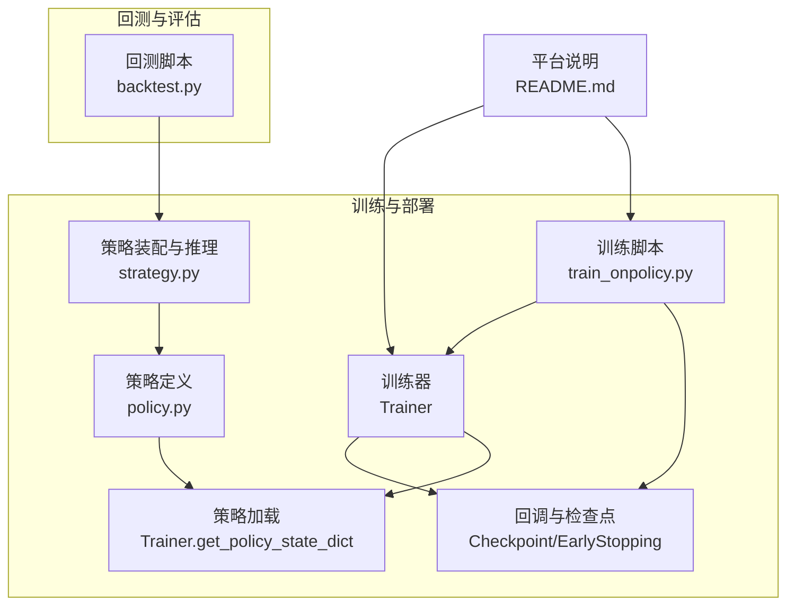
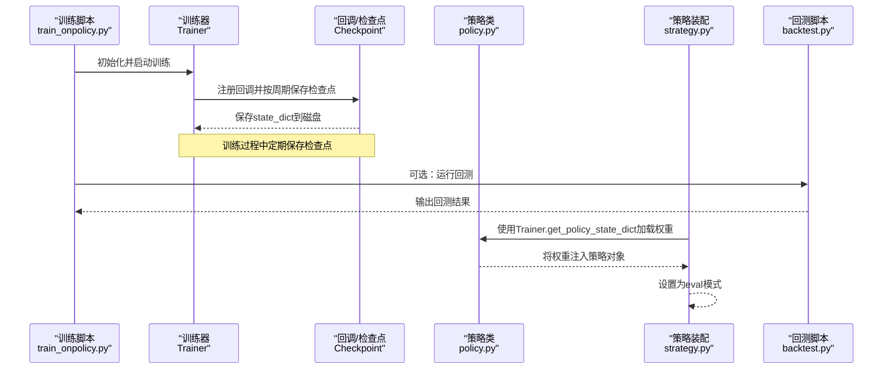
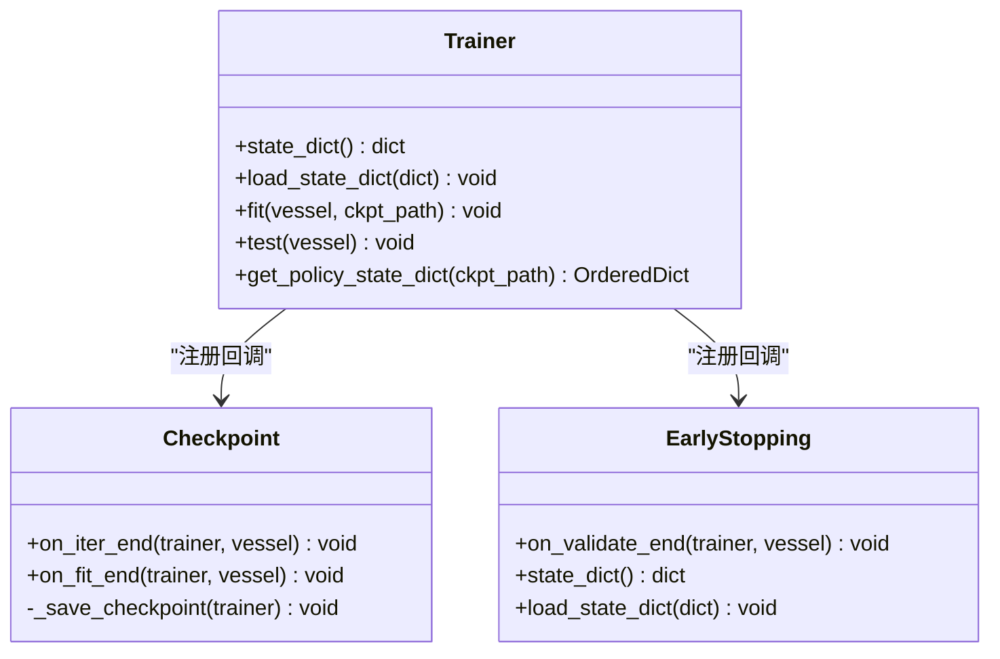
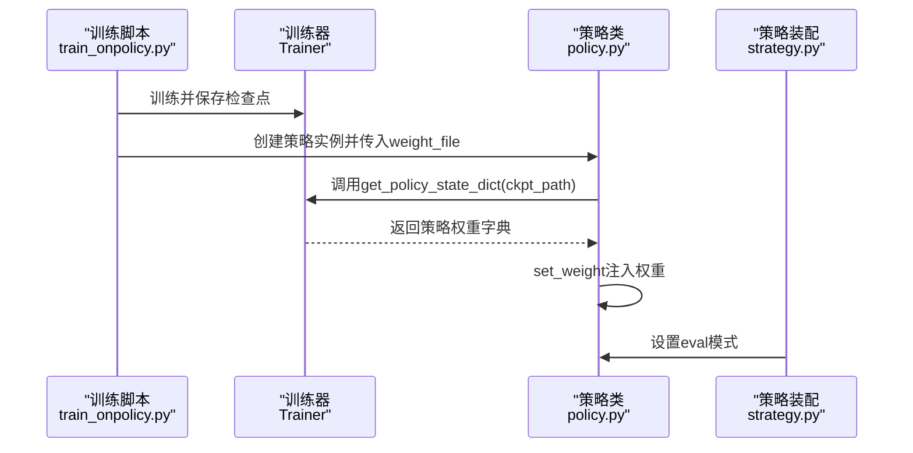
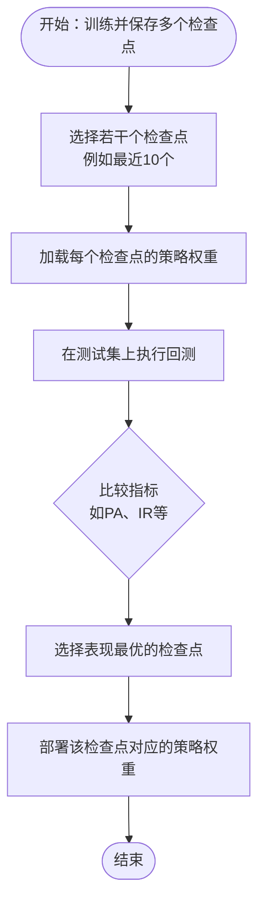
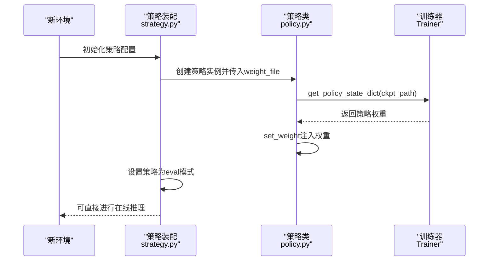
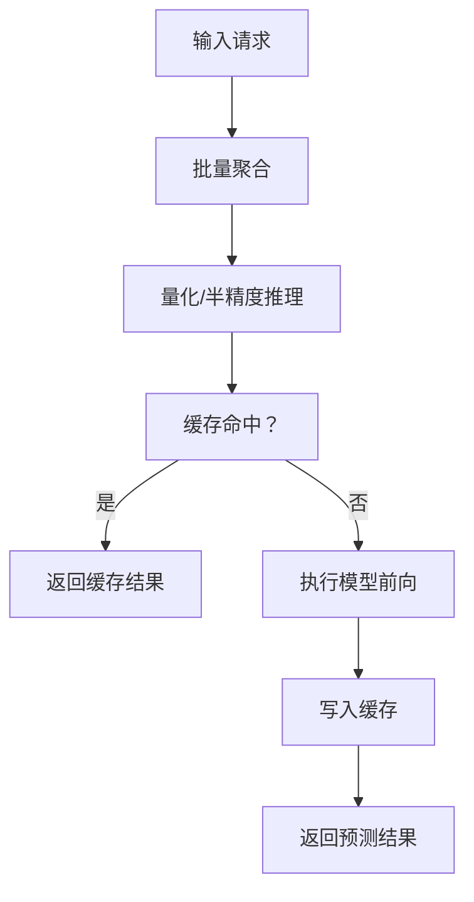
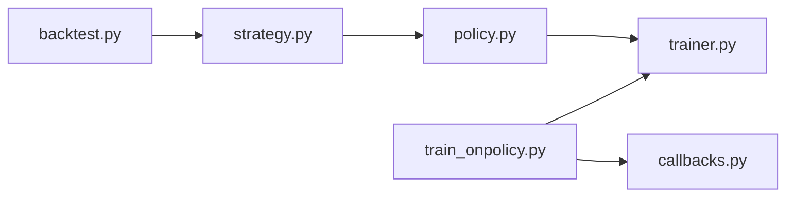

# 模型部署

<cite>
**本文引用的文件**
- [README.md](file://README.md)
- [trainer.py](file://qlib/rl/trainer/trainer.py)
- [callbacks.py](file://qlib/rl/trainer/callbacks.py)
- [train_onpolicy.py](file://qlib/rl/contrib/train_onpolicy.py)
- [policy.py](file://qlib/rl/order_execution/policy.py)
- [backtest.py](file://qlib/rl/contrib/backtest.py)
- [strategy.py](file://qlib/rl/order_execution/strategy.py)
</cite>

## 目录
1. [引言](#引言)
2. [项目结构](#项目结构)
3. [核心组件](#核心组件)
4. [架构总览](#架构总览)
5. [详细组件分析](#详细组件分析)
6. [依赖关系分析](#依赖关系分析)
7. [性能考量](#性能考量)
8. [故障排查指南](#故障排查指南)
9. [结论](#结论)
10. [附录](#附录)

## 引言
本文件系统性阐述从训练完成到生产部署的完整路径，聚焦于强化学习（RL）策略模型的部署要点。内容覆盖：
- 如何使用Trainer的策略权重提取能力，将最优策略网络权重序列化为独立模型文件；
- 基于“10次最优检查点回测”的实践，如何加载多个检查点进行稳定性评估与模型选择；
- 在新环境中加载预训练模型进行推理的流程；
- 在线服务场景下的延迟优化策略：模型量化、批处理预测与缓存机制，确保实时决策的高效性。

## 项目结构
围绕RL训练与部署，本仓库的关键目录与文件如下：
- 训练与检查点管理：qlib/rl/trainer/trainer.py、qlib/rl/trainer/callbacks.py
- 训练脚本与数据加载：qlib/rl/contrib/train_onpolicy.py
- 策略加载与推理：qlib/rl/order_execution/policy.py、qlib/rl/order_execution/strategy.py
- 回测与评估：qlib/rl/contrib/backtest.py
- 平台总体介绍与模式：README.md

图表来源
- [trainer.py](file://qlib/rl/trainer/trainer.py#L156-L161)
- [callbacks.py](file://qlib/rl/trainer/callbacks.py#L203-L292)
- [train_onpolicy.py](file://qlib/rl/contrib/train_onpolicy.py#L100-L202)
- [policy.py](file://qlib/rl/order_execution/policy.py#L102-L209)
- [strategy.py](file://qlib/rl/order_execution/strategy.py#L467-L503)
- [backtest.py](file://qlib/rl/contrib/backtest.py#L323-L364)
- [README.md](file://README.md#L144-L157)

章节来源
- [README.md](file://README.md#L144-L157)

## 核心组件
- 训练器Trainer：提供训练循环、验证周期、日志与状态保存；支持通过回调保存检查点；提供策略权重提取接口。
- 回调与检查点：定期保存训练状态，便于恢复与模型选择；支持早停策略。
- 训练脚本train_onpolicy.py：组织训练与回测流程，创建策略与解释器，驱动训练器。
- 策略加载policy.py：基于Trainer的策略权重提取接口，将权重注入到具体策略对象。
- 策略装配strategy.py：在推理阶段构建策略实例并设置为评估模式。
- 回测backtest.py：对订单集合执行并行回测，输出结果与报告。

章节来源
- [trainer.py](file://qlib/rl/trainer/trainer.py#L156-L161)
- [callbacks.py](file://qlib/rl/trainer/callbacks.py#L203-L292)
- [train_onpolicy.py](file://qlib/rl/contrib/train_onpolicy.py#L100-L202)
- [policy.py](file://qlib/rl/order_execution/policy.py#L102-L209)
- [strategy.py](file://qlib/rl/order_execution/strategy.py#L467-L503)
- [backtest.py](file://qlib/rl/contrib/backtest.py#L323-L364)

## 架构总览
下图展示了从训练到部署的核心交互路径，包括检查点保存、权重提取、策略加载与在线推理。

图表来源
- [train_onpolicy.py](file://qlib/rl/contrib/train_onpolicy.py#L100-L202)
- [trainer.py](file://qlib/rl/trainer/trainer.py#L156-L161)
- [callbacks.py](file://qlib/rl/trainer/callbacks.py#L203-L292)
- [policy.py](file://qlib/rl/order_execution/policy.py#L102-L209)
- [strategy.py](file://qlib/rl/order_execution/strategy.py#L467-L503)
- [backtest.py](file://qlib/rl/contrib/backtest.py#L323-L364)

## 详细组件分析

### 组件A：训练器与检查点（Trainer/Checkpoint）
- Trainer提供训练主循环、验证周期与指标收集；支持保存/加载完整训练状态。
- Checkpoint回调按迭代或时间间隔保存训练状态，文件名可包含迭代号与指标，便于后续模型选择。
- EarlyStopping回调在验证结束时监控指标，达到早停条件后停止训练并可恢复最佳权重。

图表来源
- [trainer.py](file://qlib/rl/trainer/trainer.py#L137-L175)
- [trainer.py](file://qlib/rl/trainer/trainer.py#L156-L161)
- [callbacks.py](file://qlib/rl/trainer/callbacks.py#L203-L292)
- [callbacks.py](file://qlib/rl/trainer/callbacks.py#L78-L183)

章节来源
- [trainer.py](file://qlib/rl/trainer/trainer.py#L137-L175)
- [trainer.py](file://qlib/rl/trainer/trainer.py#L156-L161)
- [callbacks.py](file://qlib/rl/trainer/callbacks.py#L203-L292)
- [callbacks.py](file://qlib/rl/trainer/callbacks.py#L78-L183)

### 组件B：策略权重提取与加载（Trainer.get_policy_state_dict）
- Trainer提供静态方法get_policy_state_dict，用于从检查点文件中提取策略权重字典。
- 策略类（如PPO/DQN）在初始化时可传入weight_file，内部调用Trainer.get_policy_state_dict加载权重并注入策略对象。

图表来源
- [trainer.py](file://qlib/rl/trainer/trainer.py#L156-L161)
- [policy.py](file://qlib/rl/order_execution/policy.py#L102-L209)
- [strategy.py](file://qlib/rl/order_execution/strategy.py#L467-L503)

章节来源
- [trainer.py](file://qlib/rl/trainer/trainer.py#L156-L161)
- [policy.py](file://qlib/rl/order_execution/policy.py#L102-L209)
- [strategy.py](file://qlib/rl/order_execution/strategy.py#L467-L503)

### 组件C：10次最优检查点回测实践
- 训练过程中通过Checkpoint回调保存多个检查点；EarlyStopping可在验证阶段记录最佳权重。
- 回测脚本backtest.py支持对订单集合进行并行回测，输出汇总结果与报告，便于比较不同检查点的稳定性与收益。

图表来源
- [callbacks.py](file://qlib/rl/trainer/callbacks.py#L203-L292)
- [backtest.py](file://qlib/rl/contrib/backtest.py#L323-L364)

章节来源
- [callbacks.py](file://qlib/rl/trainer/callbacks.py#L203-L292)
- [backtest.py](file://qlib/rl/contrib/backtest.py#L323-L364)

### 组件D：新环境加载预训练模型进行推理
- 在新环境中，通过策略装配模块初始化策略对象，并传入weight_file，内部自动调用Trainer.get_policy_state_dict加载权重。
- 推理前需设置策略为eval模式，确保推理行为稳定。

图表来源
- [strategy.py](file://qlib/rl/order_execution/strategy.py#L467-L503)
- [policy.py](file://qlib/rl/order_execution/policy.py#L102-L209)
- [trainer.py](file://qlib/rl/trainer/trainer.py#L156-L161)

章节来源
- [strategy.py](file://qlib/rl/order_execution/strategy.py#L467-L503)
- [policy.py](file://qlib/rl/order_execution/policy.py#L102-L209)
- [trainer.py](file://qlib/rl/trainer/trainer.py#L156-L161)

### 组件E：在线服务延迟优化策略
- 模型量化：在不显著降低精度的前提下，采用低比特表示减少内存占用与计算开销，提升推理吞吐。
- 批处理预测：将多个样本合并为批次进行一次前向计算，减少调度与上下文切换开销。
- 缓存机制：缓存热点特征或中间结果，避免重复计算；结合数据服务器的缓存策略，提高数据访问效率。
- 并行与并发：合理设置并发度与向量化环境，平衡延迟与吞吐；在回测脚本中已体现并行回测的实现思路。

图表来源
- [backtest.py](file://qlib/rl/contrib/backtest.py#L323-L364)

章节来源
- [backtest.py](file://qlib/rl/contrib/backtest.py#L323-L364)

## 依赖关系分析
- 训练脚本train_onpolicy.py依赖训练器Trainer与回调Checkpoint/EarlyStopping，负责组织训练与回测。
- 策略类policy.py依赖Trainer的策略权重提取接口，实现从检查点加载权重。
- 策略装配strategy.py在推理阶段负责构建策略实例并设置eval模式。
- 回测脚本backtest.py对订单集合执行并行回测，支撑模型选择与稳定性评估。

图表来源
- [train_onpolicy.py](file://qlib/rl/contrib/train_onpolicy.py#L100-L202)
- [trainer.py](file://qlib/rl/trainer/trainer.py#L156-L161)
- [callbacks.py](file://qlib/rl/trainer/callbacks.py#L203-L292)
- [policy.py](file://qlib/rl/order_execution/policy.py#L102-L209)
- [strategy.py](file://qlib/rl/order_execution/strategy.py#L467-L503)
- [backtest.py](file://qlib/rl/contrib/backtest.py#L323-L364)

章节来源
- [train_onpolicy.py](file://qlib/rl/contrib/train_onpolicy.py#L100-L202)
- [trainer.py](file://qlib/rl/trainer/trainer.py#L156-L161)
- [callbacks.py](file://qlib/rl/trainer/callbacks.py#L203-L292)
- [policy.py](file://qlib/rl/order_execution/policy.py#L102-L209)
- [strategy.py](file://qlib/rl/order_execution/strategy.py#L467-L503)
- [backtest.py](file://qlib/rl/contrib/backtest.py#L323-L364)

## 性能考量
- 检查点粒度：通过Checkpoint回调控制保存频率，兼顾存储成本与恢复速度。
- 早停策略：EarlyStopping在验证阶段监控指标，防止过拟合并节省训练资源。
- 并行回测：backtest.py使用多进程并行处理不同股票的回测任务，提升评估效率。
- 在线推理优化：建议结合量化、批处理与缓存策略，降低单次请求延迟并提升吞吐。

## 故障排查指南
- 检查点加载失败：确认ckpt_path存在且格式正确；若策略权重键名不匹配，可参考策略类的权重注入逻辑进行兼容处理。
- 验证指标异常：检查EarlyStopping的监控指标名称与阈值设置；必要时调整patience与restore_best_weights参数。
- 回测结果不稳定：尝试使用“10次最优检查点回测”策略，对比多个检查点的稳定性与收益，选择最优者。
- 在线推理延迟高：评估是否启用量化、批处理与缓存；检查并发度与向量化环境配置。

章节来源
- [callbacks.py](file://qlib/rl/trainer/callbacks.py#L78-L183)
- [policy.py](file://qlib/rl/order_execution/policy.py#L220-L229)
- [backtest.py](file://qlib/rl/contrib/backtest.py#L323-L364)

## 结论
本文梳理了从训练完成到生产部署的完整路径，重点强调了以下实践：
- 利用Trainer的策略权重提取能力与Checkpoint回调，形成稳定的检查点体系；
- 基于“10次最优检查点回测”的方法，实现稳健的模型选择；
- 在新环境中通过策略装配与Trainer.get_policy_state_dict快速加载预训练权重；
- 在线服务场景下，结合量化、批处理与缓存策略，保障实时决策的高效性。

## 附录
- 平台总体框架与在线服务模式可参考README中的框架说明与在线模式介绍。

章节来源
- [README.md](file://README.md#L144-L157)