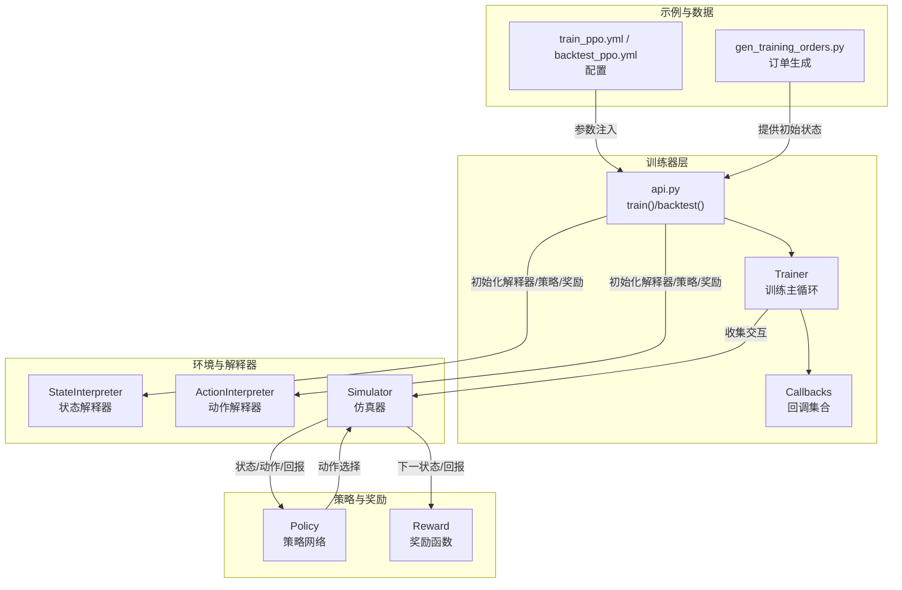
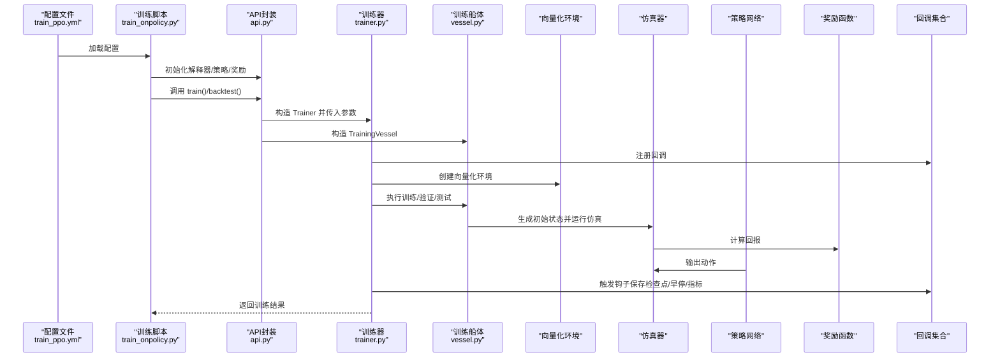
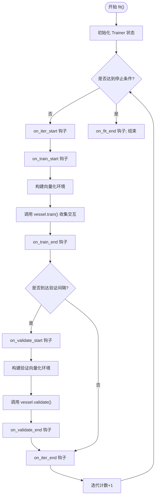
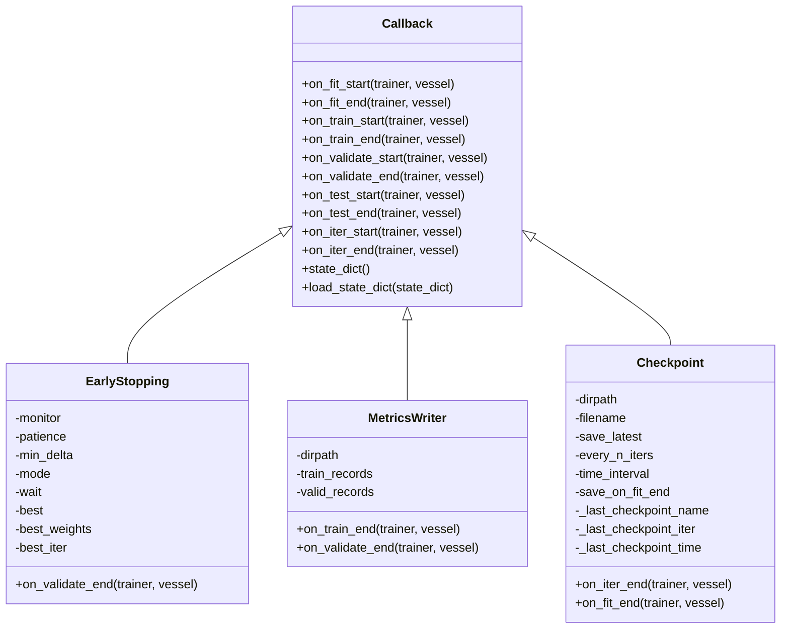
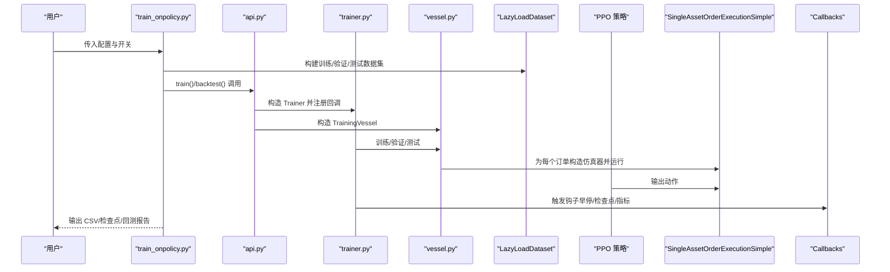
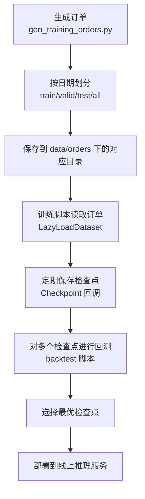
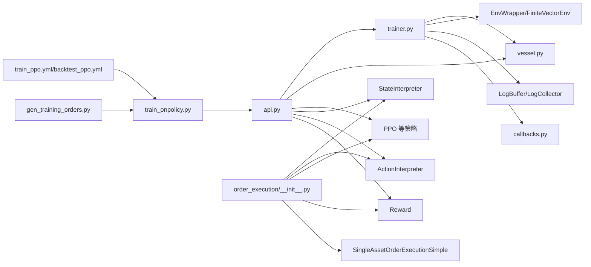

# 训练与部署

<cite>
**本文引用的文件列表**
- [trainer.py](file://qlib/rl/trainer/trainer.py)
- [callbacks.py](file://qlib/rl/trainer/callbacks.py)
- [api.py](file://qlib/rl/trainer/api.py)
- [train_onpolicy.py](file://qlib/rl/contrib/train_onpolicy.py)
- [gen_training_orders.py](file://examples/rl_order_execution/scripts/gen_training_orders.py)
- [train_ppo.yml](file://examples/rl_order_execution/exp_configs/train_ppo.yml)
- [backtest_ppo.yml](file://examples/rl_order_execution/exp_configs/backtest_ppo.yml)
- [__init__.py](file://qlib/rl/order_execution/__init__.py)
</cite>

## 目录
1. [简介](#简介)
2. [项目结构](#项目结构)
3. [核心组件](#核心组件)
4. [架构总览](#架构总览)
5. [详细组件分析](#详细组件分析)
6. [依赖关系分析](#依赖关系分析)
7. [性能考量](#性能考量)
8. [故障排查指南](#故障排查指南)
9. [结论](#结论)
10. [附录](#附录)

## 简介
本文件系统化梳理 Qlib 强化学习框架在“订单执行”场景下的训练流程与生产部署方案，重点围绕以下目标展开：
- 解析训练器 Trainer 的核心工作流：数据加载、策略更新、价值函数估计与经验回放机制
- 解读回调函数 Callbacks：性能指标记录、模型检查点保存、早停机制
- 展示 on-policy 算法（以 PPO 为例）的端到端训练脚本编写方法
- 阐述生成训练订单序列的作用与最佳实践
- 提供从本地训练到分布式部署的迁移路径，覆盖模型序列化、在线推理服务封装与实时决策延迟优化

## 项目结构
Qlib 的强化学习模块由“训练器 + 船体（vessel）+ 回调 + API 封装 + 示例配置”构成，训练与回测通过统一的 API 进行编排，示例工程提供订单生成与配置模板。

图表来源
- [trainer.py](file://qlib/rl/trainer/trainer.py#L188-L273)
- [callbacks.py](file://qlib/rl/trainer/callbacks.py#L32-L292)
- [api.py](file://qlib/rl/trainer/api.py#L19-L119)
- [train_onpolicy.py](file://qlib/rl/contrib/train_onpolicy.py#L100-L202)
- [train_ppo.yml](file://examples/rl_order_execution/exp_configs/train_ppo.yml#L1-L68)
- [backtest_ppo.yml](file://examples/rl_order_execution/exp_configs/backtest_ppo.yml#L1-L54)
- [gen_training_orders.py](file://examples/rl_order_execution/scripts/gen_training_orders.py#L1-L54)

章节来源
- [trainer.py](file://qlib/rl/trainer/trainer.py#L188-L273)
- [api.py](file://qlib/rl/trainer/api.py#L19-L119)
- [train_onpolicy.py](file://qlib/rl/contrib/train_onpolicy.py#L100-L202)
- [train_ppo.yml](file://examples/rl_order_execution/exp_configs/train_ppo.yml#L1-L68)
- [backtest_ppo.yml](file://examples/rl_order_execution/exp_configs/backtest_ppo.yml#L1-L54)
- [gen_training_orders.py](file://examples/rl_order_execution/scripts/gen_training_orders.py#L1-L54)

## 核心组件
- 训练器 Trainer：定义“收集-更新”的迭代范式，负责组织向量化环境、调用船体进行训练/验证/测试，并通过回调与日志器驱动训练过程。
- 回调 Callbacks：提供早停、指标写盘、检查点持久化等横切能力，通过钩子在训练生命周期内插入自定义逻辑。
- API 封装：提供 train()/backtest() 两套高层接口，屏蔽环境构造细节，便于快速搭建 on-policy 训练与回测。
- on-policy 训练脚本：以 PPO 为例，演示如何组合解释器、策略、奖励、仿真器与训练器，完成端到端训练与回测。
- 示例配置：提供训练与回测的 YAML 配置，包含仿真粒度、并行模式、解释器参数、策略超参、训练计划等。
- 订单生成：生成训练/验证/测试订单序列，作为初始状态输入到仿真器。

章节来源
- [trainer.py](file://qlib/rl/trainer/trainer.py#L188-L273)
- [callbacks.py](file://qlib/rl/trainer/callbacks.py#L32-L292)
- [api.py](file://qlib/rl/trainer/api.py#L19-L119)
- [train_onpolicy.py](file://qlib/rl/contrib/train_onpolicy.py#L100-L202)
- [train_ppo.yml](file://examples/rl_order_execution/exp_configs/train_ppo.yml#L1-L68)
- [backtest_ppo.yml](file://examples/rl_order_execution/exp_configs/backtest_ppo.yml#L1-L54)
- [gen_training_orders.py](file://examples/rl_order_execution/scripts/gen_training_orders.py#L1-L54)

## 架构总览
下图展示了从配置到训练、回测与生产的整体流程，以及各模块间的依赖关系。

图表来源
- [train_onpolicy.py](file://qlib/rl/contrib/train_onpolicy.py#L100-L202)
- [api.py](file://qlib/rl/trainer/api.py#L19-L119)
- [trainer.py](file://qlib/rl/trainer/trainer.py#L188-L273)
- [callbacks.py](file://qlib/rl/trainer/callbacks.py#L32-L292)
- [train_ppo.yml](file://examples/rl_order_execution/exp_configs/train_ppo.yml#L1-L68)

## 详细组件分析

### 训练器 Trainer 工作流
- 收集与更新：每次迭代（collect）收集策略与环境交互，累积到回放缓冲区，随后进行若干次策略更新。
- 向量化环境：根据并发与并行模式创建有限步向量环境，支持 dummy/subproc 等类型。
- 生命周期钩子：fit/test 中贯穿 on_fit_start/on_iter_start/on_train_start/on_train_end/on_validate_start/on_validate_end/on_iter_end/on_fit_end 等钩子，用于回调扩展。
- 指标聚合：通过日志缓冲器聚合每回合与每收集周期的指标，验证阶段指标自动加前缀“val/”。

图表来源
- [trainer.py](file://qlib/rl/trainer/trainer.py#L188-L273)

章节来源
- [trainer.py](file://qlib/rl/trainer/trainer.py#L188-L273)

### 回调函数 Callbacks
- 早停 EarlyStopping：基于监控指标（默认 reward 或 val/pa）判断是否提升，超过耐心值则设置 trainer.should_stop 并可选恢复最佳权重。
- 指标写盘 MetricsWriter：在训练/验证结束时将指标写入 CSV 文件，便于离线分析。
- 检查点 Checkpoint：按迭代间隔或时间间隔保存检查点，支持 latest.pth 软链接或复制，支持在 fit 结束时保存最终检查点。

图表来源
- [callbacks.py](file://qlib/rl/trainer/callbacks.py#L32-L292)

章节来源
- [callbacks.py](file://qlib/rl/trainer/callbacks.py#L32-L292)

### on-policy 端到端训练脚本（PPO）
- 数据准备：通过 LazyLoadDataset 延迟加载订单，按日期与时间窗口构造 Order，动态读取特征数据。
- 训练流程：使用 api.train() 组合解释器、策略、奖励与仿真器，设置 episode_per_iter、batch_size、repeat_per_collect 等超参。
- 回测流程：使用 api.backtest() 对测试集进行回测，输出 CSV 日志。
- 配置驱动：train_ppo.yml/backtest_ppo.yml 提供仿真粒度、并行模式、解释器维度、策略网络、奖励函数、训练计划等参数。

图表来源
- [train_onpolicy.py](file://qlib/rl/contrib/train_onpolicy.py#L100-L202)
- [api.py](file://qlib/rl/trainer/api.py#L19-L119)
- [trainer.py](file://qlib/rl/trainer/trainer.py#L188-L273)
- [train_ppo.yml](file://examples/rl_order_execution/exp_configs/train_ppo.yml#L1-L68)
- [backtest_ppo.yml](file://examples/rl_order_execution/exp_configs/backtest_ppo.yml#L1-L54)

章节来源
- [train_onpolicy.py](file://qlib/rl/contrib/train_onpolicy.py#L100-L202)
- [api.py](file://qlib/rl/trainer/api.py#L19-L119)
- [train_ppo.yml](file://examples/rl_order_execution/exp_configs/train_ppo.yml#L1-L68)
- [backtest_ppo.yml](file://examples/rl_order_execution/exp_configs/backtest_ppo.yml#L1-L54)

### 订单生成与 10 次最优检查点回测
- 订单生成：gen_training_orders.py 从 pickle 数据集中抽取样本，按日期划分训练/验证/测试集，并生成 pickle 文件，供 LazyLoadDataset 使用。
- 最优检查点回测：README 中建议对多个检查点进行回测，选择表现最优者作为部署权重。该流程通常在训练后进行，通过 backtest 脚本加载不同检查点，比较指标后择优。

图表来源
- [gen_training_orders.py](file://examples/rl_order_execution/scripts/gen_training_orders.py#L1-L54)
- [train_onpolicy.py](file://qlib/rl/contrib/train_onpolicy.py#L183-L202)
- [callbacks.py](file://qlib/rl/trainer/callbacks.py#L203-L292)

章节来源
- [gen_training_orders.py](file://examples/rl_order_execution/scripts/gen_training_orders.py#L1-L54)
- [train_onpolicy.py](file://qlib/rl/contrib/train_onpolicy.py#L183-L202)
- [callbacks.py](file://qlib/rl/trainer/callbacks.py#L203-L292)

## 依赖关系分析
- 训练器依赖：Trainer 依赖 TrainingVessel、EnvWrapper、FiniteVectorEnv、LogBuffer/LogCollector 等组件；通过回调实现横切关注点。
- on-policy 脚本依赖：train_onpolicy.py 依赖解释器、策略、奖励、仿真器与 api 封装；通过 YAML 配置驱动。
- 示例模块导出：order_execution 包导出解释器、策略、奖励、仿真器与策略适配器等，便于在配置中按模块路径实例化。

图表来源
- [trainer.py](file://qlib/rl/trainer/trainer.py#L188-L273)
- [callbacks.py](file://qlib/rl/trainer/callbacks.py#L32-L292)
- [api.py](file://qlib/rl/trainer/api.py#L19-L119)
- [train_onpolicy.py](file://qlib/rl/contrib/train_onpolicy.py#L100-L202)
- [train_ppo.yml](file://examples/rl_order_execution/exp_configs/train_ppo.yml#L1-L68)
- [backtest_ppo.yml](file://examples/rl_order_execution/exp_configs/backtest_ppo.yml#L1-L54)
- [gen_training_orders.py](file://examples/rl_order_execution/scripts/gen_training_orders.py#L1-L54)
- [__init__.py](file://qlib/rl/order_execution/__init__.py#L1-L39)

章节来源
- [trainer.py](file://qlib/rl/trainer/trainer.py#L188-L273)
- [callbacks.py](file://qlib/rl/trainer/callbacks.py#L32-L292)
- [api.py](file://qlib/rl/trainer/api.py#L19-L119)
- [train_onpolicy.py](file://qlib/rl/contrib/train_onpolicy.py#L100-L202)
- [train_ppo.yml](file://examples/rl_order_execution/exp_configs/train_ppo.yml#L1-L68)
- [backtest_ppo.yml](file://examples/rl_order_execution/exp_configs/backtest_ppo.yml#L1-L54)
- [gen_training_orders.py](file://examples/rl_order_execution/scripts/gen_training_orders.py#L1-L54)
- [__init__.py](file://qlib/rl/order_execution/__init__.py#L1-L39)

## 性能考量
- 并行与向量化：通过 finite_env_type 与 concurrency 控制环境并行度，合理设置可显著提升吞吐；注意 dummy 模式在多线程下的安全性问题。
- 收集与更新：episode_per_iter、repeat_per_collect、batch_size 等参数影响数据利用效率与收敛速度，需结合任务规模与显存进行权衡。
- 日志与指标：LogBuffer 仅在必要时记录，避免高频日志造成带宽瓶颈；验证频率 val_every_n_iters 应平衡过拟合检测与训练时长。
- 检查点策略：定期保存与 latest.pth 软链接/复制策略应结合磁盘空间与恢复速度进行选择。

[本节为通用指导，不直接分析具体文件]

## 故障排查指南
- 早停未生效：确认监控指标名称与可用指标一致，查看日志中 warning 提示；检查 mode/min_delta/baseline 设置。
- 检查点未保存：核对 every_n_iters/time_interval/save_on_fit_end 参数；确认 dirpath 存在且有写权限；检查 latest.pth 是否被正确软链接/复制。
- 训练卡顿：检查向量化环境类型与并发度；确认内存与显存占用；适当降低 episode_per_iter 或 batch_size。
- 回测异常：核对 backtest 配置中的 action_interpreter/state_interpreter/network/policy 与训练一致；确保 weight_file 指向有效检查点。

章节来源
- [callbacks.py](file://qlib/rl/trainer/callbacks.py#L78-L183)
- [callbacks.py](file://qlib/rl/trainer/callbacks.py#L203-L292)
- [trainer.py](file://qlib/rl/trainer/trainer.py#L274-L333)

## 结论
Qlib 的强化学习训练体系以 Trainer 为核心，通过统一的 API 与回调机制，实现了 on-policy 算法（如 PPO）在订单执行场景下的高效训练与回测。配合订单生成脚本与 YAML 配置，可快速落地从数据到模型再到生产的全流程。通过合理的并行策略、指标监控与检查点管理，可在保证稳定性的同时提升训练效率；最终通过 10 次最优检查点回测与线上推理封装，实现从实验室到生产的平滑迁移。

[本节为总结性内容，不直接分析具体文件]

## 附录
- 关键文件路径参考
  - 训练器与回调：[trainer.py](file://qlib/rl/trainer/trainer.py#L188-L273)、[callbacks.py](file://qlib/rl/trainer/callbacks.py#L32-L292)
  - API 封装：[api.py](file://qlib/rl/trainer/api.py#L19-L119)
  - on-policy 训练脚本：[train_onpolicy.py](file://qlib/rl/contrib/train_onpolicy.py#L100-L202)
  - 示例配置：[train_ppo.yml](file://examples/rl_order_execution/exp_configs/train_ppo.yml#L1-L68)、[backtest_ppo.yml](file://examples/rl_order_execution/exp_configs/backtest_ppo.yml#L1-L54)
  - 订单生成：[gen_training_orders.py](file://examples/rl_order_execution/scripts/gen_training_orders.py#L1-L54)
  - 订单执行模块导出：[__init__.py](file://qlib/rl/order_execution/__init__.py#L1-L39)