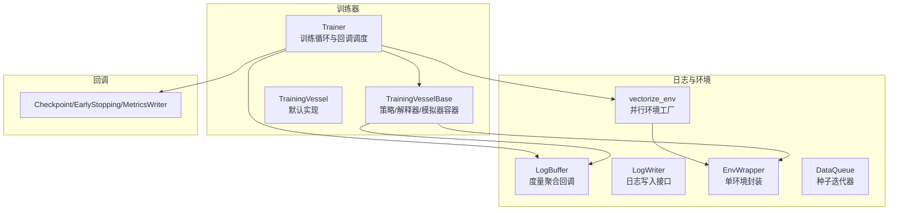
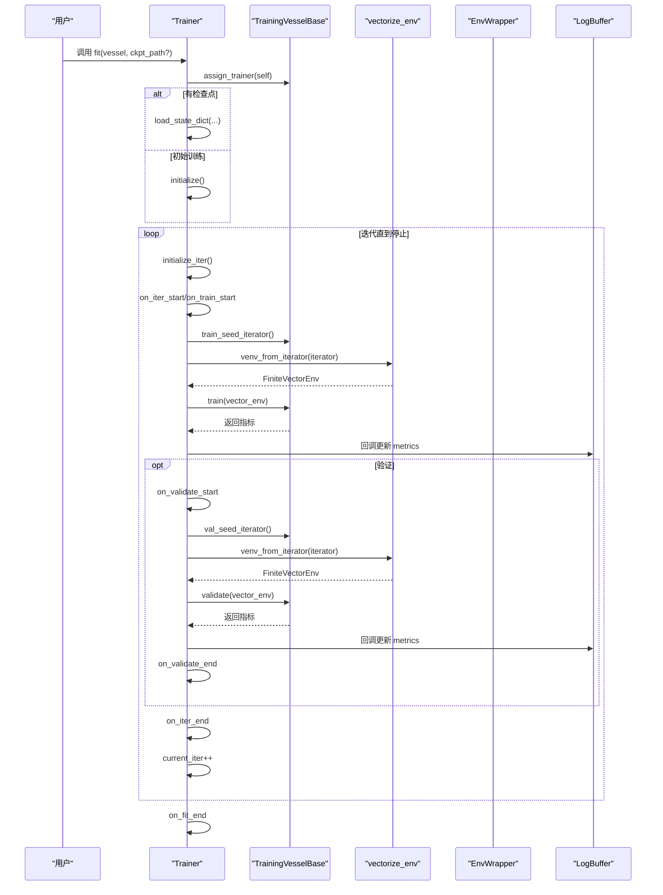
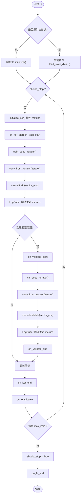
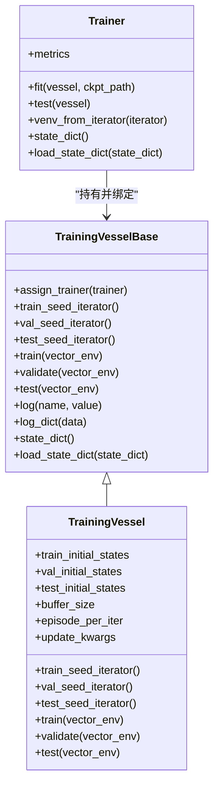
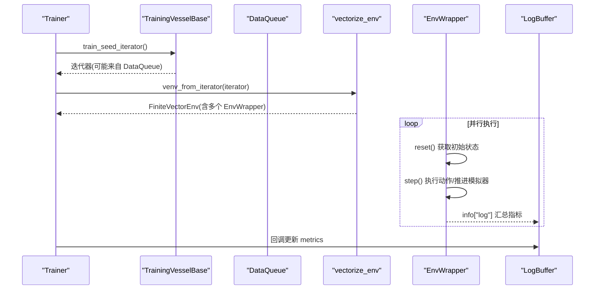
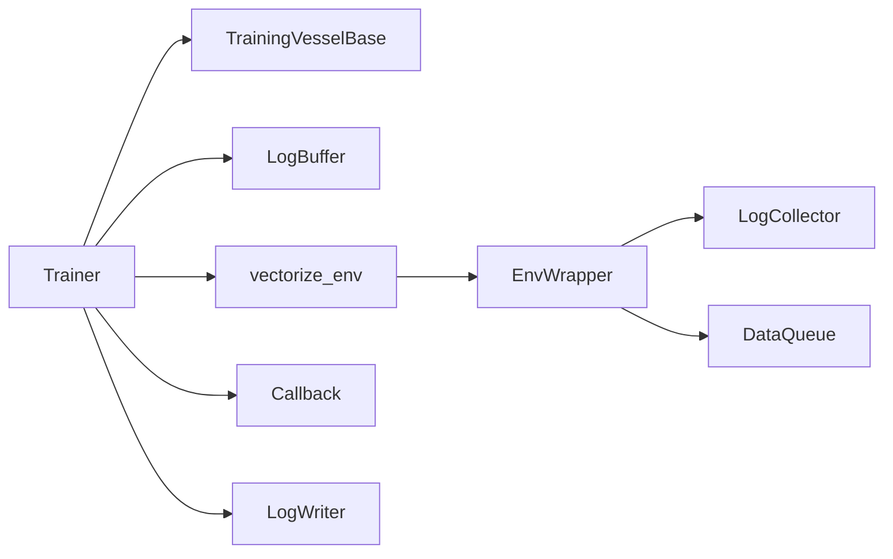

# 训练器架构

<cite>
**本文引用的文件**
- [qlib/rl/trainer/trainer.py](file://qlib/rl/trainer/trainer.py)
- [qlib/rl/trainer/vessel.py](file://qlib/rl/trainer/vessel.py)
- [qlib/rl/trainer/callbacks.py](file://qlib/rl/trainer/callbacks.py)
- [qlib/rl/utils/log.py](file://qlib/rl/utils/log.py)
- [qlib/rl/utils/finite_env.py](file://qlib/rl/utils/finite_env.py)
- [qlib/rl/utils/env_wrapper.py](file://qlib/rl/utils/env_wrapper.py)
- [qlib/rl/utils/data_queue.py](file://qlib/rl/utils/data_queue.py)
- [qlib/rl/trainer/api.py](file://qlib/rl/trainer/api.py)
</cite>

## 目录
1. [引言](#引言)
2. [项目结构](#项目结构)
3. [核心组件](#核心组件)
4. [架构总览](#架构总览)
5. [详细组件分析](#详细组件分析)
6. [依赖关系分析](#依赖关系分析)
7. [性能考量](#性能考量)
8. [故障排查指南](#故障排查指南)
9. [结论](#结论)

## 引言
本文件系统性解析 Qlib 中 RL 训练框架的 Trainer 类及其 TrainingVesselBase 容器的设计与实现，重点覆盖以下主题：
- Trainer 如何以“collect”为单位的训练范式替代传统 epoch/mini-batch，以及如何通过 vectorize_env 实现并发环境采样；
- TrainingVesselBase 如何作为容器协调策略网络、环境模拟器、奖励函数与状态/动作解释器；
- state_dict/load_state_dict 在训练中断与恢复中的作用；
- metrics 字典在训练/验证阶段的聚合与命名空间管理机制；
- assign_trainer 建立 trainer 与 vessel 的双向绑定；
- _min_loglevel 方法如何协调多个日志记录器的输出级别。

## 项目结构
围绕 RL 训练的核心模块位于 qlib/rl/trainer 与 qlib/rl/utils 下，分别负责训练控制、日志与环境并行化等关键能力。

图表来源
- [qlib/rl/trainer/trainer.py](file://qlib/rl/trainer/trainer.py#L1-L120)
- [qlib/rl/trainer/vessel.py](file://qlib/rl/trainer/vessel.py#L1-L120)
- [qlib/rl/utils/log.py](file://qlib/rl/utils/log.py#L1-L120)
- [qlib/rl/utils/finite_env.py](file://qlib/rl/utils/finite_env.py#L348-L369)
- [qlib/rl/utils/env_wrapper.py](file://qlib/rl/utils/env_wrapper.py#L1-L120)
- [qlib/rl/utils/data_queue.py](file://qlib/rl/utils/data_queue.py#L1-L80)
- [qlib/rl/trainer/callbacks.py](file://qlib/rl/trainer/callbacks.py#L1-L80)

章节来源
- [qlib/rl/trainer/trainer.py](file://qlib/rl/trainer/trainer.py#L1-L120)
- [qlib/rl/trainer/vessel.py](file://qlib/rl/trainer/vessel.py#L1-L120)
- [qlib/rl/utils/log.py](file://qlib/rl/utils/log.py#L1-L120)
- [qlib/rl/utils/finite_env.py](file://qlib/rl/utils/finite_env.py#L348-L369)
- [qlib/rl/utils/env_wrapper.py](file://qlib/rl/utils/env_wrapper.py#L1-L120)
- [qlib/rl/utils/data_queue.py](file://qlib/rl/utils/data_queue.py#L1-L80)
- [qlib/rl/trainer/callbacks.py](file://qlib/rl/trainer/callbacks.py#L1-L80)

## 核心组件
- Trainer：定义“collect”迭代训练范式，负责初始化、迭代循环、验证、测试、日志与回调调度，以及状态序列化/恢复。
- TrainingVesselBase：策略网络、模拟器、解释器、奖励函数的容器，提供训练/验证/测试的 collect 逻辑与日志接口。
- TrainingVessel：默认实现，使用 Collector 与 Replay Buffer 执行收集与更新；支持 fast_dev_run 快速开发模式。
- 日志系统：LogBuffer 聚合 episode/collect 指标并通过回调驱动 Trainer.metrics 更新；LogWriter 抽象各类写入器。
- 并行环境：vectorize_env 将 EnvWrapper 复制到多进程/共享内存环境中执行；EnvWrapper 将解释器与模拟器封装为 gym 环境；DataQueue 提供可重复、可洗牌的种子迭代器。
- 回调：Checkpoint、EarlyStopping、MetricsWriter 插入训练生命周期钩子，支持断点续训与早停。

章节来源
- [qlib/rl/trainer/trainer.py](file://qlib/rl/trainer/trainer.py#L1-L120)
- [qlib/rl/trainer/vessel.py](file://qlib/rl/trainer/vessel.py#L1-L120)
- [qlib/rl/utils/log.py](file://qlib/rl/utils/log.py#L1-L120)
- [qlib/rl/utils/finite_env.py](file://qlib/rl/utils/finite_env.py#L348-L369)
- [qlib/rl/utils/env_wrapper.py](file://qlib/rl/utils/env_wrapper.py#L1-L120)
- [qlib/rl/utils/data_queue.py](file://qlib/rl/utils/data_queue.py#L1-L80)
- [qlib/rl/trainer/callbacks.py](file://qlib/rl/trainer/callbacks.py#L1-L80)

## 架构总览
Trainer 与 TrainingVesselBase 通过 assign_trainer 建立双向绑定，Trainer 在每次迭代中：
- 使用 vessel.train_seed_iterator/val_seed_iterator 获取初始状态迭代器；
- 通过 venv_from_iterator 创建并行环境（vectorize_env）；
- 调用 vessel.train/validate/test 执行一次 collect 或一次性评估；
- 通过 LogBuffer 回调更新 Trainer.metrics；
- 触发回调（Checkpoint、EarlyStopping、MetricsWriter）。

图表来源
- [qlib/rl/trainer/trainer.py](file://qlib/rl/trainer/trainer.py#L188-L249)
- [qlib/rl/trainer/trainer.py](file://qlib/rl/trainer/trainer.py#L274-L336)
- [qlib/rl/trainer/vessel.py](file://qlib/rl/trainer/vessel.py#L66-L113)
- [qlib/rl/utils/finite_env.py](file://qlib/rl/utils/finite_env.py#L348-L369)
- [qlib/rl/utils/env_wrapper.py](file://qlib/rl/utils/env_wrapper.py#L1-L120)
- [qlib/rl/utils/log.py](file://qlib/rl/utils/log.py#L308-L384)

章节来源
- [qlib/rl/trainer/trainer.py](file://qlib/rl/trainer/trainer.py#L188-L249)
- [qlib/rl/trainer/trainer.py](file://qlib/rl/trainer/trainer.py#L274-L336)
- [qlib/rl/trainer/vessel.py](file://qlib/rl/trainer/vessel.py#L66-L113)
- [qlib/rl/utils/finite_env.py](file://qlib/rl/utils/finite_env.py#L348-L369)
- [qlib/rl/utils/env_wrapper.py](file://qlib/rl/utils/env_wrapper.py#L1-L120)
- [qlib/rl/utils/log.py](file://qlib/rl/utils/log.py#L308-L384)

## 详细组件分析

### Trainer 类与“collect”迭代范式
- “collect”迭代：每次迭代收集若干轨迹（episode），填充回放缓冲区后进行策略更新；验证阶段按需周期性执行。
- 初始化与状态：initialize/reset 当前迭代/阶段；state_dict/load_state_dict 支持断点续训；named_callbacks/named_loggers 便于统一保存。
- 日志与指标：_metrics_callback 将 episode/collect 指标写入 Trainer.metrics；验证时对指标名加“val/”前缀；_min_loglevel 统一最小日志级别以降低带宽。
- 并行环境：venv_from_iterator 依据 finite_env_type 选择 dummy/subproc/shmem；concurrency 控制并行度；EnvWrapper 包装解释器、模拟器与奖励函数。

图表来源
- [qlib/rl/trainer/trainer.py](file://qlib/rl/trainer/trainer.py#L188-L249)
- [qlib/rl/trainer/trainer.py](file://qlib/rl/trainer/trainer.py#L274-L336)
- [qlib/rl/utils/log.py](file://qlib/rl/utils/log.py#L308-L384)

章节来源
- [qlib/rl/trainer/trainer.py](file://qlib/rl/trainer/trainer.py#L1-L120)
- [qlib/rl/trainer/trainer.py](file://qlib/rl/trainer/trainer.py#L121-L207)
- [qlib/rl/trainer/trainer.py](file://qlib/rl/trainer/trainer.py#L208-L249)
- [qlib/rl/trainer/trainer.py](file://qlib/rl/trainer/trainer.py#L274-L336)
- [qlib/rl/utils/log.py](file://qlib/rl/utils/log.py#L308-L384)

### TrainingVesselBase 容器与双向绑定
- 双向绑定：assign_trainer 将弱引用注入 vessel，使 vessel 可访问 trainer 的当前迭代/阶段等信息；vessel 内部通过 log/log_dict 输出迭代级日志。
- 训练/验证/测试：默认由 vessel.train/train_seed_iterator/validate/val_seed_iterator/test/test_seed_iterator 实现；TrainingVessel 默认一次 collect 使用 Collector 收集 episode_per_iter 条轨迹并更新策略。
- fast_dev_run：在训练/验证/测试种子集合上随机采样，便于快速开发与调试。

图表来源
- [qlib/rl/trainer/vessel.py](file://qlib/rl/trainer/vessel.py#L1-L120)
- [qlib/rl/trainer/vessel.py](file://qlib/rl/trainer/vessel.py#L120-L219)
- [qlib/rl/trainer/trainer.py](file://qlib/rl/trainer/trainer.py#L188-L249)

章节来源
- [qlib/rl/trainer/vessel.py](file://qlib/rl/trainer/vessel.py#L1-L120)
- [qlib/rl/trainer/vessel.py](file://qlib/rl/trainer/vessel.py#L120-L219)
- [qlib/rl/trainer/trainer.py](file://qlib/rl/trainer/trainer.py#L188-L249)

### 并行环境采样与种子迭代器
- vectorize_env：根据 finite_env_type 选择具体并行实现（dummy/subproc/shmem），并发创建 EnvWrapper 实例；concurrency 指定并行 worker 数；传入日志写入器以汇总指标。
- EnvWrapper：将 simulator_fn/state_interpreter/action_interpreter/reward/logger 组装为 gym 环境；在 reset/step 中维护状态历史、奖励与日志；通过 info["log"] 将每步日志回传给主进程。
- DataQueue：生产者-消费者模型，支持重复次数、洗牌与多工作线程；在 with 上下文中激活生产者线程，消费者迭代返回初始状态种子；支持清理与超时处理。

图表来源
- [qlib/rl/trainer/trainer.py](file://qlib/rl/trainer/trainer.py#L274-L336)
- [qlib/rl/utils/finite_env.py](file://qlib/rl/utils/finite_env.py#L272-L369)
- [qlib/rl/utils/env_wrapper.py](file://qlib/rl/utils/env_wrapper.py#L120-L251)
- [qlib/rl/utils/data_queue.py](file://qlib/rl/utils/data_queue.py#L120-L189)

章节来源
- [qlib/rl/trainer/trainer.py](file://qlib/rl/trainer/trainer.py#L274-L336)
- [qlib/rl/utils/finite_env.py](file://qlib/rl/utils/finite_env.py#L272-L369)
- [qlib/rl/utils/env_wrapper.py](file://qlib/rl/utils/env_wrapper.py#L120-L251)
- [qlib/rl/utils/data_queue.py](file://qlib/rl/utils/data_queue.py#L120-L189)

### 训练中断与恢复：state_dict/load_state_dict
- Trainer.state_dict/load_state_dict：保存/恢复 trainer 的状态（vessel、callbacks、loggers、should_stop、current_iter/current_episode、current_stage、metrics）。
- vessel.state_dict/load_state_dict：仅保存/恢复策略网络参数（policy.state_dict/load_state_dict）。
- 检查点保存：Checkpoint 回调在迭代结束或满足条件时保存 trainer.state_dict；支持 latest 链接/复制策略。

章节来源
- [qlib/rl/trainer/trainer.py](file://qlib/rl/trainer/trainer.py#L137-L175)
- [qlib/rl/trainer/vessel.py](file://qlib/rl/trainer/vessel.py#L89-L96)
- [qlib/rl/trainer/callbacks.py](file://qlib/rl/trainer/callbacks.py#L203-L292)

### metrics 字典的聚合与命名空间管理
- Episode/Collect 聚合：LogBuffer 在 episode 结束时计算每步指标的均值/求和（如 reward 求和），在 collect 结束时计算平均；_metrics_callback 将最新指标写入 Trainer.metrics。
- 验证命名空间：当 current_stage 为 "val" 时，指标名自动加上 "val/" 前缀，避免与训练指标冲突。
- 日志级别：_min_loglevel 取所有日志写入器的最小日志级别，用于 LogCollector 的过滤，减少带宽占用。

章节来源
- [qlib/rl/utils/log.py](file://qlib/rl/utils/log.py#L308-L384)
- [qlib/rl/trainer/trainer.py](file://qlib/rl/trainer/trainer.py#L309-L336)

### assign_trainer 双向绑定
- TrainingVesselBase.assign_trainer：将 trainer 以弱引用注入 vessel，使 vessel 可读取 trainer.current_iter 等运行期状态；vessel.log/log_dict 会打印包含当前迭代号的日志。
- Trainer.fit/test：在启动训练/测试前调用 vessel.assign_trainer(self)，确保容器与训练器的强弱引用关系正确。

章节来源
- [qlib/rl/trainer/vessel.py](file://qlib/rl/trainer/vessel.py#L49-L88)
- [qlib/rl/trainer/trainer.py](file://qlib/rl/trainer/trainer.py#L188-L207)

### _min_loglevel 协调多个日志记录器
- _min_loglevel：遍历所有 LogWriter，取其 loglevel 的最小值，作为 LogCollector 的最小日志级别阈值，从而在多 writer 场景下统一过滤策略，降低网络/管道传输压力。

章节来源
- [qlib/rl/trainer/trainer.py](file://qlib/rl/trainer/trainer.py#L326-L336)
- [qlib/rl/utils/log.py](file://qlib/rl/utils/log.py#L137-L217)

## 依赖关系分析
- Trainer 依赖 TrainingVesselBase（容器）、LogBuffer（指标聚合）、vectorize_env（并行环境）、LogWriter（日志写入）、Callback（回调）。
- TrainingVesselBase 依赖 EnvWrapper（gym 环境封装）、DataQueue（种子迭代器）、LogCollector（每步日志）。
- vectorize_env 依赖具体并行实现（dummy/subproc/shmem）与日志写入器列表。

图表来源
- [qlib/rl/trainer/trainer.py](file://qlib/rl/trainer/trainer.py#L188-L249)
- [qlib/rl/trainer/vessel.py](file://qlib/rl/trainer/vessel.py#L1-L120)
- [qlib/rl/utils/finite_env.py](file://qlib/rl/utils/finite_env.py#L348-L369)
- [qlib/rl/utils/env_wrapper.py](file://qlib/rl/utils/env_wrapper.py#L1-L120)
- [qlib/rl/utils/data_queue.py](file://qlib/rl/utils/data_queue.py#L1-L80)
- [qlib/rl/utils/log.py](file://qlib/rl/utils/log.py#L1-L120)
- [qlib/rl/trainer/callbacks.py](file://qlib/rl/trainer/callbacks.py#L1-L80)

章节来源
- [qlib/rl/trainer/trainer.py](file://qlib/rl/trainer/trainer.py#L188-L249)
- [qlib/rl/trainer/vessel.py](file://qlib/rl/trainer/vessel.py#L1-L120)
- [qlib/rl/utils/finite_env.py](file://qlib/rl/utils/finite_env.py#L348-L369)
- [qlib/rl/utils/env_wrapper.py](file://qlib/rl/utils/env_wrapper.py#L1-L120)
- [qlib/rl/utils/data_queue.py](file://qlib/rl/utils/data_queue.py#L1-L80)
- [qlib/rl/utils/log.py](file://qlib/rl/utils/log.py#L1-L120)
- [qlib/rl/trainer/callbacks.py](file://qlib/rl/trainer/callbacks.py#L1-L80)

## 性能考量
- 并行环境类型：subproc/shmem 在多进程/共享内存场景下吞吐更高；dummy 仅用于调试且存在线程不安全问题。
- 日志带宽：_min_loglevel 统一过滤，LogCollector 仅保留不低于阈值的日志，避免过多传输。
- fast_dev_run：在训练/验证/测试种子集合上随机采样，显著缩短开发周期。
- 内存管理：训练完成后显式删除 vector_env，避免内存泄漏风险。

章节来源
- [qlib/rl/trainer/trainer.py](file://qlib/rl/trainer/trainer.py#L274-L336)
- [qlib/rl/utils/log.py](file://qlib/rl/utils/log.py#L308-L384)
- [qlib/rl/trainer/vessel.py](file://qlib/rl/trainer/vessel.py#L142-L219)
- [qlib/rl/utils/finite_env.py](file://qlib/rl/utils/finite_env.py#L348-L369)

## 故障排查指南
- 训练未收敛或过拟合：启用 EarlyStopping 回调，监控指定指标（默认 reward），设置 patience/min_delta/restore_best_weights。
- 指标缺失：MetricsWriter 会在 on_train_end/on_validate_end 时将 trainer.metrics 写入 CSV；若缺少指标，检查 LogBuffer 回调是否触发。
- 检查点无效：确认 Checkpoint 的 every_n_iters/time_interval/save_on_fit_end 设置；注意 latest 链接/复制策略。
- 日志级别过高导致性能下降：调整 _min_loglevel 或 LogWriter.loglevel，减少不必要的日志传输。
- 并行环境卡死：检查 DataQueue 的队列大小与清理流程；确保在 with 上下文中正确激活与关闭。

章节来源
- [qlib/rl/trainer/callbacks.py](file://qlib/rl/trainer/callbacks.py#L78-L184)
- [qlib/rl/trainer/callbacks.py](file://qlib/rl/trainer/callbacks.py#L185-L292)
- [qlib/rl/utils/log.py](file://qlib/rl/utils/log.py#L308-L384)
- [qlib/rl/utils/data_queue.py](file://qlib/rl/utils/data_queue.py#L80-L189)

## 结论
Qlib 的 RL 训练器通过“collect”迭代范式与 TrainingVesselBase 容器，将策略网络、模拟器、解释器与奖励函数解耦组合，配合 vectorize_env 实现高效并发采样。Trainer 负责训练循环、日志与回调调度，vessel 负责具体的 collect 与评估逻辑。state_dict/load_state_dict 与 Checkpoint 回调共同支撑断点续训；LogBuffer 与 _min_loglevel 确保指标聚合与带宽优化；assign_trainer 实现了 trainer 与 vessel 的弱引用双向绑定，使容器能够感知训练进度并输出迭代级日志。该设计在保证灵活性的同时，提供了良好的扩展性与可观测性。