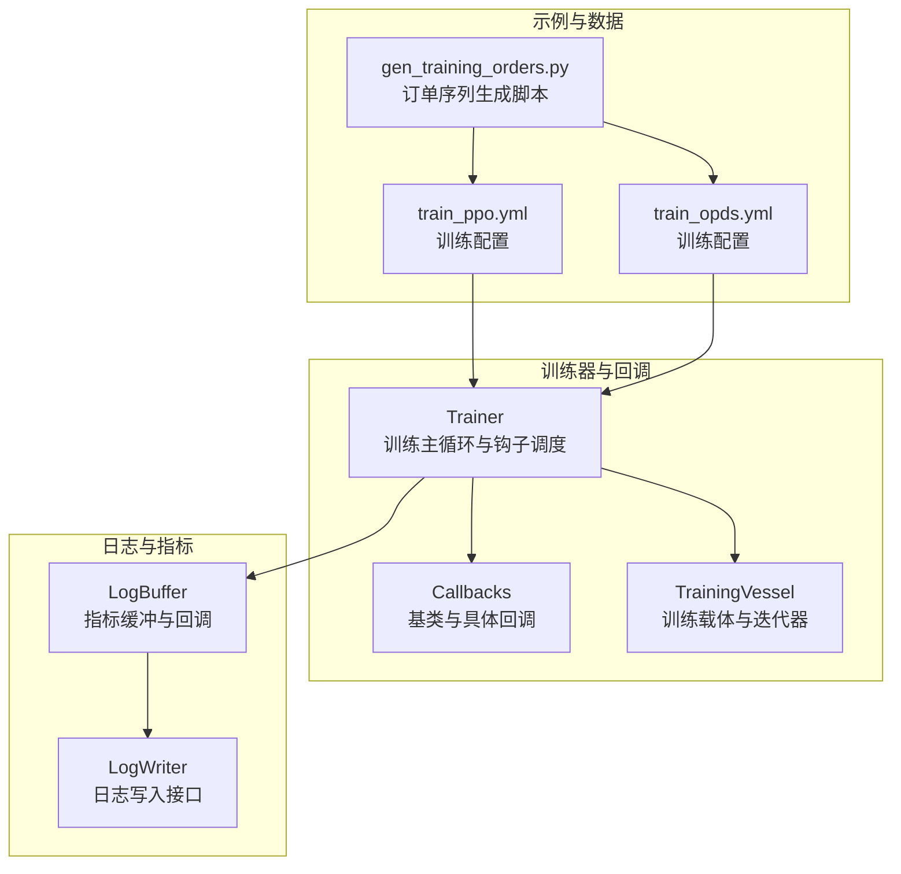
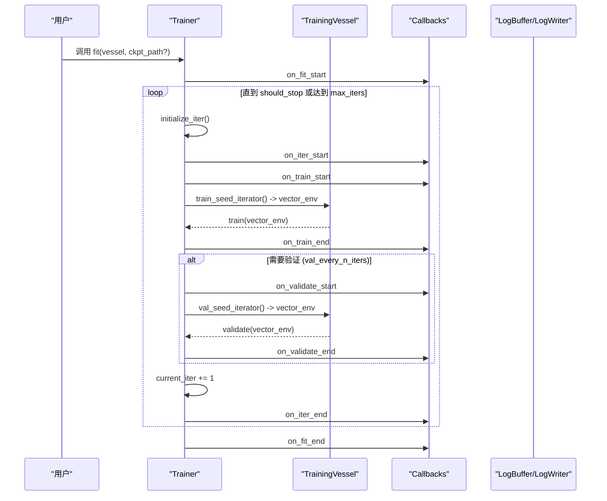
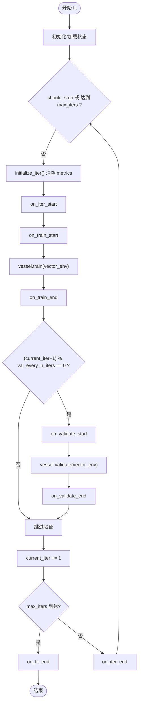
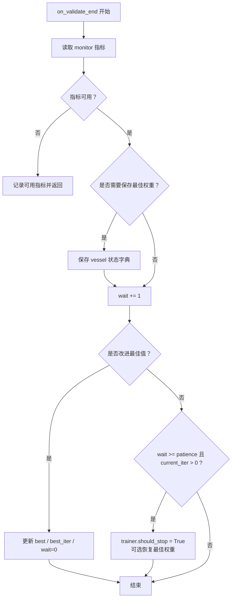
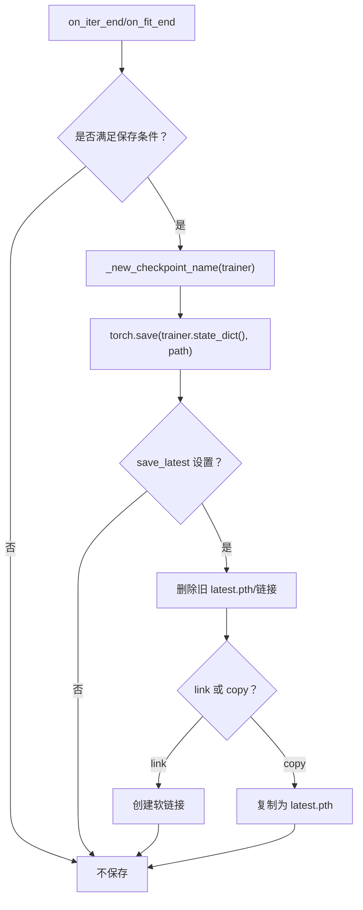
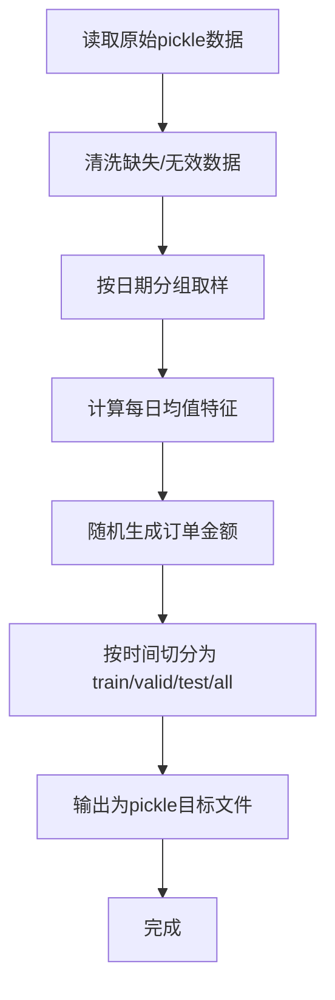
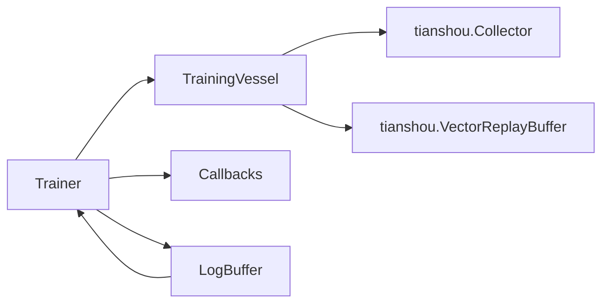

# 训练流程管理

<cite>
**本文引用的文件列表**
- [trainer.py](file://qlib/rl/trainer/trainer.py)
- [callbacks.py](file://qlib/rl/trainer/callbacks.py)
- [vessel.py](file://qlib/rl/trainer/vessel.py)
- [log.py](file://qlib/rl/utils/log.py)
- [gen_training_orders.py](file://examples/rl_order_execution/scripts/gen_training_orders.py)
- [train_ppo.yml](file://examples/rl_order_execution/exp_configs/train_ppo.yml)
- [train_opds.yml](file://examples/rl_order_execution/exp_configs/train_opds.yml)
</cite>

## 目录
1. [简介](#简介)
2. [项目结构](#项目结构)
3. [核心组件](#核心组件)
4. [架构总览](#架构总览)
5. [详细组件分析](#详细组件分析)
6. [依赖关系分析](#依赖关系分析)
7. [性能考量](#性能考量)
8. [故障排查指南](#故障排查指南)
9. [结论](#结论)
10. [附录](#附录)

## 简介
本文件系统性地文档化强化学习训练的生命周期管理，重点覆盖以下方面：
- fit方法中训练主循环的执行逻辑，包括on_iter_start到on_iter_end的完整钩子调用序列，以及训练与验证阶段的交替执行条件；
- Callbacks机制：EarlyStopping如何基于验证集奖励指标实现早停；Checkpoint回调如何通过every_n_iters和time_interval策略保存模型快照；MetricsWriter如何将训练指标持久化为CSV文件；
- 结合gen_training_orders.py，说明如何从原始市场数据生成用于订单执行任务的训练、验证和测试订单序列，并解释其在构建真实交易环境中的关键作用。

## 项目结构
围绕训练生命周期管理的核心代码位于qlib/rl/trainer目录，配合utils日志模块、order_execution示例与脚本生成工具，形成完整的训练流水线。

图表来源
- [trainer.py](file://qlib/rl/trainer/trainer.py#L188-L249)
- [callbacks.py](file://qlib/rl/trainer/callbacks.py#L32-L292)
- [vessel.py](file://qlib/rl/trainer/vessel.py#L34-L219)
- [log.py](file://qlib/rl/utils/log.py#L308-L384)
- [train_ppo.yml](file://examples/rl_order_execution/exp_configs/train_ppo.yml#L56-L68)
- [train_opds.yml](file://examples/rl_order_execution/exp_configs/train_opds.yml#L58-L67)
- [gen_training_orders.py](file://examples/rl_order_execution/scripts/gen_training_orders.py#L1-L54)

章节来源
- [trainer.py](file://qlib/rl/trainer/trainer.py#L188-L249)
- [callbacks.py](file://qlib/rl/trainer/callbacks.py#L32-L292)
- [vessel.py](file://qlib/rl/trainer/vessel.py#L34-L219)
- [log.py](file://qlib/rl/utils/log.py#L308-L384)
- [train_ppo.yml](file://examples/rl_order_execution/exp_configs/train_ppo.yml#L56-L68)
- [train_opds.yml](file://examples/rl_order_execution/exp_configs/train_opds.yml#L58-L67)
- [gen_training_orders.py](file://examples/rl_order_execution/scripts/gen_training_orders.py#L1-L54)

## 核心组件
- Trainer：负责训练主循环、阶段切换、迭代计数、指标聚合与回调调度。支持最大迭代次数、验证频率、并发环境类型等参数。
- TrainingVessel：封装模拟器、状态/动作解释器、策略与奖励函数，提供训练/验证/测试的种子迭代器与具体执行逻辑。
- Callbacks：定义统一的训练生命周期钩子，包含EarlyStopping、Checkpoint、MetricsWriter等。
- 日志系统：LogBuffer作为指标缓冲，在每轮收集或每回合结束时触发回调，Trainer将验证阶段指标前缀“val/”以便区分。

章节来源
- [trainer.py](file://qlib/rl/trainer/trainer.py#L71-L122)
- [vessel.py](file://qlib/rl/trainer/vessel.py#L34-L113)
- [callbacks.py](file://qlib/rl/trainer/callbacks.py#L32-L77)
- [log.py](file://qlib/rl/utils/log.py#L308-L384)

## 架构总览
训练生命周期由Trainer驱动，按“训练-可选验证-迭代+1”的节奏推进。每个阶段通过回调钩子扩展行为，日志系统在收集/回合边界聚合指标并写入。

图表来源
- [trainer.py](file://qlib/rl/trainer/trainer.py#L188-L249)
- [vessel.py](file://qlib/rl/trainer/vessel.py#L142-L203)
- [callbacks.py](file://qlib/rl/trainer/callbacks.py#L32-L77)

## 详细组件分析

### 训练主循环与钩子序列（fit）
- 初始化与恢复：支持从检查点加载状态，否则初始化训练状态与计数器。
- 迭代循环：每次迭代重置metrics，依次触发on_iter_start、on_train_start、执行训练、on_train_end。
- 验证阶段：当满足“当前迭代+1能被val_every_n_iters整除”时，进入验证流程，依次触发on_validate_start、执行验证、on_validate_end。
- 结束条件：达到max_iters或回调设置should_stop为真时终止，最后触发on_fit_end。
- 指标前缀：验证阶段指标自动加上“val/”前缀，便于区分训练与验证。

图表来源
- [trainer.py](file://qlib/rl/trainer/trainer.py#L188-L249)

章节来源
- [trainer.py](file://qlib/rl/trainer/trainer.py#L188-L249)

### Callbacks机制与验证阶段交替条件
- 验证触发条件：当val_every_n_iters不为空且(current_iter+1)能被其整除时，执行一次验证。
- 验证阶段指标前缀：Trainer在聚合指标时对验证阶段指标加“val/”前缀，确保MetricsWriter正确区分训练与验证记录。
- 回调注册：Trainer构造时接收回调列表，通过统一的_hook分发器调用对应钩子。

章节来源
- [trainer.py](file://qlib/rl/trainer/trainer.py#L229-L239)
- [trainer.py](file://qlib/rl/trainer/trainer.py#L310-L320)
- [callbacks.py](file://qlib/rl/trainer/callbacks.py#L32-L77)

### EarlyStopping：基于验证集奖励指标的早停
- 监控指标：默认监控名为“reward”的指标；若该指标不可用会发出警告。
- 改进判断：根据mode（min/max）与min_delta决定是否认为当前值优于最佳值。
- 耐心度与停止：当wait超过patience且已超过第一个迭代后，设置trainer.should_stop为真，并可选择恢复最佳权重。
- 最佳权重保存：在首次取得进步时保存vessel的状态字典，以便在早停后恢复。

图表来源
- [callbacks.py](file://qlib/rl/trainer/callbacks.py#L140-L169)
- [callbacks.py](file://qlib/rl/trainer/callbacks.py#L171-L183)

章节来源
- [callbacks.py](file://qlib/rl/trainer/callbacks.py#L78-L183)

### Checkpoint：周期性保存与latest链接
- 触发策略：
  - every_n_iters：在每次迭代结束时，若(current_iter+1)能被其整除则保存；
  - time_interval：若距离上次保存已超过指定秒数也保存；
  - on_fit_end：在训练结束时保存最后一次检查点（避免重复保存）。
- 文件命名：支持以{iter}、{time}及trainer.metrics中的指标动态命名；
- latest处理：支持软链接或复制latest.pth，自动清理旧链接/文件。

图表来源
- [callbacks.py](file://qlib/rl/trainer/callbacks.py#L235-L292)

章节来源
- [callbacks.py](file://qlib/rl/trainer/callbacks.py#L203-L292)

### MetricsWriter：CSV指标持久化
- 训练指标：在on_train_end时将非“val/”前缀指标追加到训练记录并写入train_result.csv；
- 验证指标：在on_validate_end时将“val/”前缀指标追加到验证记录并写入validation_result.csv；
- 数据结构：每条记录为一次迭代的指标聚合结果，行索引为迭代序号。

章节来源
- [callbacks.py](file://qlib/rl/trainer/callbacks.py#L185-L201)

### 日志与指标聚合（LogBuffer与Trainer）
- LogBuffer：在每回合结束（episode）与每轮收集（collect）时，分别更新全局回合计数与最新/聚合指标，并触发回调；
- Trainer._metrics_callback：根据current_stage为验证指标添加“val/”前缀；
- 日志写入：ConsoleWriter/CsvWriter等LogWriter实现可将指标输出至控制台或CSV文件。

章节来源
- [log.py](file://qlib/rl/utils/log.py#L308-L384)
- [trainer.py](file://qlib/rl/trainer/trainer.py#L309-L320)
- [log.py](file://qlib/rl/utils/log.py#L385-L468)
- [log.py](file://qlib/rl/utils/log.py#L470-L509)

### 订单序列生成与真实交易环境构建（gen_training_orders.py）
- 输入：原始pickle数据（按股票维度），包含多列特征与成交量；
- 处理步骤：
  - 读取数据并重采样为日粒度；
  - 计算每日平均订单量并随机生成订单金额；
  - 依据时间划分训练/验证/测试集（例如2021年6月30日前为训练，6月30日后到9月30日为验证，之后为测试）；
  - 输出四个集合：train、valid、test、all，分别保存为pickle目标文件。
- 关键作用：将真实市场数据转换为标准化的订单序列，用于订单执行任务的训练与评估，确保训练/验证/测试分布合理且可复现。

图表来源
- [gen_training_orders.py](file://examples/rl_order_execution/scripts/gen_training_orders.py#L14-L41)

章节来源
- [gen_training_orders.py](file://examples/rl_order_execution/scripts/gen_training_orders.py#L1-L54)

### 示例配置与运行参数映射
- 训练配置文件中trainer部分的关键参数：
  - max_epoch：映射到Trainer.max_iters；
  - val_every_n_epoch：映射到Trainer.val_every_n_iters；
  - earlystop_patience：映射到EarlyStopping.patience；
  - checkpoint_every_n_iters：映射到Checkpoint.every_n_iters；
  - episode_per_collect：映射到TrainingVessel.episode_per_iter；
  - repeat_per_collect、batch_size等：映射到策略更新参数（如update_kwargs）。
- 训练流程：配置解析后，Trainer.fit驱动训练主循环，回调与日志协同工作，最终产出CSV指标与检查点。

章节来源
- [train_ppo.yml](file://examples/rl_order_execution/exp_configs/train_ppo.yml#L56-L68)
- [train_opds.yml](file://examples/rl_order_execution/exp_configs/train_opds.yml#L58-L67)
- [vessel.py](file://qlib/rl/trainer/vessel.py#L115-L141)
- [trainer.py](file://qlib/rl/trainer/trainer.py#L91-L122)

## 依赖关系分析
- Trainer依赖：
  - TrainingVessel：提供训练/验证/测试的种子迭代器与具体执行；
  - Callbacks：统一的生命周期钩子扩展点；
  - LogBuffer：指标缓冲与回调，Trainer将其作为日志写入器之一。
- TrainingVessel依赖：
  - tianshou的Collector/VectorReplayBuffer进行数据收集与回放缓冲；
  - state_interpreter/action_interpreter/reward/simulator_fn构成策略训练的上下文。
- 日志系统：
  - LogBuffer在每回合/每收集时聚合指标并触发回调；
  - ConsoleWriter/CsvWriter等实现具体输出。

图表来源
- [trainer.py](file://qlib/rl/trainer/trainer.py#L188-L249)
- [vessel.py](file://qlib/rl/trainer/vessel.py#L164-L203)
- [log.py](file://qlib/rl/utils/log.py#L308-L384)

章节来源
- [trainer.py](file://qlib/rl/trainer/trainer.py#L188-L249)
- [vessel.py](file://qlib/rl/trainer/vessel.py#L164-L203)
- [log.py](file://qlib/rl/utils/log.py#L308-L384)

## 性能考量
- 并发与向量化：Trainer通过vectorize_env与不同finite_env_type提升环境并行度，减少训练瓶颈；
- 快速开发模式：fast_dev_run在训练/验证/测试时随机采样少量初始状态，加速调试；
- 内存管理：训练结束后显式删除vector_env对象，降低内存泄漏风险；
- 指标聚合：LogBuffer仅保留数值型指标，避免大对象传输带来的网络/管道压力。

章节来源
- [trainer.py](file://qlib/rl/trainer/trainer.py#L274-L307)
- [trainer.py](file://qlib/rl/trainer/trainer.py#L112-L122)
- [vessel.py](file://qlib/rl/trainer/vessel.py#L164-L203)

## 故障排查指南
- 早停未生效：
  - 检查monitor名称是否与验证阶段指标一致（默认“reward”，验证阶段会被加上“val/”前缀）；
  - 确认patience设置是否过大导致尚未触发；
  - 若restore_best_weights启用，确认vessel.state_dict/load_state_dict路径正确。
- 检查点未保存：
  - every_n_iters与time_interval是否满足其一；
  - 检查dirpath权限与磁盘空间；
  - on_fit_end保存需确保当前迭代与上次保存迭代不同。
- 指标CSV未生成：
  - 确认MetricsWriter已注册到回调列表；
  - 验证阶段指标需以“val/”开头，训练阶段以非“val/”开头；
  - 检查Trainer._metrics_callback是否被LogBuffer回调触发。
- 数据准备问题：
  - gen_training_orders.py输出文件名与配置中order_dir一致；
  - 确保pickle数据存在且字段完整，避免清洗阶段过滤掉全部样本。

章节来源
- [callbacks.py](file://qlib/rl/trainer/callbacks.py#L140-L169)
- [callbacks.py](file://qlib/rl/trainer/callbacks.py#L235-L292)
- [callbacks.py](file://qlib/rl/trainer/callbacks.py#L185-L201)
- [trainer.py](file://qlib/rl/trainer/trainer.py#L309-L320)
- [gen_training_orders.py](file://examples/rl_order_execution/scripts/gen_training_orders.py#L14-L41)

## 结论
本文件系统化梳理了强化学习训练生命周期管理，明确了Trainer主循环、回调钩子、验证触发条件、EarlyStopping与Checkpoint策略、MetricsWriter持久化以及订单序列生成脚本在真实交易环境构建中的作用。通过配置文件与训练器参数映射，可灵活控制训练节奏、早停策略与检查点保存，结合日志系统实现可观测与可追踪的训练过程。

## 附录
- 关键参数映射参考：
  - max_epoch → Trainer.max_iters
  - val_every_n_epoch → Trainer.val_every_n_iters
  - earlystop_patience → EarlyStopping.patience
  - checkpoint_every_n_iters → Checkpoint.every_n_iters
  - episode_per_collect → TrainingVessel.episode_per_iter
- 建议实践：
  - 在验证阶段使用“val/”前缀指标，确保MetricsWriter正确区分；
  - 合理设置val_every_n_iters与patience，平衡过拟合与收敛速度；
  - 使用Checkpoint的time_interval避免长时间无进展导致资源浪费；
  - 使用gen_training_orders.py生成稳定的数据划分，保证训练/验证/测试分布一致性。