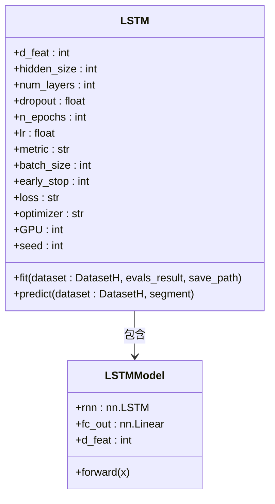
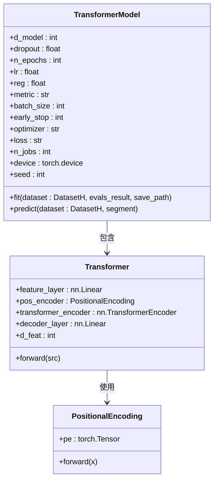
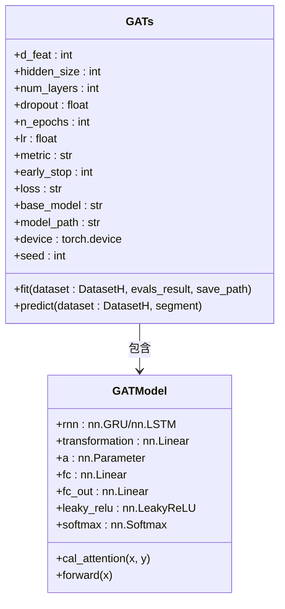
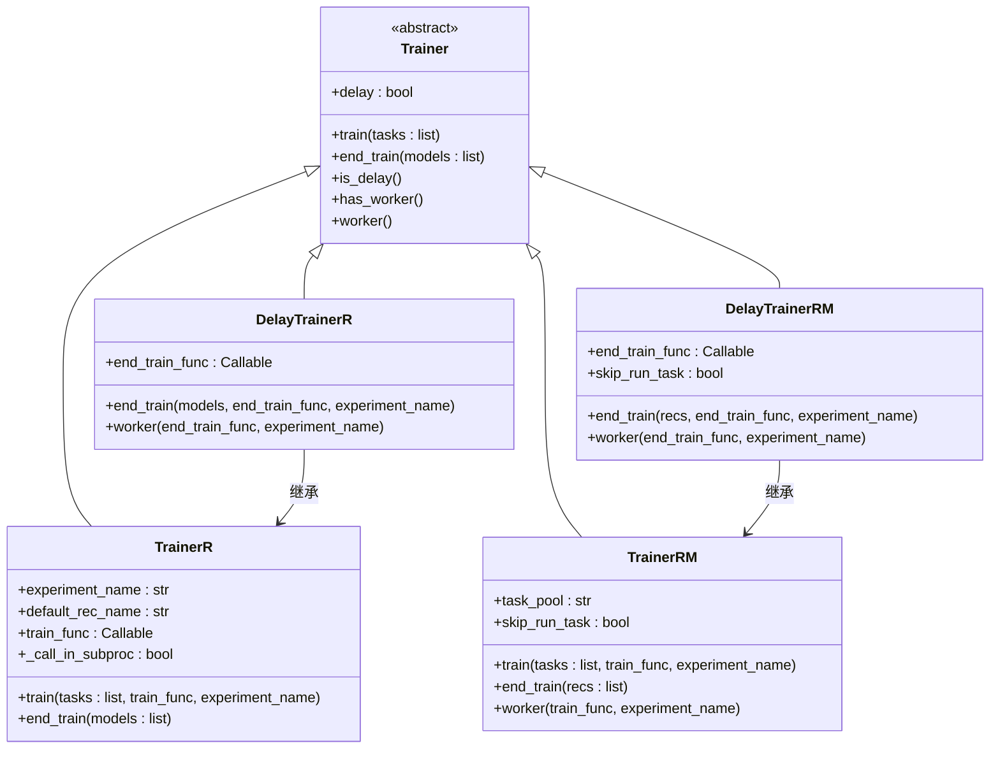
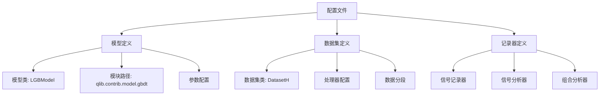

# 模型框架

<cite>
**本文档中引用的文件**  
- [base.py](file://qlib/model/base.py)
- [trainer.py](file://qlib/model/trainer.py)
- [gbdt.py](file://qlib/contrib/model/gbdt.py)
- [xgboost.py](file://qlib/contrib/model/xgboost.py)
- [catboost_model.py](file://qlib/contrib/model/catboost_model.py)
- [linear.py](file://qlib/contrib/model/linear.py)
- [pytorch_lstm.py](file://qlib/contrib/model/pytorch_lstm.py)
- [pytorch_transformer.py](file://qlib/contrib/model/pytorch_transformer.py)
- [pytorch_gats.py](file://qlib/contrib/model/pytorch_gats.py)
- [workflow_config_lightgbm_Alpha360.yaml](file://examples/benchmarks/LightGBM/workflow_config_lightgbm_Alpha360.yaml)
- [workflow_config_lstm_Alpha360.yaml](file://examples/benchmarks/LSTM/workflow_config_lstm_Alpha360.yaml)
- [workflow_config_transformer_Alpha360.yaml](file://examples/benchmarks/Transformer/workflow_config_transformer_Alpha360.yaml)
- [workflow_config_catboost_Alpha360.yaml](file://examples/benchmarks/CatBoost/workflow_config_catboost_Alpha360.yaml)
</cite>

## 目录
1. [模型系统概述](#模型系统概述)
2. [监督学习模型实现](#监督学习模型实现)
3. [深度学习模型实现](#深度学习模型实现)
4. [模型训练器机制](#模型训练器机制)
5. [评估接口与记录器](#评估接口与记录器)
6. [配置文件与参数设置](#配置文件与参数设置)
7. [自定义模型开发路径](#自定义模型开发路径)

## 模型系统概述

QLIB的模型系统基于统一的基类架构，所有模型都继承自`Model`基类，该基类定义了`fit`和`predict`两个核心方法。系统支持监督学习模型（如LightGBM、XGBoost、CatBoost）和深度学习模型（如LSTM、Transformer、GATs）的统一接口。模型训练通过`Trainer`类进行管理，支持线性训练和延迟训练两种模式。整个系统与QLIB的工作流记录器（Recorder）深度集成，实现了模型训练、评估和结果保存的自动化流程。

**Section sources**
- [base.py](file://qlib/model/base.py#L1-L111)

## 监督学习模型实现

QLIB实现了多种监督学习模型，包括基于梯度提升树的模型和线性模型。这些模型都遵循统一的接口规范，便于在不同模型间切换和比较。

### LightGBM模型

LightGBM模型通过`LGBModel`类实现，继承自`ModelFT`（可微调模型）和`LightGBMFInt`（特征重要性解释）。该模型支持均方误差（mse）和二分类（binary）损失函数，提供了早停机制和验证集监控功能。模型在训练过程中会自动记录评估指标到QLIB的实验记录系统。

**Section sources**
- [gbdt.py](file://qlib/contrib/model/gbdt.py#L1-L127)

### XGBoost模型

XGBoost模型通过`XGBModel`类实现，继承自`Model`和`FeatureInt`（特征重要性接口）。该模型封装了XGBoost的核心训练流程，支持自定义参数配置。与LightGBM类似，它也支持早停机制和多轮训练，并能通过`get_feature_importance`方法获取特征重要性。

**Section sources**
- [xgboost.py](file://qlib/contrib/model/xgboost.py#L1-L86)

### CatBoost模型

CatBoost模型通过`CatBoostModel`类实现，同样继承自`Model`和`FeatureInt`。该模型支持RMSE和Logloss损失函数，并能自动检测GPU设备以进行加速训练。CatBoost的实现充分利用了其原生的早停机制和验证集监控功能。

**Section sources**
- [catboost_model.py](file://qlib/contrib/model/catboost_model.py#L1-L101)

### 线性模型

线性模型通过`LinearModel`类实现，支持普通最小二乘法（OLS）、非负最小二乘法（NNLS）、岭回归（Ridge）和Lasso回归。该模型提供了灵活的正则化选项和截距项控制，适用于不同类型的回归问题。

**Section sources**
- [linear.py](file://qlib/contrib/model/linear.py#L1-L114)

## 深度学习模型实现

QLIB的深度学习模型基于PyTorch框架实现，提供了多种神经网络架构的支持。

### LSTM模型

LSTM模型通过`LSTM`类实现，包含一个`LSTMModel`内部类定义网络结构。该模型将输入特征重塑为时间序列格式，通过LSTM层提取时序特征，最后通过全连接层输出预测结果。训练过程中实现了早停机制和最佳模型保存功能。

**Diagram sources**
- [pytorch_lstm.py](file://qlib/contrib/model/pytorch_lstm.py#L1-L307)

### Transformer模型

Transformer模型通过`TransformerModel`类实现，包含`Transformer`和`PositionalEncoding`两个内部类。该模型使用位置编码处理时序数据，通过Transformer编码器提取特征，最后通过解码层输出预测结果。模型支持多头注意力机制和dropout正则化。

**Diagram sources**
- [pytorch_transformer.py](file://qlib/contrib/model/pytorch_transformer.py#L1-L286)

### GATs模型

GATs模型通过`GATs`类实现，结合了图注意力网络和循环神经网络（GRU或LSTM）。该模型首先使用预训练的RNN模型提取时序特征，然后通过图注意力机制学习股票间的关联关系。支持从预训练模型加载权重进行迁移学习。

**Diagram sources**
- [pytorch_gats.py](file://qlib/contrib/model/pytorch_gats.py#L1-L385)

## 模型训练器机制

QLIB的模型训练器系统提供了灵活的训练管理功能，支持多种训练模式和并行处理。

### Trainer类体系

训练器系统基于`Trainer`基类构建，提供了`TrainerR`、`DelayTrainerR`、`TrainerRM`和`DelayTrainerRM`四种具体实现。`TrainerR`用于线性训练，`TrainerRM`基于任务管理器支持并行训练，而延迟训练器则将训练过程分为准备和执行两个阶段。

**Diagram sources**
- [trainer.py](file://qlib/model/trainer.py#L1-L620)

### 训练流程

训练流程通过`task_train`函数实现，包含模型初始化、数据准备、模型训练、结果保存和记录生成等步骤。训练器会自动处理任务配置的占位符替换，并生成相应的预测、回测和分析记录。

**Section sources**
- [trainer.py](file://qlib/model/trainer.py#L1-L620)

## 评估接口与记录器

QLIB的评估系统通过记录器（Recorder）实现，提供了完整的模型评估和结果分析功能。

### 记录器类型

系统支持多种记录器类型，包括`SignalRecord`（信号记录）、`SigAnaRecord`（信号分析）和`PortAnaRecord`（组合分析）。这些记录器会自动生成预测信号、计算评估指标并生成可视化报告。

**Section sources**
- [workflow_config_lightgbm_Alpha360.yaml](file://examples/benchmarks/LightGBM/workflow_config_lightgbm_Alpha360.yaml#L64-L79)

## 配置文件与参数设置

QLIB使用YAML配置文件定义模型训练任务，提供了灵活的参数配置方式。

### LightGBM配置示例

LightGBM的配置文件定义了模型参数如`colsample_bytree`、`learning_rate`、`subsample`、`lambda_l1`、`lambda_l2`、`max_depth`和`num_leaves`等。这些参数经过优化以获得最佳预测性能。

**Diagram sources**
- [workflow_config_lightgbm_Alpha360.yaml](file://examples/benchmarks/LightGBM/workflow_config_lightgbm_Alpha360.yaml#L38-L79)

### LSTM配置示例

LSTM模型的配置文件定义了网络结构参数如`d_feat`、`hidden_size`、`num_layers`，以及训练参数如`n_epochs`、`lr`、`batch_size`和`early_stop`等。这些参数控制了模型的复杂度和训练过程。

**Section sources**
- [workflow_config_lstm_Alpha360.yaml](file://examples/benchmarks/LSTM/workflow_config_lstm_Alpha360.yaml#L45-L88)

### Transformer配置示例

Transformer模型的配置相对简洁，主要定义了`d_feat`和`seed`等基本参数。模型的其他超参数使用默认值，体现了Transformer架构的鲁棒性。

**Section sources**
- [workflow_config_transformer_Alpha360.yaml](file://examples/benchmarks/Transformer/workflow_config_transformer_Alpha360.yaml#L45-L79)

### CatBoost配置示例

CatBoost模型的配置文件定义了特定的参数如`grow_policy`（增长策略）和`bootstrap_type`（自举类型），这些是CatBoost特有的优化选项。

**Section sources**
- [workflow_config_catboost_Alpha360.yaml](file://examples/benchmarks/CatBoost/workflow_config_catboost_Alpha360.yaml#L38-L78)

## 自定义模型开发路径

开发自定义模型需要遵循QLIB的模型接口规范，实现`fit`和`predict`方法。

### 模型开发步骤

1. 创建新模型类，继承自`Model`或现有模型类
2. 实现`__init__`方法，定义模型超参数
3. 实现`fit`方法，定义训练逻辑
4. 实现`predict`方法，定义预测逻辑
5. 可选实现`get_feature_importance`等扩展方法

### 模型集成

自定义模型可以通过YAML配置文件集成到QLIB工作流中，只需指定正确的类名和模块路径。模型参数可以在配置文件中灵活配置，无需修改代码。

**Section sources**
- [base.py](file://qlib/model/base.py#L1-L111)
- [trainer.py](file://qlib/model/trainer.py#L1-L620)