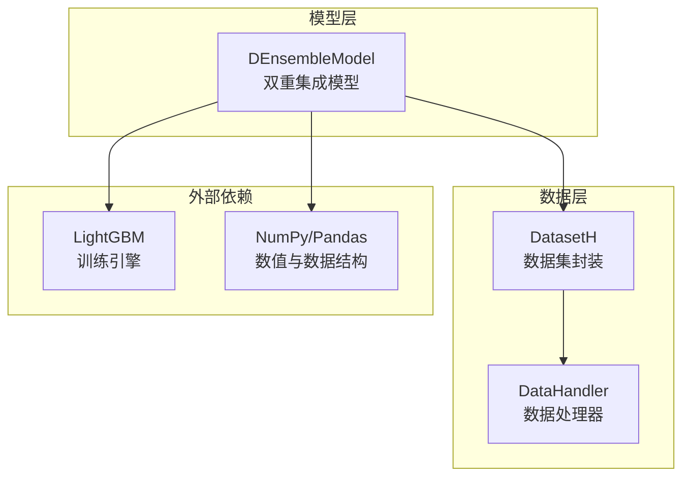
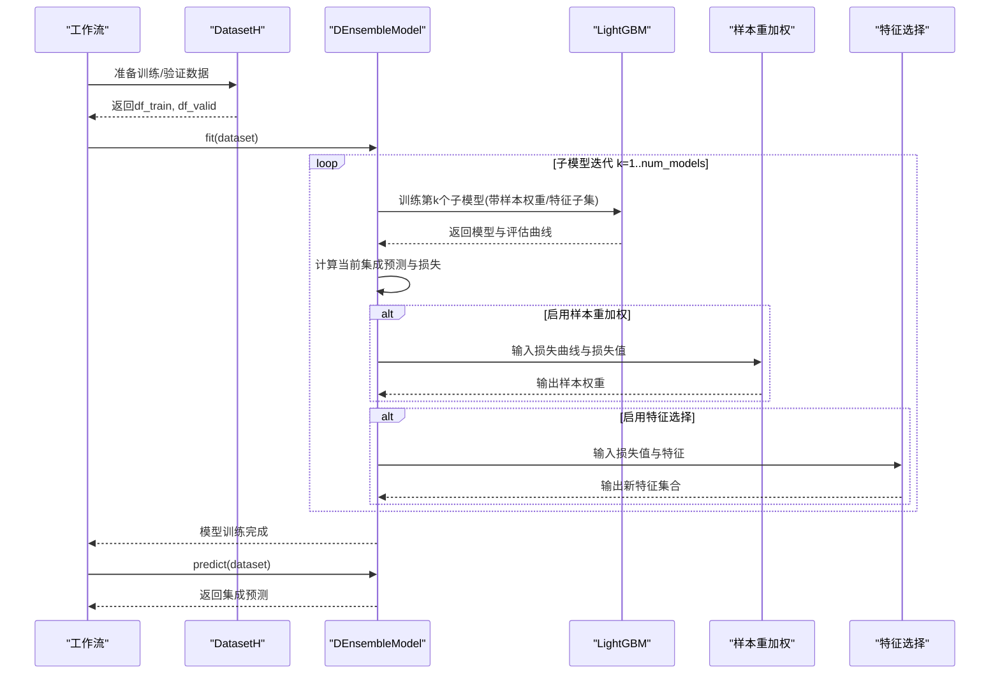
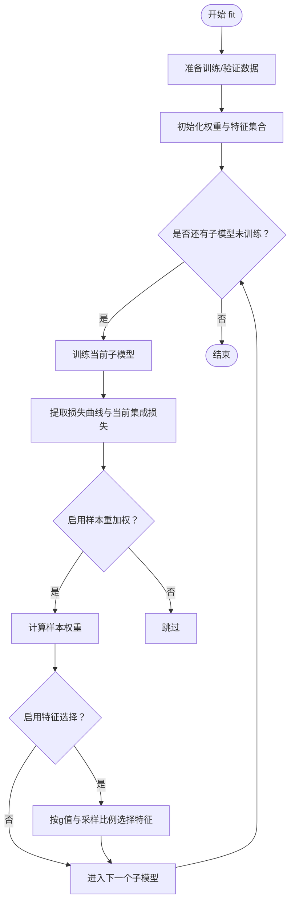
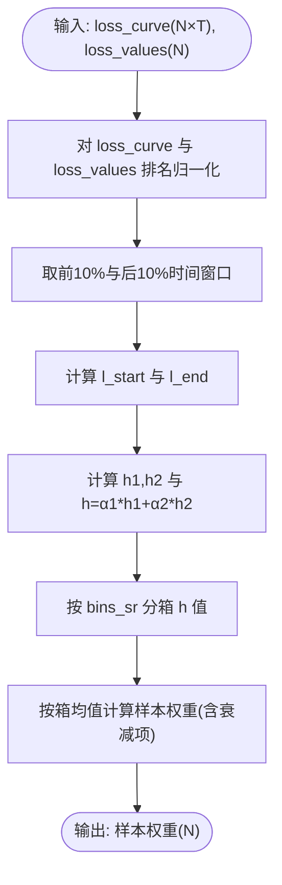
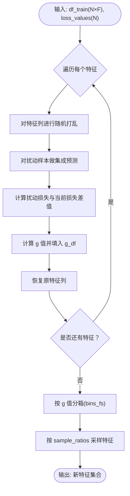
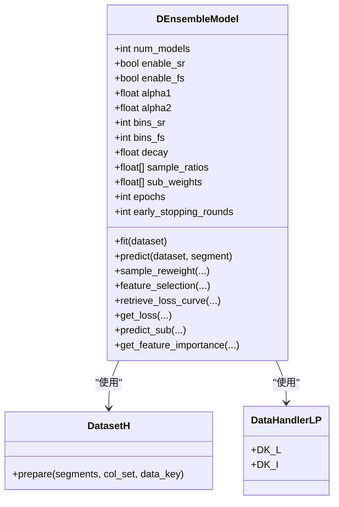

# 动态集成架构

<cite>
**本文引用的文件列表**
- [double_ensemble.py](file://qlib/contrib/model/double_ensemble.py)
- [workflow_config_doubleensemble_Alpha158.yaml](file://examples/benchmarks/DoubleEnsemble/workflow_config_doubleensemble_Alpha158.yaml)
- [handler.py](file://qlib/data/dataset/handler.py)
</cite>

## 目录
1. [引言](#引言)
2. [项目结构](#项目结构)
3. [核心组件](#核心组件)
4. [架构总览](#架构总览)
5. [详细组件分析](#详细组件分析)
6. [依赖关系分析](#依赖关系分析)
7. [性能考量](#性能考量)
8. [故障排查指南](#故障排查指南)
9. [结论](#结论)
10. [附录](#附录)

## 引言
本文件系统性地文档化双重集成模型（Double Ensemble，简称 DE）的两阶段动态架构设计与实现要点。DE 将“学习轨迹驱动的样本重加权”和“打乱驱动的特征选择”作为动态模块，在每个子模型训练后根据当前集成的损失表现自适应调整后续训练的数据权重与特征集合，从而提升对金融数据低信噪比与高维稀疏特征场景的鲁棒性与泛化能力。本文以 double_ensemble.py 的源码为依据，解析 h 值与 g 值的计算方式、样本重加权与特征选择的实现逻辑，并结合 workflow_config_doubleensemble_Alpha158.yaml 展示在实际工作流中的部署方法与关键参数对性能的影响。

## 项目结构
- 双重集成模型实现位于 qlib/contrib/model/double_ensemble.py，定义了 DEnsembleModel 类及其训练、预测、特征重要性聚合等方法。
- 工作流配置位于 examples/benchmarks/DoubleEnsemble/workflow_config_doubleensemble_Alpha158.yaml，展示了如何在 Qlib 工作流中加载该模型、数据集与记录器。
- 数据处理接口位于 qlib/data/dataset/handler.py，提供数据准备与分段读取的能力，贯穿训练/验证/测试流程。

图表来源
- [double_ensemble.py](file://qlib/contrib/model/double_ensemble.py#L64-L123)
- [handler.py](file://qlib/data/dataset/handler.py#L1-L120)

章节来源
- [double_ensemble.py](file://qlib/contrib/model/double_ensemble.py#L1-L123)
- [workflow_config_doubleensemble_Alpha158.yaml](file://examples/benchmarks/DoubleEnsemble/workflow_config_doubleensemble_Alpha158.yaml#L1-L93)
- [handler.py](file://qlib/data/dataset/handler.py#L1-L120)

## 核心组件
- DEnsembleModel：双重集成模型主体，包含：
  - 训练循环与子模型管理（ensemble、sub_features）
  - 样本重加权模块（sample_reweight）
  - 特征选择模块（feature_selection）
  - 集成预测与特征重要性聚合
- 数据接口：通过 DatasetH.prepare 获取训练/验证/测试数据，DataHandlerLP.DK_L/DK_I 控制学习与推理阶段的数据键。

章节来源
- [double_ensemble.py](file://qlib/contrib/model/double_ensemble.py#L14-L123)
- [handler.py](file://qlib/data/dataset/handler.py#L1-L120)

## 架构总览
双重集成采用两阶段动态架构：
- 第一阶段：并行训练多个子模型（顺序迭代，但可视为并行视角下的多分支），每个子模型使用当前可用的样本权重与特征集合进行训练。
- 第二阶段：在每个子模型训练完成后，利用其损失曲线与当前集成的损失，计算 h 值进行样本重加权；同时基于 g 值进行特征选择，更新下一轮训练的特征集合；最后对所有子模型进行加权平均得到最终预测。

图表来源
- [double_ensemble.py](file://qlib/contrib/model/double_ensemble.py#L64-L123)
- [double_ensemble.py](file://qlib/contrib/model/double_ensemble.py#L139-L218)

## 详细组件分析

### DEnsembleModel 类与训练流程
- 初始化参数与约束校验：确保样本重加权箱数与特征选择箱数一致、子模型权重长度匹配。
- fit 流程要点：
  - 从 DatasetH 中按“learn”键获取训练/验证数据。
  - 初始化样本权重与特征集合。
  - 循环训练子模型，每次训练后：
    - 提取损失曲线与当前集成损失。
    - 可选：执行样本重加权，更新样本权重。
    - 可选：执行特征选择，更新特征集合。
  - 训练完成后，保存子模型与对应特征索引，用于后续预测时按子模型维度裁剪特征列。

图表来源
- [double_ensemble.py](file://qlib/contrib/model/double_ensemble.py#L64-L123)

章节来源
- [double_ensemble.py](file://qlib/contrib/model/double_ensemble.py#L14-L123)

### 样本重加权（Sample Reweighting，SR）
- 输入：
  - loss_curve：前一个子模型在各迭代步上的样本损失矩阵（N×T）。
  - loss_values：当前集成在样本上的损失（N）。
- 计算步骤：
  - 对 loss_curve 与 loss_values 进行排名归一化。
  - 从 loss_curve 的前 10% 与后 10% 时间窗口分别计算均值，得到 l_start 与 l_end。
  - 计算 h1 与 h2，并组合为 h 值（h = α1*h1 + α2*h2）。
  - 将 h 值按 bins_sr 分箱，对每箱的平均 h 值计算样本权重（随子模型序号指数衰减）。
- 输出：返回每个样本的新权重向量。

图表来源
- [double_ensemble.py](file://qlib/contrib/model/double_ensemble.py#L139-L173)

章节来源
- [double_ensemble.py](file://qlib/contrib/model/double_ensemble.py#L139-L173)

### 特征选择（Feature Selection，FS）
- 输入：
  - df_train：包含特征与标签的训练数据。
  - loss_values：当前集成在样本上的损失（N）。
- 计算步骤：
  - 对每个特征进行列级随机打乱，构造扰动样本。
  - 使用当前集成对扰动样本进行预测，得到扰动损失。
  - 计算每个特征的 g 值：(扰动损失均值 - 当前损失均值) / (扰动损失标准差 + ε)。
  - 将 g 值按 bins_fs 分箱，按 sample_ratios 从高到低的箱中随机采样特征，形成新的特征集合。
- 输出：返回新的特征索引集合。

图表来源
- [double_ensemble.py](file://qlib/contrib/model/double_ensemble.py#L174-L218)

章节来源
- [double_ensemble.py](file://qlib/contrib/model/double_ensemble.py#L174-L218)

### 预测与特征重要性聚合
- 预测：对每个子模型使用其对应的特征子集进行预测，按子模型权重求和并归一化得到最终预测。
- 特征重要性：聚合各子模型的特征重要性并按子模型权重加权汇总，按重要性排序输出。

章节来源
- [double_ensemble.py](file://qlib/contrib/model/double_ensemble.py#L246-L276)

## 依赖关系分析
- 内部依赖：
  - DEnsembleModel 继承自 Model 与 FeatureInt，具备 Qlib 模型接口能力。
  - 依赖 DatasetH.prepare 获取训练/验证/测试数据，使用 DataHandlerLP.DK_L/DK_I 区分学习与推理阶段。
- 外部依赖：
  - LightGBM：用于训练与评估曲线提取。
  - NumPy/Pandas：用于数值计算与数据结构操作。

图表来源
- [double_ensemble.py](file://qlib/contrib/model/double_ensemble.py#L64-L123)
- [handler.py](file://qlib/data/dataset/handler.py#L1-L120)

章节来源
- [double_ensemble.py](file://qlib/contrib/model/double_ensemble.py#L64-L123)
- [handler.py](file://qlib/data/dataset/handler.py#L1-L120)

## 性能考量
- 子模型数量（num_models）：增加子模型数量可提升多样性，但也增加训练与推理成本；需平衡性能与效率。
- 早停（early_stopping_rounds）：建议开启以避免过拟合，提高稳定性。
- 学习率、树深度、叶子数等 LightGBM 超参：在配置文件中通过 kwargs 传入，影响收敛速度与过拟合风险。
- 样本重加权衰减系数（decay）：控制权重随子模型序号的指数衰减程度，影响后期样本权重的敏感度。
- 特征选择箱数（bins_fs）与采样比例（sample_ratios）：决定特征筛选的粒度与保留比例，应与数据维度与噪声水平匹配。

章节来源
- [workflow_config_doubleensemble_Alpha158.yaml](file://examples/benchmarks/DoubleEnsemble/workflow_config_doubleensemble_Alpha158.yaml#L33-L66)
- [double_ensemble.py](file://qlib/contrib/model/double_ensemble.py#L139-L218)

## 故障排查指南
- 数据为空或键不匹配：当 DatasetH.prepare 返回空数据时会抛出异常，检查数据路径、时间范围与列集合配置。
- 多标签不支持：LightGBM 不支持多标签训练，确保标签为单列。
- 参数长度不一致：样本重加权箱数与采样比例长度必须等于特征选择箱数；子模型权重长度必须等于子模型数量。
- 预测未训练：若未调用 fit 即进行 predict，将提示模型尚未训练。

章节来源
- [double_ensemble.py](file://qlib/contrib/model/double_ensemble.py#L64-L123)
- [double_ensemble.py](file://qlib/contrib/model/double_ensemble.py#L125-L137)

## 结论
双重集成模型通过两阶段动态机制，在每个子模型训练后利用学习轨迹与损失信息自适应地调整样本权重与特征集合，有效缓解金融数据中的低信噪比与高维稀疏问题。DEnsembleModel 在 Qlib 生态中以轻量接口与清晰流程实现了该思想，配合工作流配置即可快速落地。实践中应关注子模型数量、早停策略与 LightGBM 超参设置，以获得更稳健的性能表现。

## 附录

### 实际工作流部署要点（基于 workflow_config_doubleensemble_Alpha158.yaml）
- 模型类与模块路径：在任务配置中指定 DEnsembleModel 与其模块路径。
- 关键参数说明：
  - base_model：基模型类型（默认为“gbm”，内部使用 LightGBM）。
  - loss：损失函数（默认“mse”）。
  - num_models：子模型数量（如 3）。
  - enable_sr / enable_fs：是否启用样本重加权与特征选择。
  - alpha1 / alpha2：h 值中两部分的权重。
  - bins_sr / bins_fs：样本重加权与特征选择的箱数。
  - decay：样本重加权的指数衰减系数。
  - sample_ratios：按箱采样比例（长度需等于 bins_fs）。
  - sub_weights：各子模型权重（长度需等于 num_models）。
  - epochs：每轮子模型最大迭代次数。
  - 其他 LightGBM 超参：通过 kwargs 传入（如学习率、子采样、正则等）。
- 数据集与处理器：使用 DatasetH 与 Alpha158 处理器，划分训练/验证/测试区间。
- 记录器：SignalRecord、SigAnaRecord、PortAnaRecord 用于信号记录、IC 分析与组合分析。

章节来源
- [workflow_config_doubleensemble_Alpha158.yaml](file://examples/benchmarks/DoubleEnsemble/workflow_config_doubleensemble_Alpha158.yaml#L33-L93)