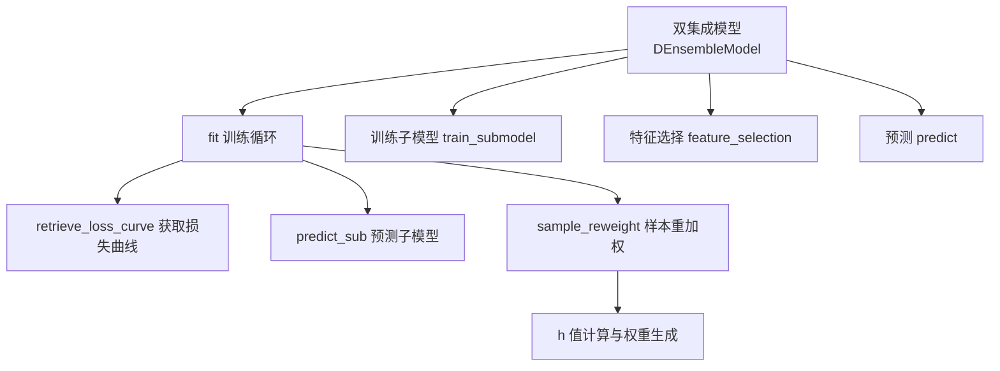
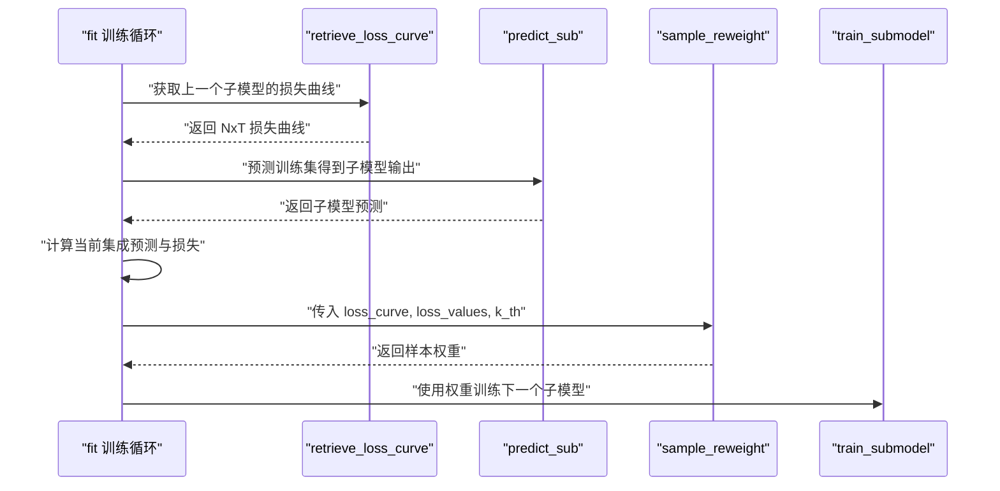
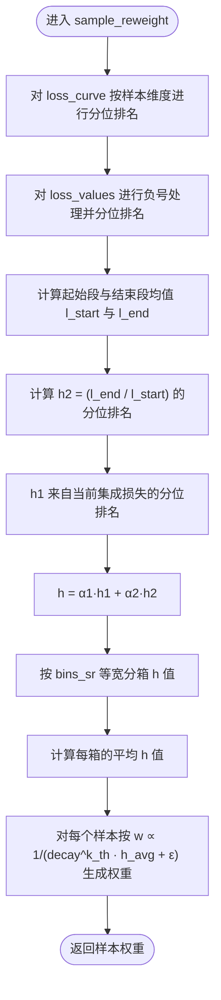
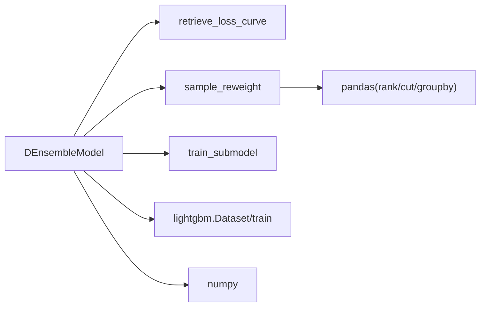

# 样本重加权

<cite>
**本文引用的文件**
- [double_ensemble.py](file://qlib/contrib/model/double_ensemble.py)
- [workflow_config_doubleensemble_Alpha158.yaml](file://examples/benchmarks/DoubleEnsemble/workflow_config_doubleensemble_Alpha158.yaml)
- [workflow_config_doubleensemble_Alpha360.yaml](file://examples/benchmarks/DoubleEnsemble/workflow_config_doubleensemble_Alpha360.yaml)
</cite>

## 目录
1. [简介](#简介)
2. [项目结构](#项目结构)
3. [核心组件](#核心组件)
4. [架构总览](#架构总览)
5. [详细组件分析](#详细组件分析)
6. [依赖关系分析](#依赖关系分析)
7. [性能考量](#性能考量)
8. [故障排查指南](#故障排查指南)
9. [结论](#结论)
10. [附录](#附录)

## 简介
本文件围绕 Qlib 中“双重集成”（Double Ensemble, DE）的样本重加权（Sample Reweighting, SR）机制展开，聚焦于 sample_reweight 方法的 h 值计算逻辑。我们将解释：
- 如何利用损失曲线（loss_curve）的起始段与结束段的比率（l_end/l_start），以及当前集成模型的损失值（loss_values）进行归一化排名；
- alpha1 与 alpha2 如何加权组合两个指标以生成最终的 h 值；
- decay 参数在迭代过程中对样本权重的动态衰减作用；
- 通过配置文件中的 bins_sr 与 enable_sr 参数启用并调整该机制；
- 分析该机制对模型鲁棒性与泛化能力的提升效果。

## 项目结构
与样本重加权直接相关的核心文件为贡献模型中的双集成实现，以及示例工作流配置文件中对该机制的启用与参数设置。



图表来源
- [double_ensemble.py](file://qlib/contrib/model/double_ensemble.py#L64-L102)
- [double_ensemble.py](file://qlib/contrib/model/double_ensemble.py#L139-L172)
- [double_ensemble.py](file://qlib/contrib/model/double_ensemble.py#L226-L244)

章节来源
- [double_ensemble.py](file://qlib/contrib/model/double_ensemble.py#L64-L102)
- [double_ensemble.py](file://qlib/contrib/model/double_ensemble.py#L139-L172)
- [double_ensemble.py](file://qlib/contrib/model/double_ensemble.py#L226-L244)

## 核心组件
- DEnsembleModel：实现双重集成框架，包含样本重加权、特征选择、训练与预测等模块。
- sample_reweight：SR 模块的核心，负责根据损失曲线与当前集成损失计算样本权重。
- retrieve_loss_curve：从已训练的子模型中提取每个样本在各迭代步的损失曲线。
- train_submodel：使用带样本权重的数据集训练下一个子模型。
- feature_selection：基于扰动特征的稳定性评估进行特征筛选（与 SR 并行）。

章节来源
- [double_ensemble.py](file://qlib/contrib/model/double_ensemble.py#L14-L63)
- [double_ensemble.py](file://qlib/contrib/model/double_ensemble.py#L139-L172)
- [double_ensemble.py](file://qlib/contrib/model/double_ensemble.py#L226-L244)

## 架构总览
下图展示了训练循环中 SR 的调用时机与数据流。



图表来源
- [double_ensemble.py](file://qlib/contrib/model/double_ensemble.py#L64-L102)
- [double_ensemble.py](file://qlib/contrib/model/double_ensemble.py#L139-L172)
- [double_ensemble.py](file://qlib/contrib/model/double_ensemble.py#L226-L244)

## 详细组件分析

### 样本重加权（SR）算法详解
本节深入解析 sample_reweight 的 h 值计算流程与权重生成策略。

- 输入与上下文
  - loss_curve：形状为 N×T，表示第 i 个样本在前 t 次迭代后的累计损失曲线。
  - loss_values：形状为 N，表示当前集成模型对样本 i 的损失。
  - k_th：当前子模型索引（从 1 开始），用于 decay 的幂次计算。

- 归一化与排名
  - 对 loss_curve 按样本维度进行分位排名（pct=True），得到每个样本在各迭代步的相对位置。
  - 对 loss_values 进行负号处理后按样本维度进行分位排名，使高损失样本排名更靠前。

- 起始与结束段比率
  - 取时间窗口的前 10% 与后 10% 作为起始与结束段，分别计算均值 l_start 与 l_end。
  - 计算 h2 = (l_end / l_start) 的分位排名，反映样本在训练后期与前期损失变化的相对趋势。

- 组合 h 值
  - h1 来自当前集成损失的排名；h2 来自损失曲线起止段比率的排名。
  - h = α1·h1 + α2·h2，其中 α1 与 α2 控制两部分的权重比例。

- 权重生成与衰减
  - 将 h 值按 bins_sr 等宽分箱，计算每箱的平均 h 值。
  - 对每个样本，按其所在箱的平均 h 值生成权重：w ∝ 1/(decay^k_th · h_avg + ε)。
  - decay^k_th 实现随迭代次数增加的指数衰减，使后续子模型对样本权重的影响逐渐减弱，避免过度拟合。

- 关键路径参考
  - 归一化与 h 值计算：[double_ensemble.py](file://qlib/contrib/model/double_ensemble.py#L152-L165)
  - 分箱与权重生成：[double_ensemble.py](file://qlib/contrib/model/double_ensemble.py#L166-L172)



图表来源
- [double_ensemble.py](file://qlib/contrib/model/double_ensemble.py#L152-L172)

章节来源
- [double_ensemble.py](file://qlib/contrib/model/double_ensemble.py#L152-L165)
- [double_ensemble.py](file://qlib/contrib/model/double_ensemble.py#L166-L172)

### 训练循环与 SR 的衔接
- 在每次训练完一个子模型后，系统会：
  - 提取该子模型的损失曲线；
  - 使用当前集成模型对训练集进行预测，得到损失值；
  - 若启用 SR，则调用 sample_reweight 生成样本权重；
  - 使用新权重训练下一个子模型。

- 关键路径参考
  - 训练循环与 SR 调用点：[double_ensemble.py](file://qlib/contrib/model/double_ensemble.py#L64-L102)
  - 损失曲线提取：[double_ensemble.py](file://qlib/contrib/model/double_ensemble.py#L226-L244)

```mermaid
sequenceDiagram
participant Loop as "fit 循环"
participant Sub as "子模型 k"
participant LC as "损失曲线"
participant Ens as "当前集成"
participant SR as "样本重加权"
participant Next as "子模型 k+1"
Loop->>Sub : "训练子模型 k"
Sub-->>Loop : "返回模型"
Loop->>LC : "retrieve_loss_curve"
LC-->>Loop : "返回 NxT 损失曲线"
Loop->>Ens : "预测训练集得到集成损失"
Ens-->>Loop : "返回损失值"
alt 启用 SR
Loop->>SR : "sample_reweight(loss_curve, loss_values, k+1)"
SR-->>Loop : "返回样本权重"
Loop->>Next : "使用权重训练子模型 k+1"
else 禁用 SR
Loop->>Next : "直接训练子模型 k+1"
end
```

图表来源
- [double_ensemble.py](file://qlib/contrib/model/double_ensemble.py#L64-L102)
- [double_ensemble.py](file://qlib/contrib/model/double_ensemble.py#L226-L244)

章节来源
- [double_ensemble.py](file://qlib/contrib/model/double_ensemble.py#L64-L102)
- [double_ensemble.py](file://qlib/contrib/model/double_ensemble.py#L226-L244)

### 配置文件中的启用与参数
- 启用 SR：在工作流配置中设置 enable_sr: true。
- 参数调整：
  - alpha1、alpha2：控制 h1 与 h2 的权重比例。
  - bins_sr：控制 h 值分箱数量，影响权重的离散化程度。
  - decay：控制权重随迭代次数的指数衰减强度。
- 示例配置参考：
  - Alpha158 示例：[workflow_config_doubleensemble_Alpha158.yaml](file://examples/benchmarks/DoubleEnsemble/workflow_config_doubleensemble_Alpha158.yaml#L39-L45)
  - Alpha360 示例：[workflow_config_doubleensemble_Alpha360.yaml](file://examples/benchmarks/DoubleEnsemble/workflow_config_doubleensemble_Alpha360.yaml#L46-L52)

章节来源
- [workflow_config_doubleensemble_Alpha158.yaml](file://examples/benchmarks/DoubleEnsemble/workflow_config_doubleensemble_Alpha158.yaml#L39-L45)
- [workflow_config_doubleensemble_Alpha360.yaml](file://examples/benchmarks/DoubleEnsemble/workflow_config_doubleensemble_Alpha360.yaml#L46-L52)

## 依赖关系分析
- 内部依赖
  - DEnsembleModel.fit 依赖 retrieve_loss_curve 与 sample_reweight；
  - sample_reweight 依赖 get_loss 与 pandas 的 rank、cut、groupby；
  - 训练阶段依赖 LightGBM 的 Dataset 与训练接口。

- 外部依赖
  - numpy、pandas、lightgbm。



图表来源
- [double_ensemble.py](file://qlib/contrib/model/double_ensemble.py#L64-L102)
- [double_ensemble.py](file://qlib/contrib/model/double_ensemble.py#L139-L172)
- [double_ensemble.py](file://qlib/contrib/model/double_ensemble.py#L226-L244)

章节来源
- [double_ensemble.py](file://qlib/contrib/model/double_ensemble.py#L64-L102)
- [double_ensemble.py](file://qlib/contrib/model/double_ensemble.py#L139-L172)
- [double_ensemble.py](file://qlib/contrib/model/double_ensemble.py#L226-L244)

## 性能考量
- 计算复杂度
  - 损失曲线提取：O(N·T)，其中 N 为样本数，T 为树的数量。
  - 排名与分箱：O(N·log N) 或 O(N) 视实现而定。
  - 权重生成：O(N + B)，B 为箱数。
- 内存占用
  - 损失曲线矩阵 NxT 占用较多内存，建议合理设置 T 与 N。
- 衰减参数
  - decay 越大，权重衰减越慢，可能增强稳定性但降低对异常样本的敏感度；decay 越小，权重衰减越快，可能提高对异常样本的关注但易过拟合。

[本节提供一般性指导，不直接分析具体文件]

## 故障排查指南
- 空数据或维度错误
  - 当数据为空或标签维度不符合要求时，训练阶段会抛出错误。请检查数据准备与标签格式。
  - 参考路径：[double_ensemble.py](file://qlib/contrib/model/double_ensemble.py#L64-L73)
- 损失曲线不可用
  - 当 base_model 不是 "gbm" 时，损失曲线提取会报错。请确保使用支持的基模型。
  - 参考路径：[double_ensemble.py](file://qlib/contrib/model/double_ensemble.py#L226-L244)
- 参数长度不匹配
  - bins_fs 与 sample_ratios 长度需一致，否则会抛出错误。请核对配置。
  - 参考路径：[double_ensemble.py](file://qlib/contrib/model/double_ensemble.py#L44-L50)
- 权重异常
  - 若 decay 设置不当或 h_avg 接近 0，可能导致权重爆炸。可适当增大 ε 或调整 decay。
  - 参考路径：[double_ensemble.py](file://qlib/contrib/model/double_ensemble.py#L166-L172)

章节来源
- [double_ensemble.py](file://qlib/contrib/model/double_ensemble.py#L64-L73)
- [double_ensemble.py](file://qlib/contrib/model/double_ensemble.py#L226-L244)
- [double_ensemble.py](file://qlib/contrib/model/double_ensemble.py#L44-L50)
- [double_ensemble.py](file://qlib/contrib/model/double_ensemble.py#L166-L172)

## 结论
样本重加权（SR）通过损失曲线的起始与结束段比率（l_end/l_start）与当前集成损失（loss_values）的综合排名，构建 h 值并以分箱方式生成样本权重。α1 与 α2 控制两部分的相对重要性，decay^k_th 则在迭代过程中对权重施加指数衰减，平衡模型的鲁棒性与泛化能力。通过配置文件中的 enable_sr、alpha1/alpha2、bins_sr、decay 等参数，用户可以灵活启用与调优该机制，从而在不同任务与数据分布下获得更稳健的训练过程与预测性能。

[本节为总结性内容，不直接分析具体文件]

## 附录
- 相关实现路径
  - 样本重加权主逻辑：[double_ensemble.py](file://qlib/contrib/model/double_ensemble.py#L139-L172)
  - 训练循环与 SR 调用点：[double_ensemble.py](file://qlib/contrib/model/double_ensemble.py#L64-L102)
  - 损失曲线提取：[double_ensemble.py](file://qlib/contrib/model/double_ensemble.py#L226-L244)
  - 配置示例（Alpha158）：[workflow_config_doubleensemble_Alpha158.yaml](file://examples/benchmarks/DoubleEnsemble/workflow_config_doubleensemble_Alpha158.yaml#L39-L45)
  - 配置示例（Alpha360）：[workflow_config_doubleensemble_Alpha360.yaml](file://examples/benchmarks/DoubleEnsemble/workflow_config_doubleensemble_Alpha360.yaml#L46-L52)