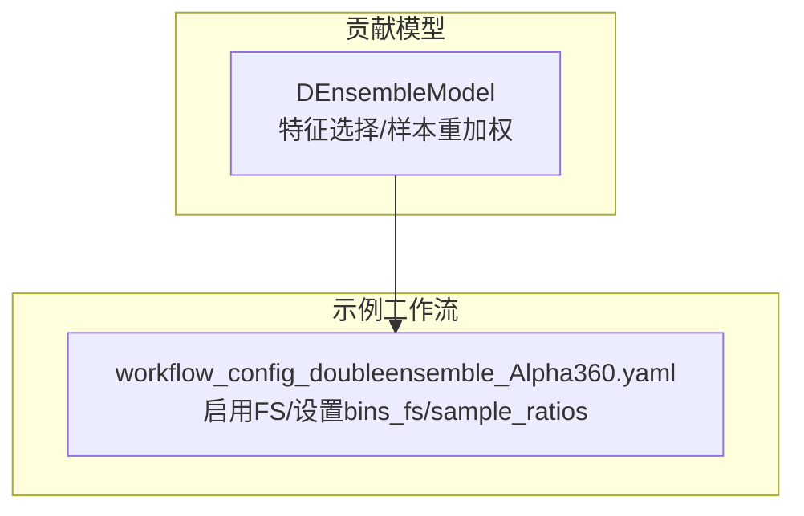
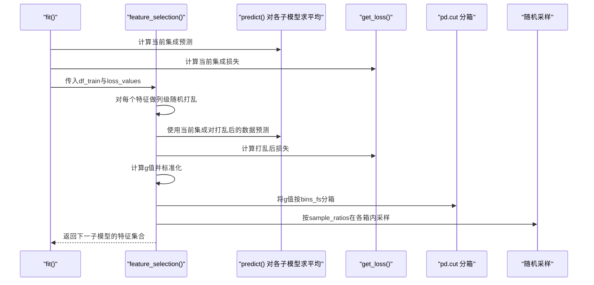
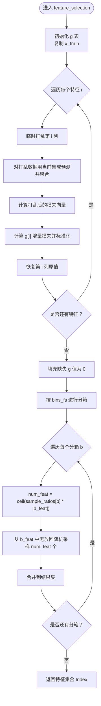
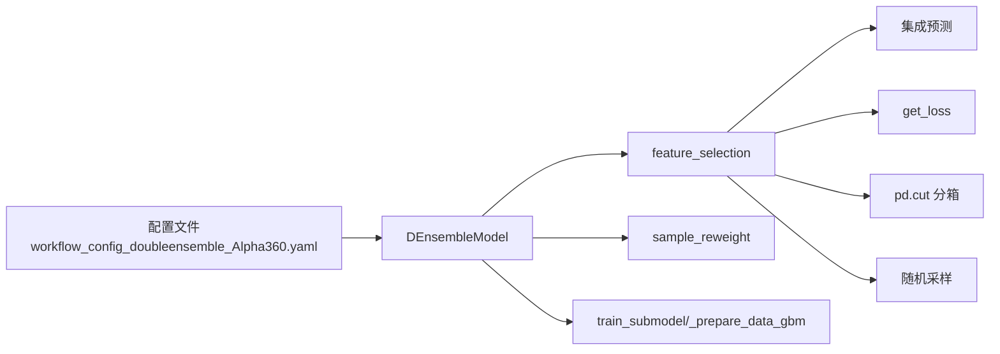

# 特征选择

<cite>
**本文引用的文件列表**
- [double_ensemble.py](file://qlib/contrib/model/double_ensemble.py)
- [workflow_config_doubleensemble_Alpha360.yaml](file://examples/benchmarks/DoubleEnsemble/workflow_config_doubleensemble_Alpha360.yaml)
- [README.md](file://examples/benchmarks/DoubleEnsemble/README.md)
</cite>

## 目录
1. [引言](#引言)
2. [项目结构](#项目结构)
3. [核心组件](#核心组件)
4. [架构总览](#架构总览)
5. [详细组件分析](#详细组件分析)
6. [依赖关系分析](#依赖关系分析)
7. [性能考量](#性能考量)
8. [故障排查指南](#故障排查指南)
9. [结论](#结论)
10. [附录](#附录)

## 引言
本文件面向双重集成架构中的特征选择（Feature Selection, FS）模块，围绕双集成模型的 feature_selection 方法，系统阐述 g 值的计算流程与意义：通过对单个特征进行随机打乱，评估其对当前集成模型预测损失的影响增量，并进行标准化；随后将所有特征按 g 值划分为 bins_fs 个分位区间，依据 sample_ratios 在每个区间内按比例随机采样，形成下一子模型的输入特征集。同时结合配置文件参数，解析该机制如何实现特征空间的动态优化与降维，以及 enable_fs 开关对整体模型架构的影响。

## 项目结构
- 双重集成模型位于贡献模块中，提供特征选择、样本重加权等能力。
- 示例工作流配置展示了如何启用 FS 模块并设置关键参数。

图表来源
- [double_ensemble.py](file://qlib/contrib/model/double_ensemble.py#L18-L64)
- [workflow_config_doubleensemble_Alpha360.yaml](file://examples/benchmarks/DoubleEnsemble/workflow_config_doubleensemble_Alpha360.yaml#L39-L73)

章节来源
- [double_ensemble.py](file://qlib/contrib/model/double_ensemble.py#L18-L64)
- [workflow_config_doubleensemble_Alpha360.yaml](file://examples/benchmarks/DoubleEnsemble/workflow_config_doubleensemble_Alpha360.yaml#L39-L73)

## 核心组件
- DEnsembleModel：包含特征选择（feature_selection）、样本重加权（sample_reweight）、训练与预测等逻辑。
- feature_selection：实现 g 值计算、分箱与按比例采样的核心流程。
- 配置项：enable_fs、bins_fs、sample_ratios 等，控制 FS 的开关与采样策略。

章节来源
- [double_ensemble.py](file://qlib/contrib/model/double_ensemble.py#L18-L64)
- [double_ensemble.py](file://qlib/contrib/model/double_ensemble.py#L175-L219)
- [workflow_config_doubleensemble_Alpha360.yaml](file://examples/benchmarks/DoubleEnsemble/workflow_config_doubleensemble_Alpha360.yaml#L46-L59)

## 架构总览
下图展示 FS 模块在双重集成训练循环中的位置与作用：在每轮子模型训练后，若启用 FS，则基于当前集成的损失曲线与当前集成预测，计算每个特征的 g 值，按分位区间采样得到下一子模型的特征集合。

图表来源
- [double_ensemble.py](file://qlib/contrib/model/double_ensemble.py#L65-L104)
- [double_ensemble.py](file://qlib/contrib/model/double_ensemble.py#L175-L219)

## 详细组件分析

### 组件A：特征选择（feature_selection）
- 输入输出
  - 输入：训练数据 df_train（包含 feature 与 label），当前集成对样本的损失向量 loss_values。
  - 输出：下一子模型应使用的特征集合（pandas.Index）。
- 关键步骤
  1) 初始化 g 表，长度等于特征数。
  2) 对每个特征 i：
     - 复制原始特征矩阵 x_train，临时将第 i 列打乱（随机置换）。
     - 使用当前集成对打乱后的数据进行预测并聚合为预测均值。
     - 计算打乱后的损失向量 loss_feat，并据此计算 g[i] 的增量损失并标准化。
     - 恢复该列原值，继续下一个特征。
  3) 将 g 中缺失值替换为 0，避免后续分箱异常。
  4) 使用 pd.cut 将 g["g_value"] 划分为 bins_fs 个分位区间。
  5) 对每个分箱，按比例 sample_ratios[i_b] 计算应采样数量，从该分箱对应特征中无放回随机采样，汇总得到最终特征集合。

图表来源
- [double_ensemble.py](file://qlib/contrib/model/double_ensemble.py#L175-L219)

章节来源
- [double_ensemble.py](file://qlib/contrib/model/double_ensemble.py#L175-L219)

### 组件B：g 值的含义与重要性度量
- g 值衡量的是“单特征被随机打乱后，对当前集成预测损失的增量影响”。该增量经均值与标准差标准化，使得不同特征间的 g 值具备可比性。
- 标准化形式有助于消除不同特征尺度差异与噪声波动，使分箱与采样更具稳定性。
- 重要性排序：g 值越高，表示该特征对当前集成越重要；分箱时高 g 值特征会被优先保留。

章节来源
- [double_ensemble.py](file://qlib/contrib/model/double_ensemble.py#L175-L205)

### 组件C：分箱与按比例采样
- 分箱：使用 pd.cut 将 g["g_value"] 划分为 bins_fs 个分位区间，确保每个区间内的特征重要性分布相对均匀。
- 采样：对每个分箱，按比例 sample_ratios[i_b] 计算应采样数量，再从该分箱特征集中随机采样，形成下一子模型的输入特征集。
- 作用：在保持高价值特征的同时，按区间比例动态缩减特征规模，实现特征空间的动态优化与降维。

章节来源
- [double_ensemble.py](file://qlib/contrib/model/double_ensemble.py#L209-L219)

### 组件D：配置参数与工作流集成
- 关键参数
  - enable_fs：是否启用特征选择。
  - bins_fs：分箱数量。
  - sample_ratios：每个分箱的采样比例数组，长度需等于 bins_fs。
- 工作流集成
  - 在每轮子模型训练完成后，若启用 FS，则调用 feature_selection 获取下一子模型的特征集合；否则沿用上一轮特征集。
  - 示例配置文件展示了默认 sample_ratios 与 bins_fs 的典型取值。

章节来源
- [double_ensemble.py](file://qlib/contrib/model/double_ensemble.py#L18-L64)
- [workflow_config_doubleensemble_Alpha360.yaml](file://examples/benchmarks/DoubleEnsemble/workflow_config_doubleensemble_Alpha360.yaml#L46-L59)
- [double_ensemble.py](file://qlib/contrib/model/double_ensemble.py#L65-L104)

## 依赖关系分析
- DEnsembleModel 依赖于 LightGBM 训练接口与数据准备函数。
- feature_selection 依赖于当前集成的预测能力与损失函数定义。
- 配置文件通过 YAML 指定模型类与参数，驱动 FS 的启用与采样策略。

图表来源
- [workflow_config_doubleensemble_Alpha360.yaml](file://examples/benchmarks/DoubleEnsemble/workflow_config_doubleensemble_Alpha360.yaml#L39-L73)
- [double_ensemble.py](file://qlib/contrib/model/double_ensemble.py#L65-L104)
- [double_ensemble.py](file://qlib/contrib/model/double_ensemble.py#L175-L219)

章节来源
- [workflow_config_doubleensemble_Alpha360.yaml](file://examples/benchmarks/DoubleEnsemble/workflow_config_doubleensemble_Alpha360.yaml#L39-L73)
- [double_ensemble.py](file://qlib/contrib/model/double_ensemble.py#L65-L104)
- [double_ensemble.py](file://qlib/contrib/model/double_ensemble.py#L175-L219)

## 性能考量
- 计算复杂度
  - 对每个特征执行一次列级随机打乱与一次集成预测，总体约为 O(F × M × T)，其中 F 为特征数，M 为子模型数，T 为预测次数（由集成预测聚合决定）。
- 内存占用
  - 需要复制一份特征矩阵用于打乱操作，内存开销与样本数 N 和特征数 F 成正比。
- 稳定性
  - 标准化 g 值可降低极端值影响；分箱与按比例采样有助于缓解过拟合风险。
- 并行化
  - 当前实现逐特征循环，若特征数较大，可考虑并行化（例如对特征分组并行打乱与预测），但需注意线程安全与内存峰值。

## 故障排查指南
- 参数长度不匹配
  - 若 sample_ratios 长度不等于 bins_fs，将抛出参数校验错误。请检查配置文件中二者的长度一致性。
- 多标签不支持
  - get_loss 目前仅支持单目标损失（如 MSE）。若标签维度不满足要求，将触发异常。
- 全 NaN 或全常数列
  - g 值中若出现 NaN，会统一替换为 0，避免分箱失败。若某列全为 NaN，建议在上游数据预处理阶段剔除或填充。
- 分箱空区间
  - 若某些分箱未落入任何特征，采样数量为 0，不会报错，但需确认 bins_fs 与特征数量的关系是否合理。

章节来源
- [double_ensemble.py](file://qlib/contrib/model/double_ensemble.py#L45-L51)
- [double_ensemble.py](file://qlib/contrib/model/double_ensemble.py#L221-L226)
- [double_ensemble.py](file://qlib/contrib/model/double_ensemble.py#L206-L207)

## 结论
特征选择模块通过“随机打乱 + 增量损失 + 标准化 + 分箱 + 比例采样”的闭环，实现了对特征重要性的量化与动态筛选。它与样本重加权共同构成双重集成的自适应优化机制：前者聚焦特征空间降维与去噪，后者聚焦样本权重调整以提升学习效率。enable_fs 开关直接决定了是否启用该优化路径，配合 bins_fs 与 sample_ratios，可在保证性能的前提下显著减少特征维度，提升模型稳定性与泛化能力。

## 附录
- 参考论文与背景介绍见示例目录下的说明文档。

章节来源
- [README.md](file://examples/benchmarks/DoubleEnsemble/README.md#L1-L4)