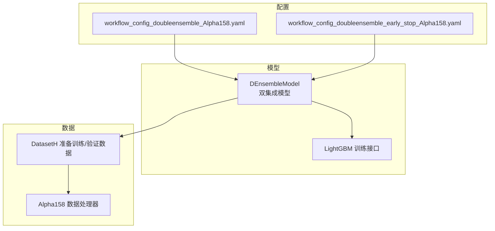
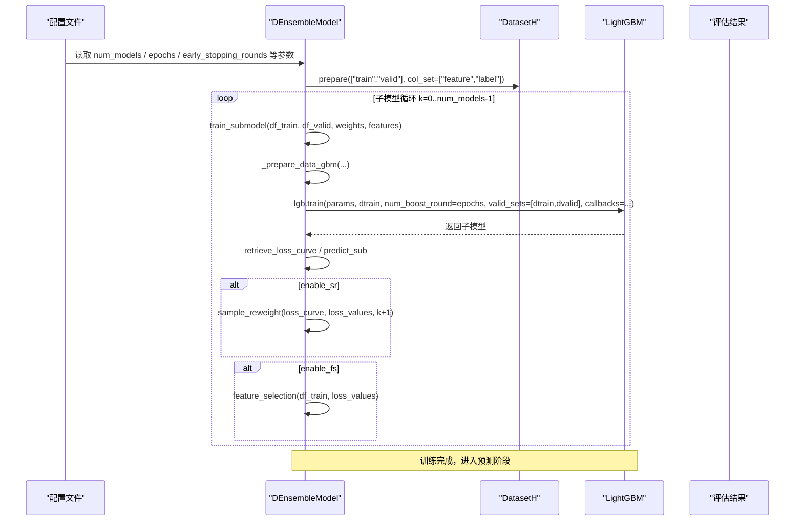
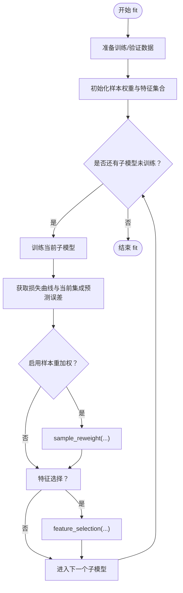
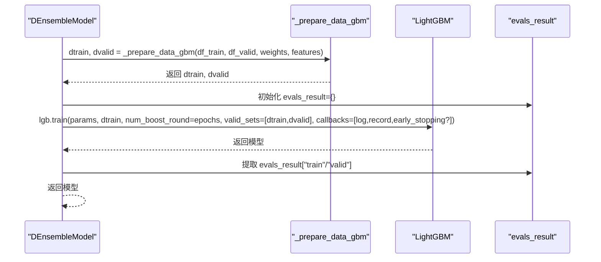
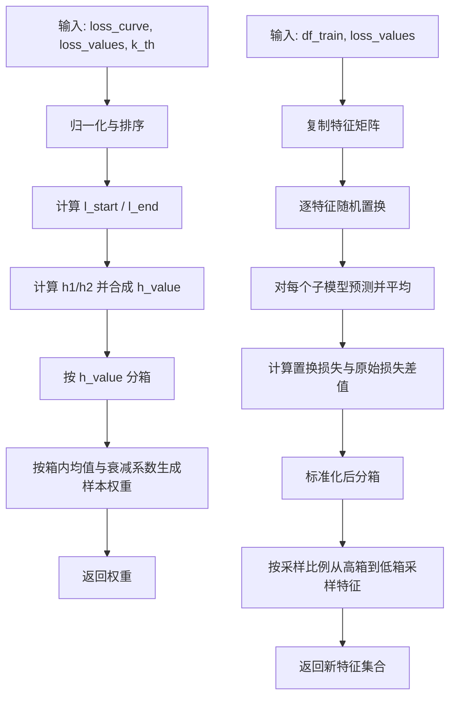
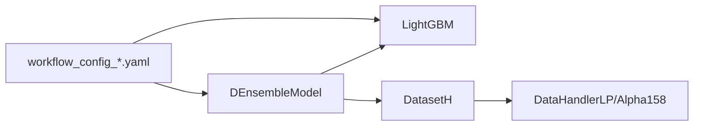

# 训练机制

<cite>
**本文引用的文件列表**
- [double_ensemble.py](file://qlib/contrib/model/double_ensemble.py)
- [workflow_config_doubleensemble_Alpha158.yaml](file://examples/benchmarks/DoubleEnsemble/workflow_config_doubleensemble_Alpha158.yaml)
- [workflow_config_doubleensemble_early_stop_Alpha158.yaml](file://examples/benchmarks/DoubleEnsemble/workflow_config_doubleensemble_early_stop_Alpha158.yaml)
- [handler.py](file://qlib/contrib/data/handler.py)
- [gbdt.py](file://qlib/contrib/model/gbdt.py)
</cite>

## 目录
1. [引言](#引言)
2. [项目结构](#项目结构)
3. [核心组件](#核心组件)
4. [架构总览](#架构总览)
5. [详细组件分析](#详细组件分析)
6. [依赖关系分析](#依赖关系分析)
7. [性能考量](#性能考量)
8. [故障排查指南](#故障排查指南)
9. [结论](#结论)

## 引言
本文件系统性地文档化双重集成模型（Double Ensemble）的两阶段训练流程，重点解析第一阶段中多个基模型（以LightGBM为基模型）的并行训练过程。通过对fit方法、train_submodel以及_prepare_data_gbm函数的深入分析，阐明数据准备、子模型训练循环、样本重加权（SR）、特征选择（FS）与验证集交互逻辑；并结合workflow配置文件中的num_models、epochs、early_stopping_rounds等关键参数，说明如何在实际配置中控制训练行为，以及这些超参数对模型收敛性与性能的影响。

## 项目结构
围绕双重集成模型训练机制的相关文件组织如下：
- 模型实现：qlib/contrib/model/double_ensemble.py
- 配置示例：examples/benchmarks/DoubleEnsemble/*.yaml
- 数据处理器：qlib/contrib/data/handler.py（Alpha158等）
- 基础LightGBM训练参考：qlib/contrib/model/gbdt.py

图表来源
- [double_ensemble.py](file://qlib/contrib/model/double_ensemble.py#L64-L124)
- [workflow_config_doubleensemble_Alpha158.yaml](file://examples/benchmarks/DoubleEnsemble/workflow_config_doubleensemble_Alpha158.yaml#L32-L66)
- [workflow_config_doubleensemble_early_stop_Alpha158.yaml](file://examples/benchmarks/DoubleEnsemble/workflow_config_doubleensemble_early_stop_Alpha158.yaml#L32-L66)
- [handler.py](file://qlib/contrib/data/handler.py#L98-L158)
- [gbdt.py](file://qlib/contrib/model/gbdt.py#L57-L90)

章节来源
- [double_ensemble.py](file://qlib/contrib/model/double_ensemble.py#L64-L124)
- [workflow_config_doubleensemble_Alpha158.yaml](file://examples/benchmarks/DoubleEnsemble/workflow_config_doubleensemble_Alpha158.yaml#L32-L66)
- [workflow_config_doubleensemble_early_stop_Alpha158.yaml](file://examples/benchmarks/DoubleEnsemble/workflow_config_doubleensemble_early_stop_Alpha158.yaml#L32-L66)
- [handler.py](file://qlib/contrib/data/handler.py#L98-L158)
- [gbdt.py](file://qlib/contrib/model/gbdt.py#L57-L90)

## 核心组件
- 双重集成模型（DEnsembleModel）
  - 负责两阶段训练：子模型训练、样本重加权（SR）、特征选择（FS）
  - 支持多子模型并行训练（按顺序迭代，非并发），每轮使用当前子模型的损失曲线与当前集成预测误差进行SR与FS
- LightGBM训练接口
  - 使用lgb.train进行训练，支持回调（日志、记录评估结果、早停）
- 数据准备
  - 通过DatasetH.prepare获取训练/验证数据，再由_prepare_data_gbm转换为LightGBM Dataset格式
- 配置驱动
  - 通过workflow配置文件传入num_models、epochs、early_stopping_rounds、LightGBM超参等

章节来源
- [double_ensemble.py](file://qlib/contrib/model/double_ensemble.py#L64-L124)
- [gbdt.py](file://qlib/contrib/model/gbdt.py#L57-L90)

## 架构总览
双重集成模型的训练流程分为两个阶段：
- 第一阶段：多子模型训练（顺序进行，非并行）
  - 每个子模型独立训练，使用当前样本权重与特征集合
  - 训练完成后计算损失曲线与当前集成预测误差，用于SR与FS
- 第二阶段：预测阶段（测试集）
  - 对测试集进行逐子模型预测，按子权重聚合得到最终预测

图表来源
- [double_ensemble.py](file://qlib/contrib/model/double_ensemble.py#L64-L124)
- [double_ensemble.py](file://qlib/contrib/model/double_ensemble.py#L105-L124)
- [double_ensemble.py](file://qlib/contrib/model/double_ensemble.py#L126-L138)
- [workflow_config_doubleensemble_Alpha158.yaml](file://examples/benchmarks/DoubleEnsemble/workflow_config_doubleensemble_Alpha158.yaml#L32-L66)

## 详细组件分析

### fit方法与训练循环
- 数据准备
  - 通过DatasetH.prepare获取训练/验证数据，要求包含“feature”和“label”
  - 初始化样本权重（全1）与特征集合（全部特征）
- 子模型训练循环
  - 每次迭代训练一个子模型，将该子模型加入ensemble
  - 计算当前子模型的损失曲线与当前集成预测误差，用于SR与FS
  - 在最后一个子模型时不再进行SR与FS
- 关键点
  - 当前实现为顺序训练，非并行；若需并行，可在循环外层使用并行工具包装训练逻辑

图表来源
- [double_ensemble.py](file://qlib/contrib/model/double_ensemble.py#L64-L104)

章节来源
- [double_ensemble.py](file://qlib/contrib/model/double_ensemble.py#L64-L104)

### train_submodel与回调
- 数据准备
  - 调用_prepare_data_gbm将DataFrame转换为LightGBM Dataset，标签降维为1D数组
- 训练
  - 设置回调：日志输出、评估结果记录、可选早停
  - 使用lgb.train进行训练，valid_sets包含训练集与验证集
- 评估结果
  - 将evals_result中的字典值提取为列表，便于后续分析

图表来源
- [double_ensemble.py](file://qlib/contrib/model/double_ensemble.py#L105-L124)
- [double_ensemble.py](file://qlib/contrib/model/double_ensemble.py#L126-L138)

章节来源
- [double_ensemble.py](file://qlib/contrib/model/double_ensemble.py#L105-L124)
- [double_ensemble.py](file://qlib/contrib/model/double_ensemble.py#L126-L138)

### _prepare_data_gbm：数据集构建与标签处理
- 特征与标签切片
  - 仅保留当前特征集合
- 标签维度处理
  - LightGBM要求1D标签，若为二维单列则压缩为1D
- Dataset创建
  - 训练集提供样本权重，验证集不提供权重
- 多标签限制
  - 不支持多标签训练，会抛出异常

章节来源
- [double_ensemble.py](file://qlib/contrib/model/double_ensemble.py#L126-L138)

### 样本重加权（SR）与特征选择（FS）
- 样本重加权（SR）
  - 基于损失曲线（前10%与后10%的平均）与当前集成预测误差，计算h值并分箱，按衰减系数与箱内均值生成样本权重
- 特征选择（FS）
  - 对每个特征进行列随机置换，计算置换后的损失变化，标准化后分箱，按采样比例从高到低的箱中随机采样特征

图表来源
- [double_ensemble.py](file://qlib/contrib/model/double_ensemble.py#L139-L172)
- [double_ensemble.py](file://qlib/contrib/model/double_ensemble.py#L174-L218)

章节来源
- [double_ensemble.py](file://qlib/contrib/model/double_ensemble.py#L139-L172)
- [double_ensemble.py](file://qlib/contrib/model/double_ensemble.py#L174-L218)

### 预测与特征重要性
- 预测
  - 对测试集逐子模型预测，按子权重加权求和并归一化
- 特征重要性
  - 聚合各子模型的特征重要性并按子权重加权求和

章节来源
- [double_ensemble.py](file://qlib/contrib/model/double_ensemble.py#L246-L258)
- [double_ensemble.py](file://qlib/contrib/model/double_ensemble.py#L265-L276)

## 依赖关系分析
- 模块耦合
  - DEnsembleModel依赖LightGBM（lgb.train、lgb.Dataset、回调）
  - DEnsembleModel依赖DatasetH与DataHandlerLP进行数据准备
  - 配置文件通过kwargs传递LightGBM超参（如colsample_bytree、learning_rate、subsample、lambda_l1、lambda_l2、max_depth、num_leaves、num_threads、verbosity等）
- 外部依赖
  - LightGBM版本要求（gbdt.fit中有注释提示升级）

图表来源
- [double_ensemble.py](file://qlib/contrib/model/double_ensemble.py#L64-L124)
- [handler.py](file://qlib/contrib/data/handler.py#L98-L158)
- [workflow_config_doubleensemble_Alpha158.yaml](file://examples/benchmarks/DoubleEnsemble/workflow_config_doubleensemble_Alpha158.yaml#L32-L66)

章节来源
- [double_ensemble.py](file://qlib/contrib/model/double_ensemble.py#L64-L124)
- [handler.py](file://qlib/contrib/data/handler.py#L98-L158)
- [workflow_config_doubleensemble_Alpha158.yaml](file://examples/benchmarks/DoubleEnsemble/workflow_config_doubleensemble_Alpha158.yaml#L32-L66)

## 性能考量
- num_models
  - 控制子模型数量，影响训练时间与集成效果。增加num_models通常提升稳定性但增加计算成本。
- epochs
  - 控制每子模型的最大训练轮数。过大可能导致过拟合，过小可能欠拟合。
- early_stopping_rounds
  - 启用早停可避免过拟合，提高泛化能力；设置过小可能过早停止，过大可能浪费资源。
- LightGBM超参
  - colsample_bytree、subsample、lambda_l1、lambda_l2、max_depth、num_leaves、num_threads、verbosity等直接影响训练速度、正则化强度与内存占用。
- SR与FS
  - SR通过样本权重引导后续子模型关注困难样本；FS通过特征分箱与采样减少冗余特征，有助于提升泛化与效率。

章节来源
- [double_ensemble.py](file://qlib/contrib/model/double_ensemble.py#L18-L64)
- [workflow_config_doubleensemble_Alpha158.yaml](file://examples/benchmarks/DoubleEnsemble/workflow_config_doubleensemble_Alpha158.yaml#L32-L66)
- [workflow_config_doubleensemble_early_stop_Alpha158.yaml](file://examples/benchmarks/DoubleEnsemble/workflow_config_doubleensemble_early_stop_Alpha158.yaml#L32-L66)

## 故障排查指南
- 空数据
  - 若DatasetH返回空数据，将抛出错误，请检查数据配置与时间段划分。
- 多标签不支持
  - _prepare_data_gbm要求标签为1D，若为多标签将报错。
- 早停未生效
  - 确认配置中early_stopping_rounds已设置且回调链包含早停。
- LightGBM版本问题
  - 若遇到回调相关错误，参考gbdt.fit中的注释提示升级LightGBM版本。

章节来源
- [double_ensemble.py](file://qlib/contrib/model/double_ensemble.py#L64-L70)
- [double_ensemble.py](file://qlib/contrib/model/double_ensemble.py#L126-L138)
- [gbdt.py](file://qlib/contrib/model/gbdt.py#L57-L90)

## 结论
双重集成模型通过两阶段训练在LightGBM基模型上实现了样本重加权与特征选择的自适应优化。fit方法定义了完整的训练循环，train_submodel负责调用LightGBM训练并管理回调，_prepare_data_gbm确保数据格式符合LightGBM要求。配置文件中的num_models、epochs、early_stopping_rounds等参数直接决定了训练策略与性能表现。实践中应根据任务规模与数据特性合理设置这些超参数，并结合SR与FS模块以获得更稳健的预测效果。