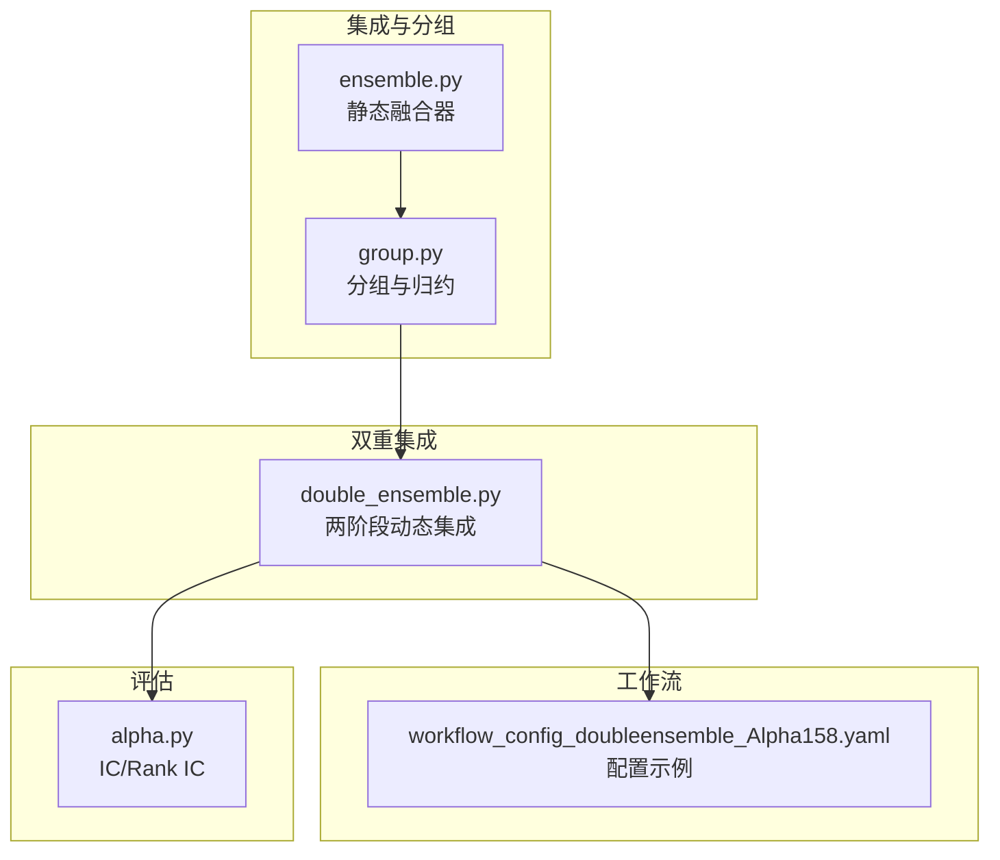
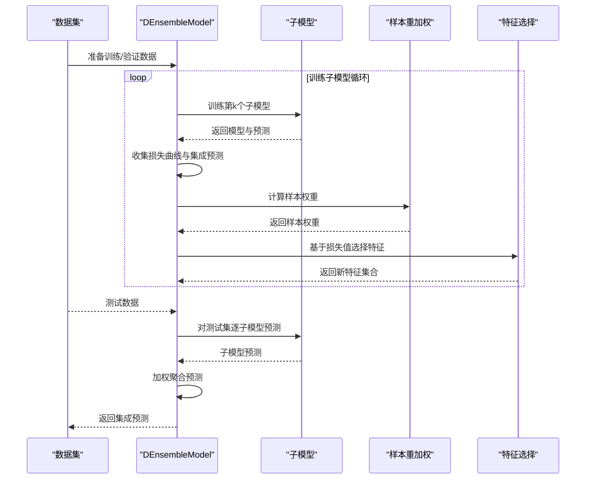
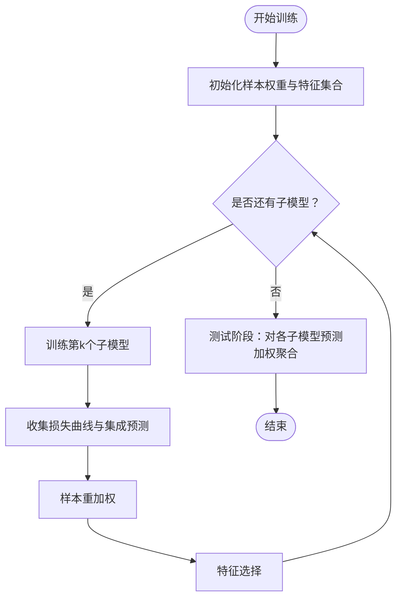
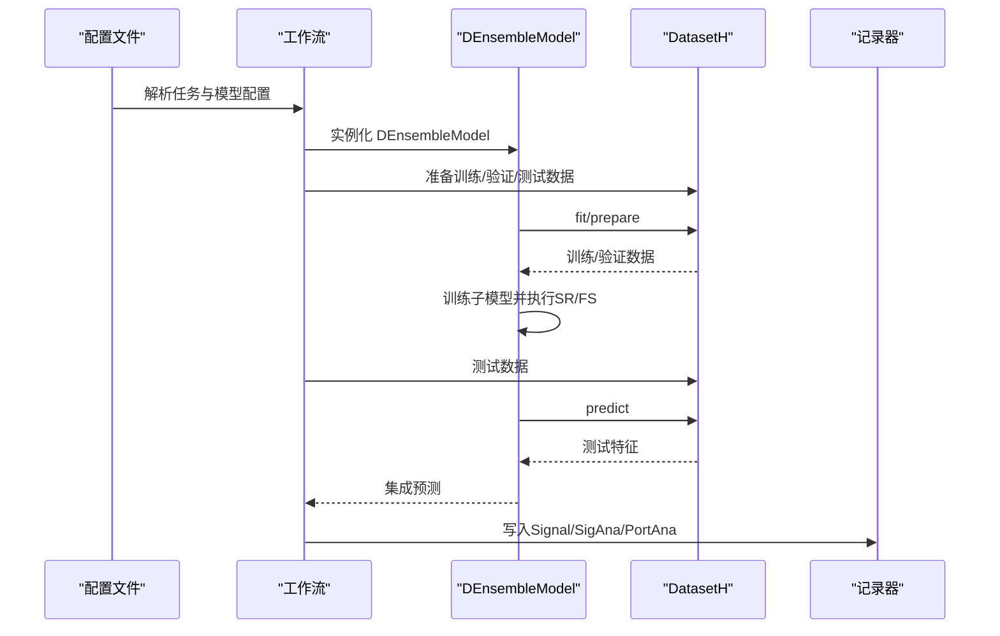
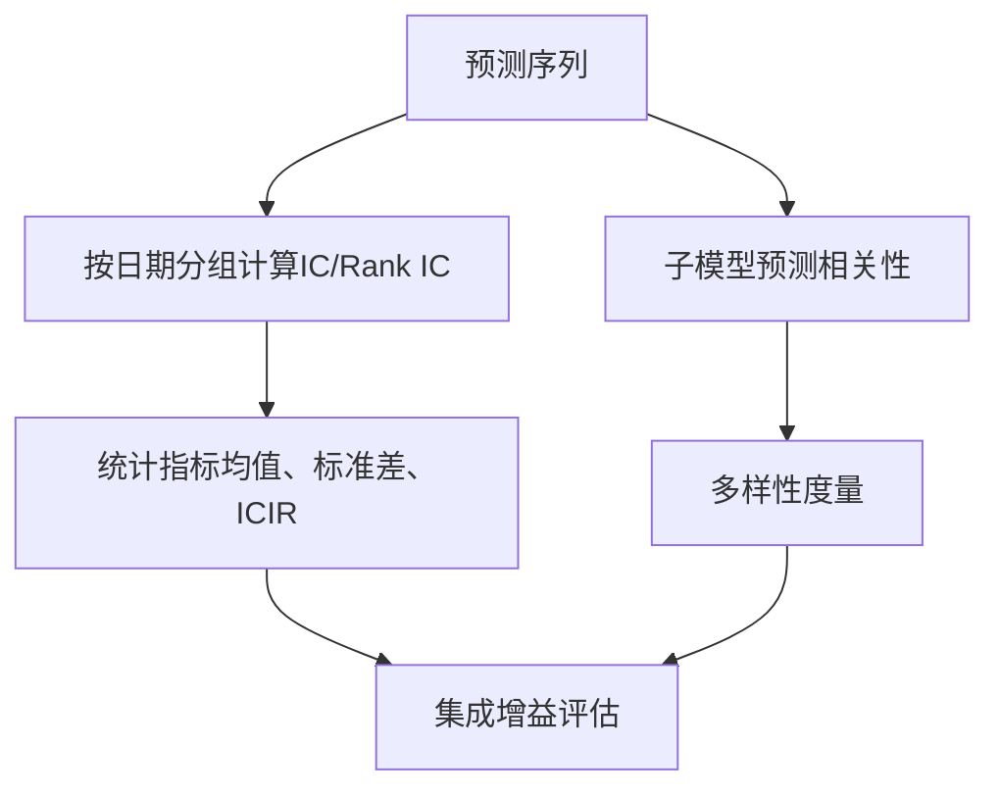
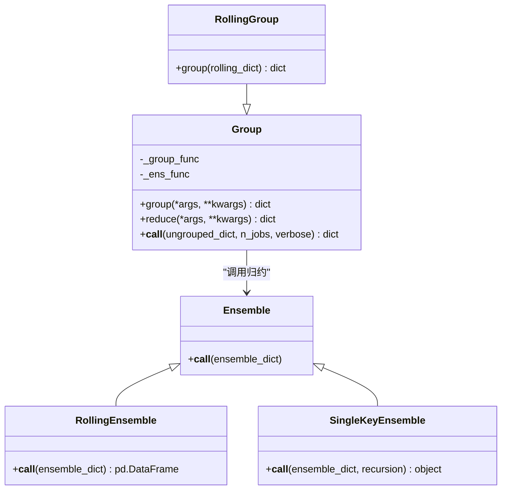
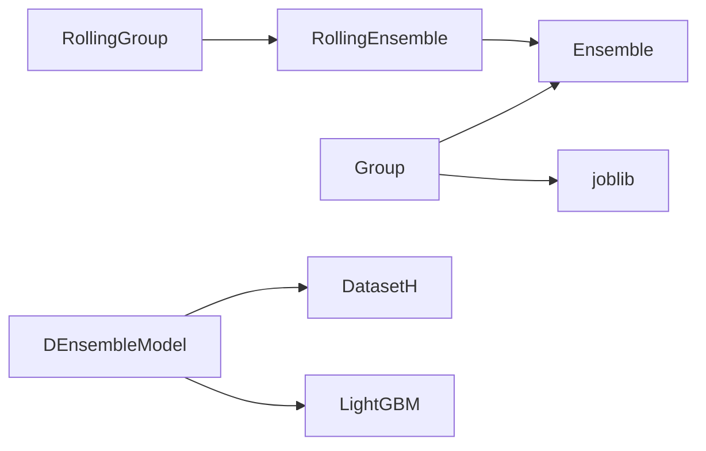

# 模型集成与融合

<cite>
**本文引用的文件**
- [ensemble.py](file://qlib/model/ens/ensemble.py)
- [group.py](file://qlib/model/ens/group.py)
- [double_ensemble.py](file://qlib/contrib/model/double_ensemble.py)
- [workflow_config_doubleensemble_Alpha158.yaml](file://examples/benchmarks/DoubleEnsemble/workflow_config_doubleensemble_Alpha158.yaml)
- [alpha.py](file://qlib/contrib/eva/alpha.py)
- [README.md（DoubleEnsemble）](file://examples/benchmarks/DoubleEnsemble/README.md)
</cite>

## 目录
1. [简介](#简介)
2. [项目结构](#项目结构)
3. [核心组件](#核心组件)
4. [架构总览](#架构总览)
5. [详细组件分析](#详细组件分析)
6. [依赖关系分析](#依赖关系分析)
7. [性能考量](#性能考量)
8. [故障排查指南](#故障排查指南)
9. [结论](#结论)
10. [附录](#附录)

## 简介
本文件系统化梳理 Qlib 的模型集成与融合框架，覆盖以下主题：
- 静态加权融合：加权平均、中位数融合、IC 加权等方法的实现逻辑与数学原理
- 排序融合：基于排序统计的集成策略
- 动态集成策略：双重集成模型的两阶段架构（样本重加权与特征选择），以及元模型对子模型权重的动态调整
- 工作流集成：通过配置文件定义多模型集成管道
- 集成效果评估：多样性度量、相关性分析与集成增益计算
- 分组与批量调度：模型分组管理与批量预测调度，以及集成在降低方差、提升稳定性方面的收益

## 项目结构
围绕“集成与融合”的核心代码主要分布在如下模块：
- 集成器与分组：qlib/model/ens/ensemble.py、qlib/model/ens/group.py
- 双重集成模型：qlib/contrib/model/double_ensemble.py
- 工作流配置示例：examples/benchmarks/DoubleEnsemble/workflow_config_doubleensemble_Alpha158.yaml
- 评估工具：qlib/contrib/eva/alpha.py（IC/Rank IC 计算）
- 示例说明：examples/benchmarks/DoubleEnsemble/README.md

图表来源
- [ensemble.py](file://qlib/model/ens/ensemble.py#L1-L133)
- [group.py](file://qlib/model/ens/group.py#L1-L116)
- [double_ensemble.py](file://qlib/contrib/model/double_ensemble.py#L1-L278)
- [workflow_config_doubleensemble_Alpha158.yaml](file://examples/benchmarks/DoubleEnsemble/workflow_config_doubleensemble_Alpha158.yaml#L1-L93)
- [alpha.py](file://qlib/contrib/eva/alpha.py#L160-L215)

章节来源
- [ensemble.py](file://qlib/model/ens/ensemble.py#L1-L133)
- [group.py](file://qlib/model/ens/group.py#L1-L116)
- [double_ensemble.py](file://qlib/contrib/model/double_ensemble.py#L1-L278)
- [workflow_config_doubleensemble_Alpha158.yaml](file://examples/benchmarks/DoubleEnsemble/workflow_config_doubleensemble_Alpha158.yaml#L1-L93)
- [alpha.py](file://qlib/contrib/eva/alpha.py#L160-L215)

## 核心组件
- 静态融合器
  - AverageEnsemble：对同一时间点的多个预测进行标准化后求均值，实现加权平均的等权版本
  - RollingEnsemble：按时间顺序拼接滚动预测，去重并排序，便于跨期对比
  - SingleKeyEnsemble：递归提取单键字典中的值，简化输出结构
- 分组与归约
  - Group：根据自定义分组函数将对象分组，并对每组调用 Ensemble 进行归约
  - RollingGroup：专门处理滚动键元组的分组，先按除最后一项外的键聚合，再对滚动键做归约
- 双重集成模型
  - DEnsembleModel：两阶段动态集成
    - 第一阶段：训练多个子模型，收集损失曲线与当前集成预测
    - 第二阶段：基于损失曲线与当前集成误差，执行样本重加权与特征选择；随后对测试集进行加权聚合预测

章节来源
- [ensemble.py](file://qlib/model/ens/ensemble.py#L1-L133)
- [group.py](file://qlib/model/ens/group.py#L1-L116)
- [double_ensemble.py](file://qlib/contrib/model/double_ensemble.py#L1-L278)

## 架构总览
双重集成模型的两阶段流程如下：
- 训练阶段
  - 初始化样本权重与特征集合
  - 循环训练子模型，记录每个子模型的预测与损失曲线
  - 基于损失曲线与当前集成误差，计算样本权重与特征集合
- 预测阶段
  - 对测试集按各子模型使用的特征进行预测
  - 使用子模型权重对预测结果进行加权平均

图表来源
- [double_ensemble.py](file://qlib/contrib/model/double_ensemble.py#L65-L124)
- [double_ensemble.py](file://qlib/contrib/model/double_ensemble.py#L140-L205)
- [double_ensemble.py](file://qlib/contrib/model/double_ensemble.py#L247-L259)

## 详细组件分析

### 静态加权融合与排序融合
- AverageEnsemble（加权平均）
  - 输入：同一时间维度的多个 DataFrame 预测
  - 处理：展平嵌套字典，按时间分组后对各列标准化，再对列求均值
  - 输出：标准化后的平均预测序列
  - 数学要点：对每个时间点的预测进行 z-score 归一化，消除量纲差异，然后求均值，实现“稳健平均”
- RollingEnsemble（滚动拼接）
  - 输入：按时间索引组织的多个 DataFrame
  - 处理：按起始时间排序拼接，去重保留最新，再整体排序
  - 输出：完整的滚动预测序列
- SingleKeyEnsemble（单键提取）
  - 输入：可能包含多层嵌套的字典
  - 处理：递归提取仅含一个键的字典值，使输出更简洁
- 排序融合（基于排序统计）
  - 在 Qlib 中可通过将预测转换为排名后再进行融合实现。例如，先对每个样本在时间点上的预测进行排名，再对排名进行平均或中位数融合，以降低极端值影响
  - 该策略常用于 IC/Rank IC 场景，强调相对排序而非绝对值

章节来源
- [ensemble.py](file://qlib/model/ens/ensemble.py#L91-L133)
- [ensemble.py](file://qlib/model/ens/ensemble.py#L65-L89)
- [ensemble.py](file://qlib/model/ens/ensemble.py#L32-L63)

### 双重集成模型（两阶段动态集成）
- 样本重加权（SR）
  - 目标：识别对当前集成误差贡献较大的样本，提高其学习权重
  - 方法：利用损失曲线（前 10% 与后 10% 的平均损失）与当前集成误差的排名，构造 h 值，按分箱平均后反比缩放得到样本权重
  - 关键参数：alpha1、alpha2 控制两部分权重占比，bins_sr 控制分箱数量，decay 控制随迭代衰减
- 特征选择（FS）
  - 目标：筛选对当前集成误差敏感的特征，缓解高维噪声
  - 方法：对每个特征进行随机打乱，计算扰动前后损失差的 z-score，按分箱采样保留部分特征
  - 关键参数：bins_fs 控制分箱数量，sample_ratios 控制每箱采样比例
- 元模型权重（静态加权）
  - 在预测阶段，使用预设的子模型权重对各子模型预测进行加权平均，实现静态集成
  - 可视化为“静态加权融合”的特例

图表来源
- [double_ensemble.py](file://qlib/contrib/model/double_ensemble.py#L65-L124)
- [double_ensemble.py](file://qlib/contrib/model/double_ensemble.py#L140-L205)
- [double_ensemble.py](file://qlib/contrib/model/double_ensemble.py#L247-L259)

章节来源
- [double_ensemble.py](file://qlib/contrib/model/double_ensemble.py#L1-L278)
- [README.md（DoubleEnsemble）](file://examples/benchmarks/DoubleEnsemble/README.md#L1-L4)

### 工作流中的双重集成管道
- 配置要点
  - 模型类：DEnsembleModel，模块路径指向贡献模型
  - 关键参数：num_models、sample_ratios、sub_weights、alpha1、alpha2、bins_sr、bins_fs、decay、epochs 等
  - 数据集：DatasetH + Alpha158 处理器，划分训练/验证/测试
  - 记录：SignalRecord、SigAnaRecord、PortAnaRecord
- 执行流程
  - 由工作流加载配置，实例化 DEnsembleModel 并 fit
  - 在测试阶段调用 predict 生成集成预测
  - 通过记录器输出信号分析与组合分析结果

图表来源
- [workflow_config_doubleensemble_Alpha158.yaml](file://examples/benchmarks/DoubleEnsemble/workflow_config_doubleensemble_Alpha158.yaml#L1-L93)
- [double_ensemble.py](file://qlib/contrib/model/double_ensemble.py#L65-L124)
- [double_ensemble.py](file://qlib/contrib/model/double_ensemble.py#L247-L259)

章节来源
- [workflow_config_doubleensemble_Alpha158.yaml](file://examples/benchmarks/DoubleEnsemble/workflow_config_doubleensemble_Alpha158.yaml#L1-L93)

### 集成效果评估
- 相关性分析
  - 使用 IC（信息系数）与 Rank IC（秩相关 IC）衡量预测与收益率的相关性
  - 可按日期分组计算日级 IC/Rank IC，并进一步计算 ICIR（信息比率）
- 多样性度量
  - 可基于子模型预测之间的相关性或 IC 的波动性衡量多样性
  - 也可参考数据选择模块中对 IC 相关矩阵的构建思路，评估模型间一致性
- 集成增益
  - 将集成预测与各子模型预测分别计算 IC/Rank IC，比较集成是否带来提升
  - 通过记录器输出的信号分析与组合分析，观察夏普率、最大回撤等指标变化

图表来源
- [alpha.py](file://qlib/contrib/eva/alpha.py#L160-L215)
- [README.md（DoubleEnsemble）](file://examples/benchmarks/DoubleEnsemble/README.md#L1-L4)

章节来源
- [alpha.py](file://qlib/contrib/eva/alpha.py#L160-L215)
- [README.md（DoubleEnsemble）](file://examples/benchmarks/DoubleEnsemble/README.md#L1-L4)

### 分组与批量预测调度
- Group 与 RollingGroup
  - Group：通过 group_func 将对象按规则分组，再对每组调用 Ensemble 进行归约
  - RollingGroup：针对滚动键元组的特殊分组，先按除滚动键外的键聚合，再对滚动键做归约
- 并行化
  - 通过 joblib.Parallel 与 delayed 对每组归约过程并行化，提升大规模分组场景下的效率
- 实际收益
  - 通过分组管理不同子模型或不同滚动窗口的结果，统一进行静态或动态融合
  - 在批量预测时，可按组并行调用子模型，显著缩短端到端预测耗时

图表来源
- [ensemble.py](file://qlib/model/ens/ensemble.py#L1-L133)
- [group.py](file://qlib/model/ens/group.py#L1-L116)

章节来源
- [group.py](file://qlib/model/ens/group.py#L1-L116)
- [ensemble.py](file://qlib/model/ens/ensemble.py#L1-L133)

## 依赖关系分析
- 组件耦合
  - Group 依赖 Ensemble 接口，具体归约行为由传入的 Ensemble 实现决定
  - RollingGroup 默认使用 RollingEnsemble，确保滚动预测的正确拼接
  - DEnsembleModel 依赖 DatasetH 提供的数据接口，内部通过 LightGBM 训练子模型
- 外部依赖
  - pandas/numpy：数据结构与数值计算
  - joblib：并行化执行
  - LightGBM：训练子模型与特征重要性

图表来源
- [group.py](file://qlib/model/ens/group.py#L1-L116)
- [ensemble.py](file://qlib/model/ens/ensemble.py#L1-L133)
- [double_ensemble.py](file://qlib/contrib/model/double_ensemble.py#L1-L278)

章节来源
- [group.py](file://qlib/model/ens/group.py#L1-L116)
- [ensemble.py](file://qlib/model/ens/ensemble.py#L1-L133)
- [double_ensemble.py](file://qlib/contrib/model/double_ensemble.py#L1-L278)

## 性能考量
- 并行化
  - 分组归约使用 joblib.Parallel 并行执行，n_jobs 参数可按 CPU 核心数设置
- 计算复杂度
  - AverageEnsemble 的标准化与分组操作为 O(T·N·F)，其中 T 为时间步数，N 为样本数，F 为特征数
  - DEnsembleModel 的 SR/FS 步骤引入额外的排序与分箱计算，复杂度与分箱数、树数相关
- 资源控制
  - early_stopping_rounds 可减少过拟合并节省训练时间
  - sub_weights 与 num_models 影响预测阶段的加权聚合成本

[本节为通用指导，不直接分析具体文件]

## 故障排查指南
- 训练数据为空
  - 现象：抛出空数据异常
  - 排查：检查数据集准备与分段配置
- 多标签不支持
  - 现象：LightGBM 不支持多标签训练
  - 排查：确保标签为 1D 数组
- 参数长度不匹配
  - 现象：sample_ratios 与 bins_fs 或 sub_weights 与 num_models 不一致
  - 排查：核对配置参数长度
- 模型未拟合即预测
  - 现象：预测时报错
  - 排查：确认已执行 fit

章节来源
- [double_ensemble.py](file://qlib/contrib/model/double_ensemble.py#L65-L124)
- [double_ensemble.py](file://qlib/contrib/model/double_ensemble.py#L247-L259)

## 结论
- 静态融合（AverageEnsemble、RollingEnsemble、SingleKeyEnsemble）提供了简单而稳健的集成手段，适合快速验证与基准对比
- 排序融合（基于排名的平均/中位数）在 IC/Rank IC 场景下具有鲁棒性
- 双重集成模型通过两阶段动态策略（样本重加权与特征选择）与静态加权预测，有效降低方差、提升稳定性
- 工作流配置清晰地定义了从数据准备到预测与记录的完整管道
- 通过 IC/Rank IC、相关性与多样性度量，可系统评估集成效果并持续优化

[本节为总结，不直接分析具体文件]

## 附录
- 术语
  - IC：信息系数（预测与收益率的线性相关）
  - Rank IC：秩相关 IC（预测与收益率的秩相关）
  - SR：样本重加权（Sample Reweighting）
  - FS：特征选择（Feature Selection）

[本节为补充说明，不直接分析具体文件]