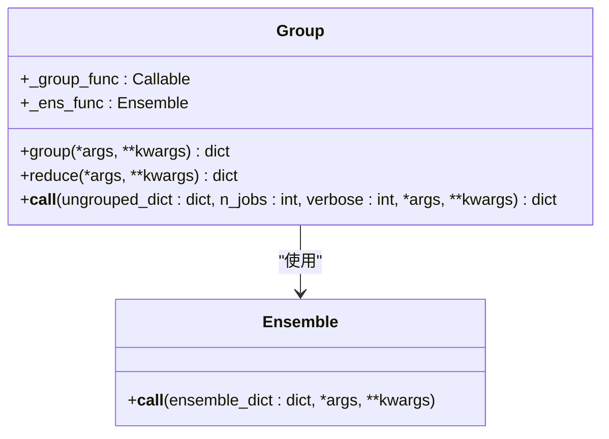
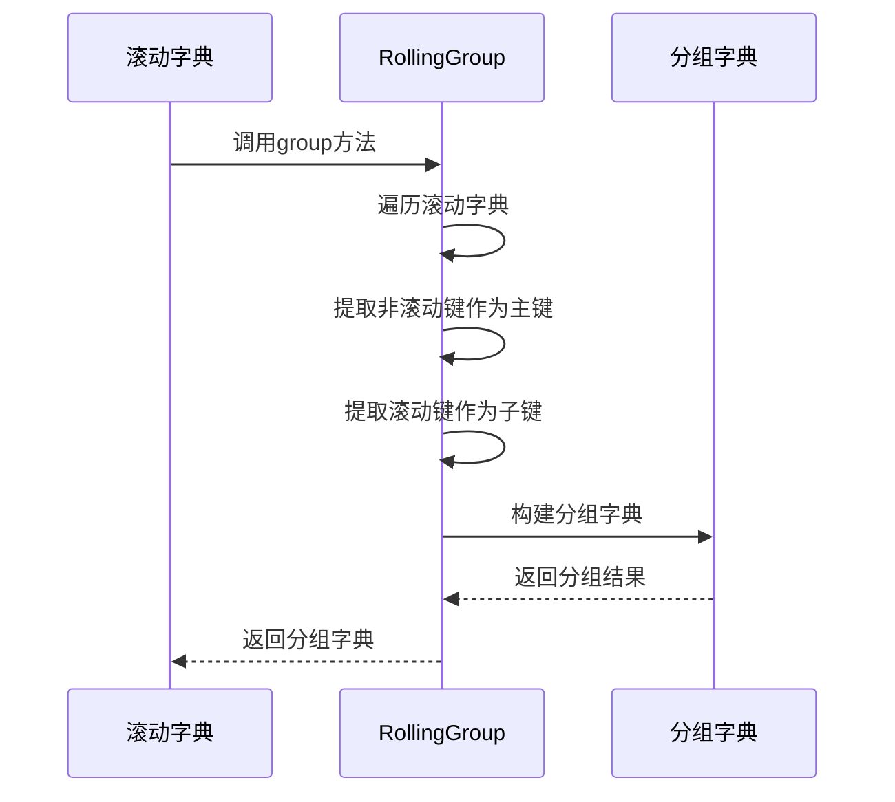
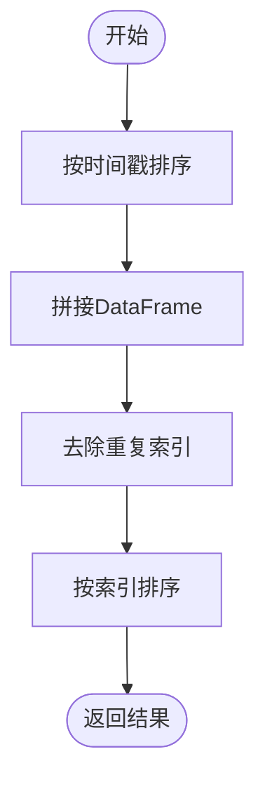
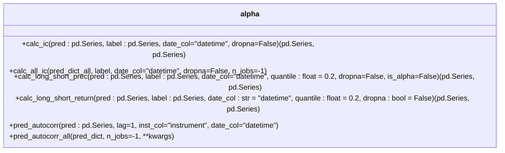
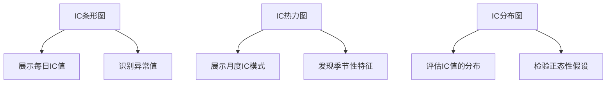

# 集成效果评估

<cite>
**本文档引用的文件**   
- [group.py](file://qlib/model/ens/group.py)
- [ensemble.py](file://qlib/model/ens/ensemble.py)
- [alpha.py](file://qlib/contrib/eva/alpha.py)
- [analysis_model_performance.py](file://qlib/contrib/report/analysis_model/analysis_model_performance.py)
- [report.py](file://qlib/contrib/report/analysis_position/report.py)
</cite>

## 目录
1. [引言](#引言)
2. [模型集成效果评估体系](#模型集成效果评估体系)
3. [Group和RollingGroup类的分组管理](#group和rollinggroup类的分组管理)
4. [RollingEnsemble的时间序列拼接](#rollingensemble的时间序列拼接)
5. [集成模型性能评估指标](#集成模型性能评估指标)
6. [可视化分析最佳实践](#可视化分析最佳实践)
7. [结论](#结论)

## 引言
在量化金融领域，模型集成是提升预测性能的关键技术。通过将多个模型的预测结果进行有效整合，可以显著提高预测的稳定性和准确性。本文档旨在建立一个完整的模型集成效果评估体系，涵盖多样性度量、预测相关性分析和集成增益计算等关键指标。我们将重点介绍如何利用group.py中的Group和RollingGroup类对多模型预测结果进行分组管理和批量调度，以及如何通过RollingEnsemble实现时间序列预测结果的无缝拼接。

**Section sources**
- [group.py](file://qlib/model/ens/group.py#L1-L116)
- [ensemble.py](file://qlib/model/ens/ensemble.py#L1-L133)

## 模型集成效果评估体系
模型集成效果评估体系是确保集成模型性能优越性的关键。该体系主要包括三个核心组成部分：多样性度量、预测相关性分析和集成增益计算。多样性度量用于评估集成中各个模型之间的差异性，预测相关性分析用于衡量集成预测与实际标签之间的相关性，而集成增益计算则用于量化集成模型相对于单个模型的性能提升。

在QLib框架中，这些评估指标通过一系列精心设计的类和函数实现。其中，Group和RollingGroup类负责对多模型预测结果进行分组管理和批量调度，而RollingEnsemble则负责实现时间序列预测结果的无缝拼接。这些组件共同构成了一个完整的集成效果评估体系，为量化金融领域的模型集成提供了强大的支持。

**Section sources**
- [group.py](file://qlib/model/ens/group.py#L1-L116)
- [ensemble.py](file://qlib/model/ens/ensemble.py#L1-L133)

## Group和RollingGroup类的分组管理
### Group类的核心功能
Group类是QLib中用于对对象进行分组管理的核心组件。它通过`group_func`函数将一组对象按照特定规则进行分组，并将结果转换为字典形式。这种分组机制使得我们可以将具有相似特征或属性的模型预测结果归为同一组，便于后续的批量处理和分析。

**Diagram sources**
- [group.py](file://qlib/model/ens/group.py#L20-L69)

### RollingGroup类的滚动分组
RollingGroup类继承自Group类，专门用于处理滚动预测结果的分组。它假设滚动键位于键元组的末尾，这是因为在时间序列预测中，滚动结果通常需要首先进行集成。RollingGroup类的`group`方法接收一个滚动字典，返回一个按非滚动键分组的字典，其中每个值都是一个以滚动键为键的字典。

**Diagram sources**
- [group.py](file://qlib/model/ens/group.py#L95-L115)

## RollingEnsemble的时间序列拼接
### RollingEnsemble的工作原理
RollingEnsemble是QLib中用于合并滚动数据帧的组件，特别适用于预测或IC值的集成。它接收一个字典，其中键可以忽略，值必须是具有"datetime"索引的pandas DataFrame。RollingEnsemble通过将这些DataFrame按时间顺序拼接，实现时间序列预测结果的无缝拼接。

**Diagram sources**
- [ensemble.py](file://qlib/model/ens/ensemble.py#L80-L88)

### 时间序列拼接的实现细节
RollingEnsemble的实现细节体现了其在处理时间序列数据时的严谨性。首先，它会根据每个DataFrame的最早时间戳对所有值进行排序，确保时间序列的连续性。然后，使用pandas的concat函数将所有DataFrame拼接在一起。为了处理可能存在的重复预测，RollingEnsemble采用"保留最后一个"的策略，即使用最新的预测结果覆盖之前的预测。最后，对结果进行排序，确保输出的DataFrame具有正确的时间顺序。

这种实现方式不仅保证了时间序列的完整性，还有效处理了模型更新和重新训练带来的预测重叠问题，为量化金融领域的滚动预测提供了可靠的解决方案。

**Section sources**
- [ensemble.py](file://qlib/model/ens/ensemble.py#L80-L88)

## 集成模型性能评估指标
### 方差缩减率和稳定性提升度
方差缩减率和稳定性提升度是衡量集成模型性能的重要指标。方差缩减率通过比较集成模型与单个模型的预测方差，量化了集成带来的稳定性提升。稳定性提升度则进一步将方差缩减转化为实际的性能提升，为模型选择提供了直观的参考。

在QLib中，这些指标的计算通常基于IC（信息系数）序列。IC值衡量了预测值与实际值之间的相关性，是量化金融领域最常用的评估指标之一。通过计算IC序列的均值和标准差，我们可以得到ICIR（信息系数比率），这是衡量模型稳定性的关键指标。

### IC分数改善的计算方法
IC分数改善是评估集成模型性能的核心指标。它通过比较集成模型与基准模型的IC值，量化了集成带来的性能提升。在QLib中，IC分数的计算主要依赖于`calc_ic`函数，该函数接收预测值和标签值作为输入，返回IC和Rank IC两个指标。

**Diagram sources**
- [alpha.py](file://qlib/contrib/eva/alpha.py#L160-L183)

## 可视化分析最佳实践
### IC值的可视化分析
IC值的可视化分析是理解模型性能的重要手段。QLib提供了丰富的可视化工具，包括IC条形图、IC热力图和IC分布图等。这些图表不仅能够直观展示IC值的时间序列特征，还能揭示模型在不同市场环境下的表现差异。

**Diagram sources**
- [analysis_model_performance.py](file://qlib/contrib/report/analysis_model/analysis_model_performance.py#L119-L220)

### 综合性能报告
综合性能报告是集成模型评估的最终输出。它整合了各种评估指标和可视化图表，为模型性能提供了全面的视角。在QLib中，综合性能报告通常包括累计收益曲线、最大回撤、换手率等多个维度，帮助用户全面理解模型的实际表现。

**Section sources**
- [analysis_model_performance.py](file://qlib/contrib/report/analysis_model/analysis_model_performance.py#L119-L237)
- [report.py](file://qlib/contrib/report/analysis_position/report.py#L1-L249)

## 结论
本文档详细介绍了QLib框架中的模型集成效果评估体系。通过Group和RollingGroup类的分组管理，以及RollingEnsemble的时间序列拼接功能，我们建立了一个完整的集成效果评估框架。该框架不仅涵盖了方差缩减率、稳定性提升度和IC分数改善等关键量化指标，还提供了丰富的可视化分析工具，为量化金融领域的模型集成提供了全面的支持。

未来，我们可以进一步扩展这个评估体系，引入更多先进的评估指标和可视化方法，不断提升模型集成的效果和可靠性。