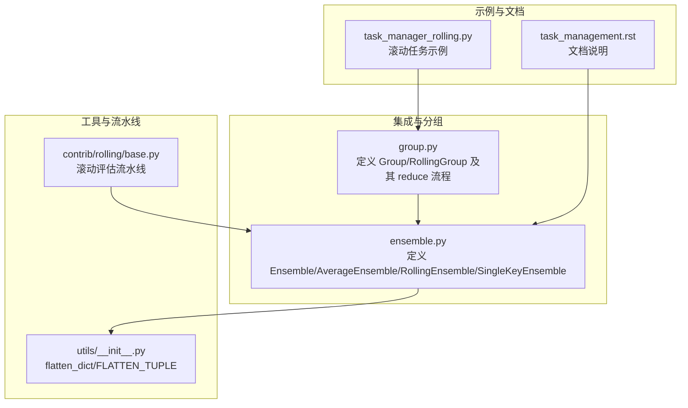
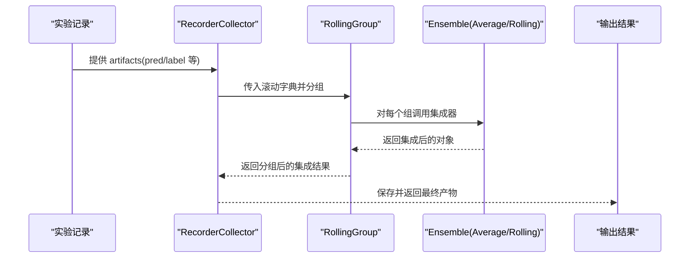
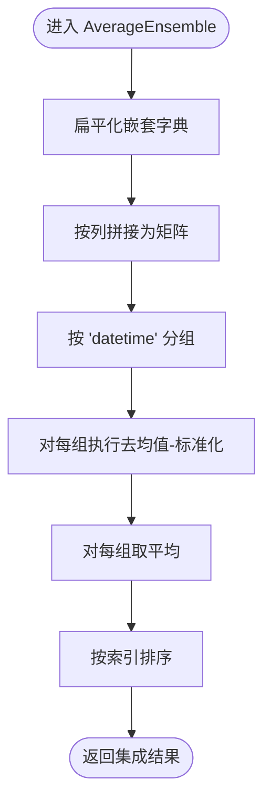
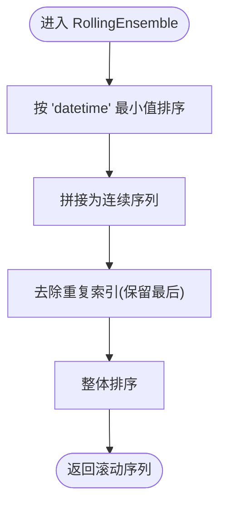
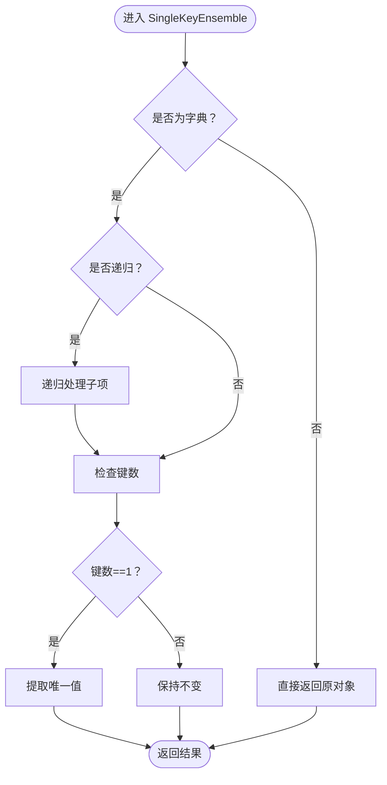
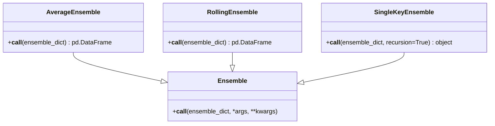
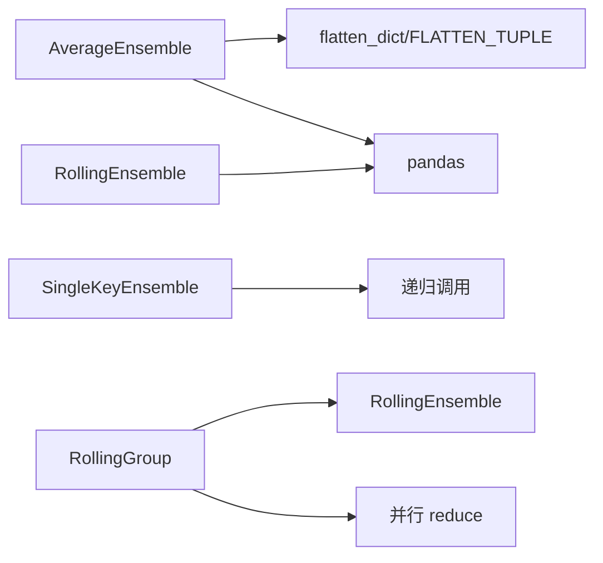

# 静态集成方法

<cite>
**本文引用的文件列表**
- [ensemble.py](file://qlib/model/ens/ensemble.py)
- [group.py](file://qlib/model/ens/group.py)
- [task_management.rst](file://docs/advanced/task_management.rst)
- [task_manager_rolling.py](file://examples/model_rolling/task_manager_rolling.py)
- [base.py](file://qlib/contrib/rolling/base.py)
- [__init__.py](file://qlib/utils/__init__.py)
</cite>

## 目录
1. [引言](#引言)
2. [项目结构](#项目结构)
3. [核心组件](#核心组件)
4. [架构总览](#架构总览)
5. [详细组件分析](#详细组件分析)
6. [依赖关系分析](#依赖关系分析)
7. [性能考量](#性能考量)
8. [故障排查指南](#故障排查指南)
9. [结论](#结论)
10. [附录：配置与调用示例](#附录配置与调用示例)

## 引言
本文件系统性阐述 Qlib 中实现的静态模型集成方法，重点围绕 ensemble.py 中的 AverageEnsemble、RollingEnsemble 和 SingleKeyEnsemble 类，解释其在多模型预测结果融合中的数学原理、数据流与控制流，并给出标准化处理流程、参数调优建议以及稳定性提升效果分析。同时，结合仓库中的示例与文档，说明如何在实际任务中配置与调用这些集成器，以实现加权平均、滚动合并与键展开等策略。

## 项目结构
与静态集成相关的代码主要位于以下模块：
- 集成器定义与分组：qlib/model/ens/ensemble.py、qlib/model/ens/group.py
- 使用示例与文档：examples/model_rolling/task_manager_rolling.py、docs/advanced/task_management.rst
- 工具函数（扁平化字典）：qlib/utils/__init__.py
- 滚动评估流水线：qlib/contrib/rolling/base.py

图表来源
- [ensemble.py](file://qlib/model/ens/ensemble.py#L1-L133)
- [group.py](file://qlib/model/ens/group.py#L1-L116)
- [task_manager_rolling.py](file://examples/model_rolling/task_manager_rolling.py#L1-L117)
- [task_management.rst](file://docs/advanced/task_management.rst#L93-L100)
- [__init__.py](file://qlib/utils/__init__.py#L670-L710)
- [base.py](file://qlib/contrib/rolling/base.py#L218-L251)

章节来源
- [ensemble.py](file://qlib/model/ens/ensemble.py#L1-L133)
- [group.py](file://qlib/model/ens/group.py#L1-L116)
- [task_manager_rolling.py](file://examples/model_rolling/task_manager_rolling.py#L1-L117)
- [task_management.rst](file://docs/advanced/task_management.rst#L93-L100)
- [__init__.py](file://qlib/utils/__init__.py#L670-L710)
- [base.py](file://qlib/contrib/rolling/base.py#L218-L251)

## 核心组件
- Ensemble 抽象基类：定义统一的集成接口 __call__，要求子类实现具体合并逻辑。
- AverageEnsemble：对同一时间步内的多个 DataFrame 进行标准化后求平均，实现“去均值-标准化-按样本聚合”的静态集成。
- RollingEnsemble：对具有“datetime”索引的滚动预测或 IC 结果进行拼接、去重与排序，形成连续滚动序列。
- SingleKeyEnsemble：当字典仅包含一个键值对时，递归提取该值，用于简化嵌套结构，便于后续处理。

章节来源
- [ensemble.py](file://qlib/model/ens/ensemble.py#L13-L133)

## 架构总览
静态集成在 Qlib 的工作流中通常出现在“收集-分组-集成”阶段：
- 收集阶段：从实验记录中收集不同模型/滚动窗口的结果。
- 分组阶段：根据模型、滚动键等维度进行分组。
- 集成阶段：对每组内的结果应用相应的集成策略（如 AverageEnsemble、RollingEnsemble）。

图表来源
- [task_manager_rolling.py](file://examples/model_rolling/task_manager_rolling.py#L82-L105)
- [group.py](file://qlib/model/ens/group.py#L20-L90)
- [ensemble.py](file://qlib/model/ens/ensemble.py#L64-L133)
- [base.py](file://qlib/contrib/rolling/base.py#L218-L251)

## 详细组件分析

### AverageEnsemble：标准化平均集成
- 数学原理
  - 扁平化嵌套字典，将多模型在同一时间步的预测/IC 值按列拼接为矩阵。
  - 对每个“datetime”分组内的观测执行“去均值-标准化”，消除系统性偏差与量纲差异。
  - 对同一时间步的所有模型取平均，得到最终集成结果。
- 数据流与控制流
  - 输入：字典形式的多模型预测/IC（DataFrame，索引含“datetime”）。
  - 处理：flatten_dict -> 按列拼接 -> 按“datetime”分组标准化 -> 同步聚合 -> 排序。
  - 输出：标准化后的平均序列（Series 或 DataFrame，取决于聚合方式）。
- 关键点
  - 标准化可抑制模型间系统性偏移，提升稳定性。
  - 若某日标准差为零，可能导致异常；需在上游数据清洗或下游处理中规避。
- 复杂度
  - 时间复杂度近似 O(N·T)，其中 N 为样本数，T 为时间步数；空间复杂度与拼接矩阵规模一致。
- 参数与可调项
  - 无显式超参；可通过上游数据预处理（缺失值填充、异常值剔除）间接影响结果稳定性。
- 应用场景
  - 多模型同周期预测融合，追求稳健的信号方向一致性。
  - 与 IC 集成配合，可用于滚动 IC 的稳定化处理。

图表来源
- [ensemble.py](file://qlib/model/ens/ensemble.py#L91-L133)
- [__init__.py](file://qlib/utils/__init__.py#L670-L710)

章节来源
- [ensemble.py](file://qlib/model/ens/ensemble.py#L91-L133)
- [__init__.py](file://qlib/utils/__init__.py#L670-L710)

### RollingEnsemble：滚动序列合并
- 数学原理
  - 将同一滚动窗口内来自不同模型的预测/IC 按“datetime”最小值排序拼接。
  - 去除重复索引（保留最新），再整体排序，形成连续滚动序列。
- 数据流与控制流
  - 输入：字典形式的滚动 DataFrame（键为模型/配置标识，值为带“datetime”索引的 DataFrame）。
  - 处理：排序 -> 拼接 -> 去重 -> 再排序。
  - 输出：完整的滚动序列 DataFrame。
- 关键点
  - 去重策略选择“保留最后”，确保最新预测覆盖旧值。
  - 适用于需要连续滚动评估的场景。
- 复杂度
  - 时间复杂度近似 O(S·log S)，S 为拼接后样本总数；空间复杂度 O(S)。
- 参数与可调项
  - 无显式超参；可通过输入数据的时间粒度与索引规范性间接影响结果。
- 应用场景
  - 滚动回测/评估时合并多模型的预测序列，保证时间连续性与唯一性。

图表来源
- [ensemble.py](file://qlib/model/ens/ensemble.py#L64-L89)

章节来源
- [ensemble.py](file://qlib/model/ens/ensemble.py#L64-L89)

### SingleKeyEnsemble：单键提取
- 数学原理
  - 当字典仅有一个键值对时，递归提取该值，减少嵌套层级，使后续处理更直观。
- 数据流与控制流
  - 输入：字典或对象。
  - 处理：若为字典且仅一个键，则提取其值；支持递归处理嵌套字典。
  - 输出：提取后的对象。
- 关键点
  - 默认递归，适合深层嵌套结构的清理。
- 复杂度
  - O(K)（K 为键数量），递归深度受限于嵌套层数。
- 参数与可调项
  - recursion：是否递归，默认开启。
- 应用场景
  - 清洗中间结果，避免后续流程因多层嵌套而复杂化。

图表来源
- [ensemble.py](file://qlib/model/ens/ensemble.py#L31-L63)

章节来源
- [ensemble.py](file://qlib/model/ens/ensemble.py#L31-L63)

### 组件关系与继承图

图表来源
- [ensemble.py](file://qlib/model/ens/ensemble.py#L13-L133)

章节来源
- [ensemble.py](file://qlib/model/ens/ensemble.py#L13-L133)

## 依赖关系分析
- AverageEnsemble 依赖：
  - flatten_dict 与 FLATTEN_TUPLE：用于将嵌套字典扁平化为键元组，便于后续按列拼接与分组。
  - pandas：concat、groupby、mean、sort_index 等操作。
- RollingEnsemble 依赖：
  - pandas：索引排序、去重、拼接与排序。
- SingleKeyEnsemble 依赖：
  - 递归调用自身，处理任意嵌套字典。
- Group/RollingGroup 依赖：
  - Group 调用 Ensemble 的 reduce 接口；RollingGroup 默认使用 RollingEnsemble。
  - 并行执行 reduce，提高大规模分组场景下的吞吐。

图表来源
- [ensemble.py](file://qlib/model/ens/ensemble.py#L13-L133)
- [group.py](file://qlib/model/ens/group.py#L1-L116)
- [__init__.py](file://qlib/utils/__init__.py#L670-L710)

章节来源
- [ensemble.py](file://qlib/model/ens/ensemble.py#L13-L133)
- [group.py](file://qlib/model/ens/group.py#L1-L116)
- [__init__.py](file://qlib/utils/__init__.py#L670-L710)

## 性能考量
- AverageEnsemble
  - 拼接与分组操作在大数据量下可能成为瓶颈；建议：
    - 控制输入 DataFrame 的列数与时间跨度，避免过宽矩阵。
    - 在上游进行必要的缺失值与异常值处理，减少无效计算。
    - 对于极长序列，可考虑分段处理或缓存中间结果。
- RollingEnsemble
  - 去重与排序为 O(S log S)，建议：
    - 确保输入已按“datetime”有序，减少二次排序成本。
    - 合理设置滚动窗口大小，避免过长导致内存压力。
- SingleKeyEnsemble
  - 递归开销与嵌套深度相关；建议：
    - 尽量在上游阶段减少不必要的嵌套层级。
- 并行化
  - RollingGroup 的 reduce 支持并行，n_jobs 可按 CPU 核数与数据规模调整。

[本节为通用性能建议，不直接分析具体文件]

## 故障排查指南
- AverageEnsemble 标准化失败
  - 症状：某日标准差为零导致异常。
  - 排查：确认该日期是否存在有效观测；检查上游数据清洗策略。
  - 参考路径：[标准化步骤](file://qlib/model/ens/ensemble.py#L121-L131)
- RollingEnsemble 结果重复或顺序错乱
  - 症状：重复索引或时间顺序不连续。
  - 排查：确认输入 DataFrame 的“datetime”索引是否规范；检查去重策略是否正确。
  - 参考路径：[去重与排序](file://qlib/model/ens/ensemble.py#L79-L87)
- SingleKeyEnsemble 未生效
  - 症状：嵌套层级未被清理。
  - 排查：确认输入是否为字典且仅有一个键；检查 recursion 是否开启。
  - 参考路径：[递归提取](file://qlib/model/ens/ensemble.py#L50-L61)
- 分组与集成未触发
  - 症状：未看到预期的集成结果。
  - 排查：确认 Group 的 group_func 与 ens_func 是否正确设置；检查并行参数与日志。
  - 参考路径：[Group.reduce](file://qlib/model/ens/group.py#L53-L66)

章节来源
- [ensemble.py](file://qlib/model/ens/ensemble.py#L50-L87)
- [group.py](file://qlib/model/ens/group.py#L53-L66)

## 结论
Qlib 的静态集成通过 AverageEnsemble、RollingEnsemble 与 SingleKeyEnsemble 实现了多模型预测结果的标准化平均、滚动序列合并与结构简化。AverageEnsemble 通过对同一时间步内观测进行去均值-标准化再聚合，有效抑制模型方差与系统性偏差，提升预测稳定性；RollingEnsemble 则保证滚动评估的连续性与唯一性；SingleKeyEnsemble 降低嵌套复杂度，使后续流程更清晰。结合 Group/RollingGroup 与 RecorderCollector，可在滚动任务中自动化完成收集-分组-集成的闭环。

[本节为总结性内容，不直接分析具体文件]

## 附录：配置与调用示例

### 在滚动评估中使用 RollingEnsemble
- 示例入口：examples/model_rolling/task_manager_rolling.py
- 关键点：
  - 使用 RollingGroup 作为 process_list 的元素之一，自动对滚动字典进行分组与集成。
  - 可通过 rec_key_func 与 rec_filter_func 控制收集范围。
- 参考路径：
  - [滚动收集与集成](file://examples/model_rolling/task_manager_rolling.py#L82-L105)
  - [RollingEnsemble 在流水线中的使用](file://qlib/contrib/rolling/base.py#L218-L251)

章节来源
- [task_manager_rolling.py](file://examples/model_rolling/task_manager_rolling.py#L82-L105)
- [base.py](file://qlib/contrib/rolling/base.py#L218-L251)

### AverageEnsemble 的典型调用位置
- 文档说明：docs/advanced/task_management.rst
- 关键点：
  - 在 Collector 的 process_list 中设置 AverageEnsemble，用于对同一时间步内的多模型结果进行标准化平均。
- 参考路径：
  - [文档说明](file://docs/advanced/task_management.rst#L93-L100)
  - [AverageEnsemble 实现](file://qlib/model/ens/ensemble.py#L91-L133)

章节来源
- [task_management.rst](file://docs/advanced/task_management.rst#L93-L100)
- [ensemble.py](file://qlib/model/ens/ensemble.py#L91-L133)

### 标准化处理流程（与 AverageEnsemble 对应）
- 步骤概览：
  1) 扁平化嵌套字典（键元组连接）。
  2) 按列拼接为矩阵。
  3) 按“datetime”分组执行去均值-标准化。
  4) 对每组取平均。
  5) 按索引排序。
- 参考路径：
  - [扁平化工具](file://qlib/utils/__init__.py#L670-L710)
  - [标准化与聚合](file://qlib/model/ens/ensemble.py#L121-L131)

章节来源
- [__init__.py](file://qlib/utils/__init__.py#L670-L710)
- [ensemble.py](file://qlib/model/ens/ensemble.py#L121-L131)

### 参数调优建议（基于现有实现）
- AverageEnsemble
  - 上游数据质量：缺失值填充、异常值剔除、标签/特征稳定性。
  - 时间窗口：控制同一时间步内的观测数量，避免极端波动。
- RollingEnsemble
  - 输入索引规范：确保“datetime”索引严格单调，减少排序成本。
  - 去重策略：默认保留最新，适用于滚动预测场景。
- SingleKeyEnsemble
  - 嵌套层级：尽量在上游阶段减少不必要的嵌套，降低递归成本。
- 并行化
  - RollingGroup 的 n_jobs：根据 CPU 核数与数据规模合理设置。

[本节为通用建议，不直接分析具体文件]