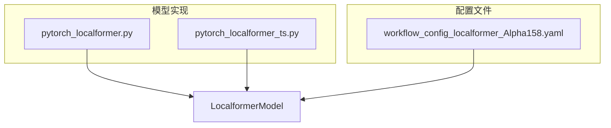
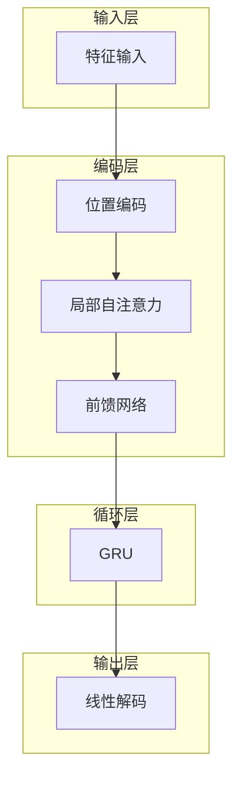
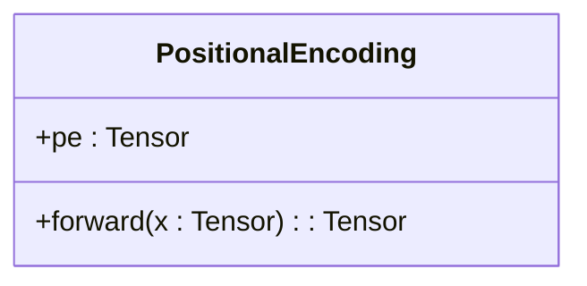
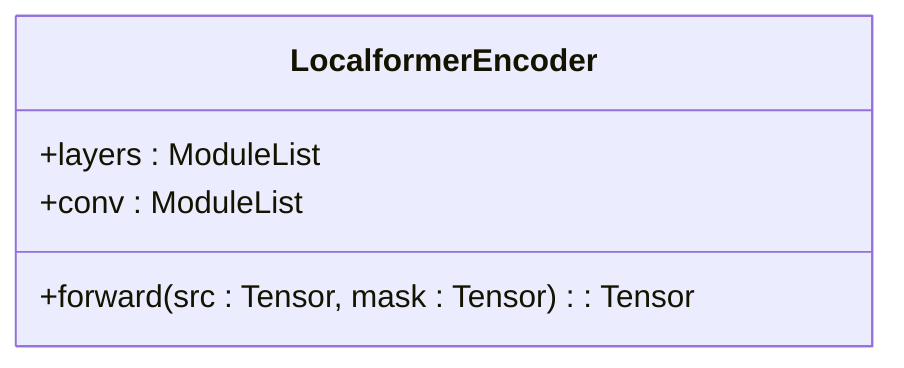
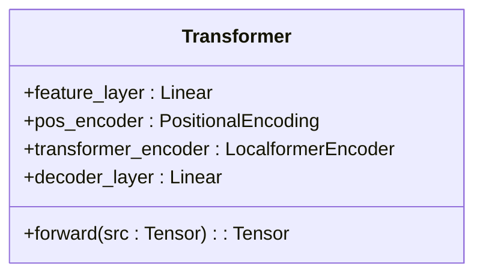
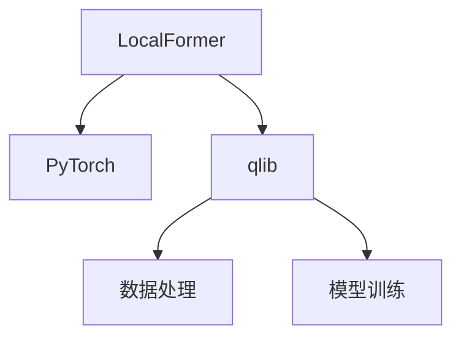

# LocalFormer模型

<cite>
**本文档中引用的文件**   
- [pytorch_localformer.py](file://qlib/contrib/model/pytorch_localformer.py)
- [pytorch_localformer_ts.py](file://qlib/contrib/model/pytorch_localformer_ts.py)
- [workflow_config_localformer_Alpha158.yaml](file://examples/benchmarks/Localformer/workflow_config_localformer_Alpha158.yaml)
</cite>

## 目录
1. [简介](#简介)
2. [项目结构](#项目结构)
3. [核心组件](#核心组件)
4. [架构概述](#架构概述)
5. [详细组件分析](#详细组件分析)
6. [依赖分析](#依赖分析)
7. [性能考虑](#性能考虑)
8. [故障排除指南](#故障排除指南)
9. [结论](#结论)

## 简介
LocalFormer模型是一种专为金融时间序列数据设计的Transformer变体，旨在解决标准Transformer在处理长序列时计算复杂度高的问题。该模型通过引入局部注意力窗口机制，有效降低了计算复杂度，同时保持了对局部市场结构变化的捕捉能力。本文件将深入分析LocalFormer的设计原理、实现细节及其在高频或长周期数据上的适应性。

## 项目结构
LocalFormer模型的实现主要分布在`qlib/contrib/model/`目录下的`pytorch_localformer.py`和`pytorch_localformer_ts.py`文件中。配置文件位于`examples/benchmarks/Localformer/`目录下，如`workflow_config_localformer_Alpha158.yaml`。这些文件共同定义了模型的结构、训练流程和集成方式。

**图示来源**
- [pytorch_localformer.py](file://qlib/contrib/model/pytorch_localformer.py#L28-L242)
- [pytorch_localformer_ts.py](file://qlib/contrib/model/pytorch_localformer_ts.py#L26-L243)
- [workflow_config_localformer_Alpha158.yaml](file://examples/benchmarks/Localformer/workflow_config_localformer_Alpha158.yaml#L1-L88)

## 核心组件
LocalFormer模型的核心组件包括位置编码、局部自注意力层和前馈网络。这些组件共同作用，使得模型能够在保持较低计算复杂度的同时，有效地捕捉时间序列中的局部模式。

**节来源**
- [pytorch_localformer.py](file://qlib/contrib/model/pytorch_localformer.py#L243-L322)
- [pytorch_localformer_ts.py](file://qlib/contrib/model/pytorch_localformer_ts.py#L224-L302)

## 架构概述
LocalFormer模型的架构基于Transformer，但引入了局部注意力窗口机制。这种机制限制了每个时间步只能关注其邻近的时间步，从而显著降低了计算复杂度。此外，模型还结合了GRU层，以增强对时间序列动态的建模能力。

**图示来源**
- [pytorch_localformer.py](file://qlib/contrib/model/pytorch_localformer.py#L286-L322)
- [pytorch_localformer_ts.py](file://qlib/contrib/model/pytorch_localformer_ts.py#L267-L302)

## 详细组件分析
### 位置编码
位置编码用于为输入序列中的每个时间步添加位置信息。LocalFormer使用正弦和余弦函数生成位置编码，确保模型能够区分不同位置的输入。

**图示来源**
- [pytorch_localformer.py](file://qlib/contrib/model/pytorch_localformer.py#L243-L256)
- [pytorch_localformer_ts.py](file://qlib/contrib/model/pytorch_localformer_ts.py#L224-L237)

### 局部自注意力层
局部自注意力层是LocalFormer的核心创新之一。它通过限制注意力范围，减少了计算复杂度。具体来说，每个时间步只关注其前后固定数量的时间步。

**图示来源**
- [pytorch_localformer.py](file://qlib/contrib/model/pytorch_localformer.py#L263-L283)
- [pytorch_localformer_ts.py](file://qlib/contrib/model/pytorch_localformer_ts.py#L244-L264)

### 前馈网络
前馈网络负责对局部自注意力层的输出进行非线性变换，进一步提取特征。

**图示来源**
- [pytorch_localformer.py](file://qlib/contrib/model/pytorch_localformer.py#L286-L322)
- [pytorch_localformer_ts.py](file://qlib/contrib/model/pytorch_localformer_ts.py#L267-L302)

## 依赖分析
LocalFormer模型依赖于PyTorch框架，并利用了`qlib`库中的数据处理和模型训练工具。配置文件定义了模型的超参数和训练流程，确保模型能够正确地集成到整个系统中。

**图示来源**
- [pytorch_localformer.py](file://qlib/contrib/model/pytorch_localformer.py#L16-L23)
- [pytorch_localformer_ts.py](file://qlib/contrib/model/pytorch_localformer_ts.py#L15-L23)
- [workflow_config_localformer_Alpha158.yaml](file://examples/benchmarks/Localformer/workflow_config_localformer_Alpha158.yaml#L1-L88)

## 性能考虑
LocalFormer通过局部注意力窗口机制显著降低了计算复杂度，使其更适合处理长序列金融时间序列数据。然而，这种机制也可能导致模型在捕捉长距离依赖关系方面的能力减弱。因此，在实际应用中需要权衡计算效率和模型性能。

## 故障排除指南
在使用LocalFormer模型时，常见的问题包括数据预处理错误、模型训练不稳定等。建议检查数据是否正确填充、超参数设置是否合理，并确保GPU资源充足。

**节来源**
- [pytorch_localformer.py](file://qlib/contrib/model/pytorch_localformer.py#L158-L215)
- [pytorch_localformer_ts.py](file://qlib/contrib/model/pytorch_localformer_ts.py#L140-L199)

## 结论
LocalFormer模型通过引入局部注意力窗口机制，有效解决了标准Transformer在处理长序列金融时间序列数据时的计算复杂度问题。该模型在捕捉局部市场结构变化方面表现出色，但在处理长距离依赖关系时可能存在局限性。未来的研究可以探索更高效的注意力机制，以进一步提升模型性能。