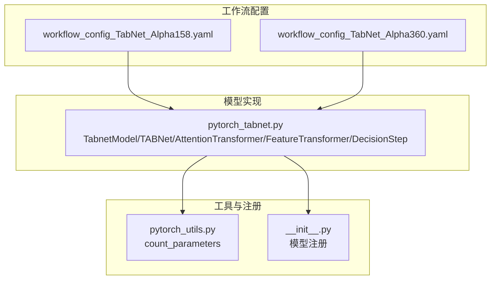
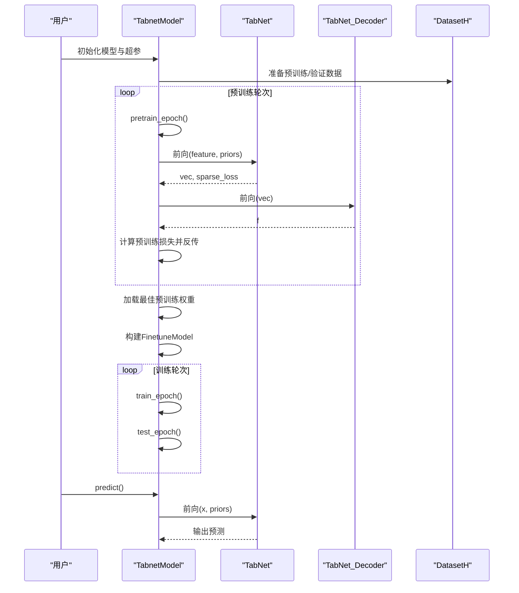
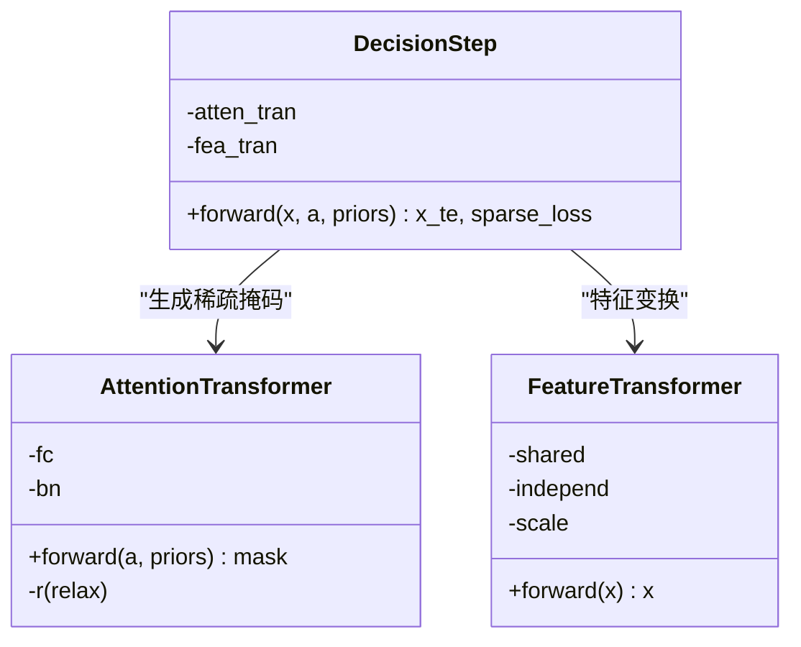
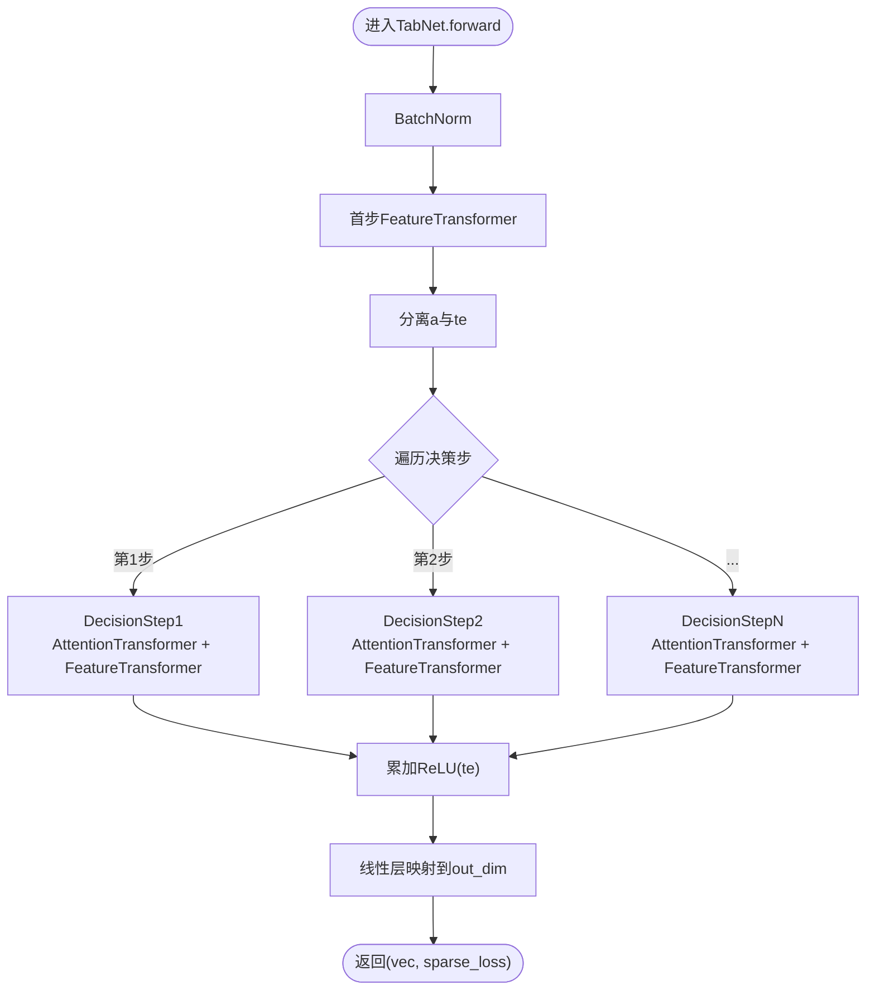
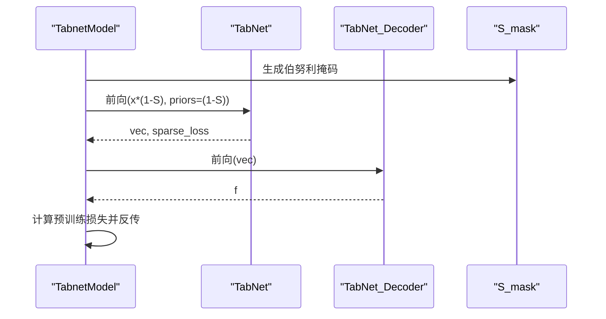
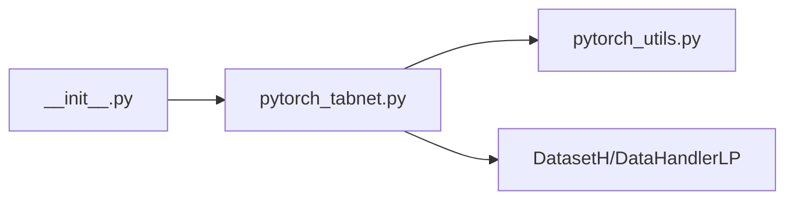

# TabNet模型

<cite>
**本文引用的文件列表**
- [pytorch_tabnet.py](file://qlib/contrib/model/pytorch_tabnet.py)
- [workflow_config_TabNet_Alpha158.yaml](file://examples/benchmarks/TabNet/workflow_config_TabNet_Alpha158.yaml)
- [workflow_config_TabNet_Alpha360.yaml](file://examples/benchmarks/TabNet/workflow_config_TabNet_Alpha360.yaml)
- [pytorch_utils.py](file://qlib/contrib/model/pytorch_utils.py)
- [__init__.py](file://qlib/contrib/model/__init__.py)
</cite>

## 目录
1. [简介](#简介)
2. [项目结构](#项目结构)
3. [核心组件](#核心组件)
4. [架构总览](#架构总览)
5. [详细组件分析](#详细组件分析)
6. [依赖关系分析](#依赖关系分析)
7. [性能与可扩展性](#性能与可扩展性)
8. [故障排查指南](#故障排查指南)
9. [结论](#结论)
10. [附录：配置与调优建议](#附录配置与调优建议)

## 简介
本文件系统性解析Qlib中TabNet模型的实现机制，聚焦其“分步注意力机制（sequential attention）”与“特征选择门控结构（feature selection gating）”。TabNet通过逐层决策步（decision steps）构建稀疏注意力掩码，仅激活对当前预测最有用的因子，从而在金融因子选择任务中实现自动特征筛选、降低过拟合并提升可解释性。本文结合pytorch_tabnet.py源码，深入剖析：
- 决策步（Decision Step）与注意力变换块（Attention Transformer）
- 上下文信号传递路径（从上一步的注意力到下一步的输入）
- 预训练阶段的自监督重建损失与稀疏性约束
- 在Alpha158与Alpha360数据集上的配置示例与关键超参数调优策略
- 训练过程中的特征重要性可视化方法及其在可解释性量化研究中的价值

## 项目结构
与TabNet相关的核心文件位于Qlib贡献模块中，包含模型实现、工作流配置以及工具函数：
- 模型实现：qlib/contrib/model/pytorch_tabnet.py
- 工作流配置（Alpha158/Alpha360）：examples/benchmarks/TabNet/workflow_config_TabNet_Alpha158.yaml、workflow_config_TabNet_Alpha360.yaml
- 参数计数工具：qlib/contrib/model/pytorch_utils.py
- 模型注册入口：qlib/contrib/model/__init__.py

图表来源
- [pytorch_tabnet.py](file://qlib/contrib/model/pytorch_tabnet.py#L1-L120)
- [workflow_config_TabNet_Alpha158.yaml](file://examples/benchmarks/TabNet/workflow_config_TabNet_Alpha158.yaml#L1-L82)
- [workflow_config_TabNet_Alpha360.yaml](file://examples/benchmarks/TabNet/workflow_config_TabNet_Alpha360.yaml#L1-L82)
- [pytorch_utils.py](file://qlib/contrib/model/pytorch_utils.py#L1-L38)
- [__init__.py](file://qlib/contrib/model/__init__.py#L26-L44)

章节来源
- [pytorch_tabnet.py](file://qlib/contrib/model/pytorch_tabnet.py#L1-L120)
- [workflow_config_TabNet_Alpha158.yaml](file://examples/benchmarks/TabNet/workflow_config_TabNet_Alpha158.yaml#L1-L82)
- [workflow_config_TabNet_Alpha360.yaml](file://examples/benchmarks/TabNet/workflow_config_TabNet_Alpha360.yaml#L1-L82)
- [pytorch_utils.py](file://qlib/contrib/model/pytorch_utils.py#L1-L38)
- [__init__.py](file://qlib/contrib/model/__init__.py#L26-L44)

## 核心组件
- TabnetModel：封装训练、预训练、评估、预测流程；管理优化器与损失；支持早停与参数保存。
- TabNet：编码器主体，包含首步特征变换与若干决策步；返回聚合后的表示与稀疏性损失。
- DecisionStep：单步决策单元，包含注意力变换与特征变换两部分。
- AttentionTransformer：基于注意力的特征选择门控，输出稀疏掩码并更新先验。
- FeatureTransformer：共享与独立GLU堆叠，提取特征表示。
- TabNet_Decoder：预训练解码器，用于自监督重构。
- FinetuneModel：微调头部，将编码器输出映射到最终预测维度。

章节来源
- [pytorch_tabnet.py](file://qlib/contrib/model/pytorch_tabnet.py#L25-L120)
- [pytorch_tabnet.py](file://qlib/contrib/model/pytorch_tabnet.py#L436-L596)
- [pytorch_tabnet.py](file://qlib/contrib/model/pytorch_tabnet.py#L528-L596)
- [pytorch_tabnet.py](file://qlib/contrib/model/pytorch_tabnet.py#L550-L579)
- [pytorch_tabnet.py](file://qlib/contrib/model/pytorch_tabnet.py#L410-L434)
- [pytorch_tabnet.py](file://qlib/contrib/model/pytorch_tabnet.py#L385-L397)

## 架构总览
TabNet采用“自监督预训练 + 有监督微调”的两阶段流程：
- 预训练阶段：以随机伯努利掩码遮蔽部分特征，使用解码器重构被遮蔽部分，同时编码器输出稀疏性损失，鼓励因子选择的稀疏性。
- 微调阶段：冻结或继续训练编码器，添加线性头进行回归/分类输出。

图表来源
- [pytorch_tabnet.py](file://qlib/contrib/model/pytorch_tabnet.py#L112-L216)
- [pytorch_tabnet.py](file://qlib/contrib/model/pytorch_tabnet.py#L299-L357)
- [pytorch_tabnet.py](file://qlib/contrib/model/pytorch_tabnet.py#L385-L397)
- [pytorch_tabnet.py](file://qlib/contrib/model/pytorch_tabnet.py#L410-L434)
- [pytorch_tabnet.py](file://qlib/contrib/model/pytorch_tabnet.py#L436-L481)

## 详细组件分析

### 分步注意力机制（Sequential Attention）与特征选择门控
- AttentionTransformer：接收上一步注意力向量a与当前先验priors，经线性+批归一化后，使用自定义Sparsemax函数生成稀疏掩码mask，并按系数relax更新先验，使后续步骤能复用已选特征但受约束。
- DecisionStep：在每一步中先计算mask，再将原始特征与mask相乘，送入FeatureTransformer提取新特征表示；同时累积稀疏性损失，鼓励每次仅激活少量因子。
- 先验更新规则：priors = priors * (relax - mask)，relax越大，越允许重复使用特征，但会增加稀疏性约束强度。

图表来源
- [pytorch_tabnet.py](file://qlib/contrib/model/pytorch_tabnet.py#L528-L548)
- [pytorch_tabnet.py](file://qlib/contrib/model/pytorch_tabnet.py#L581-L596)
- [pytorch_tabnet.py](file://qlib/contrib/model/pytorch_tabnet.py#L550-L579)

章节来源
- [pytorch_tabnet.py](file://qlib/contrib/model/pytorch_tabnet.py#L528-L596)

### 决策步（Decision Steps）、注意力变换块与上下文传递
- 决策步序列：TabNet首步使用FeatureTransformer直接提取特征，随后n_steps-1个DecisionStep依次执行；每步输出包含两部分：用于后续注意力的a（来自FeatureTransformer的第二段），以及用于最终聚合的te（前n_d维）。
- 上下文传递：每步的a作为下一步AttentionTransformer的输入，形成“注意力→特征变换→上下文累积”的链式结构。
- 聚合方式：最终输出为各步te的ReLU加和，再经线性层映射到out_dim。

图表来源
- [pytorch_tabnet.py](file://qlib/contrib/model/pytorch_tabnet.py#L436-L481)

章节来源
- [pytorch_tabnet.py](file://qlib/contrib/model/pytorch_tabnet.py#L436-L481)

### 预训练与稀疏性约束
- 自监督目标：随机伯努利掩码S_mask遮蔽部分特征，编码器以被遮蔽特征为输入，输出vec；解码器对vec进行多步变换后重构被遮蔽特征；损失函数对重构误差进行归一化后求和。
- 稀疏性损失：每步DecisionStep计算(-1)*mask*log(mask+eps)的均值，作为稀疏性正则项，鼓励mask分布接近0或1。
- 先验更新：priors = priors*(relax - mask)，限制重复使用特征，避免过拟合。

图表来源
- [pytorch_tabnet.py](file://qlib/contrib/model/pytorch_tabnet.py#L299-L357)
- [pytorch_tabnet.py](file://qlib/contrib/model/pytorch_tabnet.py#L410-L434)
- [pytorch_tabnet.py](file://qlib/contrib/model/pytorch_tabnet.py#L581-L596)

章节来源
- [pytorch_tabnet.py](file://qlib/contrib/model/pytorch_tabnet.py#L299-L357)
- [pytorch_tabnet.py](file://qlib/contrib/model/pytorch_tabnet.py#L581-L596)

### Alpha158与Alpha360数据集配置
- Alpha158：d_feat=158，使用Alpha158处理器，标签为未来两日相对收益，训练/验证/测试时间窗口按配置划分。
- Alpha360：d_feat=360，使用Alpha360处理器，其余配置一致。
- 关键字段：model.class=TabnetModel，dataset.handler.class=Alpha158/Alpha360，segments定义预训练、验证、训练、验证、测试区间。

章节来源
- [workflow_config_TabNet_Alpha158.yaml](file://examples/benchmarks/TabNet/workflow_config_TabNet_Alpha158.yaml#L46-L82)
- [workflow_config_TabNet_Alpha360.yaml](file://examples/benchmarks/TabNet/workflow_config_TabNet_Alpha360.yaml#L46-L82)

### 训练流程与指标
- 训练：按批次随机打乱索引，前向得到预测与损失，反向传播并裁剪梯度；评估时记录loss与metric（默认loss取负）。
- 早停：基于验证指标最优值更新最佳参数，超过阈值停止。
- 预测：按batch_size分批推理，返回Series结果。

章节来源
- [pytorch_tabnet.py](file://qlib/contrib/model/pytorch_tabnet.py#L151-L216)
- [pytorch_tabnet.py](file://qlib/contrib/model/pytorch_tabnet.py#L245-L298)
- [pytorch_tabnet.py](file://qlib/contrib/model/pytorch_tabnet.py#L217-L244)

## 依赖关系分析
- 模型注册：__init__.py中将TabnetModel加入可加载模型集合，便于工作流直接引用。
- 参数统计：pytorch_utils.count_parameters用于估算模型大小，辅助超参调试与资源规划。
- 数据接口：TabnetModel依赖DatasetH与DataHandlerLP准备训练/验证/测试数据。

图表来源
- [__init__.py](file://qlib/contrib/model/__init__.py#L26-L44)
- [pytorch_tabnet.py](file://qlib/contrib/model/pytorch_tabnet.py#L1-L23)
- [pytorch_utils.py](file://qlib/contrib/model/pytorch_utils.py#L1-L38)

章节来源
- [__init__.py](file://qlib/contrib/model/__init__.py#L26-L44)
- [pytorch_tabnet.py](file://qlib/contrib/model/pytorch_tabnet.py#L1-L23)
- [pytorch_utils.py](file://qlib/contrib/model/pytorch_utils.py#L1-L38)

## 性能与可扩展性
- 批归一化与虚拟批归一化（GBN）：在大批次场景下提升稳定性，减少显存占用。
- 稀疏性正则：通过注意力掩码与稀疏性损失抑制冗余特征，降低过拟合风险。
- 可扩展性：n_steps、n_d、n_a、n_shared、n_ind等超参可调，适配不同因子规模与任务复杂度。
- 计算开销：模型大小可通过count_parameters估算，便于在资源受限环境下调整网络宽度与深度。

章节来源
- [pytorch_tabnet.py](file://qlib/contrib/model/pytorch_tabnet.py#L483-L504)
- [pytorch_tabnet.py](file://qlib/contrib/model/pytorch_tabnet.py#L528-L579)
- [pytorch_tabnet.py](file://qlib/contrib/model/pytorch_tabnet.py#L436-L481)
- [pytorch_utils.py](file://qlib/contrib/model/pytorch_utils.py#L1-L38)

## 故障排查指南
- 空数据报错：若数据为空，fit会抛出异常，需检查数据集配置与时间窗口。
- NaN填充：训练/测试前将NaN置零，确保数值稳定。
- 设备与GPU：自动检测CUDA可用性，否则回退CPU；注意GPU内存与batch_size的平衡。
- 早停触发：验证指标未提升超过阈值时提前停止，避免过拟合。

章节来源
- [pytorch_tabnet.py](file://qlib/contrib/model/pytorch_tabnet.py#L164-L176)
- [pytorch_tabnet.py](file://qlib/contrib/model/pytorch_tabnet.py#L245-L272)
- [pytorch_tabnet.py](file://qlib/contrib/model/pytorch_tabnet.py#L274-L298)

## 结论
Qlib中的TabNet实现完整复刻了原论文的“分步注意力+特征选择门控”思想，通过预训练阶段的自监督重构与稀疏性损失，有效提升了金融因子选择的稀疏性与泛化能力。其模块化设计（AttentionTransformer、FeatureTransformer、DecisionStep、TabNet_Decoder）便于理解与扩展，配合工作流配置即可快速适配Alpha158/Alpha360等数据集。在实践中，合理设置决策步数、注意力维度与松弛系数，有助于在可解释性与性能之间取得平衡。

## 附录：配置与调优建议

### Alpha158配置要点
- d_feat：158
- 处理器：Alpha158
- 标签：未来两日相对收益
- 时间窗口：预训练/验证/训练/验证/测试按配置划分
- 关键超参：n_steps、n_d、n_a、relax、vbs、ps、lr、early_stop

章节来源
- [workflow_config_TabNet_Alpha158.yaml](file://examples/benchmarks/TabNet/workflow_config_TabNet_Alpha158.yaml#L46-L82)

### Alpha360配置要点
- d_feat：360
- 处理器：Alpha360
- 其他与Alpha158一致

章节来源
- [workflow_config_TabNet_Alpha360.yaml](file://examples/benchmarks/TabNet/workflow_config_TabNet_Alpha360.yaml#L46-L82)

### 关键超参数调优策略
- 决策步数（n_steps）：因子数量越多，可适当增大步数以增强分步选择能力；步数过大可能引入噪声，建议从5开始尝试。
- 注意力维度（n_a）与特征维度（n_d）：n_a决定注意力输入维度，n_d决定最终聚合特征维度；通常n_d≈n_a，保证信息充分提取。
- 松弛系数（relax）：relax越大，允许重复使用特征，提高鲁棒性但可能降低稀疏性；建议在1.2~1.5范围内搜索。
- 虚拟批大小（vbs）：在大batch场景下提升稳定性；过小可能导致统计不稳定，过大影响显存。
- 掩码概率（ps）：控制预训练阶段遮蔽比例，过高导致信息不足，过低稀疏性不足；建议0.2~0.4范围。
- 学习率（lr）：预训练与微调可采用不同学习率；微调阶段可略小以稳定收敛。
- 早停（early_stop）：根据验证指标设定，避免过拟合。

章节来源
- [pytorch_tabnet.py](file://qlib/contrib/model/pytorch_tabnet.py#L25-L93)
- [pytorch_tabnet.py](file://qlib/contrib/model/pytorch_tabnet.py#L436-L481)
- [pytorch_tabnet.py](file://qlib/contrib/model/pytorch_tabnet.py#L528-L596)

### 特征重要性可视化与可解释性量化
- 训练过程中的稀疏性损失：每步DecisionStep都会累积稀疏性损失，可用于监控模型选择的稀疏程度。
- 掩码分布可视化：可在推理或评估阶段收集各步mask分布，绘制热力图或柱状图，观察因子选择的动态变化。
- 因子重要性排序：将各步mask的均值或方差作为因子重要性指标，结合业务领域进行解释与筛选。
- 可解释性研究价值：通过比较不同因子组合下的mask分布与模型性能，可量化因子选择的贡献度，支撑因子工程迭代与风控策略制定。

章节来源
- [pytorch_tabnet.py](file://qlib/contrib/model/pytorch_tabnet.py#L581-L596)
- [pytorch_tabnet.py](file://qlib/contrib/model/pytorch_tabnet.py#L299-L357)