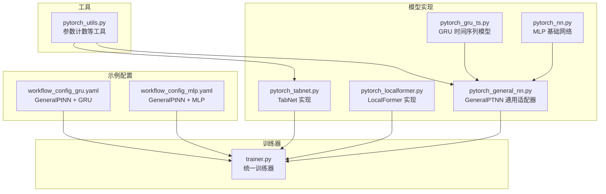
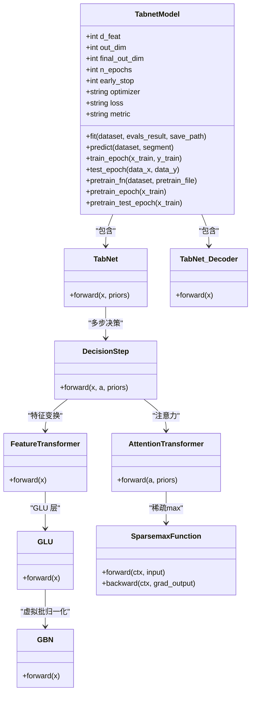
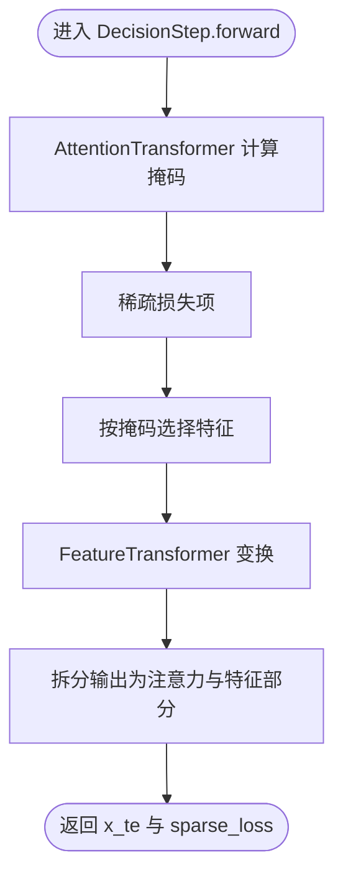
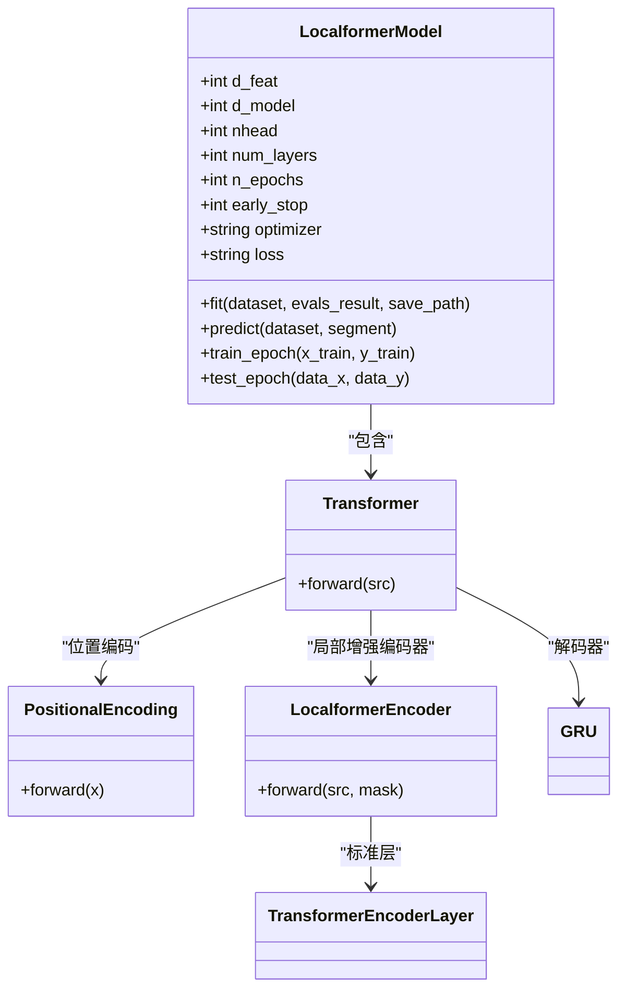
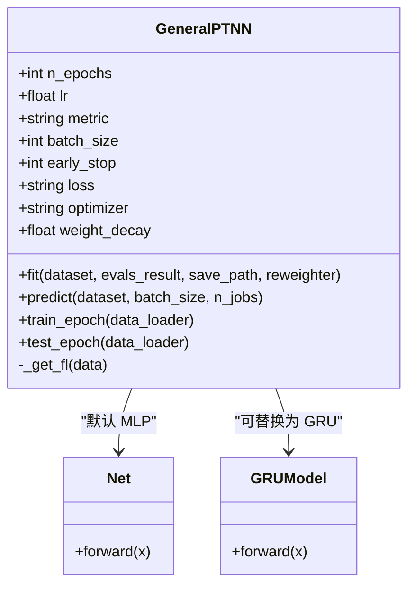
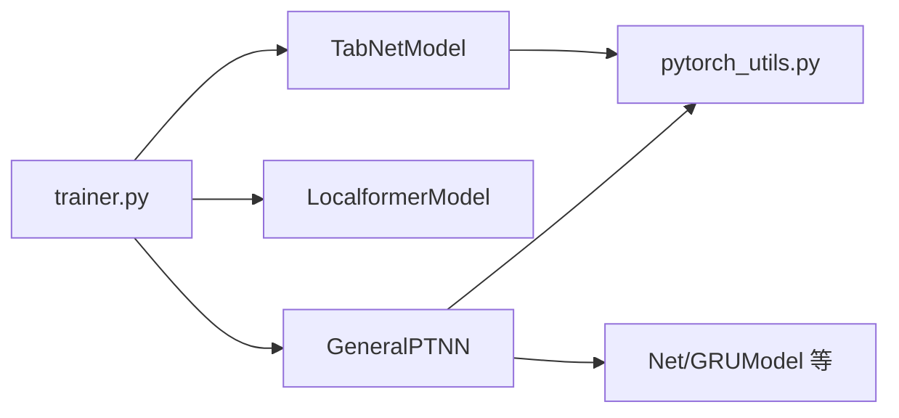

# 专用深度模型

<cite>
**本文引用的文件**
- [pytorch_tabnet.py](file://qlib/contrib/model/pytorch_tabnet.py)
- [pytorch_localformer.py](file://qlib/contrib/model/pytorch_localformer.py)
- [pytorch_general_nn.py](file://qlib/contrib/model/pytorch_general_nn.py)
- [trainer.py](file://qlib/model/trainer.py)
- [pytorch_utils.py](file://qlib/contrib/model/pytorch_utils.py)
- [pytorch_gru_ts.py](file://qlib/contrib/model/pytorch_gru_ts.py)
- [pytorch_nn.py](file://qlib/contrib/model/pytorch_nn.py)
- [workflow_config_gru.yaml](file://examples/benchmarks/GeneralPtNN/workflow_config_gru.yaml)
- [workflow_config_mlp.yaml](file://examples/benchmarks/GeneralPtNN/workflow_config_mlp.yaml)
</cite>

## 目录
1. [简介](#简介)
2. [项目结构](#项目结构)
3. [核心组件](#核心组件)
4. [架构总览](#架构总览)
5. [详细组件分析](#详细组件分析)
6. [依赖关系分析](#依赖关系分析)
7. [性能考量](#性能考量)
8. [故障排查指南](#故障排查指南)
9. [结论](#结论)
10. [附录](#附录)

## 简介
本文件系统化梳理 Qlib 中的专用深度学习模型：TabNet、LocalFormer 以及通用神经网络框架 GeneralPTNN，并结合统一训练器 Trainer 的使用方式，说明如何在 Qlib 工作流中高效训练与评估这些异构模型。重点包括：
- TabNet 的分步注意力机制与特征选择门控结构，解释其在高维金融因子场景下的稀疏性优势；
- LocalFormer 通过局部注意力窗口与卷积增强的长序列处理能力；
- GeneralPTNN 提供的通用神经网络适配器，支持模块化层堆叠、激活函数配置与残差连接；
- Trainer 如何管理不同模型的训练流程，涵盖优化器选择、学习率调度与早停策略；
- 通过 GeneralPtNN 示例展示自定义网络结构的组合方法。

## 项目结构
本节聚焦与文档目标直接相关的文件组织与职责划分：
- 模型实现：pytorch_tabnet.py、pytorch_localformer.py、pytorch_general_nn.py、pytorch_gru_ts.py、pytorch_nn.py
- 训练器：trainer.py
- 工具：pytorch_utils.py
- 示例配置：workflow_config_gru.yaml、workflow_config_mlp.yaml



图表来源
- [pytorch_tabnet.py](file://qlib/contrib/model/pytorch_tabnet.py#L1-L644)
- [pytorch_localformer.py](file://qlib/contrib/model/pytorch_localformer.py#L1-L323)
- [pytorch_general_nn.py](file://qlib/contrib/model/pytorch_general_nn.py#L1-L372)
- [pytorch_gru_ts.py](file://qlib/contrib/model/pytorch_gru_ts.py#L1-L320)
- [pytorch_nn.py](file://qlib/contrib/model/pytorch_nn.py#L1-L463)
- [trainer.py](file://qlib/model/trainer.py#L1-L620)
- [pytorch_utils.py](file://qlib/contrib/model/pytorch_utils.py#L1-L38)
- [workflow_config_gru.yaml](file://examples/benchmarks/GeneralPtNN/workflow_config_gru.yaml#L1-L101)
- [workflow_config_mlp.yaml](file://examples/benchmarks/GeneralPtNN/workflow_config_mlp.yaml#L1-L99)

章节来源
- [pytorch_tabnet.py](file://qlib/contrib/model/pytorch_tabnet.py#L1-L644)
- [pytorch_localformer.py](file://qlib/contrib/model/pytorch_localformer.py#L1-L323)
- [pytorch_general_nn.py](file://qlib/contrib/model/pytorch_general_nn.py#L1-L372)
- [trainer.py](file://qlib/model/trainer.py#L1-L620)
- [pytorch_utils.py](file://qlib/contrib/model/pytorch_utils.py#L1-L38)
- [workflow_config_gru.yaml](file://examples/benchmarks/GeneralPtNN/workflow_config_gru.yaml#L1-L101)
- [workflow_config_mlp.yaml](file://examples/benchmarks/GeneralPtNN/workflow_config_mlp.yaml#L1-L99)

## 核心组件
- TabNetModel：封装 TabNet 编码器、解码器与预训练流程，提供训练、验证、预测与早停逻辑。
- LocalformerModel：基于 Transformer 编码器与 GRU 解码器的时间序列模型，支持局部注意力窗口与卷积增强。
- GeneralPTNN：通用神经网络适配器，通过配置注入任意 PyTorch 模型，统一训练与预测流程。
- Trainer：统一的任务训练入口，负责任务初始化、数据加载、模型拟合与记录生成。

章节来源
- [pytorch_tabnet.py](file://qlib/contrib/model/pytorch_tabnet.py#L25-L244)
- [pytorch_localformer.py](file://qlib/contrib/model/pytorch_localformer.py#L28-L241)
- [pytorch_general_nn.py](file://qlib/contrib/model/pytorch_general_nn.py#L33-L372)
- [trainer.py](file://qlib/model/trainer.py#L1-L120)

## 架构总览
下图展示了 Qlib 统一训练器如何驱动不同模型的训练流程，以及模型内部的关键组件关系。

```mermaid
sequenceDiagram
participant W as "工作流/任务配置"
participant TR as "Trainer"
participant REC as "Recorder"
participant MOD as "模型实例(如 TabNet/LocalFormer/GeneralPTNN)"
participant DS as "DatasetH/TSDatasetH"
participant OPT as "优化器/调度器"
W->>TR : 提交任务(task)
TR->>REC : 记录任务信息
TR->>MOD : 初始化模型实例
TR->>DS : 初始化数据集
TR->>MOD : 调用 fit(dataset, reweighter)
MOD->>OPT : 训练循环(前向/反向/梯度裁剪/优化)
MOD-->>TR : 返回最佳参数与评估结果
TR->>REC : 保存模型与数据集
TR->>REC : 生成记录(预测/回测/分析)
TR-->>W : 返回 Recorder 列表
```

图表来源
- [trainer.py](file://qlib/model/trainer.py#L36-L120)
- [pytorch_tabnet.py](file://qlib/contrib/model/pytorch_tabnet.py#L151-L216)
- [pytorch_localformer.py](file://qlib/contrib/model/pytorch_localformer.py#L158-L212)
- [pytorch_general_nn.py](file://qlib/contrib/model/pytorch_general_nn.py#L235-L333)

## 详细组件分析

### TabNet 分析
TabNet 在高维金融因子场景下通过“分步注意力 + 特征选择门控”实现稀疏性与可解释性。其关键点如下：
- 编码器由多步决策组成，每步输出一个向量表示，并累积到最终特征空间，形成稀疏正则化项。
- 注意力变换器使用自定义的稀疏最大值函数，替代传统 ReLU，得到稀疏掩码，控制特征选择。
- 预训练阶段通过解码器重构被遮蔽的输入，辅助主任务训练。
- 支持虚拟批归一化以提升小批量稳定性。



图表来源
- [pytorch_tabnet.py](file://qlib/contrib/model/pytorch_tabnet.py#L25-L644)



图表来源
- [pytorch_tabnet.py](file://qlib/contrib/model/pytorch_tabnet.py#L581-L600)

- 稀疏性优势：通过注意力掩码与稀疏损失，仅激活对当前步骤重要的特征，减少冗余，提升可解释性与泛化能力。
- 预训练策略：使用随机伯努利掩码遮蔽输入，解码器重构被遮蔽部分，缓解过拟合并稳定收敛。
- 高维因子适用性：虚拟批归一化与 GLU 结合，适合高维稀疏金融特征；分步注意力逐层筛选特征，避免一次性全维度交互导致的噪声放大。

章节来源
- [pytorch_tabnet.py](file://qlib/contrib/model/pytorch_tabnet.py#L25-L244)
- [pytorch_tabnet.py](file://qlib/contrib/model/pytorch_tabnet.py#L385-L644)

### LocalFormer 分析
LocalFormer 面向长序列时间序列建模，通过局部注意力窗口与卷积增强，降低全局注意力的计算复杂度，同时保留时序依赖：
- 输入先经线性映射与位置编码，再进入 Transformer 编码器；
- 编码器采用 LocalformerEncoder，对每个时间步进行局部卷积增强，再叠加标准 TransformerEncoderLayer；
- 使用 GRU 作为解码器，输出最后一个时间步的标量预测。



图表来源
- [pytorch_localformer.py](file://qlib/contrib/model/pytorch_localformer.py#L28-L323)

- 局部注意力窗口：通过沿时间维的卷积对输出进行增强，限制了注意力的跨步范围，显著降低计算开销。
- 长序列处理：结合 GRU 解码器，有效捕获长期依赖，适合金融时间序列的多尺度动态。
- 可扩展性：编码器支持多层堆叠，便于在资源允许的情况下加深模型。

章节来源
- [pytorch_localformer.py](file://qlib/contrib/model/pytorch_localformer.py#L28-L241)
- [pytorch_localformer.py](file://qlib/contrib/model/pytorch_localformer.py#L243-L323)

### 通用神经网络框架 GeneralPTNN 分析
GeneralPTNN 提供统一的训练与预测接口，通过配置注入任意 PyTorch 模型，支持：
- 模块化层堆叠：通过传入模型 URI 与 kwargs，灵活组合网络结构；
- 激活函数配置：支持多种激活函数与批归一化；
- 残差连接：可在自定义网络中自由添加；
- 数据加载与权重重采样：支持 DataLoader 与重加权；
- 学习率调度：内置 ReduceLROnPlateau；
- 早停与最佳参数保存：基于验证指标自动选择最优模型。



图表来源
- [pytorch_general_nn.py](file://qlib/contrib/model/pytorch_general_nn.py#L33-L372)
- [pytorch_nn.py](file://qlib/contrib/model/pytorch_nn.py#L425-L463)
- [pytorch_gru_ts.py](file://qlib/contrib/model/pytorch_gru_ts.py#L302-L320)

- 自定义网络组合：通过 workflow 配置中的 pt_model_uri 与 pt_model_kwargs 注入自定义网络，例如 GRU 或 MLP；
- 适配器模式：GeneralPTNN 不关心具体网络细节，只负责训练循环、评估与保存，便于快速试验不同结构。

章节来源
- [pytorch_general_nn.py](file://qlib/contrib/model/pytorch_general_nn.py#L33-L372)
- [pytorch_nn.py](file://qlib/contrib/model/pytorch_nn.py#L425-L463)
- [pytorch_gru_ts.py](file://qlib/contrib/model/pytorch_gru_ts.py#L302-L320)
- [workflow_config_gru.yaml](file://examples/benchmarks/GeneralPtNN/workflow_config_gru.yaml#L54-L72)
- [workflow_config_mlp.yaml](file://examples/benchmarks/GeneralPtNN/workflow_config_mlp.yaml#L59-L72)

## 依赖关系分析
- 模型到训练器：各模型均实现 fit/predict 接口，Trainer 通过统一入口调用；
- 优化器与调度器：模型内部根据配置选择 Adam/SGD，并可结合 ReduceLROnPlateau；
- 数据接口：模型统一从 DatasetH/TSDatasetH 准备数据，支持重加权与填充策略；
- 参数统计：使用 pytorch_utils.count_parameters 统计模型大小，便于资源规划。



图表来源
- [trainer.py](file://qlib/model/trainer.py#L36-L120)
- [pytorch_tabnet.py](file://qlib/contrib/model/pytorch_tabnet.py#L25-L244)
- [pytorch_localformer.py](file://qlib/contrib/model/pytorch_localformer.py#L28-L241)
- [pytorch_general_nn.py](file://qlib/contrib/model/pytorch_general_nn.py#L33-L146)
- [pytorch_utils.py](file://qlib/contrib/model/pytorch_utils.py#L1-L38)

章节来源
- [trainer.py](file://qlib/model/trainer.py#L1-L200)
- [pytorch_general_nn.py](file://qlib/contrib/model/pytorch_general_nn.py#L130-L200)
- [pytorch_tabnet.py](file://qlib/contrib/model/pytorch_tabnet.py#L89-L106)

## 性能考量
- 计算复杂度
  - TabNet：每步注意力计算与稀疏损失引入额外开销，但通过稀疏掩码显著减少无效特征参与，整体在高维稀疏场景更高效。
  - LocalFormer：局部卷积与受限注意力窗口降低全局注意力复杂度，适合长序列。
- 内存与显存
  - 通用适配器支持 DataLoader 并行加载与可选数据并行(DataParallel)，便于在有限资源下扩展。
  - 模型大小可通过参数计数工具评估，指导超参与硬件选择。
- 训练稳定性
  - 虚拟批归一化与梯度裁剪有助于小批量训练的稳定性。
  - 学习率调度与早停机制防止过拟合，提高泛化。

章节来源
- [pytorch_tabnet.py](file://qlib/contrib/model/pytorch_tabnet.py#L483-L504)
- [pytorch_general_nn.py](file://qlib/contrib/model/pytorch_general_nn.py#L140-L146)
- [pytorch_utils.py](file://qlib/contrib/model/pytorch_utils.py#L1-L38)

## 故障排查指南
- 训练不收敛或震荡
  - 检查学习率是否过高，适当降低或启用学习率调度；
  - 确认数据预处理与缺失值填充策略一致。
- 显存不足
  - 降低 batch_size 或使用更小的模型规模；
  - 启用数据并行(DataParallel)或减少 num_workers。
- 早停过早触发
  - 调整 early_stop 参数，或检查验证指标是否合理；
  - 对于 LocalFormer，确认序列长度与窗口设置是否合适。
- 预训练失败
  - 检查预训练文件路径与权限；
  - 确认预训练损失函数与掩码概率设置。

章节来源
- [pytorch_tabnet.py](file://qlib/contrib/model/pytorch_tabnet.py#L112-L150)
- [pytorch_general_nn.py](file://qlib/contrib/model/pytorch_general_nn.py#L285-L333)
- [pytorch_localformer.py](file://qlib/contrib/model/pytorch_localformer.py#L158-L212)

## 结论
- TabNet 通过分步注意力与稀疏损失，在高维金融因子场景下实现特征选择与可解释性；
- LocalFormer 以局部注意力与卷积增强兼顾长序列建模效率与效果；
- GeneralPTNN 将任意 PyTorch 模型纳入统一训练框架，便于快速实验与部署；
- Trainer 提供一致的训练生命周期管理，结合优化器、调度器与早停机制，保障训练质量与效率。

## 附录
- 自定义网络组合示例
  - GRU + GeneralPtNN：通过 workflow 配置注入 GRUModel，设置 d_feat、hidden_size、num_layers 等超参。
  - MLP + GeneralPtNN：通过 workflow 配置注入 Net，设置 input_dim 与 layers 等超参。
- 训练器使用要点
  - 任务配置中 model/dataset/record 字段需正确指向对应类与模块路径；
  - 训练过程会自动保存模型与数据集，便于后续推理与回测。

章节来源
- [workflow_config_gru.yaml](file://examples/benchmarks/GeneralPtNN/workflow_config_gru.yaml#L54-L101)
- [workflow_config_mlp.yaml](file://examples/benchmarks/GeneralPtNN/workflow_config_mlp.yaml#L59-L99)
- [trainer.py](file://qlib/model/trainer.py#L36-L120)