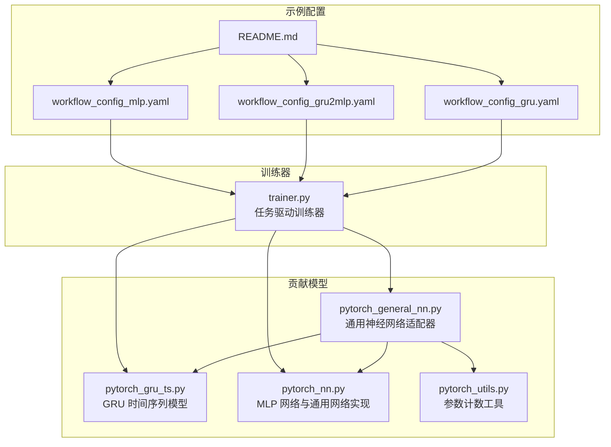
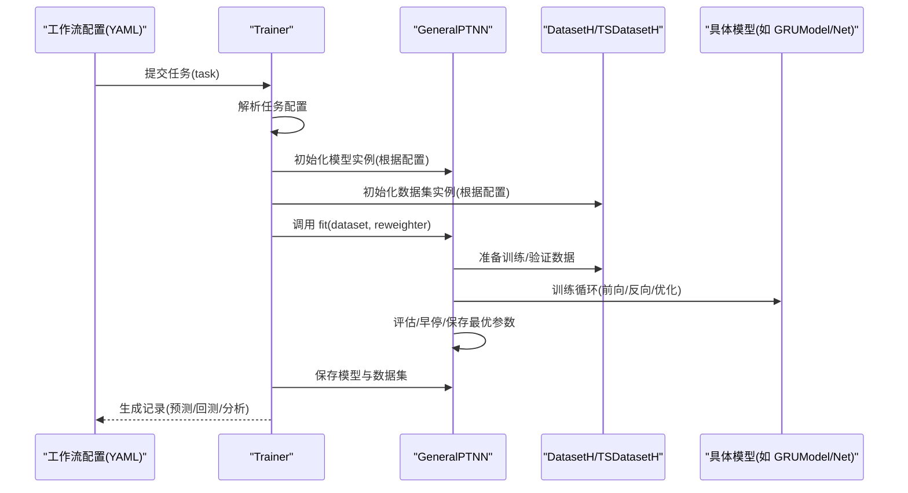
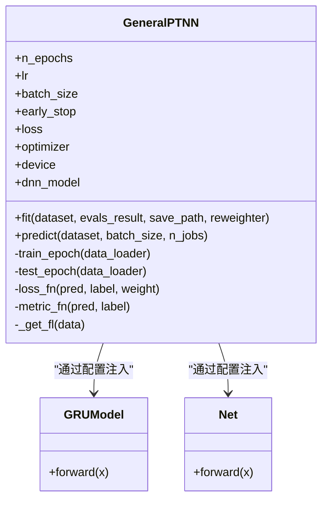
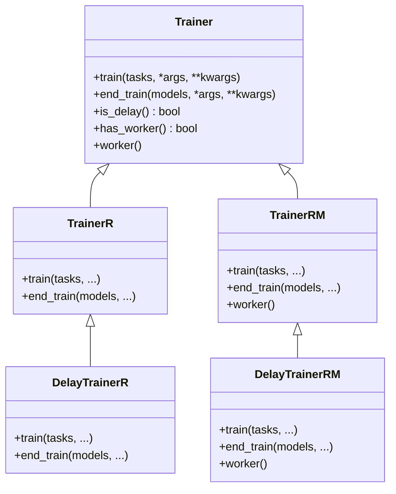
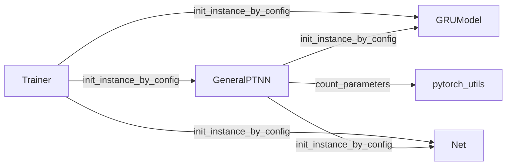

# 通用神经网络框架

<cite>
**本文引用的文件列表**
- [pytorch_general_nn.py](file://qlib/contrib/model/pytorch_general_nn.py)
- [trainer.py](file://qlib/model/trainer.py)
- [pytorch_gru_ts.py](file://qlib/contrib/model/pytorch_gru_ts.py)
- [pytorch_nn.py](file://qlib/contrib/model/pytorch_nn.py)
- [pytorch_utils.py](file://qlib/contrib/model/pytorch_utils.py)
- [workflow_config_gru.yaml](file://examples/benchmarks/GeneralPtNN/workflow_config_gru.yaml)
- [workflow_config_gru2mlp.yaml](file://examples/benchmarks/GeneralPtNN/workflow_config_gru2mlp.yaml)
- [workflow_config_mlp.yaml](file://examples/benchmarks/GeneralPtNN/workflow_config_mlp.yaml)
- [README.md](file://examples/benchmarks/GeneralPtNN/README.md)
</cite>

## 目录
1. [简介](#简介)
2. [项目结构](#项目结构)
3. [核心组件](#核心组件)
4. [架构总览](#架构总览)
5. [详细组件分析](#详细组件分析)
6. [依赖关系分析](#依赖关系分析)
7. [性能与正则化特性](#性能与正则化特性)
8. [故障排查指南](#故障排查指南)
9. [结论](#结论)
10. [附录：最佳实践与示例](#附录最佳实践与示例)

## 简介
本文件围绕 Qlib 的通用神经网络框架（pytorch_general_nn.py）进行深入解析，阐述其作为多种自定义模型基础类的设计理念，并结合 trainer.py 展示统一训练器如何通过配置驱动的方式管理不同网络结构的训练流程。文档重点覆盖：
- 模块化层堆叠机制与可插拔网络结构
- 支持的激活函数与残差连接配置
- Dropout 正则化策略
- 训练器对优化器（AdamW、SGD）、学习率调度（ReduceLROnPlateau）与早停机制的统一管理
- GeneralPtNN 示例中 GRU、MLP 等组件的组合方法与复合模型（如 GRU+MLP）的构建实践

## 项目结构
通用神经网络框架位于 Qlib 贡献模型目录下，配合统一训练器与示例工作流配置共同构成端到端的训练与推理管线。

图表来源
- [pytorch_general_nn.py](file://qlib/contrib/model/pytorch_general_nn.py#L1-L120)
- [pytorch_gru_ts.py](file://qlib/contrib/model/pytorch_gru_ts.py#L1-L120)
- [pytorch_nn.py](file://qlib/contrib/model/pytorch_nn.py#L1-L120)
- [pytorch_utils.py](file://qlib/contrib/model/pytorch_utils.py#L1-L38)
- [trainer.py](file://qlib/model/trainer.py#L1-L120)
- [workflow_config_gru.yaml](file://examples/benchmarks/GeneralPtNN/workflow_config_gru.yaml#L1-L101)
- [workflow_config_gru2mlp.yaml](file://examples/benchmarks/GeneralPtNN/workflow_config_gru2mlp.yaml#L1-L94)
- [workflow_config_mlp.yaml](file://examples/benchmarks/GeneralPtNN/workflow_config_mlp.yaml#L1-L99)
- [README.md](file://examples/benchmarks/GeneralPtNN/README.md#L1-L20)

章节来源
- [pytorch_general_nn.py](file://qlib/contrib/model/pytorch_general_nn.py#L1-L120)
- [trainer.py](file://qlib/model/trainer.py#L1-L120)
- [workflow_config_gru.yaml](file://examples/benchmarks/GeneralPtNN/workflow_config_gru.yaml#L1-L101)
- [workflow_config_gru2mlp.yaml](file://examples/benchmarks/GeneralPtNN/workflow_config_gru2mlp.yaml#L1-L94)
- [workflow_config_mlp.yaml](file://examples/benchmarks/GeneralPtNN/workflow_config_mlp.yaml#L1-L99)
- [README.md](file://examples/benchmarks/GeneralPtNN/README.md#L1-L20)

## 核心组件
- 通用神经网络适配器 GeneralPTNN
  - 通过配置注入任意 PyTorch 模型（如 GRUModel、pytorch_nn.Net），统一训练与预测流程
  - 内置损失函数、评估指标、优化器与学习率调度、早停逻辑
- 统一训练器 Trainer
  - 基于任务字典的任务驱动训练，支持线性与延迟训练模式，便于并行扩展
- 可插拔网络实现
  - GRU 时间序列模型（pytorch_gru_ts.py）
  - MLP 网络（pytorch_nn.py），包含模块化层堆叠与激活函数选择

章节来源
- [pytorch_general_nn.py](file://qlib/contrib/model/pytorch_general_nn.py#L33-L146)
- [trainer.py](file://qlib/model/trainer.py#L131-L207)
- [pytorch_gru_ts.py](file://qlib/contrib/model/pytorch_gru_ts.py#L26-L136)
- [pytorch_nn.py](file://qlib/contrib/model/pytorch_nn.py#L38-L184)

## 架构总览
通用神经网络框架采用“配置驱动 + 适配器 + 统一训练器”的分层设计：
- 配置驱动：在任务配置中指定模型类、数据集类、超参与网络结构参数
- 适配器：GeneralPTNN 将任意 PyTorch 模型包装为 Qlib Model 接口，统一 fit/predict 流程
- 训练器：Trainer 将任务配置转换为实际训练过程，支持延迟训练与并行执行

图表来源
- [trainer.py](file://qlib/model/trainer.py#L42-L72)
- [pytorch_general_nn.py](file://qlib/contrib/model/pytorch_general_nn.py#L235-L333)
- [workflow_config_gru.yaml](file://examples/benchmarks/GeneralPtNN/workflow_config_gru.yaml#L54-L101)
- [workflow_config_gru2mlp.yaml](file://examples/benchmarks/GeneralPtNN/workflow_config_gru2mlp.yaml#L54-L94)
- [workflow_config_mlp.yaml](file://examples/benchmarks/GeneralPtNN/workflow_config_mlp.yaml#L59-L99)

## 详细组件分析

### 通用神经网络适配器 GeneralPTNN
- 设计理念
  - 以“配置驱动”为核心，通过 pt_model_uri 和 pt_model_kwargs 注入任意 PyTorch 模型，实现“一次适配，多模型可用”
  - 统一训练/验证/预测接口，屏蔽时间序列与表格数据差异
- 关键能力
  - 数据预处理：自动区分时间序列与表格数据，提取特征与标签
  - 训练循环：封装前向、反向、梯度裁剪、优化器步进
  - 评估与早停：基于 ReduceLROnPlateau 的学习率调度与基于验证集指标的早停
  - 参数计数：使用工具函数统计模型参数量，辅助资源规划
- 优化器与学习率
  - 支持 Adam/SGD；默认使用 ReduceLROnPlateau 进行学习率调度
- 早停机制
  - 基于验证集指标（默认 loss）进行早停，保存最优参数

图表来源
- [pytorch_general_nn.py](file://qlib/contrib/model/pytorch_general_nn.py#L33-L146)
- [pytorch_gru_ts.py](file://qlib/contrib/model/pytorch_gru_ts.py#L302-L320)
- [pytorch_nn.py](file://qlib/contrib/model/pytorch_nn.py#L425-L463)

章节来源
- [pytorch_general_nn.py](file://qlib/contrib/model/pytorch_general_nn.py#L33-L146)
- [pytorch_general_nn.py](file://qlib/contrib/model/pytorch_general_nn.py#L147-L215)
- [pytorch_general_nn.py](file://qlib/contrib/model/pytorch_general_nn.py#L216-L333)
- [pytorch_utils.py](file://qlib/contrib/model/pytorch_utils.py#L1-L38)

### 统一训练器 Trainer
- 任务驱动训练
  - 通过任务字典初始化模型与数据集，调用模型 fit 并保存结果
  - 支持 Recorder 记录训练过程与产出
- 延迟训练
  - DelayTrainerR/DelayTrainerRM 将准备阶段与训练阶段分离，便于跨机器/进程并行
- 并行与分布式
  - TrainerRM/TrainerR 支持子进程与多进程训练，TaskManager 协助任务编排

图表来源
- [trainer.py](file://qlib/model/trainer.py#L131-L207)
- [trainer.py](file://qlib/model/trainer.py#L209-L339)
- [trainer.py](file://qlib/model/trainer.py#L341-L465)
- [trainer.py](file://qlib/model/trainer.py#L491-L620)

章节来源
- [trainer.py](file://qlib/model/trainer.py#L42-L72)
- [trainer.py](file://qlib/model/trainer.py#L209-L339)
- [trainer.py](file://qlib/model/trainer.py#L341-L465)
- [trainer.py](file://qlib/model/trainer.py#L491-L620)

### GRU 时间序列模型
- 结构要点
  - GRUModel 使用 GRU 层 + 全连接输出层，支持 dropout
  - GRU 包装器负责数据加载、训练/验证循环、早停与参数保存
- 适用场景
  - 时间序列建模，支持 TSDatasetH

章节来源
- [pytorch_gru_ts.py](file://qlib/contrib/model/pytorch_gru_ts.py#L26-L136)
- [pytorch_gru_ts.py](file://qlib/contrib/model/pytorch_gru_ts.py#L141-L200)
- [pytorch_gru_ts.py](file://qlib/contrib/model/pytorch_gru_ts.py#L200-L300)
- [pytorch_gru_ts.py](file://qlib/contrib/model/pytorch_gru_ts.py#L302-L320)

### MLP 网络与模块化层堆叠
- 结构要点
  - Net 通过 ModuleList 实现模块化层堆叠，支持 LeakyReLU/SiLU 等激活函数
  - 默认包含输入 Dropout、BatchNorm、全连接层与输出层
- 适用场景
  - 表格数据建模，支持 DatasetH

章节来源
- [pytorch_nn.py](file://qlib/contrib/model/pytorch_nn.py#L425-L463)
- [pytorch_nn.py](file://qlib/contrib/model/pytorch_nn.py#L1-L120)

## 依赖关系分析
- 适配器与模型
  - GeneralPTNN 通过配置注入任意 PyTorch 模型（如 GRUModel、Net），并在训练时统一调用 forward
- 工具函数
  - count_parameters 用于统计模型参数量，辅助资源规划与模型比较
- 训练器与任务
  - Trainer 将任务字典解析为模型与数据集实例，统一 fit 流程并保存模型与数据集

图表来源
- [pytorch_general_nn.py](file://qlib/contrib/model/pytorch_general_nn.py#L90-L120)
- [pytorch_general_nn.py](file://qlib/contrib/model/pytorch_general_nn.py#L126-L146)
- [pytorch_utils.py](file://qlib/contrib/model/pytorch_utils.py#L1-L38)
- [trainer.py](file://qlib/model/trainer.py#L42-L72)

章节来源
- [pytorch_general_nn.py](file://qlib/contrib/model/pytorch_general_nn.py#L90-L120)
- [pytorch_general_nn.py](file://qlib/contrib/model/pytorch_general_nn.py#L126-L146)
- [pytorch_utils.py](file://qlib/contrib/model/pytorch_utils.py#L1-L38)
- [trainer.py](file://qlib/model/trainer.py#L42-L72)

## 性能与正则化特性
- 模块化层堆叠机制
  - MLP 中通过 ModuleList 顺序装配层，便于灵活增减层数与通道数
- 激活函数
  - MLP 支持 LeakyReLU、SiLU 等常见激活函数；GRUModel 使用默认激活（由 GRU 决定）
- 残差连接
  - 当前 GRUModel 未显式实现残差连接；如需可在 GRUModel.forward 中添加跳跃连接
- Dropout 正则化
  - MLP 默认在输入与层间加入 Dropout；可通过 pt_model_kwargs 调整
  - GRUModel 支持 num_layers 与 dropout 参数；可通过 pt_model_kwargs 调整
- 梯度裁剪
  - 通用适配器在训练中使用梯度裁剪，有助于稳定训练
- 学习率调度
  - 通用适配器默认使用 ReduceLROnPlateau；MLP 包装器支持更丰富的调度器配置

章节来源
- [pytorch_nn.py](file://qlib/contrib/model/pytorch_nn.py#L425-L463)
- [pytorch_gru_ts.py](file://qlib/contrib/model/pytorch_gru_ts.py#L302-L320)
- [pytorch_general_nn.py](file://qlib/contrib/model/pytorch_general_nn.py#L202-L215)

## 故障排查指南
- 训练数据为空
  - fit 前会检查训练/验证数据是否为空，若为空会抛出异常
- 重采样器类型不支持
  - reweighter 必须为 Reweighter 类型，否则抛出异常
- 优化器不支持
  - 仅支持 Adam/SGD；其他名称会抛出异常
- GPU 不可用或设备 ID 错误
  - 自动降级为 CPU；请确认 GPU 是否可用与 ID 是否正确
- 早停触发
  - 若验证集指标未改善超过 early_stop 轮次，训练提前结束并加载最优参数

章节来源
- [pytorch_general_nn.py](file://qlib/contrib/model/pytorch_general_nn.py#L248-L259)
- [pytorch_general_nn.py](file://qlib/contrib/model/pytorch_general_nn.py#L251-L259)
- [pytorch_general_nn.py](file://qlib/contrib/model/pytorch_general_nn.py#L133-L139)
- [pytorch_general_nn.py](file://qlib/contrib/model/pytorch_general_nn.py#L314-L333)

## 结论
通用神经网络框架通过“配置驱动 + 适配器 + 统一训练器”的设计，实现了对多种 PyTorch 模型的一致化接入与训练管理。其模块化层堆叠、可选激活函数、Dropout 正则化与早停机制，使得 GRU、MLP 等组件能够灵活组合，满足时间序列与表格数据的建模需求。结合 Trainer 的延迟训练与并行能力，可在复杂实验中高效组织与扩展。

## 附录：最佳实践与示例

### 通用神经网络适配器（GeneralPTNN）使用要点
- 通过 pt_model_uri 与 pt_model_kwargs 注入任意 PyTorch 模型
- 选择优化器（Adam/SGD）、损失函数（当前支持 MSE）、学习率调度（默认 ReduceLROnPlateau）与早停策略
- 支持时间序列与表格数据，自动区分特征与标签维度

章节来源
- [pytorch_general_nn.py](file://qlib/contrib/model/pytorch_general_nn.py#L33-L146)
- [pytorch_general_nn.py](file://qlib/contrib/model/pytorch_general_nn.py#L147-L215)
- [pytorch_general_nn.py](file://qlib/contrib/model/pytorch_general_nn.py#L216-L333)

### 训练器（Trainer）配置驱动流程
- 在任务字典中指定 model/dataset/class/module_path/kwargs
- Trainer 自动初始化模型与数据集，调用 fit 并保存模型与数据集
- 支持延迟训练与并行执行，便于跨机器/进程扩展

章节来源
- [trainer.py](file://qlib/model/trainer.py#L42-L72)
- [trainer.py](file://qlib/model/trainer.py#L209-L339)
- [trainer.py](file://qlib/model/trainer.py#L341-L465)

### GRU+MLP 复合模型构建建议
- 方案一：将 MLP 作为 GRU 的后处理头
  - GRUModel 输出序列最后一个时刻的隐藏状态，再接 MLP 层（Net）完成回归
  - 优点：保留时间依赖信息，同时利用非线性映射
- 方案二：将 GRU 与 MLP 并行拼接
  - 同时输入时间序列与静态特征，分别经 GRU 与 MLP，最后融合（如拼接+全连接）
  - 优点：充分利用多源信息，适合高维特征场景
- 注意事项
  - 调整 dropout 与 batch_size 以平衡过拟合与收敛速度
  - 如需残差连接，可在 GRUModel 或 Net 中扩展

章节来源
- [pytorch_gru_ts.py](file://qlib/contrib/model/pytorch_gru_ts.py#L302-L320)
- [pytorch_nn.py](file://qlib/contrib/model/pytorch_nn.py#L425-L463)

### 示例工作流配置解读
- GRU 时间序列配置
  - 指定 GeneralPTNN 与 GRUModel，设置 d_feat、hidden_size、num_layers、dropout 等
  - 使用 TSDatasetH，配置时间窗口 step_len
- GRU 转 MLP 配置
  - 将 pt_model_uri 切换为 Net，数据集切换为 DatasetH
  - 仅需调整网络结构与数据集类型
- MLP 配置
  - 指定 Net 的 input_dim 与 layers，使用 DatasetH
  - 可配置 optimizer、weight_decay、batch_size 等

章节来源
- [workflow_config_gru.yaml](file://examples/benchmarks/GeneralPtNN/workflow_config_gru.yaml#L54-L101)
- [workflow_config_gru2mlp.yaml](file://examples/benchmarks/GeneralPtNN/workflow_config_gru2mlp.yaml#L54-L94)
- [workflow_config_mlp.yaml](file://examples/benchmarks/GeneralPtNN/workflow_config_mlp.yaml#L59-L99)
- [README.md](file://examples/benchmarks/GeneralPtNN/README.md#L1-L20)