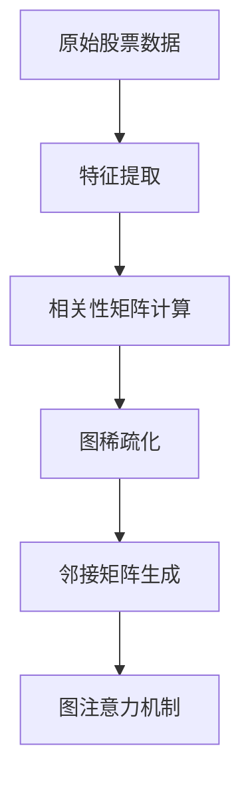
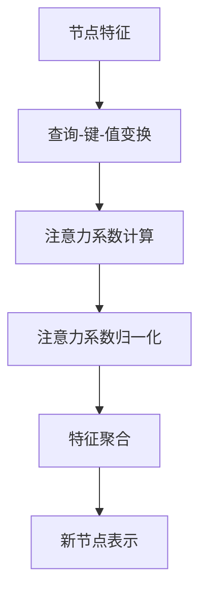
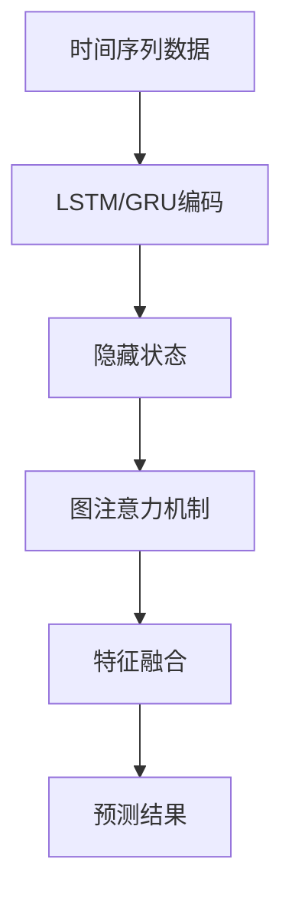
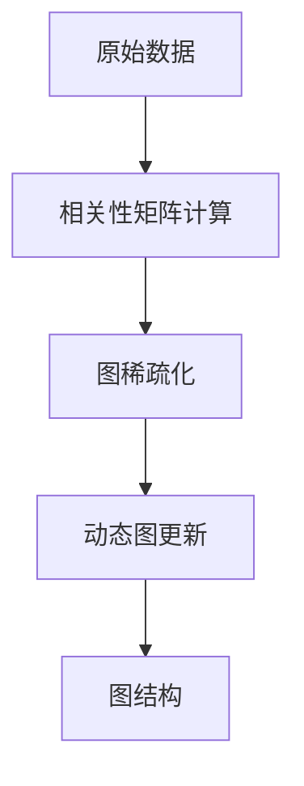

# 图神经网络模型

<cite>
**本文档中引用的文件**  
- [pytorch_gats.py](file://qlib/contrib/model/pytorch_gats.py)
- [pytorch_gats_ts.py](file://qlib/contrib/model/pytorch_gats_ts.py)
- [workflow_config_gats_Alpha158.yaml](file://examples/benchmarks/GATs/workflow_config_gats_Alpha158.yaml)
- [pytorch_lstm.py](file://qlib/contrib/model/pytorch_lstm.py)
- [pytorch_gru.py](file://qlib/contrib/model/pytorch_gru.py)
- [pytorch_utils.py](file://qlib/contrib/model/pytorch_utils.py)
- [handler.py](file://qlib/contrib/data/handler.py)
- [dataset.py](file://qlib/data/dataset/__init__.py)
</cite>

## 目录
1. [引言](#引言)
2. [图结构构建与动态生成](#图结构构建与动态生成)
3. [多头图注意力机制计算流程](#多头图注意力机制计算流程)
4. [时序与图神经网络的融合](#时序与图神经网络的融合)
5. [图结构超参数配置](#图结构超参数配置)
6. [图结构数据预处理指南](#图结构数据预处理指南)
7. [图神经网络在量化投资中的应用场景](#图神经网络在量化投资中的应用场景)
8. [结论](#结论)

## 引言

Qlib中的图注意力网络（GATs）模型是一种结合了图神经网络与时序处理的先进量化投资模型。该模型通过构建股票之间的相关性图结构，利用图注意力机制捕捉跨股票的依赖关系，并结合LSTM或GRU等时序模型提取时间维度上的特征，从而实现对股票收益的精准预测。本文档将深入解析Qlib中GATs模型的实现细节，包括图结构的构建、多头注意力机制的计算流程、时序与图神经网络的融合方法、超参数配置以及数据预处理策略。

**Section sources**
- [pytorch_gats.py](file://qlib/contrib/model/pytorch_gats.py#L1-L385)
- [pytorch_gats_ts.py](file://qlib/contrib/model/pytorch_gats_ts.py#L1-L394)

## 图结构构建与动态生成

在Qlib的GATs模型中，图结构的构建是基于股票之间的相关性。每只股票被视为图中的一个节点，而股票之间的相关性则作为边的权重。具体来说，模型首先通过Alpha158特征集提取每只股票的特征向量，然后计算这些特征向量之间的相似度或相关性，形成一个相关性矩阵。这个相关性矩阵经过稀疏化处理后，生成最终的邻接矩阵，用于图注意力机制的计算。

图结构的动态生成策略体现在模型训练过程中，通过每日的交易数据更新相关性矩阵，从而动态调整图结构。这种动态更新机制能够捕捉市场结构的变化，提高模型的适应性和预测准确性。

**Diagram sources**
- [pytorch_gats.py](file://qlib/contrib/model/pytorch_gats.py#L359-L372)
- [pytorch_gats_ts.py](file://qlib/contrib/model/pytorch_gats_ts.py#L371-L384)

**Section sources**
- [pytorch_gats.py](file://qlib/contrib/model/pytorch_gats.py#L359-L385)
- [pytorch_gats_ts.py](file://qlib/contrib/model/pytorch_gats_ts.py#L371-L394)

## 多头图注意力机制计算流程

多头图注意力机制是GATs模型的核心组件，其计算流程包括查询-键-值变换、注意力系数归一化与特征聚合操作。具体步骤如下：

1. **查询-键-值变换**：通过线性变换将节点特征映射到查询（Query）、键（Key）和值（Value）空间。
2. **注意力系数计算**：计算每对节点之间的注意力系数，公式为 $e_{ij} = \text{LeakyReLU}(a^T [Wh_i \| Wh_j])$，其中 $a$ 是可学习的参数向量，$W$ 是变换矩阵，$\|$ 表示拼接操作。
3. **注意力系数归一化**：使用softmax函数对注意力系数进行归一化，得到注意力权重 $\alpha_{ij} = \text{softmax}(e_{ij})$。
4. **特征聚合**：根据注意力权重对邻居节点的特征进行加权求和，得到新的节点表示 $h_i' = \sigma(\sum_{j \in \mathcal{N}(i)} \alpha_{ij} W h_j)$，其中 $\sigma$ 是激活函数。

**Diagram sources**
- [pytorch_gats.py](file://qlib/contrib/model/pytorch_gats.py#L359-L385)
- [pytorch_gats_ts.py](file://qlib/contrib/model/pytorch_gats_ts.py#L371-L394)

**Section sources**
- [pytorch_gats.py](file://qlib/contrib/model/pytorch_gats.py#L359-L385)
- [pytorch_gats_ts.py](file://qlib/contrib/model/pytorch_gats_ts.py#L371-L394)

## 时序与图神经网络的融合

`pytorch_gats_ts.py` 文件中的模型实现了图神经网络与时序处理的结合，通过跨股票与跨时间的联合建模，进一步提升了预测性能。具体实现方式如下：

1. **时序特征提取**：使用LSTM或GRU模型对每只股票的时间序列特征进行编码，提取时间维度上的隐藏状态。
2. **图注意力机制**：将LSTM或GRU提取的隐藏状态作为图注意力机制的输入，计算股票之间的注意力权重。
3. **特征融合**：将图注意力机制输出的特征与原始时序特征进行融合，生成最终的预测结果。

这种融合方法不仅能够捕捉股票之间的相关性，还能有效利用时间序列信息，实现更全面的市场建模。

**Diagram sources**
- [pytorch_gats_ts.py](file://qlib/contrib/model/pytorch_gats_ts.py#L338-L394)

**Section sources**
- [pytorch_gats_ts.py](file://qlib/contrib/model/pytorch_gats_ts.py#L338-L394)

## 图结构超参数配置

`workflow_config_gats_Alpha158.yaml` 配置文件中定义了图结构相关的超参数，包括邻居采样数、注意力头数和图更新频率等。这些超参数的设置对模型性能有重要影响：

- **d_feat**: 输入特征维度，设置为20。
- **hidden_size**: 隐藏层大小，设置为64。
- **num_layers**: LSTM/GRU层数，设置为2。
- **dropout**: Dropout比率，设置为0.7。
- **n_epochs**: 训练轮数，设置为200。
- **lr**: 学习率，设置为1e-4。
- **early_stop**: 早停轮数，设置为10。
- **base_model**: 基础模型，设置为LSTM。
- **model_path**: 预训练模型路径，设置为"benchmarks/LSTM/csi300_lstm_ts.pkl"。

这些超参数的选择基于实验验证，能够在保证模型复杂度的同时，避免过拟合问题。

**Section sources**
- [workflow_config_gats_Alpha158.yaml](file://examples/benchmarks/GATs/workflow_config_gats_Alpha158.yaml#L53-L69)

## 图结构数据预处理指南

图结构数据的预处理是确保模型性能的关键步骤，主要包括相关性矩阵计算、图稀疏化技巧和动态图更新机制：

1. **相关性矩阵计算**：使用Pearson相关系数或其他相似度度量方法计算股票之间的相关性。
2. **图稀疏化**：通过阈值过滤或Top-K选择方法，保留最强的相关性连接，减少噪声干扰。
3. **动态图更新**：定期（如每日）重新计算相关性矩阵，更新图结构，以适应市场变化。

**Diagram sources**
- [pytorch_gats.py](file://qlib/contrib/model/pytorch_gats.py#L359-L372)
- [pytorch_gats_ts.py](file://qlib/contrib/model/pytorch_gats_ts.py#L371-L384)

**Section sources**
- [pytorch_gats.py](file://qlib/contrib/model/pytorch_gats.py#L359-L385)
- [pytorch_gats_ts.py](file://qlib/contrib/model/pytorch_gats_ts.py#L371-L394)

## 图神经网络在量化投资中的应用场景

图神经网络在量化投资中有多种典型应用场景，包括：

1. **板块效应建模**：通过构建行业或概念板块内的股票相关性图，捕捉板块内部的联动效应。
2. **产业链传导分析**：分析上下游企业之间的相关性，揭示产业链中的传导机制。
3. **市场情绪传播**：研究市场情绪在不同股票之间的传播路径，预测市场整体走势。

这些应用能够帮助投资者更好地理解市场结构，制定更有效的投资策略。

**Section sources**
- [pytorch_gats.py](file://qlib/contrib/model/pytorch_gats.py#L359-L385)
- [pytorch_gats_ts.py](file://qlib/contrib/model/pytorch_gats_ts.py#L371-L394)

## 结论

Qlib中的GATs模型通过结合图神经网络与时序处理，实现了对股票市场的全面建模。本文详细解析了图结构的构建方式、多头图注意力机制的计算流程、时序与图神经网络的融合方法、超参数配置以及数据预处理策略。这些技术细节为理解和应用GATs模型提供了坚实的基础，有助于提升量化投资的预测准确性和策略效果。