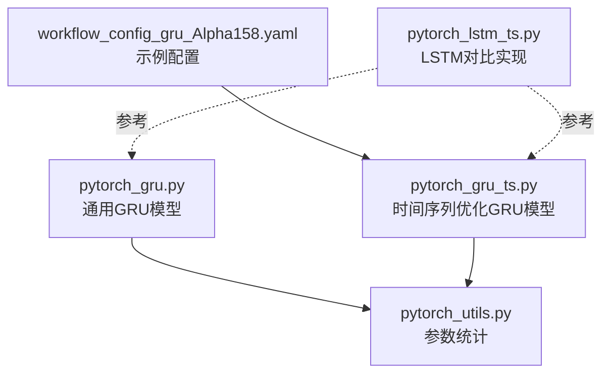
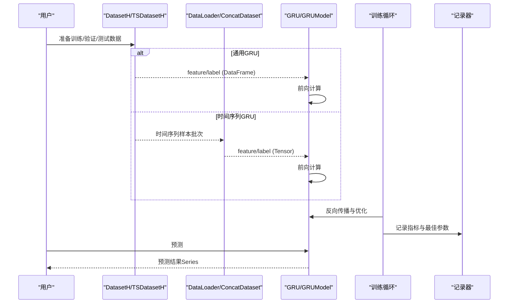
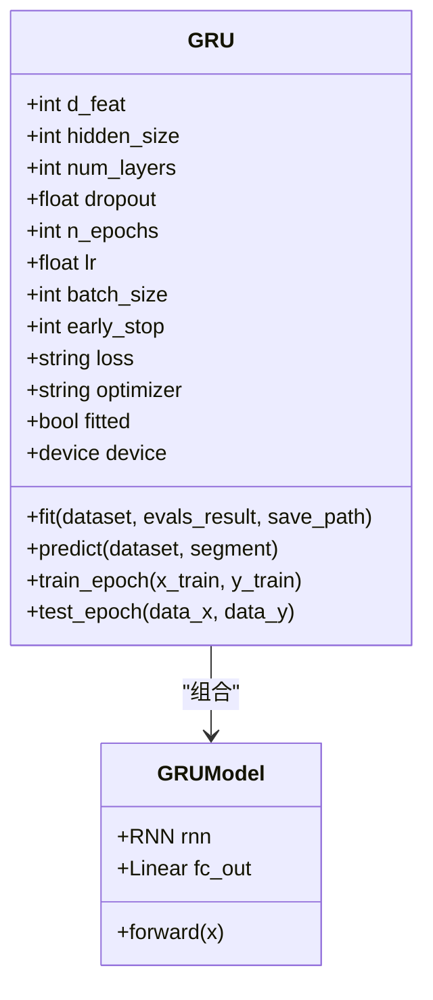
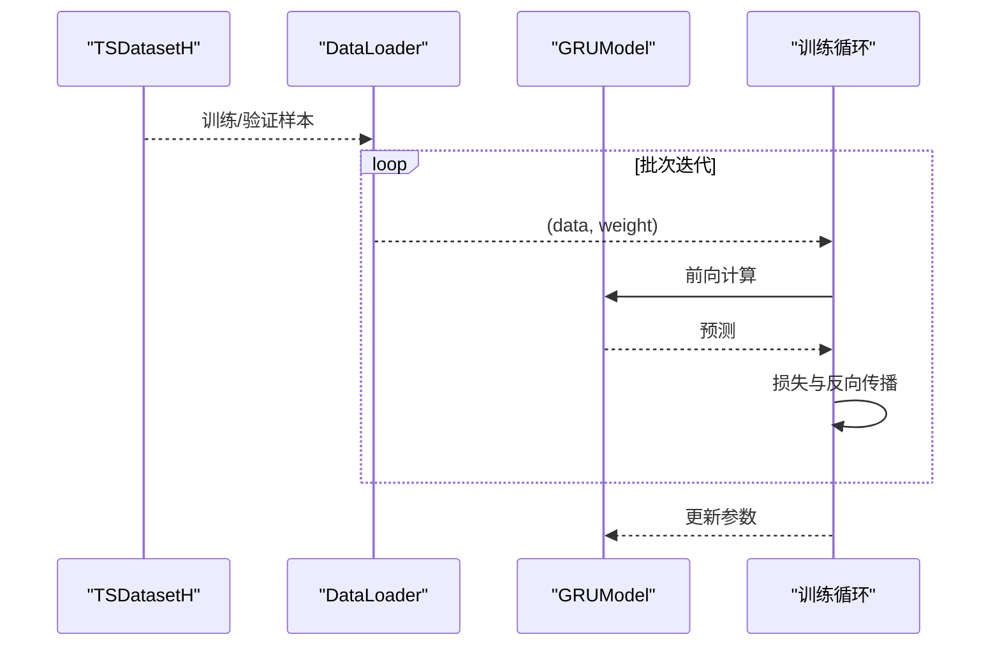
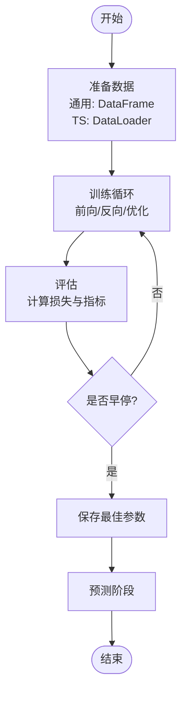
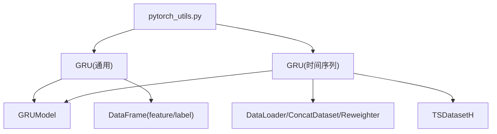

# GRU模型

<cite>
**本文引用的文件列表**
- [pytorch_gru.py](file://qlib/contrib/model/pytorch_gru.py)
- [pytorch_gru_ts.py](file://qlib/contrib/model/pytorch_gru_ts.py)
- [pytorch_utils.py](file://qlib/contrib/model/pytorch_utils.py)
- [workflow_config_gru_Alpha158.yaml](file://examples/benchmarks/GRU/workflow_config_gru_Alpha158.yaml)
- [pytorch_lstm_ts.py](file://qlib/contrib/model/pytorch_lstm_ts.py)
- [pytorch_gru_ts.py](file://qlib/contrib/model/pytorch_gru_ts.py)
- [pytorch_gru.py](file://qlib/contrib/model/pytorch_gru.py)
</cite>

## 目录
1. [简介](#简介)
2. [项目结构](#项目结构)
3. [核心组件](#核心组件)
4. [架构总览](#架构总览)
5. [详细组件分析](#详细组件分析)
6. [依赖关系分析](#依赖关系分析)
7. [性能考量](#性能考量)
8. [故障排查指南](#故障排查指南)
9. [结论](#结论)
10. [附录](#附录)

## 简介
本文件系统性地文档化 Qlib 中基于 PyTorch 的 GRU 模型实现，覆盖通用 GRU（pytorch_gru.py）与面向时间序列优化的 GRU 版本（pytorch_gru_ts.py）。重点说明：
- GRU 的门控机制（更新门与重置门）在代码中的实现方式与多层堆叠时的隐藏状态传递逻辑；
- 模型如何适配 Qlib 的时序数据流，特别是与数据处理器配合进行特征序列化输入的处理流程；
- 结合 workflow_config_gru_Alpha158.yaml 配置文件，解释超参数（隐藏单元数、层数、序列长度、dropout 率等）的设置方法及其对训练效果的影响；
- 提供从数据输入到输出预测的完整调用链路说明；
- 对比 GRU 与 LSTM 在性能与收敛速度上的典型差异；
- 针对训练过程中可能出现的梯度消失问题，给出 Qlib 推荐的优化策略（如使用 ReLU 激活函数、调整初始化方法、引入梯度裁剪等）。

## 项目结构
本次文档聚焦于以下文件：
- 通用 GRU 实现：qlib/contrib/model/pytorch_gru.py
- 时间序列优化 GRU 实现：qlib/contrib/model/pytorch_gru_ts.py
- 参数统计工具：qlib/contrib/model/pytorch_utils.py
- 示例配置：examples/benchmarks/GRU/workflow_config_gru_Alpha158.yaml
- 对比参考：qlib/contrib/model/pytorch_lstm_ts.py（用于 GRU vs LSTM 差异对比）

图表来源
- [pytorch_gru.py](file://qlib/contrib/model/pytorch_gru.py#L1-L340)
- [pytorch_gru_ts.py](file://qlib/contrib/model/pytorch_gru_ts.py#L1-L320)
- [pytorch_utils.py](file://qlib/contrib/model/pytorch_utils.py#L1-L38)
- [workflow_config_gru_Alpha158.yaml](file://examples/benchmarks/GRU/workflow_config_gru_Alpha158.yaml#L1-L98)
- [pytorch_lstm_ts.py](file://qlib/contrib/model/pytorch_lstm_ts.py#L1-L200)

章节来源
- [pytorch_gru.py](file://qlib/contrib/model/pytorch_gru.py#L1-L340)
- [pytorch_gru_ts.py](file://qlib/contrib/model/pytorch_gru_ts.py#L1-L320)
- [pytorch_utils.py](file://qlib/contrib/model/pytorch_utils.py#L1-L38)
- [workflow_config_gru_Alpha158.yaml](file://examples/benchmarks/GRU/workflow_config_gru_Alpha158.yaml#L1-L98)
- [pytorch_lstm_ts.py](file://qlib/contrib/model/pytorch_lstm_ts.py#L1-L200)

## 核心组件
- 通用 GRU 模型（pytorch_gru.py）
  - GRU 类：封装训练、验证、早停、保存、预测等流程；内部持有 GRUModel 子模块。
  - GRUModel 类：基于 nn.GRU 的前向网络，支持多层堆叠与 dropout；输入维度 d_feat、隐藏维度 hidden_size、层数 num_layers、dropout。
  - 数据接口：通过 DatasetH.prepare 获取“feature”和“label”，按批训练与评估。
- 时间序列优化 GRU 模型（pytorch_gru_ts.py）
  - GRU 类：面向 TSDatasetH 的 DataLoader 训练流程，支持权重采样、并行加载、填充 NaN 等。
  - GRUModel 类：与通用版本一致，但输入张量形状直接为 [N, T, F]，无需手动 reshape。
  - 数据接口：使用 DataLoader + ConcatDataset + Reweighter，支持 n_jobs 并行加载。

章节来源
- [pytorch_gru.py](file://qlib/contrib/model/pytorch_gru.py#L25-L120)
- [pytorch_gru.py](file://qlib/contrib/model/pytorch_gru.py#L319-L340)
- [pytorch_gru_ts.py](file://qlib/contrib/model/pytorch_gru_ts.py#L26-L136)
- [pytorch_gru_ts.py](file://qlib/contrib/model/pytorch_gru_ts.py#L302-L320)

## 架构总览
下图展示 GRU 模型在 Qlib 中的整体调用链路，包括数据准备、模型训练与预测阶段。

图表来源
- [pytorch_gru.py](file://qlib/contrib/model/pytorch_gru.py#L209-L317)
- [pytorch_gru_ts.py](file://qlib/contrib/model/pytorch_gru_ts.py#L200-L300)

## 详细组件分析

### 通用 GRU 组件分析（pytorch_gru.py）
- 超参数与初始化
  - 关键超参：d_feat、hidden_size、num_layers、dropout、n_epochs、lr、batch_size、early_stop、loss、optimizer、GPU、seed。
  - 设备选择：自动检测 CUDA 并选择 GPU 或 CPU。
  - 初始化：可选固定随机种子。
- 模型结构
  - GRUModel 使用 nn.GRU，batch_first=True，num_layers 多层堆叠，dropout 控制丢弃率。
  - 前向传播：将输入从 [N, F*T] 重塑为 [N, F, T]，再转置为 [N, T, F]，调用 rnn 后取最后一时刻的隐藏状态，经全连接层映射到标量输出。
- 训练与评估
  - 训练：按 batch_size 切分索引，随机打乱，前向、反向、梯度裁剪、优化器步进。
  - 评估：计算损失与指标（默认以负损失作为指标），支持早停。
  - 保存：记录最佳参数并持久化。
- 预测
  - 使用 DataHandlerLP.DK_I 段准备测试集，按批推理，返回带索引的 Series。

图表来源
- [pytorch_gru.py](file://qlib/contrib/model/pytorch_gru.py#L25-L120)
- [pytorch_gru.py](file://qlib/contrib/model/pytorch_gru.py#L319-L340)

章节来源
- [pytorch_gru.py](file://qlib/contrib/model/pytorch_gru.py#L25-L120)
- [pytorch_gru.py](file://qlib/contrib/model/pytorch_gru.py#L121-L208)
- [pytorch_gru.py](file://qlib/contrib/model/pytorch_gru.py#L209-L317)
- [pytorch_gru.py](file://qlib/contrib/model/pytorch_gru.py#L319-L340)

### 时间序列优化 GRU 组件分析（pytorch_gru_ts.py）
- 超参数与初始化
  - 与通用版本一致，额外支持 n_jobs（DataLoader 并行）、device 显式指定。
  - 支持权重 reweighter，便于样本加权训练。
- 模型结构
  - GRUModel 与通用版本一致，但输入张量形状为 [N, T, F]，无需手动 reshape。
- 训练与评估
  - 使用 DataLoader + ConcatDataset + Reweighter 构建训练/验证集，支持并行加载与填充 NaN。
  - 指标与早停逻辑同通用版本。
- 预测
  - 使用 DataHandlerLP.DK_I 段准备测试集，按批推理，返回带索引的 Series。

图表来源
- [pytorch_gru_ts.py](file://qlib/contrib/model/pytorch_gru_ts.py#L164-L199)
- [pytorch_gru_ts.py](file://qlib/contrib/model/pytorch_gru_ts.py#L200-L300)

章节来源
- [pytorch_gru_ts.py](file://qlib/contrib/model/pytorch_gru_ts.py#L26-L136)
- [pytorch_gru_ts.py](file://qlib/contrib/model/pytorch_gru_ts.py#L137-L208)
- [pytorch_gru_ts.py](file://qlib/contrib/model/pytorch_gru_ts.py#L200-L300)
- [pytorch_gru_ts.py](file://qlib/contrib/model/pytorch_gru_ts.py#L302-L320)

### 门控机制与多层隐藏状态传递
- 门控机制
  - 代码层面通过 nn.GRU 实现，未显式拆解更新门与重置门的内部计算细节；PyTorch 的 GRU 内核已内置门控逻辑。
- 多层堆叠与隐藏状态
  - num_layers>1 时，GRUModel 的 rnn 层会堆叠多层；默认不返回中间层隐藏状态，仅返回最后一层的隐藏状态与最终输出。
  - 由于 batch_first=True，隐藏状态维度为 [N, T, H]，其中 H 为 hidden_size；取 out[:, -1, :] 即得到最后一个时间步的隐藏表示。

章节来源
- [pytorch_gru.py](file://qlib/contrib/model/pytorch_gru.py#L319-L340)
- [pytorch_gru_ts.py](file://qlib/contrib/model/pytorch_gru_ts.py#L302-L320)

### 适配 Qlib 时序数据流与特征序列化
- 通用 GRU
  - 通过 DatasetH.prepare 获取 DataFrame 形式的 feature 与 label，内部将 feature 从 [N, F*T] 重塑为 [N, F, T] 并转置为 [N, T, F]，再送入 GRU。
- 时间序列 GRU
  - 通过 TSDatasetH + DataLoader 直接产出 [N, T, F] 的张量，无需手动 reshape；同时支持 fillna_type、权重 reweighter 等增强。
- 数据处理器配合
  - 配置文件中定义了特征过滤、归一化、缺失值处理、标签标准化等处理器，确保输入特征稳定且无 NaN。

章节来源
- [pytorch_gru.py](file://qlib/contrib/model/pytorch_gru.py#L319-L340)
- [pytorch_gru_ts.py](file://qlib/contrib/model/pytorch_gru_ts.py#L200-L237)
- [workflow_config_gru_Alpha158.yaml](file://examples/benchmarks/GRU/workflow_config_gru_Alpha158.yaml#L1-L98)

### 超参数设置与影响（结合 workflow_config_gru_Alpha158.yaml）
- 关键超参
  - d_feat: 特征维度（来自配置文件中的特征集合数量）。
  - hidden_size: 隐藏单元数（影响模型容量与拟合能力）。
  - num_layers: GRU 层数（增加深度，提升表达能力，也可能增加过拟合风险）。
  - dropout: 层间或节点丢弃率（正则化，缓解过拟合）。
  - n_epochs/lr/early_stop/batch_size/GPU/n_jobs：训练稳定性与效率相关。
- 设置方法
  - 通过 workflow_config_gru_Alpha158.yaml 的 model.kwargs 进行配置。
- 对训练效果的影响
  - hidden_size 与 num_layers 增大通常提升拟合能力，但也可能带来更慢的收敛与更高的过拟合风险。
  - dropout 有助于泛化，但过大可能导致欠拟合。
  - batch_size、学习率与早停共同决定训练稳定性与收敛速度。

章节来源
- [workflow_config_gru_Alpha158.yaml](file://examples/benchmarks/GRU/workflow_config_gru_Alpha158.yaml#L54-L70)
- [pytorch_gru.py](file://qlib/contrib/model/pytorch_gru.py#L61-L107)
- [pytorch_gru_ts.py](file://qlib/contrib/model/pytorch_gru_ts.py#L63-L111)

### 从输入到输出的完整调用链路
- 通用 GRU
  - fit: 准备 train/valid 数据 -> 训练循环（train_epoch）-> 评估（test_epoch）-> 早停与最佳参数保存 -> 记录指标。
  - predict: 准备 test 数据 -> 按批推理 -> 返回 Series。
- 时间序列 GRU
  - fit: 准备 train/valid DataLoader -> 训练循环（train_epoch）-> 评估（test_epoch）-> 早停与最佳参数保存 -> 记录指标。
  - predict: 准备 test DataLoader -> 按批推理 -> 返回 Series。

图表来源
- [pytorch_gru.py](file://qlib/contrib/model/pytorch_gru.py#L209-L317)
- [pytorch_gru_ts.py](file://qlib/contrib/model/pytorch_gru_ts.py#L200-L300)

## 依赖关系分析
- 组件耦合
  - GRU 类与 GRUModel 强内聚，前者负责训练/评估/保存/预测流程，后者负责网络结构。
  - 通用与时间序列版本共享相似的训练框架，但在数据接口上存在差异（DataFrame vs DataLoader）。
- 外部依赖
  - PyTorch nn.GRU、optim、DataLoader、ConcatDataset、Reweighter 等。
  - Qlib 的 DatasetH、TSDatasetH、DataHandlerLP、记录器 R 等。

图表来源
- [pytorch_gru.py](file://qlib/contrib/model/pytorch_gru.py#L25-L120)
- [pytorch_gru_ts.py](file://qlib/contrib/model/pytorch_gru_ts.py#L26-L136)
- [pytorch_utils.py](file://qlib/contrib/model/pytorch_utils.py#L1-L38)

章节来源
- [pytorch_gru.py](file://qlib/contrib/model/pytorch_gru.py#L25-L120)
- [pytorch_gru_ts.py](file://qlib/contrib/model/pytorch_gru_ts.py#L26-L136)
- [pytorch_utils.py](file://qlib/contrib/model/pytorch_utils.py#L1-L38)

## 性能考量
- 计算复杂度
  - GRU 的时间复杂度与序列长度 T、特征维度 F、隐藏维度 H、层数 L 成正比；batch_size 决定并行度。
- 收敛与稳定性
  - 通用 GRU 与时间序列 GRU 均采用梯度裁剪（clip_grad_value）以缓解梯度爆炸；时间序列版本还支持权重 reweighter 与并行加载。
- 超参建议
  - hidden_size 与 num_layers 需结合数据规模与任务复杂度调优；dropout 适度（如 0.0~0.3）有助于泛化。
  - batch_size 与学习率需协同调整；早停阈值（early_stop）避免过拟合。
- 与 LSTM 的对比
  - LSTM 具有更复杂的门控结构（遗忘门、输入门、输出门），理论上对长期依赖建模更强，但计算开销更大；GRU 结构更简洁，训练更快，收敛更稳定，适合大规模时序建模场景。

章节来源
- [pytorch_lstm_ts.py](file://qlib/contrib/model/pytorch_lstm_ts.py#L113-L156)
- [pytorch_gru.py](file://qlib/contrib/model/pytorch_gru.py#L170-L179)
- [pytorch_gru_ts.py](file://qlib/contrib/model/pytorch_gru_ts.py#L170-L178)

## 故障排查指南
- 训练不收敛或震荡
  - 检查学习率是否过高；尝试降低 lr 或使用更稳定的优化器。
  - 检查 batch_size 是否过大导致内存不足或梯度不稳定。
  - 确认数据中是否存在大量 NaN，必要时启用 fillna_type 或预处理。
- 梯度消失/爆炸
  - 通用与时间序列版本均使用梯度裁剪；若仍异常，可减小 hidden_size、num_layers，或增大 dropout。
  - 确保权重 reweighter 正确配置（时间序列版本）。
- GPU 内存不足
  - 降低 batch_size 或 hidden_size；关闭不必要的日志与记录器；确保及时释放缓存。
- 数据为空
  - 检查数据集 segments 配置与时间范围；确认 DataHandlerLP 的列集合包含 feature 与 label。

章节来源
- [pytorch_gru.py](file://qlib/contrib/model/pytorch_gru.py#L227-L240)
- [pytorch_gru_ts.py](file://qlib/contrib/model/pytorch_gru_ts.py#L207-L214)
- [pytorch_gru.py](file://qlib/contrib/model/pytorch_gru.py#L170-L179)
- [pytorch_gru_ts.py](file://qlib/contrib/model/pytorch_gru_ts.py#L170-L178)

## 结论
- 通用 GRU（pytorch_gru.py）适用于标准 DataFrame 输入，适合快速原型与中小规模数据；时间序列 GRU（pytorch_gru_ts.py）针对 TSDatasetH 的 DataLoader 流程进行了优化，具备更好的并行与扩展能力。
- 两者均基于 nn.GRU，隐藏状态在多层堆叠时逐层传递，最后一时刻输出用于回归预测。
- 通过 workflow_config_gru_Alpha158.yaml 可灵活配置超参数；结合梯度裁剪、dropout、早停与合适的 batch_size/lr，可在保证稳定性的同时获得良好性能。
- 与 LSTM 相比，GRU 结构更简洁、训练更快、收敛更稳，适合大规模金融时序建模任务。

## 附录
- 参数统计工具：count_parameters 可用于估算模型参数量与内存占用，辅助超参调优与资源规划。
- 示例配置要点：d_feat、hidden_size、num_layers、dropout、n_epochs、lr、early_stop、batch_size、n_jobs、GPU 等均可在 workflow_config_gru_Alpha158.yaml 中统一配置。

章节来源
- [pytorch_utils.py](file://qlib/contrib/model/pytorch_utils.py#L1-L38)
- [workflow_config_gru_Alpha158.yaml](file://examples/benchmarks/GRU/workflow_config_gru_Alpha158.yaml#L54-L70)