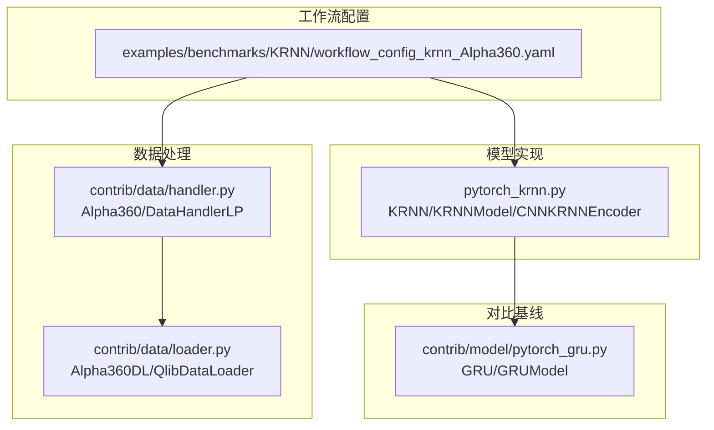
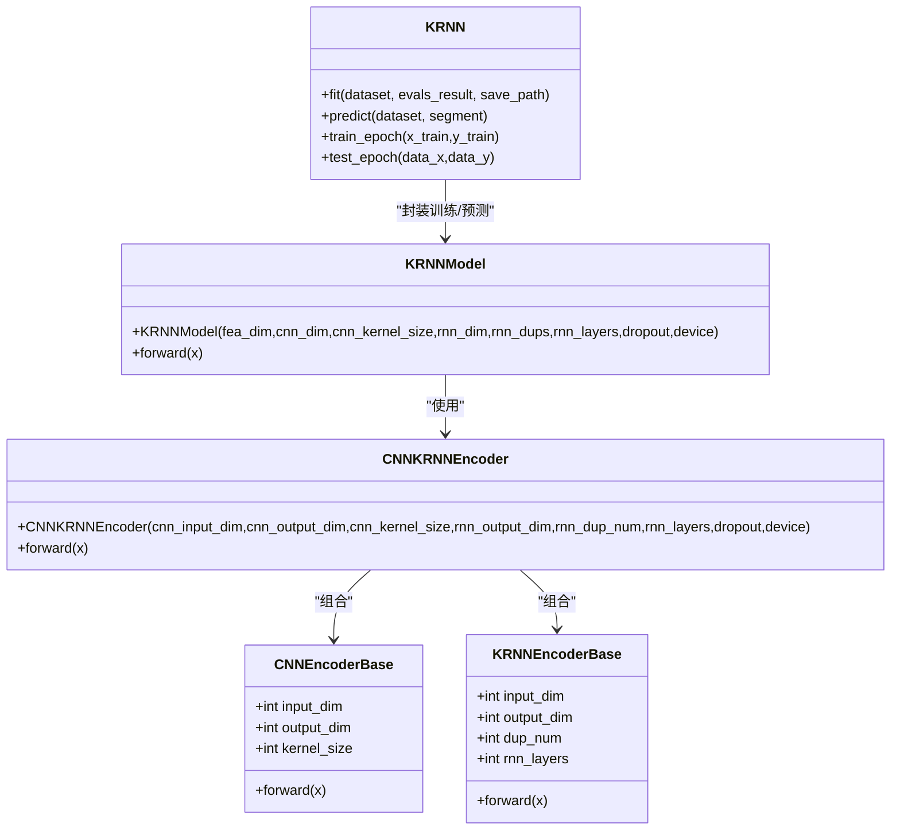
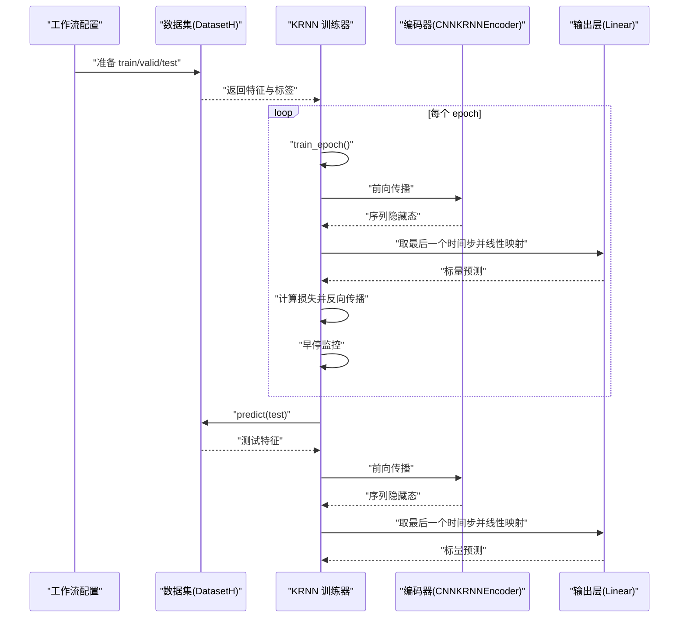
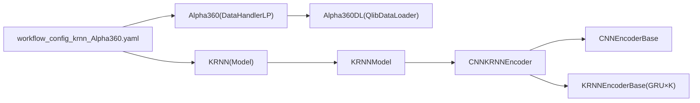
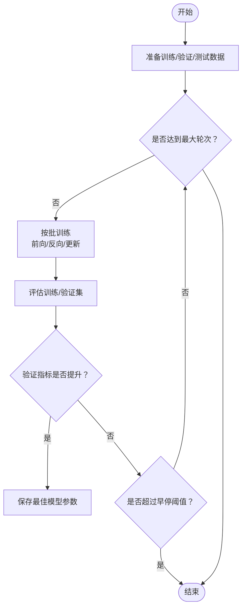

# KRNN模型

<cite>
**本文引用的文件列表**
- [pytorch_krnn.py](file://qlib/contrib/model/pytorch_krnn.py)
- [workflow_config_krnn_Alpha360.yaml](file://examples/benchmarks/KRNN/workflow_config_krnn_Alpha360.yaml)
- [handler.py](file://qlib/contrib/data/handler.py)
- [loader.py](file://qlib/contrib/data/loader.py)
- [pytorch_gru.py](file://qlib/contrib/model/pytorch_gru.py)
</cite>

## 目录
1. [简介](#简介)
2. [项目结构](#项目结构)
3. [核心组件](#核心组件)
4. [架构总览](#架构总览)
5. [详细组件分析](#详细组件分析)
6. [依赖关系分析](#依赖关系分析)
7. [性能考量](#性能考量)
8. [故障排查指南](#故障排查指南)
9. [结论](#结论)
10. [附录](#附录)

## 简介
本文件系统性地文档化 Qlib 中的 KRNN（Knowledge-Rich Recurrent Network）模型实现，聚焦于 pytorch_krnn.py 的网络架构设计与训练/推理流程。KRNN 在标准 RNN 结构基础上引入“知识增强”思想：通过并行多 RNN（KRNNEncoderBase）与 CNN 编码器组合，形成对金融时序特征的多视角表征聚合，从而在面对高噪声市场数据时提升建模稳健性。本文将解释其输入接口、编码器结构、前向传播路径、与 Alpha360 数据集的对接方式，并结合 workflow_config_krnn_Alpha360.yaml 展示关键超参数配置，最后对比 KRNN 与普通 GRU 的差异及调参与实践建议。

## 项目结构
KRNN 模型位于 Qlib 贡献模块中，配合 Alpha360 数据处理器与工作流配置文件共同完成端到端训练与评估。

图示来源
- [pytorch_krnn.py](file://qlib/contrib/model/pytorch_krnn.py#L182-L223)
- [handler.py](file://qlib/contrib/data/handler.py#L48-L91)
- [loader.py](file://qlib/contrib/data/loader.py#L1-L25)
- [workflow_config_krnn_Alpha360.yaml](file://examples/benchmarks/KRNN/workflow_config_krnn_Alpha360.yaml#L46-L90)
- [pytorch_gru.py](file://qlib/contrib/model/pytorch_gru.py#L1-L120)

章节来源
- [pytorch_krnn.py](file://qlib/contrib/model/pytorch_krnn.py#L182-L223)
- [handler.py](file://qlib/contrib/data/handler.py#L48-L91)
- [loader.py](file://qlib/contrib/data/loader.py#L1-L25)
- [workflow_config_krnn_Alpha360.yaml](file://examples/benchmarks/KRNN/workflow_config_krnn_Alpha360.yaml#L46-L90)
- [pytorch_gru.py](file://qlib/contrib/model/pytorch_gru.py#L1-L120)

## 核心组件
- KRNNModel：封装编码器与输出层，负责将输入张量映射为标量预测。
- CNNKRNNEncoder：由 CNN 编码器与 KRNN 编码器组成，先用 CNN 提取局部时序特征，再用多 RNN 并行聚合。
- KRNNEncoderBase：构建 K 个并行 GRU，逐个运行后按输出均值聚合，形成鲁棒的序列表征。
- CNNEncoderBase：1D 卷积编码器，保持时间步长度不变，将输入从展平形式转换为三维张量后卷积，再还原为序列表示。
- KRNN：训练器与预测器，包含损失函数、优化器、早停策略、日粒度批处理等。

章节来源
- [pytorch_krnn.py](file://qlib/contrib/model/pytorch_krnn.py#L28-L72)
- [pytorch_krnn.py](file://qlib/contrib/model/pytorch_krnn.py#L74-L134)
- [pytorch_krnn.py](file://qlib/contrib/model/pytorch_krnn.py#L136-L179)
- [pytorch_krnn.py](file://qlib/contrib/model/pytorch_krnn.py#L182-L223)
- [pytorch_krnn.py](file://qlib/contrib/model/pytorch_krnn.py#L225-L511)

## 架构总览
KRNN 的整体结构由三层组成：
1) 输入预处理：将展平的时序特征重塑为三维张量（batch, seq_len, input_dim），随后进入 CNN 编码器。
2) 特征增强：CNN 将输入映射到更高维的时序表征；随后 K 个 GRU 并行处理同一序列，各自输出隐藏态，再做平均聚合，得到更稳定的序列表示。
3) 预测头：取最后一个时间步的隐藏态，经全连接层映射为标量预测。

图示来源
- [pytorch_krnn.py](file://qlib/contrib/model/pytorch_krnn.py#L28-L72)
- [pytorch_krnn.py](file://qlib/contrib/model/pytorch_krnn.py#L74-L134)
- [pytorch_krnn.py](file://qlib/contrib/model/pytorch_krnn.py#L136-L179)
- [pytorch_krnn.py](file://qlib/contrib/model/pytorch_krnn.py#L182-L223)
- [pytorch_krnn.py](file://qlib/contrib/model/pytorch_krnn.py#L225-L511)

## 详细组件分析

### 输入接口与数据形态
- 输入张量形状：[batch_size, node_num, seq_len, input_dim]。其中 node_num 表示样本数量（可理解为股票数），seq_len 为历史窗口长度，input_dim 为每步特征维度。
- CNN 编码器内部会将展平后的序列转换为三维张量（batch, channels, seq_len），执行 1D 卷积后再还原为序列表示，保持时间步长度不变。
- 输出层仅使用最后一个时间步的隐藏态进行回归预测，最终得到标量预测。

章节来源
- [pytorch_krnn.py](file://qlib/contrib/model/pytorch_krnn.py#L182-L223)

### CNN 编码器（CNNEncoderBase）
- 作用：对输入序列进行局部特征提取，增强对价格/成交量等时序信号的平滑与滤波能力。
- 实现要点：
  - 使用 1D 卷积核大小为奇数，padding 设计保证输出序列长度与输入一致。
  - 输入先 reshape 再 permute，卷积后还原为序列表示。
- 复杂度：对每个样本，卷积操作的时间复杂度约为 O(T × C_in × K)，空间复杂度 O(T × C_out)。

章节来源
- [pytorch_krnn.py](file://qlib/contrib/model/pytorch_krnn.py#L28-L72)

### 多 RNN 编码器（KRNNEncoderBase）
- 作用：构建 K 个并行 GRU，分别对同一序列进行编码，然后对各 RNN 的输出进行平均聚合，降低单 RNN 的过拟合风险，提升鲁棒性。
- 实现要点：
  - 将输入张量转置为 (seq_len, batch, input_dim)，逐个 GRU 运行，得到多个隐藏态序列。
  - 将所有隐藏态堆叠并在最后一维求均值，再还原为 (batch, seq_len, output_dim)。
- 复杂度：K 个 GRU 的总时间复杂度约为 O(K × T × H × L)，其中 H 为隐藏维度，L 为层数。

章节来源
- [pytorch_krnn.py](file://qlib/contrib/model/pytorch_krnn.py#L74-L134)

### 编码器组合（CNNKRNNEncoder）
- 作用：串联 CNN 编码器与 KRNN 编码器，形成“局部特征提取 + 全局序列聚合”的双阶段增强。
- 实现要点：先 CNN 后 KRNN，输出为序列级表征，供预测头使用。

章节来源
- [pytorch_krnn.py](file://qlib/contrib/model/pytorch_krnn.py#L136-L179)

### 预测模型（KRNNModel）
- 作用：对编码器输出取最后一个时间步，经线性层映射为标量预测。
- 实现要点：输出层维度固定为 1，适配回归任务。

章节来源
- [pytorch_krnn.py](file://qlib/contrib/model/pytorch_krnn.py#L182-L223)

### 训练与推理（KRNN）
- 训练流程：
  - 准备训练/验证集，按日聚合样本，随机打乱后分批训练。
  - 前向传播计算预测与损失，反向传播并裁剪梯度，更新参数。
  - 早停监控验证指标，保存最佳模型。
- 推理流程：
  - 加载最佳模型状态，按批预测，拼接结果并返回带索引的序列。

图示来源
- [pytorch_krnn.py](file://qlib/contrib/model/pytorch_krnn.py#L381-L431)
- [pytorch_krnn.py](file://qlib/contrib/model/pytorch_krnn.py#L432-L511)

章节来源
- [pytorch_krnn.py](file://qlib/contrib/model/pytorch_krnn.py#L381-L431)
- [pytorch_krnn.py](file://qlib/contrib/model/pytorch_krnn.py#L432-L511)

### 与 Alpha360 数据集的对接
- Alpha360 数据处理器提供标准化的历史价格与成交量特征，时间窗口通常为 60 天，特征维度较大。
- 工作流配置中指定 Alpha360 数据处理器与对应字段集合，训练时直接读取特征与标签。
- 标签定义为未来两日涨跌幅，用于回归任务。

章节来源
- [handler.py](file://qlib/contrib/data/handler.py#L48-L91)
- [loader.py](file://qlib/contrib/data/loader.py#L1-L25)
- [workflow_config_krnn_Alpha360.yaml](file://examples/benchmarks/KRNN/workflow_config_krnn_Alpha360.yaml#L46-L90)

### 与普通 GRU 的差异
- KRNN 引入 CNN 层与多 RNN 并行聚合，增强对局部模式与全局序列的双重建模能力；GRU 则为单一 RNN 结构。
- 训练细节上，两者均采用 MSE 损失、梯度裁剪与早停策略，但 KRNN 的参数规模更大（包含 CNN 与 K 个 RNN）。

章节来源
- [pytorch_gru.py](file://qlib/contrib/model/pytorch_gru.py#L1-L120)
- [pytorch_krnn.py](file://qlib/contrib/model/pytorch_krnn.py#L225-L511)

## 依赖关系分析
KRNN 的关键依赖链如下：
- KRNN.fit/test_epoch/train_epoch 依赖 DatasetH 与 DataHandlerLP 的 prepare 接口获取特征/标签。
- KRNNModel.forward 依赖 CNNKRNNEncoder 的输出作为序列表示。
- CNNKRNNEncoder 依赖 CNNEncoderBase 与 KRNNEncoderBase 的组合。
- 工作流配置通过 YAML 指定数据集与模型参数，驱动训练与回测。

图示来源
- [workflow_config_krnn_Alpha360.yaml](file://examples/benchmarks/KRNN/workflow_config_krnn_Alpha360.yaml#L46-L90)
- [handler.py](file://qlib/contrib/data/handler.py#L48-L91)
- [loader.py](file://qlib/contrib/data/loader.py#L1-L25)
- [pytorch_krnn.py](file://qlib/contrib/model/pytorch_krnn.py#L136-L223)

章节来源
- [workflow_config_krnn_Alpha360.yaml](file://examples/benchmarks/KRNN/workflow_config_krnn_Alpha360.yaml#L46-L90)
- [handler.py](file://qlib/contrib/data/handler.py#L48-L91)
- [loader.py](file://qlib/contrib/data/loader.py#L1-L25)
- [pytorch_krnn.py](file://qlib/contrib/model/pytorch_krnn.py#L136-L223)

## 性能考量
- 计算复杂度：
  - CNN 层：O(T × C_in × K)；KRNN 层：O(K × T × H × L)。K 值越大，计算开销越高，但可提升稳定性。
  - 参数规模：CNN + K 个 GRU + 输出层，参数量随 K、H、L 增长而增加。
- 内存占用：
  - 序列长度 T 较大时，中间隐藏态与卷积输出的内存占用显著上升。
- 正则化与稳定：
  - 使用 dropout 与梯度裁剪，有助于缓解过拟合与梯度爆炸。
  - 多 RNN 平均聚合天然具备一定的正则效果。

[本节为通用性能讨论，不直接分析具体文件]

## 故障排查指南
- 训练数据为空：当数据集准备返回空时会抛出异常，需检查数据源与时间范围配置。
- GPU 可用性：若未检测到可用 GPU，模型将退回到 CPU 训练。
- 损失与指标：当前实现支持 MSE 损失与“loss”指标（负损失），其他损失/指标会报错。
- 早停触发：验证指标不再提升时自动停止，建议根据任务调整 early_stop 与 n_epochs。

章节来源
- [pytorch_krnn.py](file://qlib/contrib/model/pytorch_krnn.py#L432-L489)
- [pytorch_krnn.py](file://qlib/contrib/model/pytorch_krnn.py#L353-L368)
- [pytorch_krnn.py](file://qlib/contrib/model/pytorch_krnn.py#L335-L344)

## 结论
KRNN 通过“CNN + 多 RNN 并行聚合”的组合，在金融时序建模中实现了更强的局部特征提取与全局序列鲁棒性。其训练/推理流程与 Qlib 工作流无缝衔接，配合 Alpha360 数据集可直接开展实验。相比普通 GRU，KRNN 在噪声环境下具有更好的稳定性，但代价是更高的计算与内存开销。合理设置 K、H、L 与 dropout，可在性能与稳定性之间取得平衡。

[本节为总结性内容，不直接分析具体文件]

## 附录

### 关键超参数与配置说明（来自 workflow_config_krnn_Alpha360.yaml）
- 模型类与模块：KRNN，模块路径为 qlib.contrib.model.pytorch_krnn。
- 数据集：DatasetH，使用 Alpha360 数据处理器，字段集合来自 Alpha360DL。
- 关键超参数（示例）：
  - fea_dim：输入特征维度（Alpha360 提供的特征数）。
  - cnn_dim：CNN 输出维度。
  - cnn_kernel_size：卷积核大小（奇数）。
  - rnn_dim：KRNN 输出维度。
  - rnn_dups：并行 RNN 数量 K。
  - rnn_layers：每个 RNN 的层数。
  - n_epochs、lr、batch_size、early_stop、metric、GPU 等。
- 注意：该配置文件未显式声明“知识注入层维度”或“融合权重初始化方式”，KRNN 的知识增强体现在 CNN 与多 RNN 的组合，而非显式的外部知识向量融合。

章节来源
- [workflow_config_krnn_Alpha360.yaml](file://examples/benchmarks/KRNN/workflow_config_krnn_Alpha360.yaml#L46-L90)

### 训练与推理流程图（基于代码）

图示来源
- [pytorch_krnn.py](file://qlib/contrib/model/pytorch_krnn.py#L432-L489)