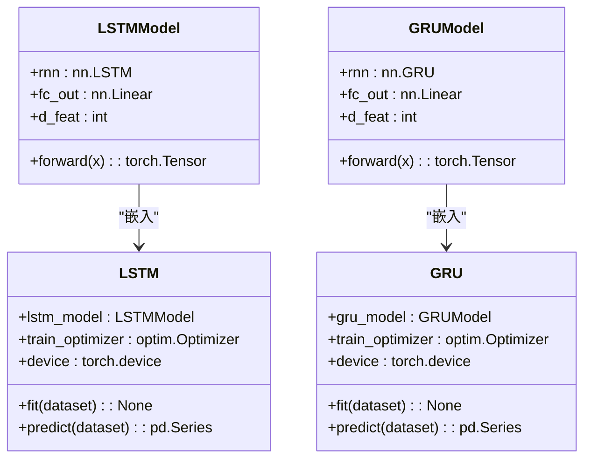
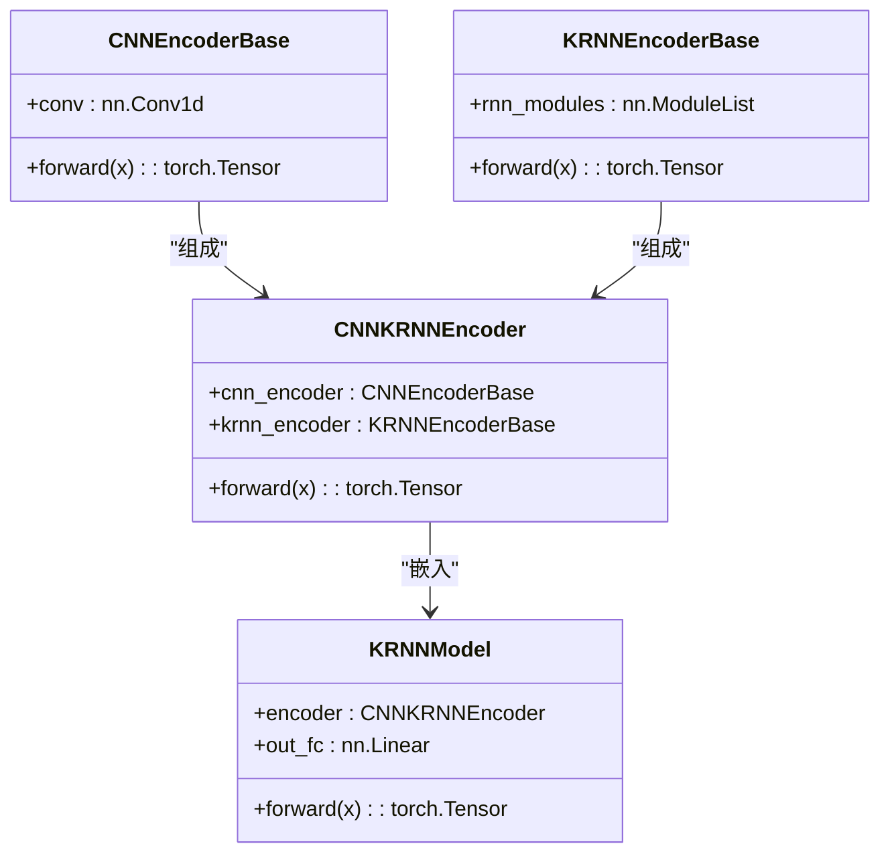
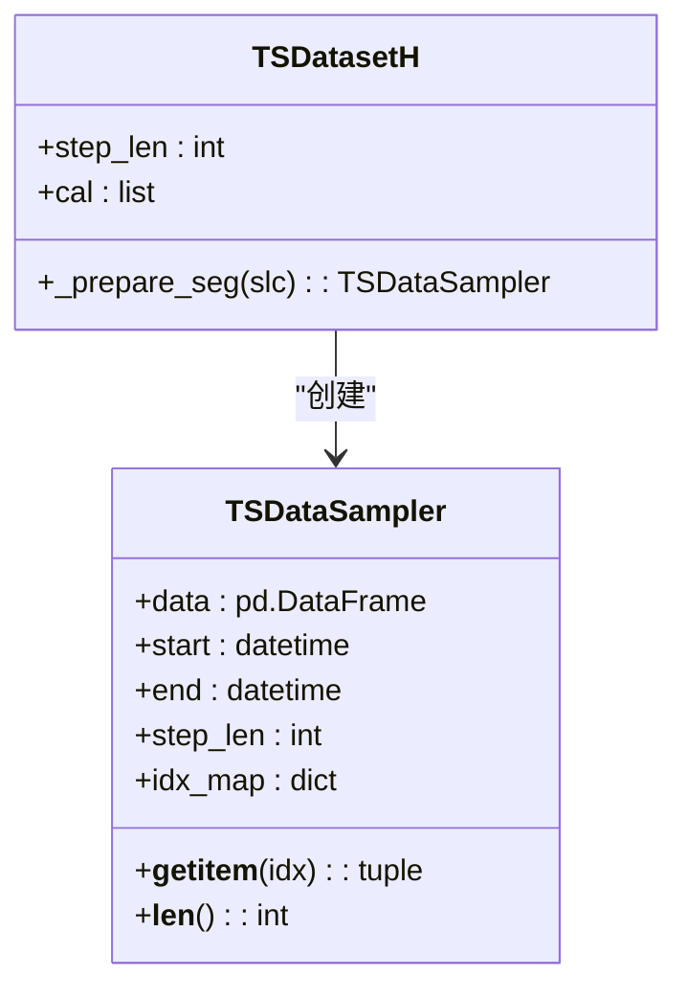
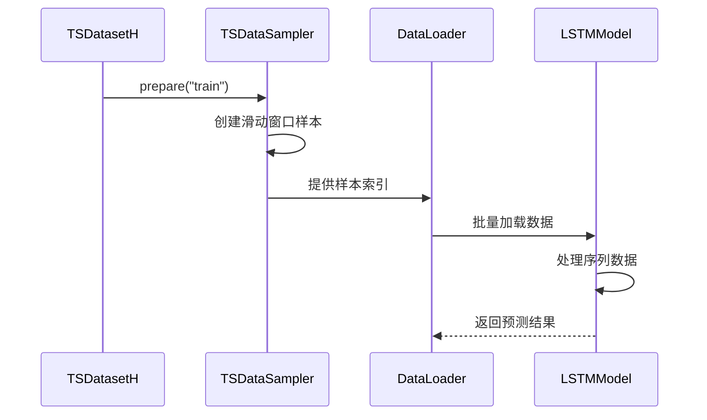
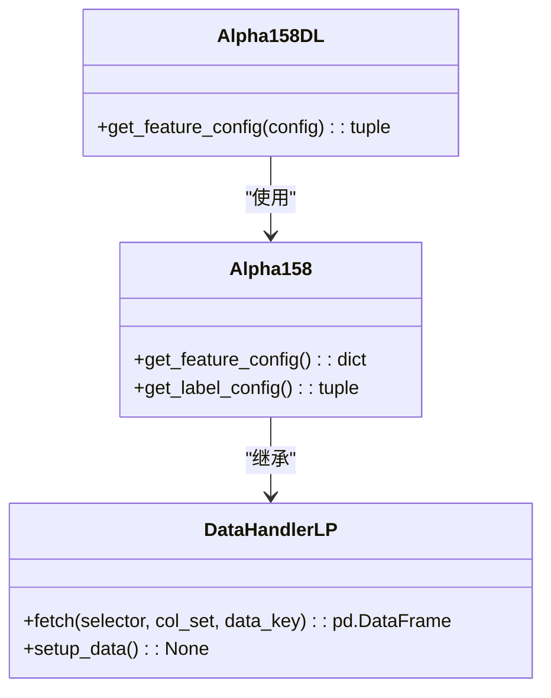
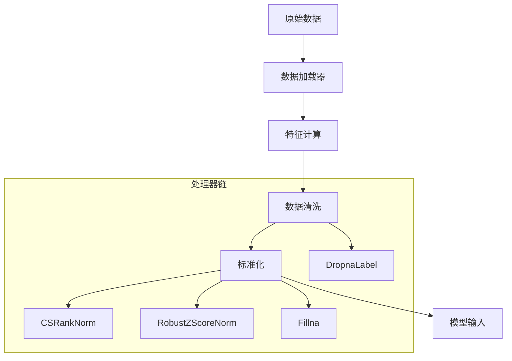
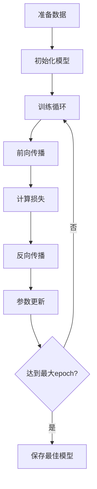

# 循环网络模型

<cite>
**本文档中引用的文件**   
- [pytorch_lstm.py](file://qlib/contrib/model/pytorch_lstm.py)
- [pytorch_gru.py](file://qlib/contrib/model/pytorch_gru.py)
- [pytorch_krnn.py](file://qlib/contrib/model/pytorch_krnn.py)
- [pytorch_lstm_ts.py](file://qlib/contrib/model/pytorch_lstm_ts.py)
- [pytorch_gru_ts.py](file://qlib/contrib/model/pytorch_gru_ts.py)
- [workflow_config_lstm_Alpha158.yaml](file://examples/benchmarks/LSTM/workflow_config_lstm_Alpha158.yaml)
- [workflow_config_gru_Alpha158.yaml](file://examples/benchmarks/GRU/workflow_config_gru_Alpha158.yaml)
- [handler.py](file://qlib/contrib/data/handler.py)
- [loader.py](file://qlib/contrib/data/loader.py)
- [dataset/handler.py](file://qlib/data/dataset/handler.py)
- [dataset/__init__.py](file://qlib/data/dataset/__init__.py)
</cite>

## 目录
1. [简介](#简介)
2. [核心模型架构](#核心模型架构)
3. [时间序列专用模型](#时间序列专用模型)
4. [数据处理与特征工程](#数据处理与特征工程)
5. [模型配置与超参数](#模型配置与超参数)
6. [训练与推理流程](#训练与推理流程)
7. [常见问题与解决方案](#常见问题与解决方案)

## 简介

Qlib框架提供了基于PyTorch的循环神经网络模型体系，支持LSTM、GRU和KRNN等多种变体。这些模型专为金融时间序列预测设计，能够有效捕捉市场数据中的长期依赖关系和动态模式。本文档深入解析这些模型的网络结构设计、数据处理流程和配置方法。

**本文档中引用的文件**   
- [pytorch_lstm.py](file://qlib/contrib/model/pytorch_lstm.py)
- [pytorch_gru.py](file://qlib/contrib/model/pytorch_gru.py)
- [pytorch_krnn.py](file://qlib/contrib/model/pytorch_krnn.py)

## 核心模型架构

Qlib中的循环神经网络模型采用统一的架构设计模式，包含多层堆叠、dropout处理和灵活的优化器配置。LSTM和GRU模型具有相似的结构，而KRNN则引入了更复杂的混合架构。

### LSTM与GRU模型结构

LSTM和GRU模型在Qlib中实现了标准的循环神经网络结构，通过`nn.LSTM`和`nn.GRU`模块构建。模型输入首先被重塑为三维张量[batch_size, seq_len, feature_dim]，然后通过多层循环网络进行处理。



**图表来源**  
- [pytorch_lstm.py](file://qlib/contrib/model/pytorch_lstm.py#L286-L307)
- [pytorch_gru.py](file://qlib/contrib/model/pytorch_gru.py#L319-L340)

**本节来源**  
- [pytorch_lstm.py](file://qlib/contrib/model/pytorch_lstm.py#L24-L307)
- [pytorch_gru.py](file://qlib/contrib/model/pytorch_gru.py#L25-L340)

### KRNN混合架构

KRNN（K-Parallel RNN）模型采用创新的混合架构，结合了CNN和RNN的优势。该模型首先使用CNN编码器提取局部特征，然后通过K个并行的RNN模块处理序列信息，最后对输出进行平均融合。



**图表来源**  
- [pytorch_krnn.py](file://qlib/contrib/model/pytorch_krnn.py#L28-L180)

**本节来源**  
- [pytorch_krnn.py](file://qlib/contrib/model/pytorch_krnn.py#L28-L346)

## 时间序列专用模型

Qlib提供了专门针对时间序列数据优化的模型变体，如`pytorch_lstm_ts.py`和`pytorch_gru_ts.py`。这些模型与`TSDatasetH`数据集类协同工作，自动处理时间序列的滑动窗口和批处理。

### 时间序列数据采样

时间序列专用模型利用`TSDatasetH`和`TSDataSampler`类实现高效的时间序列数据采样。`TSDatasetH`将表格数据转换为时间序列格式，通过滑动窗口机制构建训练样本。



**图表来源**  
- [dataset/__init__.py](file://qlib/data/dataset/__init__.py#L642-L722)

**本节来源**  
- [dataset/__init__.py](file://qlib/data/dataset/__init__.py#L272-L722)

### 时间序列模型实现

时间序列专用模型采用PyTorch的`DataLoader`进行高效批处理，支持多进程数据加载。模型输入格式为[batch_size, seq_len, feature_dim]，其中最后一个时间步的输出用于预测。



**图表来源**  
- [pytorch_lstm_ts.py](file://qlib/contrib/model/pytorch_lstm_ts.py#L195-L275)
- [pytorch_gru_ts.py](file://qlib/contrib/model/pytorch_gru_ts.py#L200-L277)

**本节来源**  
- [pytorch_lstm_ts.py](file://qlib/contrib/model/pytorch_lstm_ts.py#L25-L315)
- [pytorch_gru_ts.py](file://qlib/contrib/model/pytorch_gru_ts.py#L26-L320)

## 数据处理与特征工程

Qlib通过`DataHandlerLP`和相关处理器实现完整的数据处理流水线，支持从原始数据到模型输入的端到端转换。

### Alpha158数据处理器

Alpha158数据处理器是Qlib中常用的特征工程工具，提供158个技术指标作为特征。该处理器通过`Alpha158DL`和`Alpha158`类实现，支持灵活的特征配置。



**图表来源**  
- [loader.py](file://qlib/contrib/data/loader.py#L61-L200)
- [handler.py](file://qlib/contrib/data/handler.py#L98-L158)

**本节来源**  
- [handler.py](file://qlib/contrib/data/handler.py#L98-L158)
- [loader.py](file://qlib/contrib/data/loader.py#L61-L200)

### 数据处理流水线

数据处理流水线包括多个阶段：数据加载、特征计算、数据清洗和标准化。处理器链（processor chain）允许用户定义复杂的预处理逻辑。



**本节来源**  
- [handler.py](file://qlib/contrib/data/handler.py#L37-L45)
- [workflow_config_lstm_Alpha158.yaml](file://examples/benchmarks/LSTM/workflow_config_lstm_Alpha158.yaml#L12-L32)

## 模型配置与超参数

Qlib使用YAML配置文件管理模型超参数，支持灵活的实验配置和复现。

### 配置文件结构

配置文件定义了完整的机器学习工作流，包括数据集、模型和评估策略。以下是以LSTM模型为例的典型配置：

```mermaid
erDiagram
CONFIG ||--o{ MODEL : "包含"
CONFIG ||--o{ DATASET : "包含"
CONFIG ||--o{ RECORD : "包含"
MODEL ||--|| OPTIMIZER : "使用"
DATASET ||--|| HANDLER : "使用"
class CONFIG {
qlib_init
task
port_analysis_config
}
class MODEL {
class
module_path
kwargs
}
class DATASET {
class
module_path
kwargs
}
class HANDLER {
class
module_path
kwargs
}
```

**本节来源**  
- [workflow_config_lstm_Alpha158.yaml](file://examples/benchmarks/LSTM/workflow_config_lstm_Alpha158.yaml)
- [workflow_config_gru_Alpha158.yaml](file://examples/benchmarks/GRU/workflow_config_gru_Alpha158.yaml)

### 超参数说明

核心超参数包括：
- **d_feat**: 每个时间步的特征维度
- **hidden_size**: 隐藏层维度
- **num_layers**: 循环层的层数
- **dropout**: dropout比率
- **seq_len**: 序列长度（通过step_len参数设置）
- **learning_rate**: 学习率

这些参数在配置文件中集中管理，便于实验对比和调优。

**本节来源**  
- [workflow_config_lstm_Alpha158.yaml](file://examples/benchmarks/LSTM/workflow_config_lstm_Alpha158.yaml#L58-L69)
- [workflow_config_gru_Alpha158.yaml](file://examples/benchmarks/GRU/workflow_config_gru_Alpha158.yaml#L58-L69)

## 训练与推理流程

模型的训练和推理流程遵循标准的机器学习范式，但针对时间序列数据进行了优化。

### 训练流程

训练流程包括数据准备、模型训练和早停机制。模型使用均方误差（MSE）作为损失函数，并通过验证集性能决定最佳模型。



**本节来源**  
- [pytorch_lstm.py](file://qlib/contrib/model/pytorch_lstm.py#L204-L258)
- [pytorch_gru.py](file://qlib/contrib/model/pytorch_gru.py#L209-L282)

### 推理模式差异

在推理模式下，模型行为与训练模式有以下差异：
1. 关闭dropout层
2. 禁用梯度计算
3. 使用完整的测试集进行预测
4. 不进行参数更新

这些差异通过`model.eval()`和`torch.no_grad()`实现，确保推理过程的效率和一致性。

**本节来源**  
- [pytorch_lstm.py](file://qlib/contrib/model/pytorch_lstm.py#L262-L283)
- [pytorch_gru.py](file://qlib/contrib/model/pytorch_gru.py#L292-L316)

## 常见问题与解决方案

### 梯度爆炸问题

梯度爆炸是循环网络训练中的常见问题。Qlib通过梯度裁剪解决此问题，在反向传播后对梯度进行裁剪：

```python
torch.nn.utils.clip_grad_value_(model.parameters(), 3.0)
```

**本节来源**  
- [pytorch_lstm.py](file://qlib/contrib/model/pytorch_lstm.py#L173)
- [pytorch_gru.py](file://qlib/contrib/model/pytorch_gru.py#L177)

### 长期依赖衰减

为缓解长期依赖衰减问题，建议：
1. 使用适当的隐藏层维度
2. 调整学习率
3. 增加dropout比率
4. 使用更深层的网络结构

### 初始化策略

模型采用标准的PyTorch初始化策略，并支持随机种子设置以确保实验可复现：

```python
if self.seed is not None:
    np.random.seed(self.seed)
    torch.manual_seed(self.seed)
```

**本节来源**  
- [pytorch_lstm.py](file://qlib/contrib/model/pytorch_lstm.py#L108-L111)
- [pytorch_gru.py](file://qlib/contrib/model/pytorch_gru.py#L109-L112)