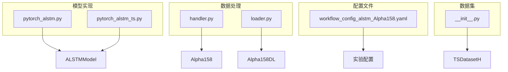
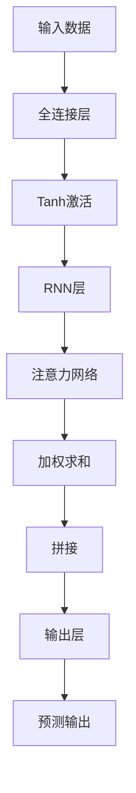
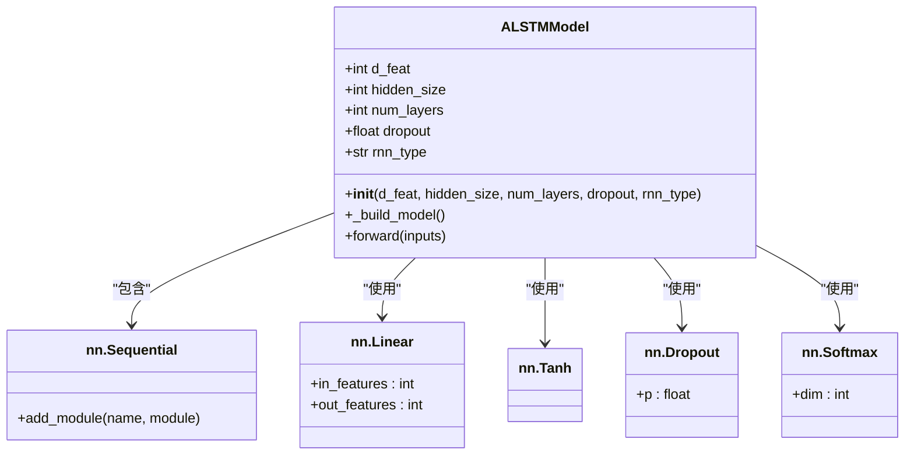
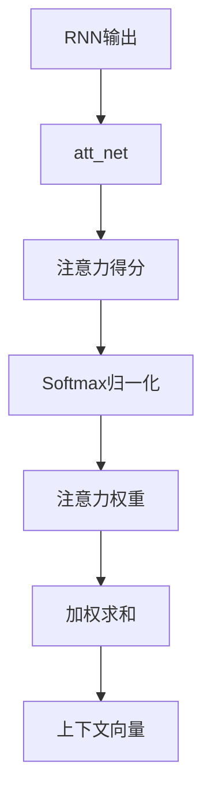
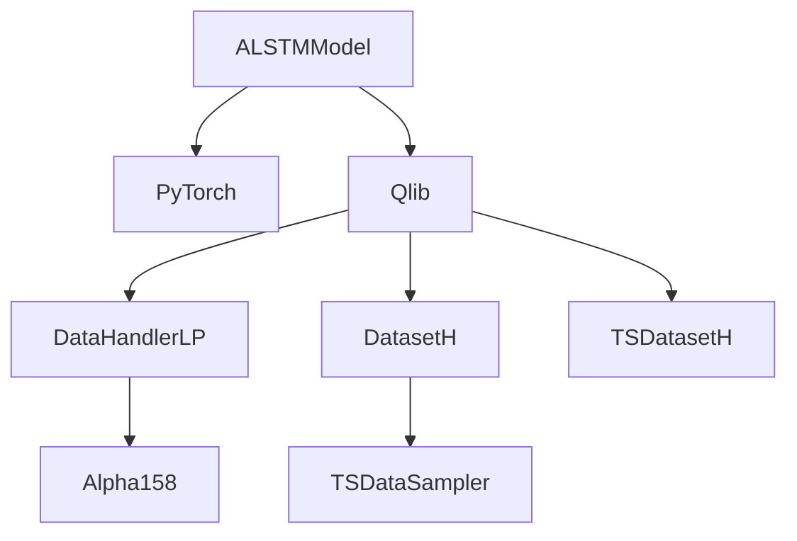

# ALSTM模型

<cite>
**本文档中引用的文件**  
- [pytorch_alstm.py](file://qlib/contrib/model/pytorch_alstm.py)
- [pytorch_alstm_ts.py](file://qlib/contrib/model/pytorch_alstm_ts.py)
- [workflow_config_alstm_Alpha158.yaml](file://examples/benchmarks/ALSTM/workflow_config_alstm_Alpha158.yaml)
- [handler.py](file://qlib/contrib/data/handler.py)
- [loader.py](file://qlib/contrib/data/loader.py)
- [__init__.py](file://qlib/data/dataset/__init__.py)
</cite>

## 目录
1. [项目结构](#项目结构)
2. [核心组件](#核心组件)
3. [架构概述](#架构概述)
4. [详细组件分析](#详细组件分析)
5. [依赖分析](#依赖分析)
6. [性能考虑](#性能考虑)
7. [故障排除指南](#故障排除指南)
8. [结论](#结论)

## 项目结构

ALSTM模型是Qlib框架中用于金融时间序列预测的一种注意力增强型LSTM模型。该项目结构清晰地组织了数据处理、模型实现和实验配置。

**图示来源**
- [pytorch_alstm.py](file://qlib/contrib/model/pytorch_alstm.py#L294-L345)
- [pytorch_alstm_ts.py](file://qlib/contrib/model/pytorch_alstm_ts.py#L308-L356)
- [handler.py](file://qlib/contrib/data/handler.py#L97-L158)
- [loader.py](file://qlib/contrib/data/loader.py#L60-L259)
- [__init__.py](file://qlib/data/dataset/__init__.py#L642-L722)

**本节来源**
- [pytorch_alstm.py](file://qlib/contrib/model/pytorch_alstm.py)
- [pytorch_alstm_ts.py](file://qlib/contrib/model/pytorch_alstm_ts.py)
- [workflow_config_alstm_Alpha158.yaml](file://examples/benchmarks/ALSTM/workflow_config_alstm_Alpha158.yaml)

## 核心组件

ALSTM模型的核心组件包括ALSTMModel类，该类将注意力机制与LSTM相结合。首先通过全连接层和Tanh激活函数进行特征映射，然后使用GRU或LSTM提取时序特征，最后通过独立的注意力网络（att_net）计算各时间步的注意力权重并进行加权求和。解释为何将LSTM最后一个时间步的隐藏状态与注意力加权后的上下文向量拼接作为最终输出。分析注意力得分的Softmax归一化过程及其对模型可解释性的贡献。

**本节来源**
- [pytorch_alstm.py](file://qlib/contrib/model/pytorch_alstm.py#L294-L345)
- [pytorch_alstm_ts.py](file://qlib/contrib/model/pytorch_alstm_ts.py#L308-L356)

## 架构概述

ALSTM模型的架构设计旨在结合LSTM的时序建模能力和注意力机制的选择性关注能力。模型接收时间序列数据作为输入，经过一系列变换后输出预测结果。

**图示来源**
- [pytorch_alstm.py](file://qlib/contrib/model/pytorch_alstm.py#L304-L332)
- [pytorch_alstm_ts.py](file://qlib/contrib/model/pytorch_alstm_ts.py#L319-L346)

## 详细组件分析

### ALSTMModel分析

ALSTMModel类是ALSTM模型的核心实现。它通过以下步骤处理输入数据：

1. **特征映射**：通过全连接层和Tanh激活函数将输入特征映射到隐藏空间。
2. **时序特征提取**：使用GRU或LSTM层提取时序特征。
3. **注意力机制**：通过独立的注意力网络计算各时间步的注意力权重。
4. **加权求和**：根据注意力权重对时序特征进行加权求和。
5. **最终输出**：将LSTM最后一个时间步的隐藏状态与注意力加权后的上下文向量拼接，通过全连接层得到最终输出。

**图示来源**
- [pytorch_alstm.py](file://qlib/contrib/model/pytorch_alstm.py#L294-L345)
- [pytorch_alstm_ts.py](file://qlib/contrib/model/pytorch_alstm_ts.py#L308-L356)

**本节来源**
- [pytorch_alstm.py](file://qlib/contrib/model/pytorch_alstm.py#L294-L345)
- [pytorch_alstm_ts.py](file://qlib/contrib/model/pytorch_alstm_ts.py#L308-L356)

### 注意力机制分析

注意力机制在ALSTM模型中起着至关重要的作用。它通过以下步骤计算注意力权重：

1. **特征映射**：将RNN输出通过一个小型神经网络（att_net）映射到注意力得分。
2. **Softmax归一化**：使用Softmax函数对注意力得分进行归一化，确保所有注意力权重之和为1。
3. **加权求和**：根据归一化后的注意力权重对RNN输出进行加权求和，得到上下文向量。

**图示来源**
- [pytorch_alstm.py](file://qlib/contrib/model/pytorch_alstm.py#L320-L331)
- [pytorch_alstm_ts.py](file://qlib/contrib/model/pytorch_alstm_ts.py#L334-L345)

**本节来源**
- [pytorch_alstm.py](file://qlib/contrib/model/pytorch_alstm.py#L320-L331)
- [pytorch_alstm_ts.py](file://qlib/contrib/model/pytorch_alstm_ts.py#L334-L345)

## 依赖分析

ALSTM模型依赖于多个组件和库，包括PyTorch、Qlib框架中的数据处理模块等。这些依赖关系确保了模型能够正确地处理和分析金融时间序列数据。

**图示来源**
- [pytorch_alstm.py](file://qlib/contrib/model/pytorch_alstm.py#L21-L23)
- [pytorch_alstm_ts.py](file://qlib/contrib/model/pytorch_alstm_ts.py#L21-L26)
- [handler.py](file://qlib/contrib/data/handler.py#L97-L158)
- [__init__.py](file://qlib/data/dataset/__init__.py#L642-L722)

**本节来源**
- [pytorch_alstm.py](file://qlib/contrib/model/pytorch_alstm.py)
- [pytorch_alstm_ts.py](file://qlib/contrib/model/pytorch_alstm_ts.py)
- [handler.py](file://qlib/contrib/data/handler.py)
- [__init__.py](file://qlib/data/dataset/__init__.py)

## 性能考虑

ALSTM模型在设计时考虑了多个性能因素，包括计算效率、内存使用和训练稳定性。通过合理设置超参数如hidden_size、num_layers等，可以在保证模型性能的同时减少计算资源消耗。

**本节来源**
- [pytorch_alstm.py](file://qlib/contrib/model/pytorch_alstm.py#L43-L55)
- [pytorch_alstm_ts.py](file://qlib/contrib/model/pytorch_alstm_ts.py#L44-L58)
- [workflow_config_alstm_Alpha158.yaml](file://examples/benchmarks/ALSTM/workflow_config_alstm_Alpha158.yaml#L57-L70)

## 故障排除指南

在使用ALSTM模型时可能会遇到一些常见问题，如训练不收敛、预测结果异常等。以下是一些可能的解决方案：

1. **检查数据预处理**：确保数据经过适当的预处理，如标准化、填充缺失值等。
2. **调整超参数**：尝试不同的hidden_size、num_layers、dropout等超参数组合。
3. **监控训练过程**：定期检查训练损失和验证损失，确保模型正常收敛。
4. **检查硬件资源**：确保有足够的GPU内存和计算资源支持模型训练。

**本节来源**
- [pytorch_alstm.py](file://qlib/contrib/model/pytorch_alstm.py#L113-L118)
- [pytorch_alstm_ts.py](file://qlib/contrib/model/pytorch_alstm_ts.py#L120-L125)

## 结论

ALSTM模型通过结合LSTM和注意力机制，有效地提升了金融时间序列预测的准确性和可解释性。通过对模型架构的深入分析，我们可以更好地理解其工作原理，并在此基础上进行进一步的优化和改进。