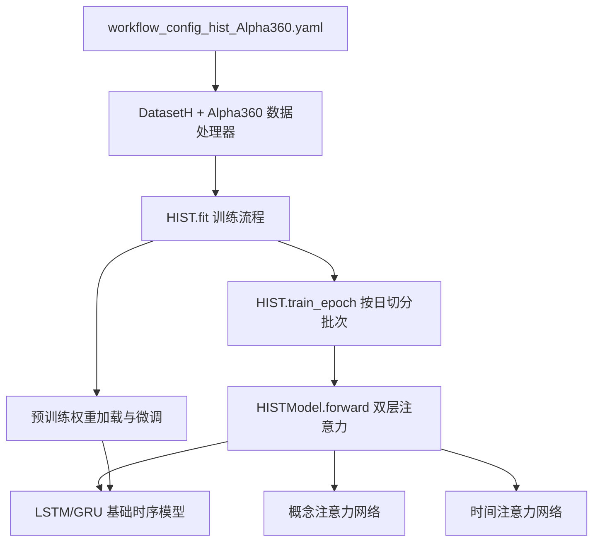
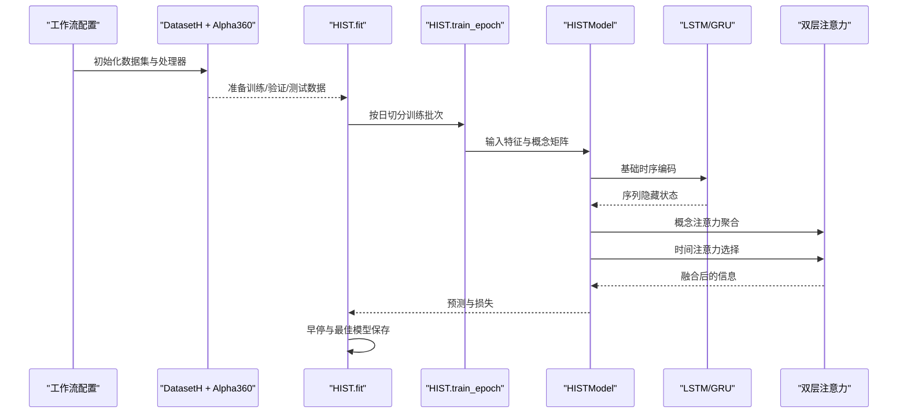
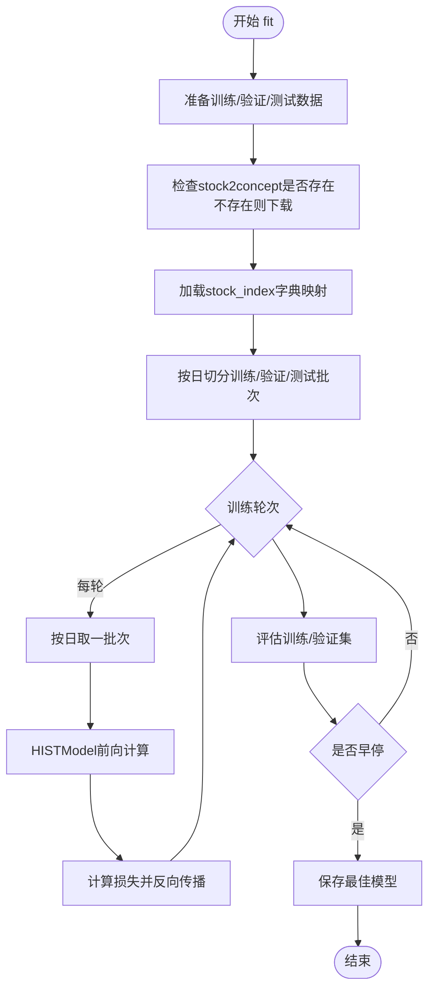
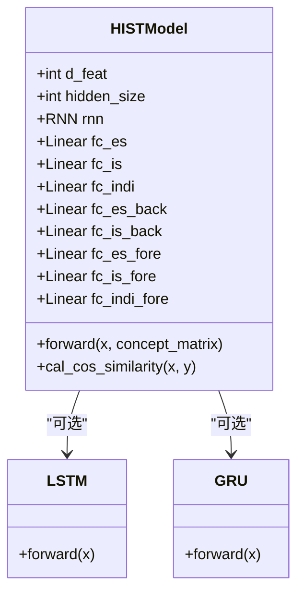
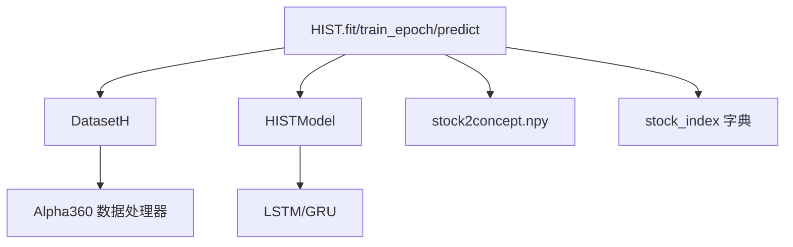
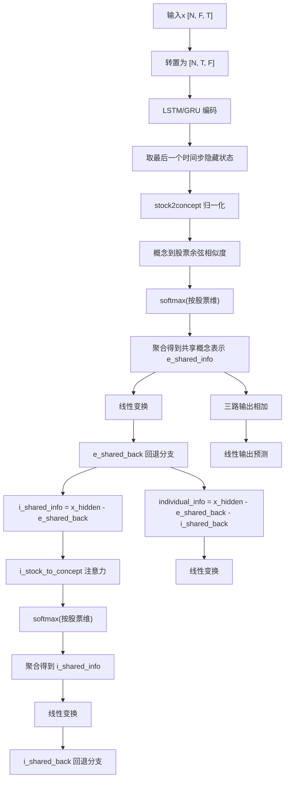

# HIST模型

<cite>
**本文引用的文件列表**
- [pytorch_hist.py](file://qlib/contrib/model/pytorch_hist.py)
- [workflow_config_hist_Alpha360.yaml](file://examples/benchmarks/HIST/workflow_config_hist_Alpha360.yaml)
- [handler.py](file://qlib/contrib/data/handler.py)
- [pytorch_lstm.py](file://qlib/contrib/model/pytorch_lstm.py)
</cite>

## 目录
1. [简介](#简介)
2. [项目结构](#项目结构)
3. [核心组件](#核心组件)
4. [架构总览](#架构总览)
5. [详细组件分析](#详细组件分析)
6. [依赖关系分析](#依赖关系分析)
7. [性能考量](#性能考量)
8. [故障排查指南](#故障排查指南)
9. [结论](#结论)
10. [附录](#附录)

## 简介
本文件系统化梳理QLib中HIST（Hierarchical Information Selection in Time series）模型的双层注意力机制，重点阐述其如何同时建模“股票-概念”关联：通过stock2concept矩阵构建概念层级，在时间维度与实体维度分别施加注意力；并通过概念注意力网络聚合相关概念表示、通过时间注意力网络选择关键时间步。进一步说明HISTModel如何集成LSTM或GRU作为基础时序模型并在输出上叠加注意力层；训练过程采用按日切分数据批次的策略以适配市场日效应；结合workflow_config_hist_Alpha360.yaml配置文件，给出stock2concept与stock_index等特殊输入的准备流程，并提供预训练权重加载与微调的实践指南。

## 项目结构
围绕HIST模型的关键文件与配置如下：
- 模型实现：qlib/contrib/model/pytorch_hist.py
- 数据处理器：qlib/contrib/data/handler.py（Alpha360）
- 训练配置：examples/benchmarks/HIST/workflow_config_hist_Alpha360.yaml
- 基础时序模型参考：qlib/contrib/model/pytorch_lstm.py（用于预训练权重加载）

图表来源
- [pytorch_hist.py](file://qlib/contrib/model/pytorch_hist.py#L244-L363)
- [workflow_config_hist_Alpha360.yaml](file://examples/benchmarks/HIST/workflow_config_hist_Alpha360.yaml#L46-L91)
- [handler.py](file://qlib/contrib/data/handler.py#L48-L91)
- [pytorch_lstm.py](file://qlib/contrib/model/pytorch_lstm.py#L1-L200)

章节来源
- [pytorch_hist.py](file://qlib/contrib/model/pytorch_hist.py#L244-L363)
- [workflow_config_hist_Alpha360.yaml](file://examples/benchmarks/HIST/workflow_config_hist_Alpha360.yaml#L46-L91)
- [handler.py](file://qlib/contrib/data/handler.py#L48-L91)
- [pytorch_lstm.py](file://qlib/contrib/model/pytorch_lstm.py#L1-L200)

## 核心组件
- HIST类：封装训练、评估、预测流程，负责按日切分批次、加载预训练权重、保存最佳模型。
- HISTModel类：包含LSTM/GRU基础时序模块与双层注意力子模块（概念注意力与时间注意力），最终线性回归输出。
- Alpha360数据处理器：定义特征与标签配置，配合DatasetH进行数据准备。
- 预训练模型：LSTM/GRU模型权重用于初始化HISTModel的基础时序部分。

章节来源
- [pytorch_hist.py](file://qlib/contrib/model/pytorch_hist.py#L27-L145)
- [pytorch_hist.py](file://qlib/contrib/model/pytorch_hist.py#L365-L501)
- [handler.py](file://qlib/contrib/data/handler.py#L48-L91)
- [pytorch_lstm.py](file://qlib/contrib/model/pytorch_lstm.py#L1-L200)

## 架构总览
HIST的整体训练与推理流程如下：

图表来源
- [pytorch_hist.py](file://qlib/contrib/model/pytorch_hist.py#L244-L363)
- [pytorch_hist.py](file://qlib/contrib/model/pytorch_hist.py#L365-L501)
- [handler.py](file://qlib/contrib/data/handler.py#L48-L91)

## 详细组件分析

### HIST类与训练流程
- 参数与初始化：支持d_feat、hidden_size、num_layers、dropout、n_epochs、lr、early_stop、loss、base_model、model_path、stock2concept、stock_index、optimizer、GPU、seed等超参。
- 训练入口fit：准备训练/验证/测试数据，自动下载stock2concept.npy，加载stock_index字典映射到每条样本所属的股票索引类别，构造按日切分的批次，循环训练并早停。
- 按日切分策略：get_daily_inter根据MultiIndex的日期分组统计每日样本数，生成每日起始索引与计数，训练时shuffle打乱，测试时不打乱。
- 预训练权重加载：根据base_model选择LSTM/GRU模型，加载预训练权重并更新到HISTModel对应参数，再保存最佳模型。

图表来源
- [pytorch_hist.py](file://qlib/contrib/model/pytorch_hist.py#L244-L363)

章节来源
- [pytorch_hist.py](file://qlib/contrib/model/pytorch_hist.py#L244-L363)

### HISTModel：双层注意力机制
- 基础时序模型：可选LSTM或GRU，batch_first=True，返回序列隐藏状态，取最后一个时间步作为初始表征。
- 概念注意力网络（Predefined Concept Module）：
  - 使用stock2concept矩阵将股票嵌入映射到概念空间，先做归一化，再用概念到股票的余弦相似度计算注意力权重，得到共享概念表示e_shared_info。
  - 通过多层感知机变换得到e_shared_back，作为共享信息的回退分支，用于后续个体信息分解。
- 隐式概念模块（Hidden Concept Module）：
  - 计算i_shared_info = x_hidden - e_shared_back，基于隐式共享信息计算i_stock_to_concept注意力，采用最大值掩码+对角修正策略，得到i_concept_to_stock注意力，聚合得到i_shared_info。
  - 通过多层感知机变换得到i_shared_back，作为隐式共享信息的回退分支。
- 个体信息模块（Individual Information Module）：
  - 计算individual_info = x_hidden - e_shared_back - i_shared_back，直接进入个体信息分支。
- 输出融合：将三路输出相加后经线性层得到最终预测。

图表来源
- [pytorch_hist.py](file://qlib/contrib/model/pytorch_hist.py#L365-L501)

章节来源
- [pytorch_hist.py](file://qlib/contrib/model/pytorch_hist.py#L365-L501)

### 数据准备与特殊输入
- stock2concept：为每个股票到概念的二值/权重矩阵，HIST在训练时若本地不存在会自动从指定URL下载。
- stock_index：为一个字典，键为股票代码，值为该股票所属的类别索引（整数）。HIST在准备数据时将MultiIndex的instrument映射到该索引，缺失值统一填充为733。
- Alpha360数据处理器：定义特征与标签配置，配合DatasetH按“learn”数据键准备特征与标签，按“infer”数据键准备预测阶段的特征。

章节来源
- [pytorch_hist.py](file://qlib/contrib/model/pytorch_hist.py#L258-L267)
- [pytorch_hist.py](file://qlib/contrib/model/pytorch_hist.py#L334-L341)
- [handler.py](file://qlib/contrib/data/handler.py#L48-L91)
- [workflow_config_hist_Alpha360.yaml](file://examples/benchmarks/HIST/workflow_config_hist_Alpha360.yaml#L46-L91)

### 预训练权重加载与微调实践
- 选择基础模型：根据base_model参数选择LSTM或GRU模型实例。
- 加载预训练权重：若model_path非空，则加载对应权重；否则使用默认初始化。
- 参数匹配与更新：从预训练模型state_dict中筛选与当前HISTModel同名参数并更新，保留新模型新增参数的默认初始化。
- 微调策略：在已有预训练参数基础上继续训练，早停监控验证指标，保存最佳模型。

章节来源
- [pytorch_hist.py](file://qlib/contrib/model/pytorch_hist.py#L279-L297)
- [pytorch_lstm.py](file://qlib/contrib/model/pytorch_lstm.py#L1-L200)

## 依赖关系分析
- HIST依赖于DatasetH与Alpha360数据处理器，以获取特征与标签。
- HISTModel依赖于LSTM或GRU作为基础时序编码器。
- 训练流程依赖stock2concept与stock_index两个外部输入，前者用于概念注意力，后者用于按日批次组织与样本分类。

图表来源
- [pytorch_hist.py](file://qlib/contrib/model/pytorch_hist.py#L244-L363)
- [handler.py](file://qlib/contrib/data/handler.py#L48-L91)

章节来源
- [pytorch_hist.py](file://qlib/contrib/model/pytorch_hist.py#L244-L363)
- [handler.py](file://qlib/contrib/data/handler.py#L48-L91)

## 性能考量
- 按日切分批次有助于缓解市场日效应带来的分布漂移，提升泛化稳定性。
- 注意力权重计算采用余弦相似度与softmax，注意数值稳定（已添加小正则项）。
- 梯度裁剪防止梯度爆炸，提升训练稳定性。
- 建议在大规模数据下优先使用GPU训练，合理设置batch大小与学习率。

## 故障排查指南
- stock2concept文件缺失：首次运行会自动下载，若下载失败，请检查网络与存储路径权限。
- stock_index映射异常：确认字典中是否包含目标股票代码，缺失值会被填充为733，需确保该类别存在或逻辑正确。
- 预训练权重不兼容：仅加载与当前模型同名的参数，其余参数保持默认初始化；若出现形状不匹配，检查base_model与预训练模型是否一致。
- 训练不稳定：启用梯度裁剪、调整学习率、减少dropout或num_layers，观察早停效果。

章节来源
- [pytorch_hist.py](file://qlib/contrib/model/pytorch_hist.py#L258-L267)
- [pytorch_hist.py](file://qlib/contrib/model/pytorch_hist.py#L279-L297)

## 结论
HIST通过在“股票-概念”层级上的双层注意力机制，实现了对跨时间步与跨实体信息的有效聚合与选择。其训练流程采用按日切分批次以适配市场日效应，结合预训练权重加载与微调策略，能够在有限数据条件下快速收敛并取得良好性能。配合Alpha360数据处理器与标准工作流配置，HIST可作为金融时序预测的通用框架使用。

## 附录

### 关键流程图：HISTModel前向传播

图表来源
- [pytorch_hist.py](file://qlib/contrib/model/pytorch_hist.py#L431-L501)