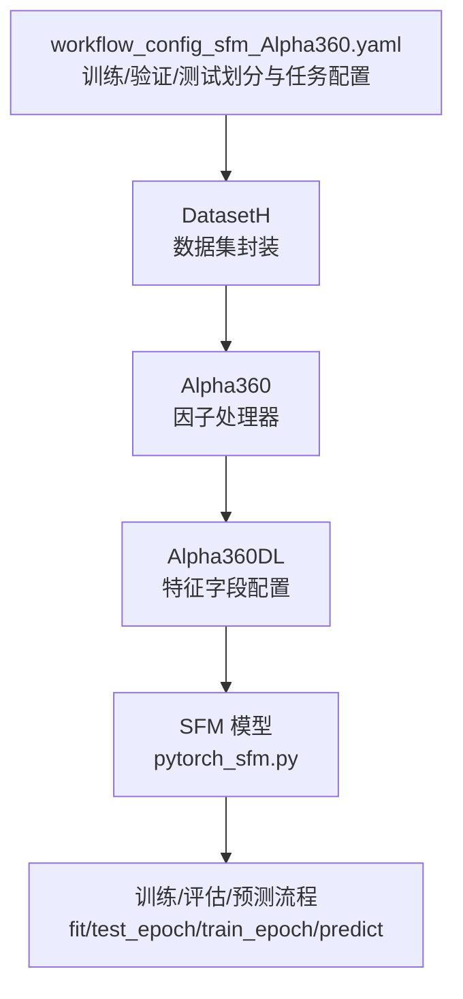
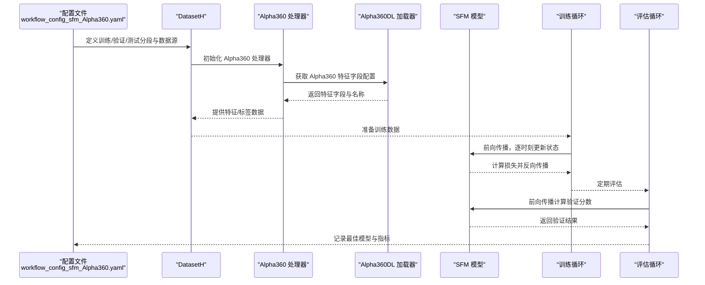
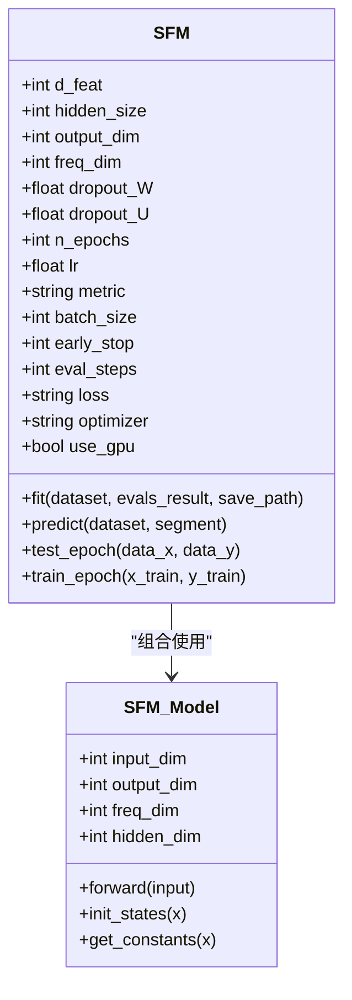
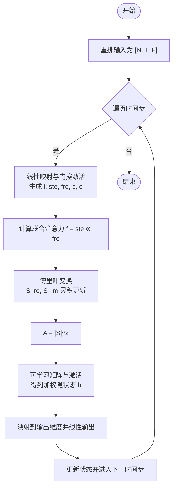
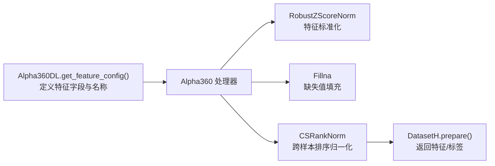
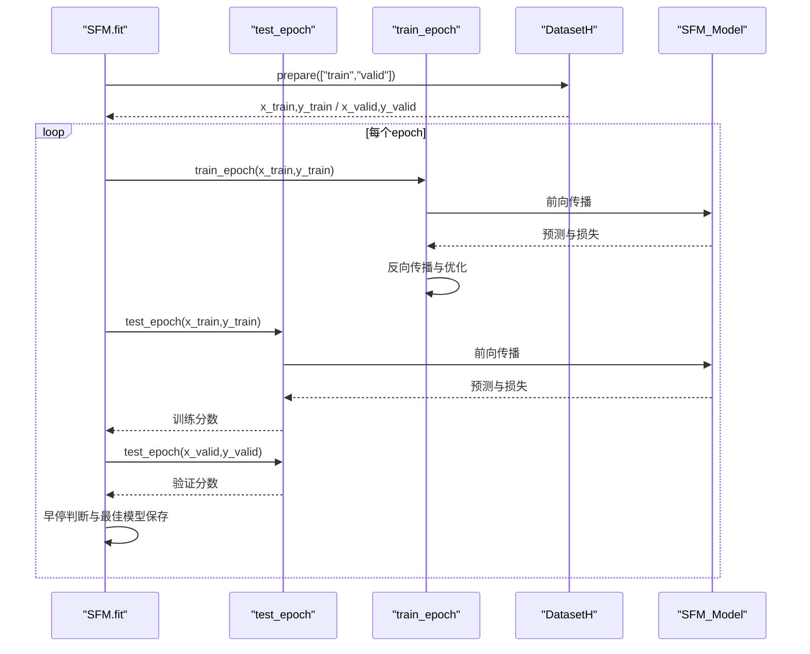
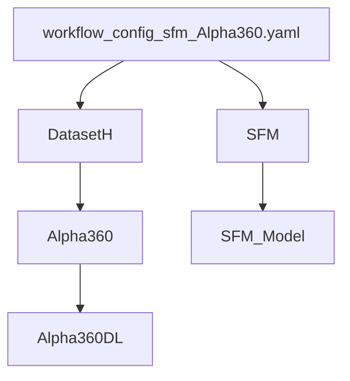

# SFM模型

<cite>
**本文引用的文件列表**
- [workflow_config_sfm_Alpha360.yaml](file://examples/benchmarks/SFM/workflow_config_sfm_Alpha360.yaml)
- [pytorch_sfm.py](file://qlib/contrib/model/pytorch_sfm.py)
- [README.md](file://examples/benchmarks/SFM/README.md)
- [handler.py](file://qlib/contrib/data/handler.py)
- [loader.py](file://qlib/contrib/data/loader.py)
</cite>

## 目录
1. [简介](#简介)
2. [项目结构](#项目结构)
3. [核心组件](#核心组件)
4. [架构总览](#架构总览)
5. [详细组件分析](#详细组件分析)
6. [依赖关系分析](#依赖关系分析)
7. [性能考量](#性能考量)
8. [故障排查指南](#故障排查指南)
9. [结论](#结论)
10. [附录](#附录)

## 简介
SFM（Stock Flow Model，股票流模型）是一种基于循环神经网络的模型，通过离散傅里叶变换分解记忆单元的隐藏状态，从历史市场数据中捕捉多频率交易模式，用于股票价格预测。该模型在Qlib中以PyTorch实现，支持Alpha360因子集的数据处理流程，并通过可学习的参数实现对不同因子的动态特征融合与自适应加权，从而模拟资金在不同股票间的流动过程。本文将系统解析SFM的动态特征融合机制、特征提取、注意力评分计算与加权聚合的实现步骤，说明其如何将传统技术指标与深度学习结合，以及在高维异构特征下的优势与稀疏化约束对泛化能力的提升，并结合workflow配置展示在Alpha360因子集上的调优方法与特征重要性分析的后处理思路。

## 项目结构
SFM相关代码与配置主要分布在以下位置：
- 模型实现：qlib/contrib/model/pytorch_sfm.py
- 配置文件：examples/benchmarks/SFM/workflow_config_sfm_Alpha360.yaml
- Alpha360因子处理器：qlib/contrib/data/handler.py、qlib/contrib/data/loader.py
- 示例说明：examples/benchmarks/SFM/README.md

图表来源
- [workflow_config_sfm_Alpha360.yaml](file://examples/benchmarks/SFM/workflow_config_sfm_Alpha360.yaml#L46-L91)
- [pytorch_sfm.py](file://qlib/contrib/model/pytorch_sfm.py#L360-L461)
- [handler.py](file://qlib/contrib/data/handler.py#L47-L89)
- [loader.py](file://qlib/contrib/data/loader.py#L3-L58)

章节来源
- [workflow_config_sfm_Alpha360.yaml](file://examples/benchmarks/SFM/workflow_config_sfm_Alpha360.yaml#L1-L91)
- [pytorch_sfm.py](file://qlib/contrib/model/pytorch_sfm.py#L180-L461)
- [handler.py](file://qlib/contrib/data/handler.py#L47-L89)
- [loader.py](file://qlib/contrib/data/loader.py#L3-L58)

## 核心组件
- SFM_Model：SFM的核心神经网络模块，包含可学习参数矩阵与内部状态管理，实现基于傅里叶变换的多频率特征融合与动态加权。
- SFM：SFM的高层封装，负责超参数设置、优化器选择、训练/评估/预测流程与早停策略。
- Alpha360/Alpha360DL：Alpha360因子集的数据处理器与特征字段配置，为SFM提供高维异构特征输入。
- workflow_config_sfm_Alpha360.yaml：SFM在Alpha360因子集上的完整训练配置，包括数据预处理、模型参数、训练策略与回测记录。

章节来源
- [pytorch_sfm.py](file://qlib/contrib/model/pytorch_sfm.py#L24-L176)
- [pytorch_sfm.py](file://qlib/contrib/model/pytorch_sfm.py#L180-L461)
- [handler.py](file://qlib/contrib/data/handler.py#L47-L89)
- [loader.py](file://qlib/contrib/data/loader.py#L3-L58)
- [workflow_config_sfm_Alpha360.yaml](file://examples/benchmarks/SFM/workflow_config_sfm_Alpha360.yaml#L46-L91)

## 架构总览
SFM的架构围绕“特征提取—注意力评分—加权聚合—输出预测”的闭环展开。模型通过可学习的权重矩阵对输入特征进行线性映射，结合门控机制与傅里叶变换得到的频率响应，形成对多时间尺度交易模式的表征，最终输出预测信号。

图表来源
- [workflow_config_sfm_Alpha360.yaml](file://examples/benchmarks/SFM/workflow_config_sfm_Alpha360.yaml#L46-L91)
- [pytorch_sfm.py](file://qlib/contrib/model/pytorch_sfm.py#L360-L461)
- [handler.py](file://qlib/contrib/data/handler.py#L47-L89)
- [loader.py](file://qlib/contrib/data/loader.py#L3-L58)

## 详细组件分析

### SFM模型类图
SFM_Model通过可学习参数实现特征映射与状态更新；SFM作为高层封装，负责训练/评估/预测流程与早停策略。

图表来源
- [pytorch_sfm.py](file://qlib/contrib/model/pytorch_sfm.py#L24-L176)
- [pytorch_sfm.py](file://qlib/contrib/model/pytorch_sfm.py#L180-L461)

章节来源
- [pytorch_sfm.py](file://qlib/contrib/model/pytorch_sfm.py#L24-L176)
- [pytorch_sfm.py](file://qlib/contrib/model/pytorch_sfm.py#L180-L461)

### 动态特征融合机制与流程
SFM通过以下步骤实现动态特征融合与自适应加权：
- 特征提取：将输入张量重排为[N, T, F]，按时间步遍历，对每个时间步的特征进行线性映射，得到多组中间表示（如i、ste、fre、c、o等）。
- 注意力评分计算：将中间表示通过门控激活函数生成注意力权重，其中ste与fre分别对应“状态”和“频率”两个子空间的注意力，二者相乘得到联合注意力f。
- 加权聚合：将当前时刻的隐状态与注意力权重进行加权，结合傅里叶变换得到的频率响应（S_re、S_im），累积得到A（能量谱），再经由可学习矩阵与激活函数得到最终的加权隐状态h。
- 输出预测：将加权隐状态映射到输出维度，并通过线性层输出预测值。

图表来源
- [pytorch_sfm.py](file://qlib/contrib/model/pytorch_sfm.py#L76-L139)

章节来源
- [pytorch_sfm.py](file://qlib/contrib/model/pytorch_sfm.py#L76-L139)

### Alpha360因子集与数据处理
Alpha360提供高维异构特征，包括价格序列（CLOSE、OPEN、HIGH、LOW）、成交量（VOLUME）、成交量加权均价（VWAP）及其滞后项，这些特征经过归一化处理后作为SFM的输入。Alpha360DL定义了特征字段与命名规则，Alpha360处理器将其注入到数据管道中，配合RobustZScoreNorm、Fillna、CSRankNorm等处理器完成标准化与缺失值处理。

图表来源
- [loader.py](file://qlib/contrib/data/loader.py#L3-L58)
- [handler.py](file://qlib/contrib/data/handler.py#L47-L89)
- [workflow_config_sfm_Alpha360.yaml](file://examples/benchmarks/SFM/workflow_config_sfm_Alpha360.yaml#L12-L25)

章节来源
- [loader.py](file://qlib/contrib/data/loader.py#L3-L58)
- [handler.py](file://qlib/contrib/data/handler.py#L47-L89)
- [workflow_config_sfm_Alpha360.yaml](file://examples/benchmarks/SFM/workflow_config_sfm_Alpha360.yaml#L12-L25)

### 训练与评估流程
SFM的训练流程包含：
- 数据准备：从DatasetH中按“train/valid”切片获取特征与标签。
- 训练循环：按批次前向传播、计算损失、反向传播与梯度裁剪，定期评估训练/验证分数。
- 早停策略：根据验证分数选择最佳模型并保存。

图表来源
- [pytorch_sfm.py](file://qlib/contrib/model/pytorch_sfm.py#L360-L461)

章节来源
- [pytorch_sfm.py](file://qlib/contrib/model/pytorch_sfm.py#L360-L461)

### 在Alpha360因子集上的配置与调优
workflow_config_sfm_Alpha360.yaml展示了SFM在Alpha360因子集上的完整配置：
- 数据处理：RobustZScoreNorm、Fillna、CSRankNorm等处理器确保特征稳定与标签有序。
- 模型参数：d_feat（特征维度）、hidden_size（隐藏维度）、output_dim（输出维度）、freq_dim（频率维度）、dropout_W/ dropout_U（权重/循环权重丢弃率）。
- 训练策略：n_epochs、lr、batch_size、early_stop、eval_steps、loss（mse）、optimizer（adam）。
- 数据集：DatasetH + Alpha360处理器，划分train/valid/test时间段。
- 记录：SignalRecord、SigAnaRecord、PortAnaRecord用于信号记录、IC分析与组合分析。

章节来源
- [workflow_config_sfm_Alpha360.yaml](file://examples/benchmarks/SFM/workflow_config_sfm_Alpha360.yaml#L1-L91)

### 特征重要性分析的后处理思路
虽然SFM未内置特征重要性计算，但可借鉴其他模型中的特征扰动/置换方法进行后处理：
- 对训练集中每个特征列进行随机置换或打乱，观察模型预测损失的变化，变化越大则该特征越重要。
- 将特征重要性按分箱分组，辅助特征选择与降维。
- 结合Alpha360的特征命名规则，定位具体因子类别（如价格、成交量、滚动统计等）以进行分组分析。

章节来源
- [double_ensemble.py](file://qlib/contrib/model/double_ensemble.py#L190-L210)

## 依赖关系分析
SFM的依赖关系如下：
- workflow_config_sfm_Alpha360.yaml 依赖 DatasetH、Alpha360 处理器与 Alpha360DL 加载器。
- SFM 依赖 SFM_Model 实现前向传播与状态更新。
- Alpha360DL 依赖 QlibDataLoader，提供Alpha360特征字段配置。
- Alpha360 处理器封装 Alpha360DL 并集成数据预处理流程。

图表来源
- [workflow_config_sfm_Alpha360.yaml](file://examples/benchmarks/SFM/workflow_config_sfm_Alpha360.yaml#L46-L91)
- [pytorch_sfm.py](file://qlib/contrib/model/pytorch_sfm.py#L180-L461)
- [handler.py](file://qlib/contrib/data/handler.py#L47-L89)
- [loader.py](file://qlib/contrib/data/loader.py#L3-L58)

章节来源
- [workflow_config_sfm_Alpha360.yaml](file://examples/benchmarks/SFM/workflow_config_sfm_Alpha360.yaml#L46-L91)
- [pytorch_sfm.py](file://qlib/contrib/model/pytorch_sfm.py#L180-L461)
- [handler.py](file://qlib/contrib/data/handler.py#L47-L89)
- [loader.py](file://qlib/contrib/data/loader.py#L3-L58)

## 性能考量
- 计算复杂度：SFM在每个时间步执行多次矩阵乘法与激活操作，且包含傅里叶变换相关的三角函数运算，整体复杂度随时间步数T与特征维度F线性增长。
- 内存占用：模型包含多组可学习参数矩阵与内部状态（S_re、S_im、time等），需合理设置batch_size与hidden_size以平衡内存与吞吐。
- 正则化与稀疏化：通过dropout_W与dropout_U降低过拟合风险；freq_dim控制频率子空间维度，有助于在多频率模式间进行选择性融合。
- 早停与优化：采用Adam优化器与梯度裁剪，结合早停策略减少无效训练迭代。

[本节为通用指导，不直接分析具体文件]

## 故障排查指南
- 数据为空：若DatasetH返回空数据，请检查数据路径、时间范围与因子字段配置。
- 设备与GPU：确认GPU可用性与设备ID设置，避免CUDA相关错误。
- 损失与梯度：若损失NaN或梯度爆炸，检查数据预处理是否异常、学习率是否过高、是否启用梯度裁剪。
- 评估指标：若指标异常，检查标签构造逻辑与缺失值掩码。

章节来源
- [pytorch_sfm.py](file://qlib/contrib/model/pytorch_sfm.py#L360-L461)

## 结论
SFM通过可学习的特征权重与门控机制，结合傅里叶变换的频率响应，实现了对多时间尺度交易模式的动态特征融合。在Alpha360因子集上，SFM能够有效利用高维异构特征，通过注意力评分与加权聚合捕捉市场微观结构特征，提升预测稳定性与泛化能力。结合合理的数据预处理、早停策略与超参数调优，SFM在实践中具有良好的可扩展性与鲁棒性。

[本节为总结性内容，不直接分析具体文件]

## 附录
- 示例说明：SFM的论文背景与动机见示例README。
- 配置参考：workflow_config_sfm_Alpha360.yaml提供了完整的训练/验证/测试配置模板。

章节来源
- [README.md](file://examples/benchmarks/SFM/README.md#L1-L3)
- [workflow_config_sfm_Alpha360.yaml](file://examples/benchmarks/SFM/workflow_config_sfm_Alpha360.yaml#L1-L91)