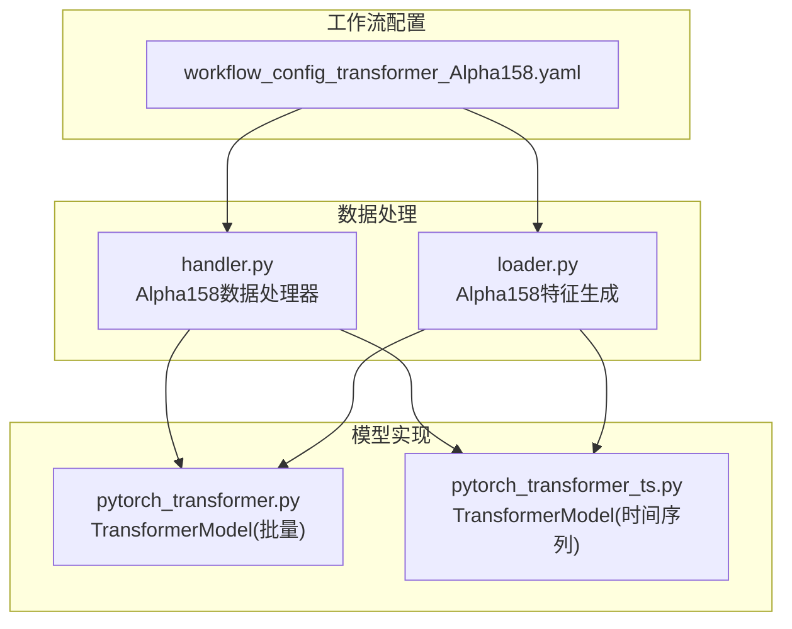
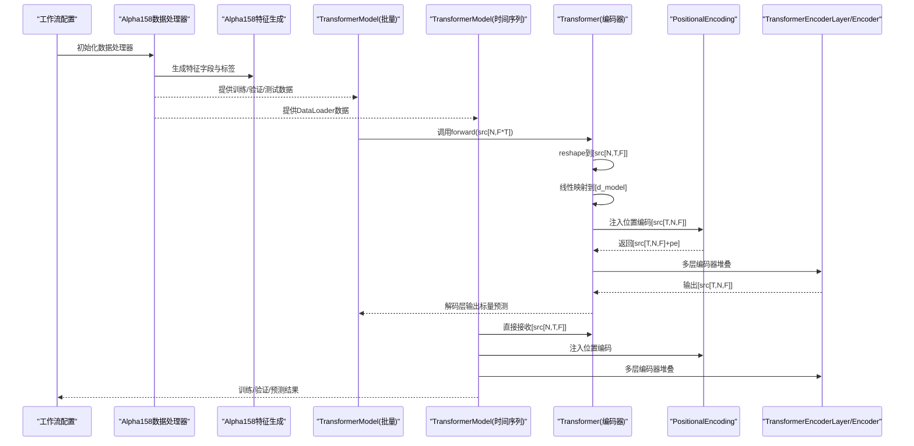
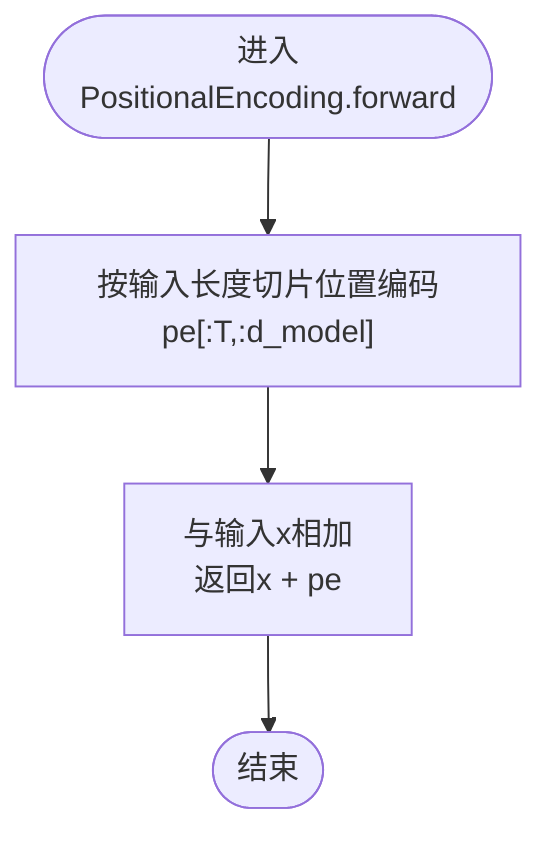
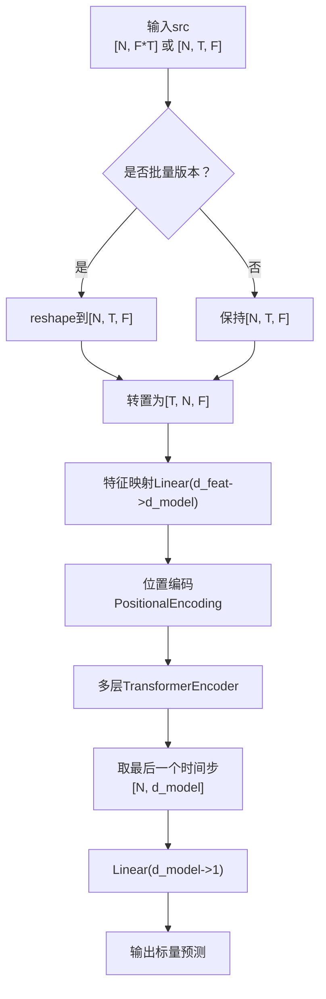
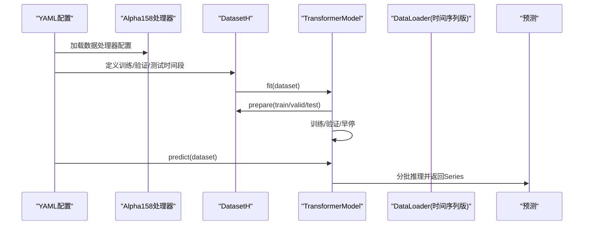
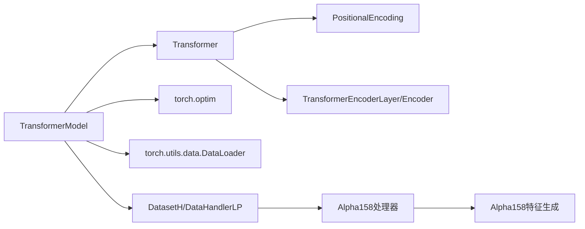

# Transformer模型

<cite>
**本文引用的文件列表**
- [pytorch_transformer.py](file://qlib/contrib/model/pytorch_transformer.py)
- [pytorch_transformer_ts.py](file://qlib/contrib/model/pytorch_transformer_ts.py)
- [workflow_config_transformer_Alpha158.yaml](file://examples/benchmarks/Transformer/workflow_config_transformer_Alpha158.yaml)
- [handler.py](file://qlib/contrib/data/handler.py)
- [loader.py](file://qlib/contrib/data/loader.py)
</cite>

## 目录
1. [简介](#简介)
2. [项目结构](#项目结构)
3. [核心组件](#核心组件)
4. [架构总览](#架构总览)
5. [详细组件分析](#详细组件分析)
6. [依赖关系分析](#依赖关系分析)
7. [性能考量](#性能考量)
8. [故障排查指南](#故障排查指南)
9. [结论](#结论)
10. [附录](#附录)

## 简介
本文件系统性地文档化Qlib中基于PyTorch实现的Transformer模型，重点覆盖以下方面：
- TransformerModel类的初始化参数与调优建议：d_feat、d_model、nhead、num_layers、dropout、batch_size、n_epochs、lr、early_stop、loss、optimizer、reg、n_jobs、GPU、seed等。
- PositionalEncoding类的正弦位置编码实现及其对序列顺序信息的保留方式。
- Transformer编码器结构（nn.TransformerEncoderLayer）在金融时序数据上的适配性，包括输入数据从[N, F*T]到[T, N, F]的维度变换逻辑。
- 多头自注意力机制在捕捉股票特征间非线性依赖关系中的优势。
- 结合workflow_config_transformer_Alpha158.yaml在实际工作流中的部署方法，提供训练、验证、预测的完整调用路径。
- 注意力权重提取与可视化的思路，帮助研究人员理解模型关注的重点特征。

## 项目结构
与Transformer模型直接相关的核心文件位于以下路径：
- 模型实现：qlib/contrib/model/pytorch_transformer.py（批量数据版本）、qlib/contrib/model/pytorch_transformer_ts.py（时间序列DataLoader版本）
- 工作流配置：examples/benchmarks/Transformer/workflow_config_transformer_Alpha158.yaml
- 数据处理器：qlib/contrib/data/handler.py（Alpha158数据处理器）、qlib/contrib/data/loader.py（Alpha158特征生成）

图表来源
- [pytorch_transformer.py](file://qlib/contrib/model/pytorch_transformer.py#L1-L286)
- [pytorch_transformer_ts.py](file://qlib/contrib/model/pytorch_transformer_ts.py#L1-L265)
- [workflow_config_transformer_Alpha158.yaml](file://examples/benchmarks/Transformer/workflow_config_transformer_Alpha158.yaml#L1-L88)
- [handler.py](file://qlib/contrib/data/handler.py#L98-L158)
- [loader.py](file://qlib/contrib/data/loader.py#L61-L260)

章节来源
- [pytorch_transformer.py](file://qlib/contrib/model/pytorch_transformer.py#L1-L286)
- [pytorch_transformer_ts.py](file://qlib/contrib/model/pytorch_transformer_ts.py#L1-L265)
- [workflow_config_transformer_Alpha158.yaml](file://examples/benchmarks/Transformer/workflow_config_transformer_Alpha158.yaml#L1-L88)
- [handler.py](file://qlib/contrib/data/handler.py#L98-L158)
- [loader.py](file://qlib/contrib/data/loader.py#L61-L260)

## 核心组件
- TransformerModel：封装了模型实例化、训练、评估、早停、保存与预测流程；支持Adam/GD优化器、MSE损失、NaN/Inf掩码处理。
- Transformer：核心网络，包含特征映射层、位置编码、多层Transformer编码器、线性解码层。
- PositionalEncoding：实现正弦/余弦位置编码，向序列元素注入相对位置信息。
- Alpha158数据处理器与特征生成：为模型提供金融时序特征与标签。

章节来源
- [pytorch_transformer.py](file://qlib/contrib/model/pytorch_transformer.py#L27-L286)
- [pytorch_transformer_ts.py](file://qlib/contrib/model/pytorch_transformer_ts.py#L25-L265)
- [handler.py](file://qlib/contrib/data/handler.py#L98-L158)
- [loader.py](file://qlib/contrib/data/loader.py#L61-L260)

## 架构总览
下图展示了从数据准备到模型训练与预测的整体流程，以及关键组件之间的交互。

图表来源
- [pytorch_transformer.py](file://qlib/contrib/model/pytorch_transformer.py#L157-L240)
- [pytorch_transformer_ts.py](file://qlib/contrib/model/pytorch_transformer_ts.py#L137-L220)
- [handler.py](file://qlib/contrib/data/handler.py#L98-L158)
- [loader.py](file://qlib/contrib/data/loader.py#L61-L260)

## 详细组件分析

### TransformerModel类与初始化参数
- d_feat：输入特征数量（原始特征维数），用于reshape与后续线性映射。
- d_model：嵌入维度，决定特征映射后的通道数与注意力头的隐空间大小。
- nhead：多头注意力头数，影响并行建模能力与特征间依赖捕获强度。
- num_layers：Transformer编码器层数，增加深度以提升表征复杂度。
- dropout：注意力与前馈子层的丢弃率，用于正则化。
- batch_size：批大小，影响内存占用与收敛稳定性。
- n_epochs：最大训练轮数，配合早停使用。
- lr：学习率，控制优化步长。
- early_stop：早停轮数阈值，防止过拟合。
- loss：损失函数类型（当前实现支持MSE）。
- optimizer：优化器选择（Adam/GD）。
- reg：权重衰减系数，L2正则。
- n_jobs：DataLoader并行加载进程数。
- GPU：GPU设备号，自动回退CPU。
- seed：随机种子，保证可复现性。

调优建议
- d_model：通常与特征维度成比例，建议从64~256起步，观察验证集表现再调整。
- nhead：建议为偶数且能被d_model整除，常见取值2、4、8。
- num_layers：从2开始，逐步增加至4~6，注意显存与过拟合风险。
- dropout：0.1~0.3之间，过大可能欠拟合，过小易过拟合。
- batch_size：根据显存容量选择，尽量使每个epoch内batch数量稳定。
- lr：Adam默认1e-4，若收敛慢可尝试1e-3或更小；GD需更小心设置。
- early_stop：建议5~10，避免过拟合。
- optimizer：优先Adam；若优化困难可尝试SGD。
- reg：1e-4~1e-2之间，结合dropout共同正则。

章节来源
- [pytorch_transformer.py](file://qlib/contrib/model/pytorch_transformer.py#L27-L79)
- [pytorch_transformer_ts.py](file://qlib/contrib/model/pytorch_transformer_ts.py#L25-L77)

### PositionalEncoding类：正弦位置编码
- 实现原理：通过构造固定频率的正弦/余弦序列，按奇偶列分别填充到位置编码矩阵，形成与模型维度一致的位置向量。
- 前向传播：将位置编码与输入张量按位置切片相加，保持形状[T, N, F]。
- 作用：为Transformer提供序列顺序信息，弥补其不带循环结构的局限。

图表来源
- [pytorch_transformer.py](file://qlib/contrib/model/pytorch_transformer.py#L242-L256)
- [pytorch_transformer_ts.py](file://qlib/contrib/model/pytorch_transformer_ts.py#L222-L236)

章节来源
- [pytorch_transformer.py](file://qlib/contrib/model/pytorch_transformer.py#L242-L256)
- [pytorch_transformer_ts.py](file://qlib/contrib/model/pytorch_transformer_ts.py#L222-L236)

### Transformer编码器结构与维度变换
- 输入格式差异：
  - 批量版本：输入为[N, F*T]，先reshape为[N, T, F]，再转置为[T, N, F]。
  - 时间序列版本：输入即为[N, T, F]，直接转置为[T, N, F]。
- 特征映射：通过Linear(d_feat, d_model)将每步特征投影到统一隐空间。
- 位置编码：在转置后注入位置信息。
- 编码器堆叠：使用nn.TransformerEncoderLayer构建多层编码器，逐层抽取上下文依赖。
- 解码输出：取最后一个时间步的隐藏状态，经Linear(d_model, 1)得到标量预测。

图表来源
- [pytorch_transformer.py](file://qlib/contrib/model/pytorch_transformer.py#L258-L286)
- [pytorch_transformer_ts.py](file://qlib/contrib/model/pytorch_transformer_ts.py#L238-L265)

章节来源
- [pytorch_transformer.py](file://qlib/contrib/model/pytorch_transformer.py#L258-L286)
- [pytorch_transformer_ts.py](file://qlib/contrib/model/pytorch_transformer_ts.py#L238-L265)

### 多头自注意力机制在金融时序中的优势
- 并行建模：多头注意力允许模型同时关注不同子空间的特征关系，适合捕捉跨时间窗口与跨特征的非线性依赖。
- 上下文感知：通过掩码与堆叠层，模型能够利用历史窗口内的全局依赖，识别趋势、动量与反转信号。
- 可解释性：通过注意力权重可视化，可以定位模型在特定样本上关注的关键特征与时间点，辅助策略设计与风险控制。

（本节为概念性说明，不直接分析具体代码文件）

### 在工作流中部署Transformer模型（Alpha158）
- 数据处理器：Alpha158提供特征字段与标签配置，支持价格、滚动统计等因子。
- 工作流配置：workflow_config_transformer_Alpha158.yaml定义了数据预处理、模型参数、数据集划分、记录器等。
- 训练流程：模型fit阶段通过DatasetH.prepare获取训练/验证集，执行早停与最佳模型保存。
- 预测流程：predict阶段对测试集进行分批推理，返回Series索引与预测值。

图表来源
- [workflow_config_transformer_Alpha158.yaml](file://examples/benchmarks/Transformer/workflow_config_transformer_Alpha158.yaml#L1-L88)
- [handler.py](file://qlib/contrib/data/handler.py#L98-L158)
- [pytorch_transformer_ts.py](file://qlib/contrib/model/pytorch_transformer_ts.py#L137-L220)

章节来源
- [workflow_config_transformer_Alpha158.yaml](file://examples/benchmarks/Transformer/workflow_config_transformer_Alpha158.yaml#L1-L88)
- [handler.py](file://qlib/contrib/data/handler.py#L98-L158)
- [pytorch_transformer_ts.py](file://qlib/contrib/model/pytorch_transformer_ts.py#L137-L220)

### 注意力权重提取与可视化（方法论）
- 方法思路：在Transformer编码器内部，多头注意力会输出注意力权重张量。可通过Hook或修改模型forward返回中间变量的方式收集注意力权重。
- 可视化建议：对单个样本的时间步与特征维度进行热力图展示，标注关键特征名称，观察模型在不同时间窗口的关注焦点。
- 注意事项：需要确保模型处于eval模式，避免梯度计算与dropout影响；对大规模数据采用抽样可视化。

（本节为方法论说明，不直接分析具体代码文件）

## 依赖关系分析
- 模块耦合：
  - TransformerModel依赖于Transformer模块与PyTorch nn组件。
  - 数据侧依赖Alpha158处理器与特征生成器，提供标准化的特征与标签。
- 外部依赖：
  - PyTorch（nn、optim、DataLoader）。
  - Qlib数据与工作流组件（DatasetH、DataHandlerLP、record_temp）。

图表来源
- [pytorch_transformer.py](file://qlib/contrib/model/pytorch_transformer.py#L27-L286)
- [pytorch_transformer_ts.py](file://qlib/contrib/model/pytorch_transformer_ts.py#L25-L265)
- [handler.py](file://qlib/contrib/data/handler.py#L98-L158)
- [loader.py](file://qlib/contrib/data/loader.py#L61-L260)

章节来源
- [pytorch_transformer.py](file://qlib/contrib/model/pytorch_transformer.py#L27-L286)
- [pytorch_transformer_ts.py](file://qlib/contrib/model/pytorch_transformer_ts.py#L25-L265)
- [handler.py](file://qlib/contrib/data/handler.py#L98-L158)
- [loader.py](file://qlib/contrib/data/loader.py#L61-L260)

## 性能考量
- 显存与吞吐：增大batch_size与d_model会显著提升显存占用；合理设置num_layers与nhead平衡表达能力与速度。
- 训练稳定性：使用Adam与适当dropout有助于稳定训练；学习率过低导致收敛慢，过高可能导致震荡。
- 数据预处理：Alpha158特征工程已对价格与滚动统计进行归一化与缺失值处理，减少训练噪声。
- 早停与正则：结合early_stop与weight decay，有效缓解过拟合。

（本节提供一般性指导，不直接分析具体文件）

## 故障排查指南
- 空数据报错：当数据集为空时，fit阶段会抛出异常。检查数据时间范围与过滤条件。
- 设备不可用：GPU不可用时自动回退CPU；如需强制使用GPU，请确认设备号与驱动安装。
- 损失与指标：当前仅支持MSE损失与“loss”指标；其他指标会抛出异常。
- NaN/Inf处理：损失函数对NaN/Inf进行掩码，确保训练稳定。

章节来源
- [pytorch_transformer.py](file://qlib/contrib/model/pytorch_transformer.py#L157-L206)
- [pytorch_transformer_ts.py](file://qlib/contrib/model/pytorch_transformer_ts.py#L137-L199)

## 结论
Qlib中的Transformer模型通过简洁的编码器结构与标准的数据处理管线，实现了对金融时序数据的有效建模。PositionalEncoding保留了序列顺序信息，多头自注意力增强了特征间的非线性关联建模能力。结合Alpha158特征工程与工作流配置，用户可在相同框架下快速部署与迭代。建议从合理的超参数起点出发，结合早停与正则策略，逐步优化模型性能。

（本节为总结性内容，不直接分析具体文件）

## 附录
- 关键实现路径参考：
  - TransformerModel初始化与训练流程：[pytorch_transformer.py](file://qlib/contrib/model/pytorch_transformer.py#L27-L215)、[pytorch_transformer_ts.py](file://qlib/contrib/model/pytorch_transformer_ts.py#L25-L200)
  - Transformer前向与维度变换：[pytorch_transformer.py](file://qlib/contrib/model/pytorch_transformer.py#L258-L286)、[pytorch_transformer_ts.py](file://qlib/contrib/model/pytorch_transformer_ts.py#L238-L265)
  - Alpha158特征与标签配置：[handler.py](file://qlib/contrib/data/handler.py#L98-L158)、[loader.py](file://qlib/contrib/data/loader.py#L61-L260)
  - 工作流配置与记录器：[workflow_config_transformer_Alpha158.yaml](file://examples/benchmarks/Transformer/workflow_config_transformer_Alpha158.yaml#L1-L88)