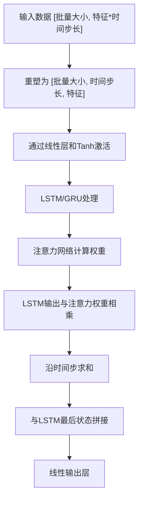
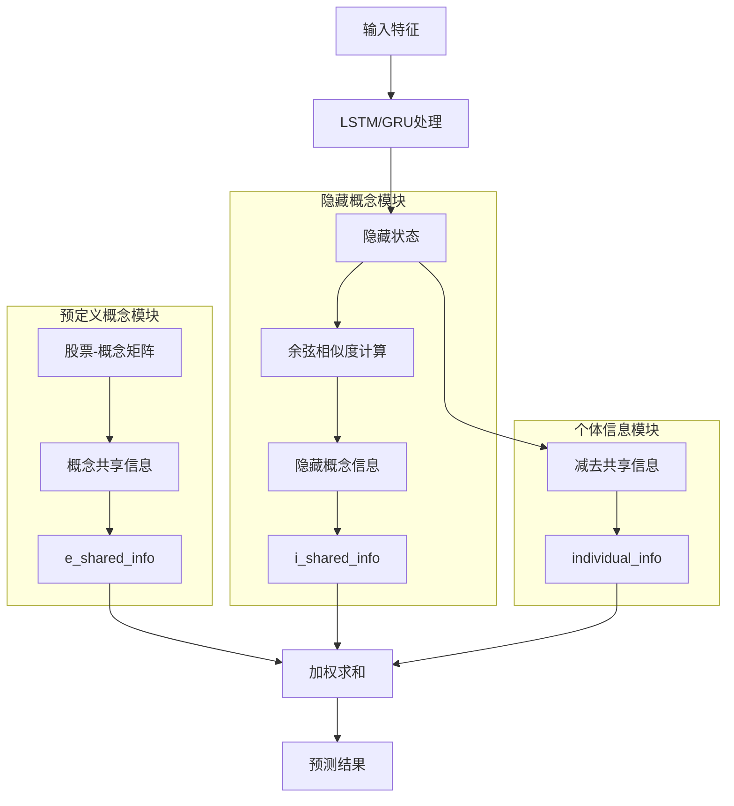

# 注意力模型

<cite>
**本文档引用的文件**
- [pytorch_transformer.py](file://qlib/contrib/model/pytorch_transformer.py)
- [pytorch_alstm.py](file://qlib/contrib/model/pytorch_alstm.py)
- [pytorch_hist.py](file://qlib/contrib/model/pytorch_hist.py)
- [pytorch_sfm.py](file://qlib/contrib/model/pytorch_sfm.py)
- [workflow_config_transformer_Alpha360.yaml](file://examples/benchmarks/Transformer/workflow_config_transformer_Alpha360.yaml)
- [workflow_config_alstm_Alpha360.yaml](file://examples/benchmarks/ALSTM/workflow_config_alstm_Alpha360.yaml)
- [workflow_config_hist_Alpha360.yaml](file://examples/benchmarks/HIST/workflow_config_hist_Alpha360.yaml)
- [workflow_config_sfm_Alpha360.yaml](file://examples/benchmarks/SFM/workflow_config_sfm_Alpha360.yaml)
</cite>

## 目录
1. [引言](#引言)
2. [标准Transformer模型](#标准transformer模型)
3. [ALSTM模型](#alstm模型)
4. [HIST模型](#hist模型)
5. [SFM模型](#sfm模型)
6. [注意力权重可视化](#注意力权重可视化)

## 引言
Qlib中的注意力机制模型家族包含多种先进的深度学习架构，包括标准Transformer、ALSTM、HIST和SFM等。这些模型通过不同的注意力机制设计来增强金融时间序列预测的性能。本文档将深入解析这些模型的实现细节、架构差异和调优策略。

## 标准Transformer模型
标准Transformer模型在Qlib中通过`pytorch_transformer.py`文件实现，采用多头自注意力机制处理金融时间序列数据。

### 多头自注意力机制实现
Transformer模型的核心是多头自注意力机制，通过`nn.TransformerEncoder`实现。模型首先将输入特征通过线性层映射到指定维度，然后添加位置编码以保留时间序列的顺序信息。

### 位置编码
位置编码通过`PositionalEncoding`类实现，采用正弦和余弦函数的组合来为序列中的每个位置生成唯一的编码向量。这种编码方式能够使模型学习到相对位置信息，对于时间序列预测至关重要。

### 注意力权重计算与掩码处理
在前向传播过程中，输入数据首先被重塑为[批量大小, 特征维度, 时间步长]的形状，然后转置为[时间步长, 批量大小, 特征维度]以适应PyTorch的Transformer实现。注意力权重的计算由PyTorch内置的Transformer编码器自动完成，而掩码处理则通过在损失函数中忽略NaN标签来实现。

### 配置参数调优
从`workflow_config_transformer_Alpha360.yaml`配置文件可以看出，关键参数包括：
- `d_feat`: 输入特征维度，设置为6
- `d_model`: 模型维度，影响注意力机制的表示能力
- `nhead`: 注意力头数，决定并行注意力计算的数量
- `num_layers`: Transformer编码器层数，影响模型深度

**Section sources**
- [pytorch_transformer.py](file://qlib/contrib/model/pytorch_transformer.py#L27-L286)
- [workflow_config_transformer_Alpha360.yaml](file://examples/benchmarks/Transformer/workflow_config_transformer_Alpha360.yaml#L45-L63)

## ALSTM模型
ALSTM模型将注意力机制融入LSTM单元，以增强特征选择能力。

### 注意力机制与LSTM的融合
ALSTM模型通过在LSTM输出后添加注意力网络来实现特征选择。具体来说，模型首先使用LSTM或GRU处理时间序列数据，然后通过一个独立的注意力网络计算每个时间步的重要性权重。

### 与基础LSTM的结构差异
与基础LSTM相比，ALSTM的主要差异在于：
1. 添加了专门的注意力网络(`att_net`)，用于计算时间步的注意力权重
2. 最终输出是LSTM最后一个时间步的隐藏状态与注意力加权和的拼接
3. 使用Tanh激活函数和Softmax归一化来确保注意力权重的合理分布

**Diagram sources**
- [pytorch_alstm.py](file://qlib/contrib/model/pytorch_alstm.py#L294-L345)

### 配置参数调优
从`workflow_config_alstm_Alpha360.yaml`配置文件可以看出，关键参数包括：
- `hidden_size`: LSTM隐藏层大小，设置为64
- `num_layers`: LSTM层数，设置为2
- `rnn_type`: RNN类型，支持LSTM和GRU
- `batch_size`: 批量大小，设置为800

**Section sources**
- [pytorch_alstm.py](file://qlib/contrib/model/pytorch_alstm.py#L25-L345)
- [workflow_config_alstm_Alpha360.yaml](file://examples/benchmarks/ALSTM/workflow_config_alstm_Alpha360.yaml#L45-L73)

## HIST模型
HIST模型采用分层注意力设计，用于捕捉时间与实体间的双重依赖关系。

### 分层注意力设计
HIST模型的创新之处在于其分层注意力机制，包含三个主要模块：
1. **预定义概念模块**: 利用股票到概念的映射矩阵，捕捉行业和概念层面的共性信息
2. **隐藏概念模块**: 通过余弦相似度计算，发现数据中潜在的概念结构
3. **个体信息模块**: 捕捉每个股票独特的特征信息

### 双重依赖关系捕捉
模型通过以下方式捕捉时间与实体间的双重依赖：
- 时间依赖: 通过LSTM或GRU处理时间序列数据
- 实体依赖: 通过概念矩阵和余弦相似度计算股票间的关联性

**Diagram sources**
- [pytorch_hist.py](file://qlib/contrib/model/pytorch_hist.py#L365-L501)

### 配置参数调优
从`workflow_config_hist_Alpha360.yaml`配置文件可以看出，关键参数包括：
- `base_model`: 基础模型类型，可选LSTM或GRU
- `model_path`: 预训练模型路径
- `stock2concept`: 股票到概念的映射文件路径
- `stock_index`: 股票索引文件路径

**Section sources**
- [pytorch_hist.py](file://qlib/contrib/model/pytorch_hist.py#L25-L501)
- [workflow_config_hist_Alpha360.yaml](file://examples/benchmarks/HIST/workflow_config_hist_Alpha360.yaml#L45-L75)

## SFM模型
SFM模型通过可学习的特征权重实现动态特征融合。

### 动态特征融合机制
SFM模型的核心是其独特的动态特征融合机制，通过频率维度和注意力机制的结合来实现：
- 模型为每个特征学习一个频率表示，捕捉不同特征的时间模式
- 使用注意力机制动态调整特征的重要性权重
- 通过复数神经网络结构处理周期性模式

### 可学习特征权重
SFM模型中的可学习权重包括：
- `W_fre`和`U_fre`: 特征到频率空间的映射矩阵
- `U_a`: 频率注意力权重，决定不同频率成分的重要性
- 各个门控机制的权重矩阵，控制信息流动

### 配置参数调优
从`workflow_config_sfm_Alpha360.yaml`配置文件可以看出，关键参数包括：
- `freq_dim`: 频率维度，设置为25
- `output_dim`: 输出维度，设置为32
- `dropout_W`和`dropout_U`: 输入和隐藏层的dropout率
- `n_epochs`: 训练轮数，设置为20

**Section sources**
- [pytorch_sfm.py](file://qlib/contrib/model/pytorch_sfm.py#L25-L480)
- [workflow_config_sfm_Alpha360.yaml](file://examples/benchmarks/SFM/workflow_config_sfm_Alpha360.yaml#L45-L75)

## 注意力权重可视化
为了帮助用户理解模型决策过程，可以采用以下方法进行注意力权重可视化：

1. **提取注意力权重**: 对于ALSTM模型，可以从`att_net`的输出获取时间步的注意力权重
2. **绘制热力图**: 将注意力权重按时间步和样本绘制为热力图，直观显示模型关注的重点
3. **时间序列对比**: 将高注意力权重对应的时间段与实际市场走势进行对比分析
4. **特征重要性分析**: 结合注意力权重分析不同特征的重要性变化

这些可视化方法可以帮助用户验证模型是否学习到了合理的市场模式，以及识别模型可能存在的偏差或异常行为。

**Section sources**
- [pytorch_alstm.py](file://qlib/contrib/model/pytorch_alstm.py#L320-L332)
- [pytorch_transformer.py](file://qlib/contrib/model/pytorch_transformer.py#L263-L264)