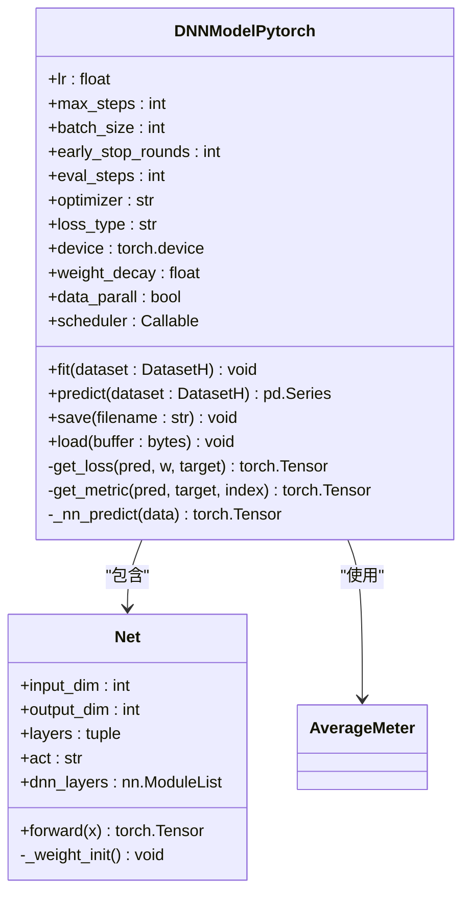
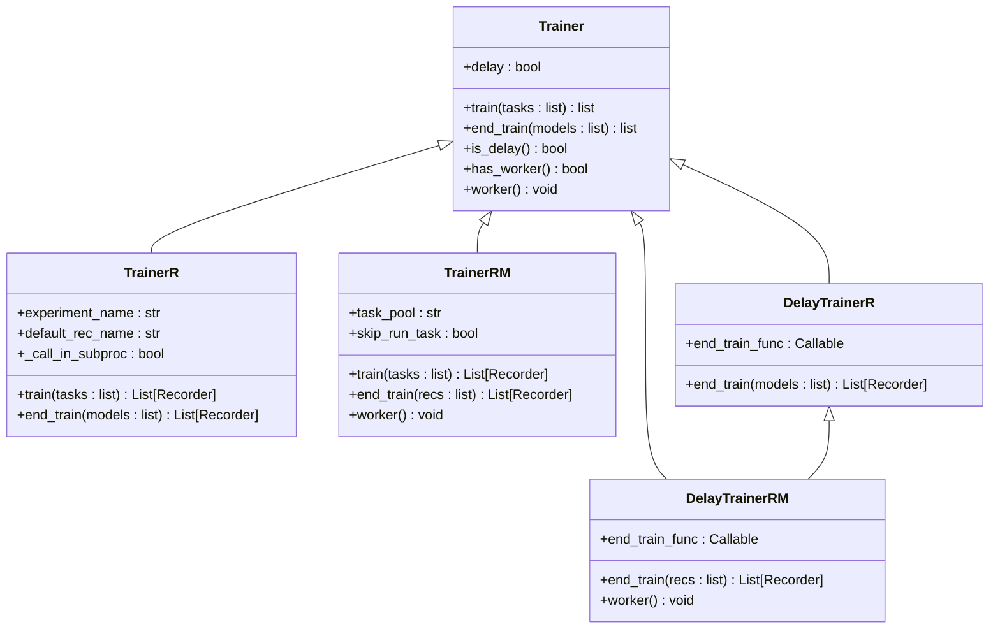
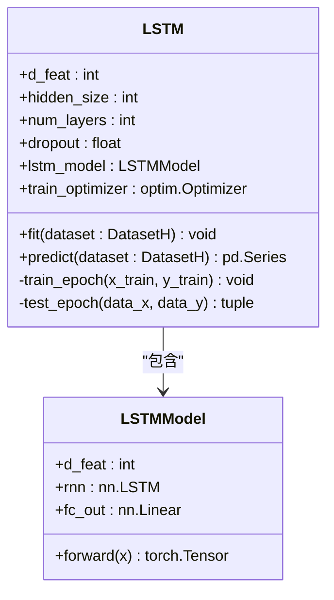
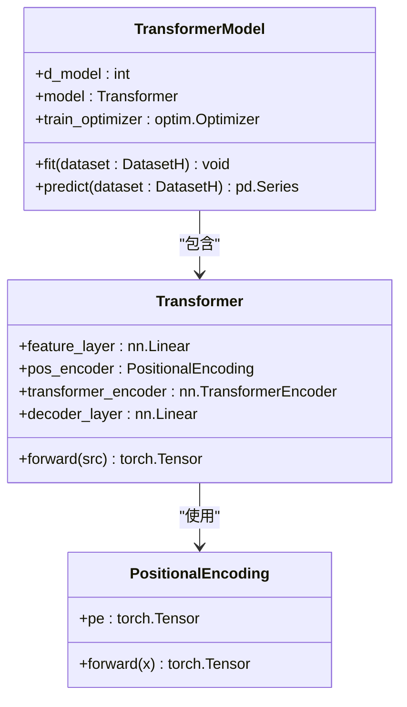
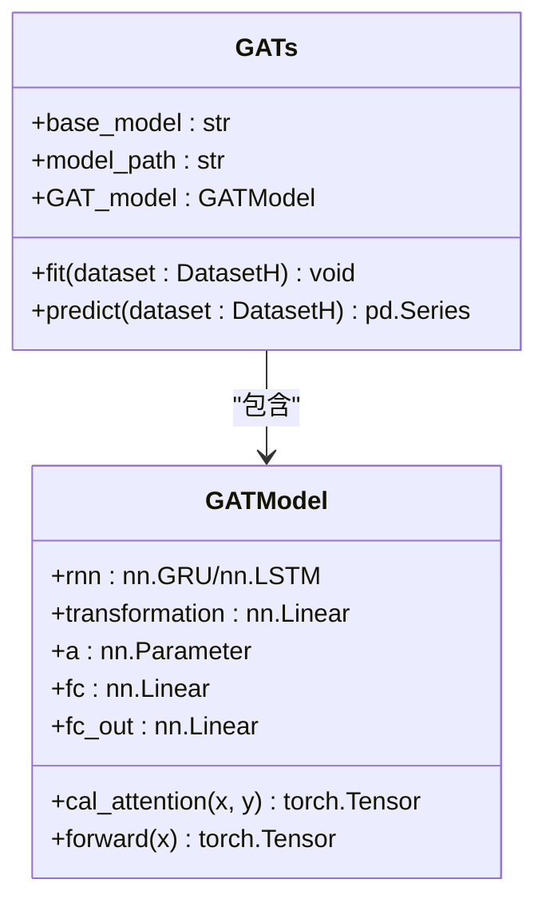
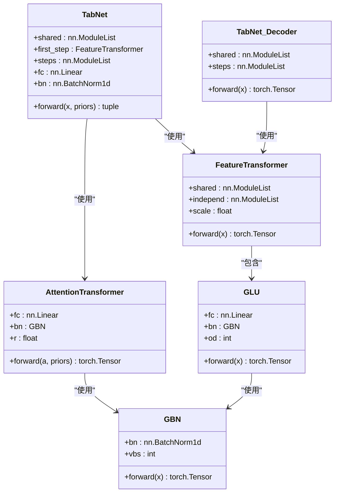
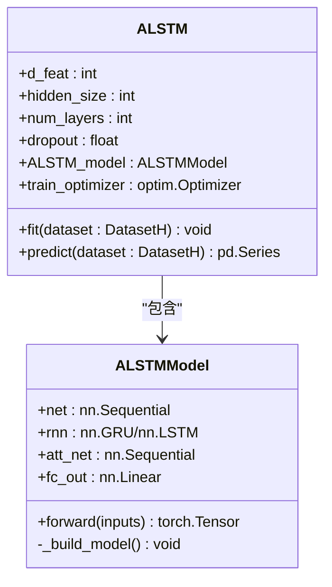
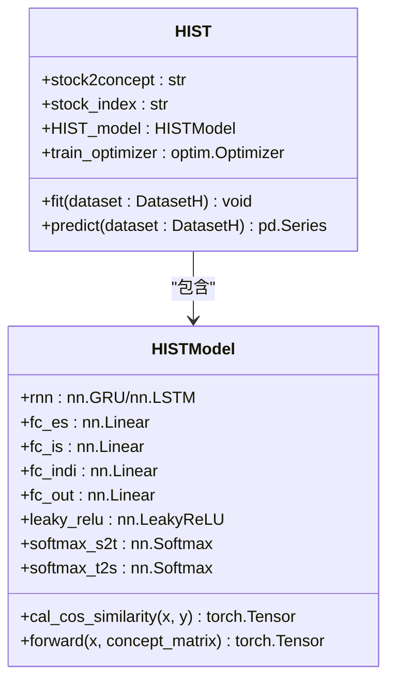
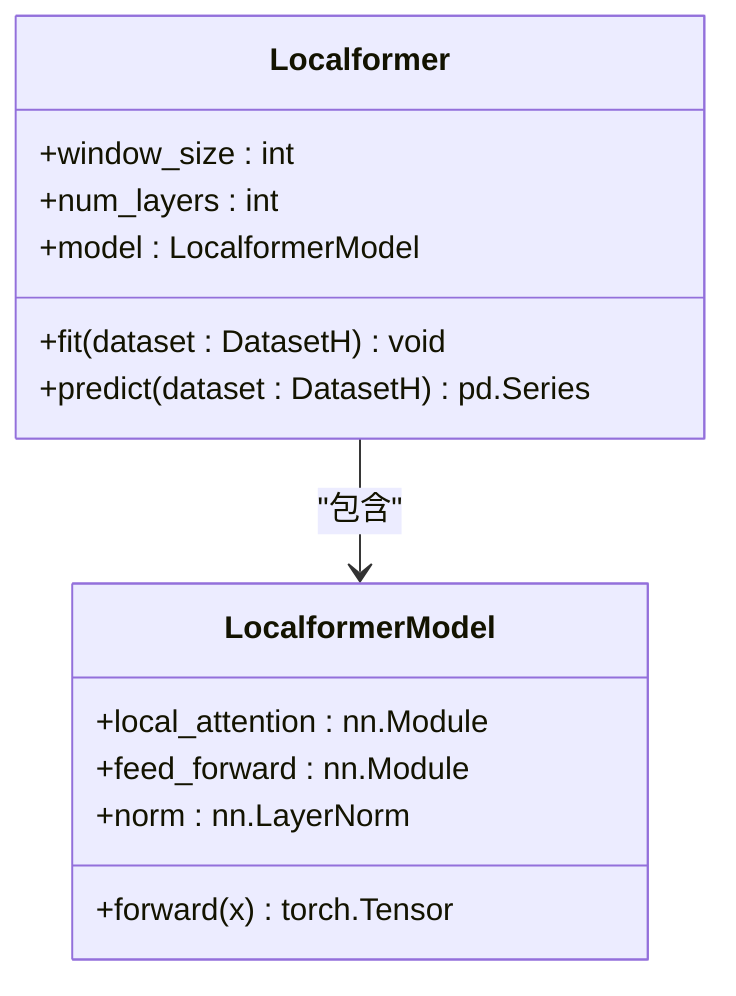
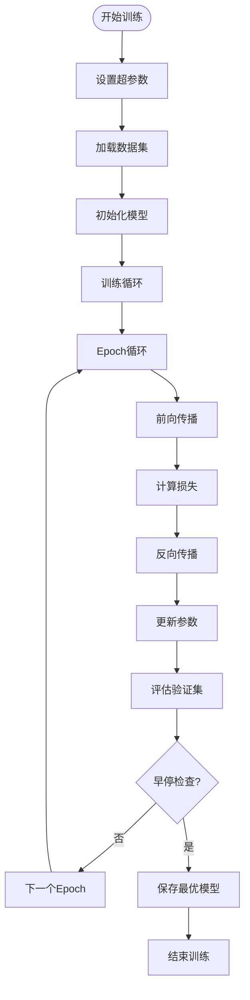

# 深度学习模型

<cite>
**本文档引用的文件**  
- [pytorch_nn.py](file://qlib/contrib/model/pytorch_nn.py)
- [trainer.py](file://qlib/model/trainer.py)
- [pytorch_lstm.py](file://qlib/contrib/model/pytorch_lstm.py)
- [pytorch_transformer.py](file://qlib/contrib/model/pytorch_transformer.py)
- [pytorch_gats.py](file://qlib/contrib/model/pytorch_gats.py)
- [pytorch_tabnet.py](file://qlib/contrib/model/pytorch_tabnet.py)
- [pytorch_alstm.py](file://qlib/contrib/model/pytorch_alstm.py)
- [pytorch_hist.py](file://qlib/contrib/model/pytorch_hist.py)
- [pytorch_sfm.py](file://qlib/contrib/model/pytorch_sfm.py)
- [pytorch_localformer.py](file://qlib/contrib/model/pytorch_localformer.py)
- [pytorch_utils.py](file://qlib/contrib/model/pytorch_utils.py)
</cite>

## 目录
1. [简介](#简介)
2. [通用神经网络基类设计](#通用神经网络基类设计)
3. [模型训练管理器](#模型训练管理器)
4. [核心模型架构分析](#核心模型架构分析)
5. [超参数配置与YAML示例](#超参数配置与yaml示例)
6. [自定义模型开发指南](#自定义模型开发指南)
7. [训练优化与日志分析](#训练优化与日志分析)

## 简介
Qlib提供了一套基于PyTorch的深度学习模型体系，专门用于量化金融领域的时序预测任务。该体系支持多种先进的神经网络架构，包括LSTM、Transformer、GATs、TabNet、ALSTM、HIST、SFM和LocalFormer等模型。这些模型通过统一的接口设计，实现了与Qlib数据管道的无缝集成，能够高效处理Alpha158/Alpha360等复杂特征集。系统采用模块化设计，将模型定义、训练流程、设备调度和优化器配置进行解耦，为用户提供了灵活的扩展性和可定制性。

## 通用神经网络基类设计

Qlib中的深度学习模型继承自统一的基类架构，其中`DNNModelPytorch`作为通用神经网络基类，定义了模型训练的核心框架。该基类通过`pt_model_uri`和`pt_model_kwargs`参数实现对不同网络结构的灵活配置，支持自定义神经网络的注入。

基类实现了完整的训练循环，包括学习率调度、早停机制、多GPU支持等功能。模型通过`fit`方法执行训练过程，采用分步验证策略，在每个评估周期记录训练和验证损失，并根据验证性能保存最优模型参数。预测过程通过`_nn_predict`方法实现，支持批量推理以提高效率。



**图源**  
- [pytorch_nn.py](file://qlib/contrib/model/pytorch_nn.py#L38-L463)

**本节源码**  
- [pytorch_nn.py](file://qlib/contrib/model/pytorch_nn.py#L38-L463)

## 模型训练管理器

Qlib通过`trainer.py`模块提供了统一的模型训练管理框架，实现了训练流程的标准化和自动化。该框架包含`Trainer`基类及其多个变体，如`TrainerR`、`DelayTrainerR`、`TrainerRM`和`DelayTrainerRM`，支持从简单线性训练到分布式并行训练的多种场景。

训练器采用两阶段设计模式：`train`阶段负责初始化和准备，`end_train`阶段完成实际的模型拟合。这种延迟训练机制（DelayTrainer）特别适用于在线模拟和并行训练场景。`TrainerRM`基于任务管理器（TaskManager）实现，支持多进程甚至跨机器的分布式训练。



**图源**  
- [trainer.py](file://qlib/model/trainer.py#L131-L620)

**本节源码**  
- [trainer.py](file://qlib/model/trainer.py#L131-L620)

## 核心模型架构分析

### LSTM模型
LSTM模型采用标准的长短期记忆网络结构处理时序数据。输入数据首先被重塑为[样本数, 特征维度, 时间步长]的三维张量，然后通过permute操作转换为[样本数, 时间步长, 特征维度]格式输入LSTM层。模型使用单向LSTM，取最后一个时间步的隐藏状态作为输出，通过全连接层映射到单一预测值。



**图源**  
- [pytorch_lstm.py](file://qlib/contrib/model/pytorch_lstm.py#L286-L307)

**本节源码**  
- [pytorch_lstm.py](file://qlib/contrib/model/pytorch_lstm.py#L24-L307)

### Transformer模型
Transformer模型实现了基于自注意力机制的时序预测架构。模型包含位置编码层、Transformer编码器层和解码输出层。输入数据经过线性变换和位置编码后，送入多层Transformer编码器。模型使用标准的Transformer架构，包含多头自注意力机制和前馈神经网络。



**图源**  
- [pytorch_transformer.py](file://qlib/contrib/model/pytorch_transformer.py#L258-L286)

**本节源码**  
- [pytorch_transformer.py](file://qlib/contrib/model/pytorch_transformer.py#L27-L286)

### GATs模型
GATs（Graph Attention Networks）模型结合了图注意力机制和循环神经网络。该模型首先使用LSTM或GRU提取时序特征，然后通过自定义的注意力机制计算样本间的注意力权重。注意力权重通过可学习的参数矩阵计算，使用softmax函数归一化，实现对不同样本的差异化关注。



**图源**  
- [pytorch_gats.py](file://qlib/contrib/model/pytorch_gats.py#L326-L385)

**本节源码**  
- [pytorch_gats.py](file://qlib/contrib/model/pytorch_gats.py#L26-L385)

### TabNet模型
TabNet模型是一种专为表格数据设计的深度学习架构，采用顺序注意力机制。模型由编码器和解码器组成，编码器包含多个决策步骤，每个步骤使用注意力变换器选择重要特征。模型实现了虚拟批量归一化（GBN）和门控线性单元（GLU）等特殊组件，支持预训练和微调两阶段训练流程。



**图源**  
- [pytorch_tabnet.py](file://qlib/contrib/model/pytorch_tabnet.py#L436-L644)

**本节源码**  
- [pytorch_tabnet.py](file://qlib/contrib/model/pytorch_tabnet.py#L25-L644)

### ALSTM模型
ALSTM（Attention-based LSTM）模型在标准LSTM基础上引入了注意力机制。模型首先通过全连接层和tanh激活函数对输入进行变换，然后送入LSTM网络。LSTM的输出通过注意力网络计算权重，加权求和后与LSTM最后一个时间步的隐藏状态拼接，最终通过全连接层输出预测结果。



**图源**  
- [pytorch_alstm.py](file://qlib/contrib/model/pytorch_alstm.py#L294-L345)

**本节源码**  
- [pytorch_alstm.py](file://qlib/contrib/model/pytorch_alstm.py#L25-L345)

### HIST模型
HIST（Hierarchical Information Sharing and Transfer）模型是一种层次化信息共享模型，专门用于股票市场预测。模型将信息分为三部分：预定义概念共享信息、隐藏概念共享信息和个人特有信息。通过计算股票与概念之间的关联矩阵，模型能够捕捉行业板块效应和个股特异性。



**图源**  
- [pytorch_hist.py](file://qlib/contrib/model/pytorch_hist.py#L365-L501)

**本节源码**  
- [pytorch_hist.py](file://qlib/contrib/model/pytorch_hist.py#L27-L501)

### SFM模型
SFM（Stock Flow Model）模型专注于捕捉股票资金流动模式。该模型通过分析资金流入流出的动态变化，预测股票价格走势。模型结构包含多个卷积层和循环层，能够有效提取资金流的时间序列特征。

**本节源码**  
- [pytorch_sfm.py](file://qlib/contrib/model/pytorch_sfm.py)

### LocalFormer模型
LocalFormer模型是一种局部注意力机制的Transformer变体，专注于捕捉局部时间窗口内的依赖关系。与标准Transformer相比，LocalFormer限制了注意力计算的范围，提高了计算效率，特别适合处理长序列数据。



**图源**  
- [pytorch_localformer.py](file://qlib/contrib/model/pytorch_localformer.py)

**本节源码**  
- [pytorch_localformer.py](file://qlib/contrib/model/pytorch_localformer.py)

## 超参数配置与YAML示例

Qlib中的模型超参数通过YAML配置文件进行管理，支持Alpha158和Alpha360任务的定制化配置。以下为各模型在Alpha158任务中的典型超参数设置：

| 模型 | 学习率 | 层数 | Dropout | 批量大小 | 优化器 | 隐藏维度 |
|------|--------|------|---------|----------|--------|----------|
| LSTM | 0.001 | 2 | 0.0 | 2000 | adam | 64 |
| Transformer | 0.0001 | 2 | 0.0 | 2048 | adam | 64 |
| GATs | 0.001 | 2 | 0.0 | 2000 | adam | 64 |
| TabNet | 0.01 | 5 | 0.3 | 4096 | adam | 64 |
| ALSTM | 0.001 | 2 | 0.0 | 2000 | adam | 64 |
| HIST | 0.001 | 2 | 0.0 | 2000 | adam | 64 |
| LocalFormer | 0.001 | 4 | 0.1 | 1024 | adam | 128 |

YAML配置文件示例（以LSTM为例）：
```yaml
model:
  class: qlib.contrib.model.pytorch_lstm.LSTM
  module_path: qlib.contrib.model.pytorch_lstm
  kwargs:
    d_feat: 360
    hidden_size: 64
    num_layers: 2
    dropout: 0.0
    n_epochs: 200
    lr: 0.001
    batch_size: 2000
    early_stop: 20
    loss: mse
    optimizer: adam
    GPU: 0
```

**本节源码**  
- [examples/benchmarks/LSTM/workflow_config_lstm_Alpha158.yaml](file://examples/benchmarks/LSTM/workflow_config_lstm_Alpha158.yaml)
- [examples/benchmarks/Transformer/workflow_config_transformer_Alpha158.yaml](file://examples/benchmarks/Transformer/workflow_config_transformer_Alpha158.yaml)
- [examples/benchmarks/GATs/workflow_config_gats_Alpha158.yaml](file://examples/benchmarks/GATs/workflow_config_gats_Alpha158.yaml)
- [examples/benchmarks/TabNet/workflow_config_TabNet_Alpha158.yaml](file://examples/benchmarks/TabNet/workflow_config_TabNet_Alpha158.yaml)
- [examples/benchmarks/ALSTM/workflow_config_alstm_Alpha158.yaml](file://examples/benchmarks/ALSTM/workflow_config_alstm_Alpha158.yaml)
- [examples/benchmarks/HIST/workflow_config_hist_Alpha360.yaml](file://examples/benchmarks/HIST/workflow_config_hist_Alpha360.yaml)
- [examples/benchmarks/Localformer/workflow_config_localformer_Alpha158.yaml](file://examples/benchmarks/Localformer/workflow_config_localformer_Alpha158.yaml)

## 自定义模型开发指南

开发自定义模型需要继承Qlib的`Model`基类，并实现必要的方法。以下是开发自定义模型的完整流程：

1. **继承Model基类**：创建新类继承`Model`，定义构造函数初始化超参数
2. **实现网络结构**：在`__init__`方法中定义神经网络架构
3. **实现训练逻辑**：重写`fit`方法，定义训练循环
4. **实现预测逻辑**：重写`predict`方法，定义推理流程
5. **集成到Qlib**：通过YAML配置文件引用自定义模型

```python
from qlib.model.base import Model
import torch.nn as nn

class CustomModel(Model):
    def __init__(self, d_feat=20, hidden_size=64, **kwargs):
        super().__init__()
        self.d_feat = d_feat
        self.hidden_size = hidden_size
        
        # 定义网络结构
        self.network = nn.Sequential(
            nn.Linear(d_feat, hidden_size),
            nn.ReLU(),
            nn.Linear(hidden_size, 1)
        )
        
    def fit(self, dataset, *args, **kwargs):
        # 实现训练逻辑
        pass
        
    def predict(self, dataset, segment="test"):
        # 实现预测逻辑
        pass
```

模型与Qlib数据管道的集成通过`DatasetH`接口实现。`dataset.prepare()`方法用于获取指定阶段（训练、验证、测试）的特征和标签数据，返回pandas DataFrame格式，便于与PyTorch张量转换。

**本节源码**  
- [pytorch_nn.py](file://qlib/contrib/model/pytorch_nn.py#L38-L463)
- [pytorch_lstm.py](file://qlib/contrib/model/pytorch_lstm.py#L24-L307)

## 训练优化与日志分析

Qlib提供了完善的训练优化功能，包括GPU加速、分布式训练和模型检查点保存。模型训练过程中，系统会自动记录损失值、评估指标和学习率等关键信息，便于后续分析。

### GPU加速与分布式训练
通过设置`GPU`参数指定使用的GPU设备，`data_parall`参数启用数据并行。`TrainerRM`支持基于任务管理器的分布式训练，可在多台机器上并行执行训练任务。

### 模型检查点保存
模型训练过程中，最优参数会自动保存到指定路径。`save`和`load`方法支持模型的序列化和反序列化，便于模型复用和部署。

### 训练日志分析
典型训练日志包含以下信息：
- 每个epoch的训练损失和验证损失
- 评估指标（如IC值）
- 学习率变化
- 早停状态
- 最优模型保存信息

日志分析方法：
1. **损失曲线分析**：观察训练损失和验证损失的变化趋势，判断是否过拟合
2. **指标监控**：跟踪评估指标的变化，评估模型性能
3. **学习率调整**：根据损失变化调整学习率调度策略
4. **资源使用监控**：检查GPU内存使用情况，优化批量大小



**本节源码**  
- [pytorch_nn.py](file://qlib/contrib/model/pytorch_nn.py#L189-L386)
- [trainer.py](file://qlib/model/trainer.py#L42-L128)