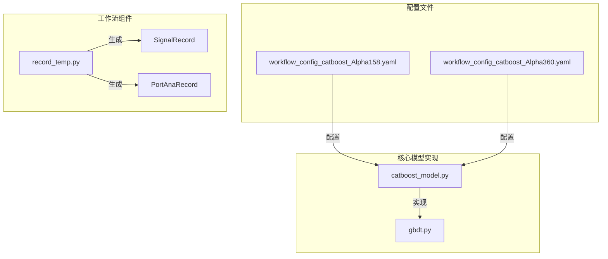
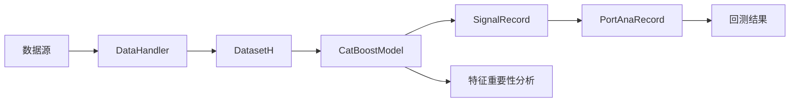
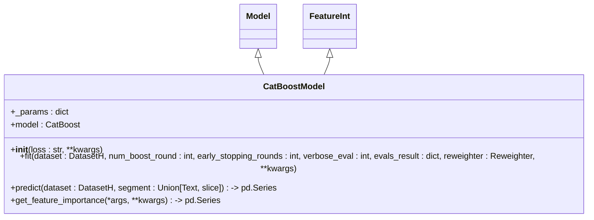
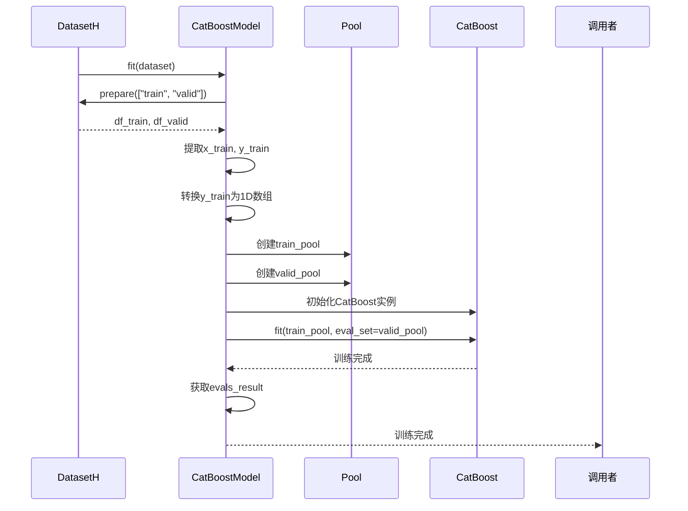
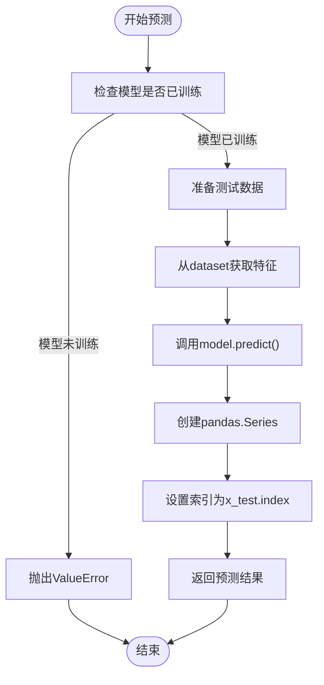
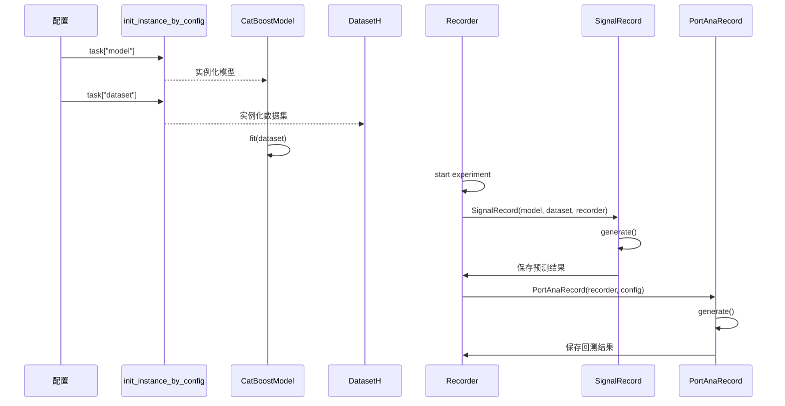
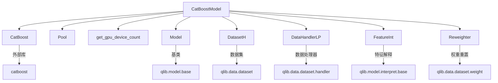

# CatBoost模型

<cite>
**本文档中引用的文件**   
- [catboost_model.py](file://qlib/contrib/model/catboost_model.py)
- [workflow_config_catboost_Alpha158.yaml](file://examples/benchmarks/CatBoost/workflow_config_catboost_Alpha158.yaml)
- [workflow_config_catboost_Alpha360.yaml](file://examples/benchmarks/CatBoost/workflow_config_catboost_Alpha360.yaml)
- [gbdt.py](file://qlib/contrib/model/gbdt.py)
- [model.rst](file://docs/component/model.rst)
- [integration.rst](file://docs/start/integration.rst)
- [workflow_by_code.py](file://examples/workflow_by_code.py)
- [base.py](file://qlib/model/base.py)
- [record_temp.py](file://qlib/workflow/record_temp.py)
</cite>

## 目录
1. [简介](#简介)
2. [项目结构](#项目结构)
3. [核心组件](#核心组件)
4. [架构概述](#架构概述)
5. [详细组件分析](#详细组件分析)
6. [依赖分析](#依赖分析)
7. [性能考量](#性能考量)
8. [故障排除指南](#故障排除指南)
9. [结论](#结论)

## 简介
本文档系统性地文档化了Qlib中CatBoostModel的集成与使用。深入解析了`qlib/contrib/model/catboost_model.py`中CatBoostModel类的实现细节，包括其对CatBoost库的封装策略、与Qlib工作流的兼容性设计。结合`workflow_config_catboost_Alpha158.yaml`配置文件，阐明了iterations、learning_rate、depth、l2_leaf_reg等关键参数的作用机制及优化方向。描述了CatBoost在处理类别特征、减少过拟合方面的独特优势，以及其在Alpha因子挖掘中的适用场景。提供了从模型配置、训练到预测的完整代码路径示例，展示了如何通过init_instance_by_config实例化模型并与DatasetH协同工作。说明了模型输出的预测分数如何被用于生成交易信号，并与回测引擎集成。涵盖了特征重要性分析、训练过程监控及与其他GBDT模型的性能对比。

## 项目结构
Qlib项目结构清晰地组织了其核心功能模块。CatBoost模型相关的代码主要位于`qlib/contrib/model/`目录下，配置文件则存放在`examples/benchmarks/CatBoost/`目录中。这种结构化的设计使得模型实现与配置分离，便于维护和扩展。

**图示来源**
- [catboost_model.py](file://qlib/contrib/model/catboost_model.py#L1-L101)
- [workflow_config_catboost_Alpha158.yaml](file://examples/benchmarks/CatBoost/workflow_config_catboost_Alpha158.yaml#L1-L71)
- [record_temp.py](file://qlib/workflow/record_temp.py#L1-L200)

**节来源**
- [catboost_model.py](file://qlib/contrib/model/catboost_model.py#L1-L101)
- [workflow_config_catboost_Alpha158.yaml](file://examples/benchmarks/CatBoost/workflow_config_catboost_Alpha158.yaml#L1-L71)

## 核心组件
CatBoostModel是Qlib中集成CatBoost算法的核心组件，继承自Qlib的Model基类和FeatureInt特征解释接口。该模型通过封装CatBoost库，实现了与Qlib数据处理流程的无缝集成。模型初始化时接受loss参数（支持RMSE和Logloss），并允许通过**kwargs传递其他CatBoost参数。fit方法负责模型训练，predict方法用于生成预测，get_feature_importance方法提供特征重要性分析功能。

**节来源**
- [catboost_model.py](file://qlib/contrib/model/catboost_model.py#L17-L101)

## 架构概述
CatBoostModel在Qlib架构中扮演着预测模型的角色，与数据集、工作流记录器和回测系统紧密协作。模型通过DatasetH获取处理后的特征数据，训练完成后生成的预测结果被SignalRecord保存，并进一步用于回测分析。

**图示来源**
- [catboost_model.py](file://qlib/contrib/model/catboost_model.py#L17-L101)
- [record_temp.py](file://qlib/workflow/record_temp.py#L162-L200)
- [base.py](file://qlib/model/base.py#L22-L78)

## 详细组件分析

### CatBoostModel分析
CatBoostModel类实现了Qlib模型接口，提供了完整的机器学习工作流支持。

#### 类结构分析

**图示来源**
- [catboost_model.py](file://qlib/contrib/model/catboost_model.py#L17-L101)
- [base.py](file://qlib/model/base.py#L22-L78)

#### 训练流程分析

**图示来源**
- [catboost_model.py](file://qlib/contrib/model/catboost_model.py#L28-L79)
- [base.py](file://qlib/model/base.py#L54-L59)

#### 预测流程分析

**图示来源**
- [catboost_model.py](file://qlib/contrib/model/catboost_model.py#L80-L84)

### 配置文件分析
CatBoost模型的配置通过YAML文件进行管理，实现了模型参数与代码的解耦。

#### 配置参数分析
| 参数 | 说明 | 示例值 |
|------|------|--------|
| loss | 损失函数 | RMSE |
| learning_rate | 学习率 | 0.0421 |
| subsample | 子采样率 | 0.8789 |
| max_depth | 最大深度 | 6 |
| num_leaves | 叶子节点数 | 100 |
| thread_count | 线程数 | 20 |
| grow_policy | 增长策略 | Lossguide |
| bootstrap_type | 自举类型 | Poisson |

**图示来源**
- [workflow_config_catboost_Alpha158.yaml](file://examples/benchmarks/CatBoost/workflow_config_catboost_Alpha158.yaml#L36-L44)

**节来源**
- [workflow_config_catboost_Alpha158.yaml](file://examples/benchmarks/CatBoost/workflow_config_catboost_Alpha158.yaml#L32-L44)

### 工作流集成分析
CatBoostModel与Qlib工作流系统的集成通过标准接口实现，确保了与其他模型的一致性。

#### 工作流执行流程

**图示来源**
- [workflow_by_code.py](file://examples/workflow_by_code.py#L67-L85)
- [model.rst](file://docs/component/model.rst#L89-L102)
- [record_temp.py](file://qlib/workflow/record_temp.py#L162-L200)

**节来源**
- [workflow_by_code.py](file://examples/workflow_by_code.py#L67-L85)
- [model.rst](file://docs/component/model.rst#L89-L102)

## 依赖分析
CatBoostModel的实现依赖于多个Qlib核心组件和外部库，形成了一个完整的机器学习工作流。

**图示来源**
- [catboost_model.py](file://qlib/contrib/model/catboost_model.py#L7-L15)
- [base.py](file://qlib/model/base.py#L22-L78)

**节来源**
- [catboost_model.py](file://qlib/contrib/model/catboost_model.py#L7-L15)
- [base.py](file://qlib/model/base.py#L22-L78)

## 性能考量
CatBoostModel在设计时考虑了多个性能优化方面：

1. **GPU支持**：通过get_gpu_device_count自动检测GPU可用性，并设置task_type为GPU或CPU
2. **早停机制**：支持early_stopping_rounds参数，防止过拟合
3. **多线程训练**：通过thread_count参数充分利用多核CPU
4. **内存效率**：使用Pool对象管理训练数据，优化内存使用
5. **特征处理**：原生支持类别特征，无需预处理

这些特性使得CatBoostModel在处理大规模金融数据时具有良好的性能表现。

## 故障排除指南
在使用CatBoostModel时可能遇到的常见问题及解决方案：

**节来源**
- [catboost_model.py](file://qlib/contrib/model/catboost_model.py#L43-L44)
- [catboost_model.py](file://qlib/contrib/model/catboost_model.py#L51-L52)
- [catboost_model.py](file://qlib/contrib/model/catboost_model.py#L81-L82)

### 数据相关问题
- **问题**：Empty data from dataset, please check your dataset config.
- **原因**：数据集准备阶段返回空数据
- **解决方案**：检查数据源路径、时间范围和股票列表配置

- **问题**：CatBoost doesn't support multi-label training
- **原因**：标签数据维度不正确
- **解决方案**：确保标签为1D数组，单列数据

### 模型相关问题
- **问题**：model is not fitted yet!
- **原因**：在调用predict前未调用fit方法
- **解决方案**：确保模型已成功训练

- **问题**：Unsupported reweighter type
- **原因**：权重重置器类型不正确
- **解决方案**：确保reweighter参数为Reweighter实例

### 配置相关问题
- **问题**：Invalid loss function
- **原因**：loss参数值不在支持列表中
- **解决方案**：使用RMSE或Logloss

- **问题**：GPU not detected
- **原因**：未安装CUDA或CatBoost GPU版本
- **解决方案**：安装支持GPU的CatBoost版本

## 结论
CatBoostModel在Qlib中的集成展示了如何将先进的机器学习算法与量化投资框架有效结合。通过精心设计的封装，CatBoostModel不仅保留了原生CatBoost的所有优势特性，如类别特征处理、过拟合抑制和GPU加速，还实现了与Qlib生态系统无缝集成。配置文件驱动的设计使得模型参数调整变得简单直观，而标准化的工作流接口确保了与其他模型的一致性和可替换性。特征重要性分析功能为模型解释提供了有力支持，有助于理解Alpha因子的驱动机制。整体而言，CatBoostModel为量化研究员提供了一个强大而灵活的工具，可用于Alpha因子挖掘和投资策略开发。