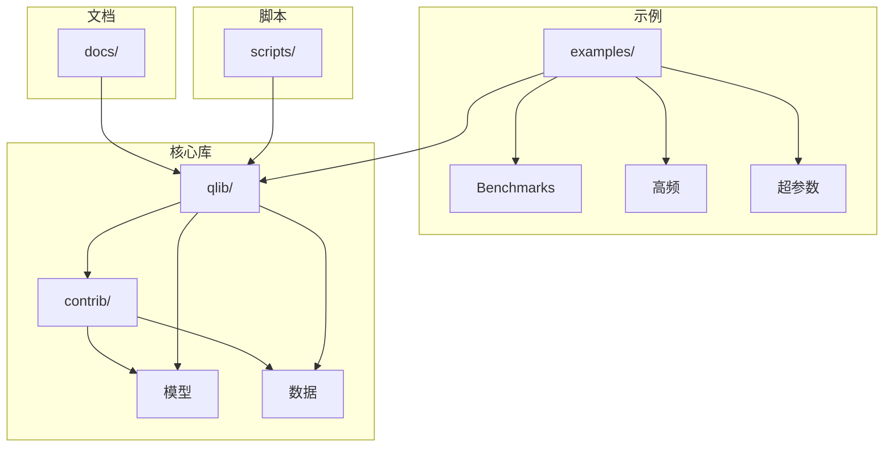
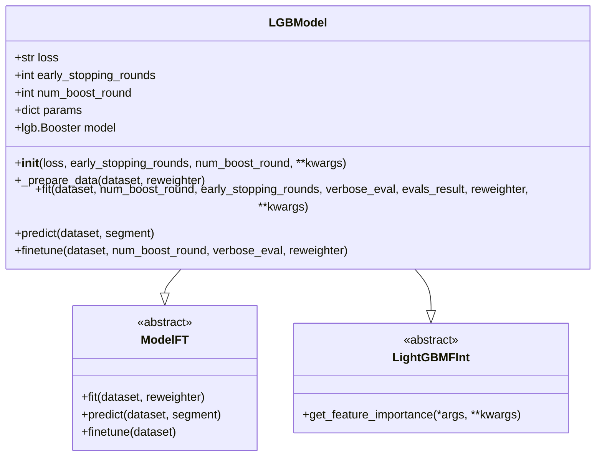
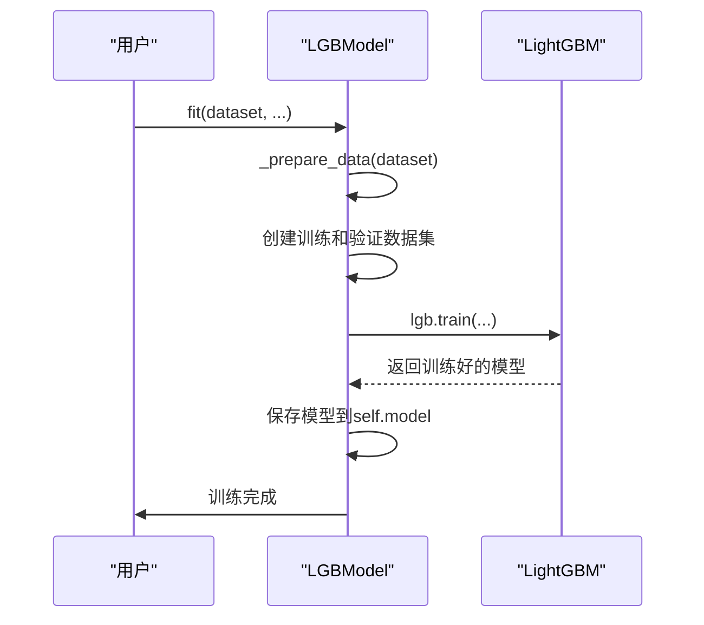
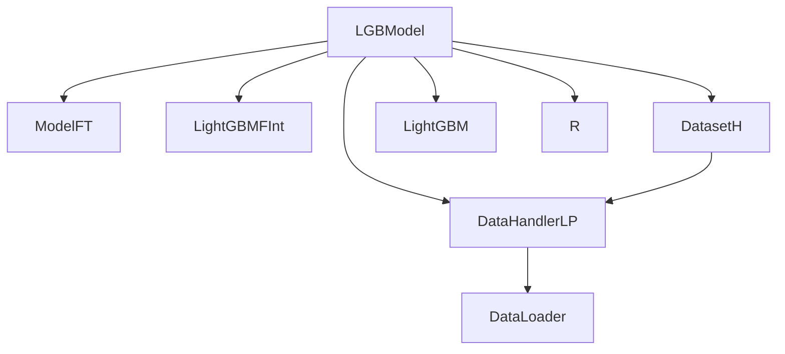

# LightGBM模型

<cite>
**本文档中引用的文件**  
- [gbdt.py](file://qlib/contrib/model/gbdt.py#L1-L127)
- [workflow_config_lightgbm_Alpha158.yaml](file://examples/benchmarks/LightGBM/workflow_config_lightgbm_Alpha158.yaml#L1-L72)
- [workflow_config_lightgbm_Alpha360.yaml](file://examples/benchmarks/LightGBM/workflow_config_lightgbm_Alpha360.yaml#L1-L79)
- [workflow_config_lightgbm_multi_freq.yaml](file://examples/benchmarks/LightGBM/workflow_config_lightgbm_multi_freq.yaml#L1-L89)
- [multi_freq_handler.py](file://examples/benchmarks/LightGBM/multi_freq_handler.py#L1-L135)
- [base.py](file://qlib/model/base.py#L1-L111)
- [__init__.py](file://qlib/contrib/model/__init__.py#L1-L44)
- [base.py](file://qlib/model/interpret/base.py#L1-L46)
- [handler.py](file://qlib/data/dataset/handler.py#L1-L787)
- [__init__.py](file://qlib/data/dataset/__init__.py#L41-L213)
</cite>

## 目录
1. [简介](#简介)
2. [项目结构](#项目结构)
3. [核心组件](#核心组件)
4. [架构概述](#架构概述)
5. [详细组件分析](#详细组件分析)
6. [依赖分析](#依赖分析)
7. [性能考虑](#性能考虑)
8. [故障排除指南](#故障排除指南)
9. [结论](#结论)

## 简介
本文档详细阐述了Qlib中LGBModel的实现机制与使用方法。LGBModel是基于LightGBM的梯度提升决策树模型，专为多因子选股任务设计。该模型继承自ModelFT基类，实现了fit、predict和finetune等核心接口。通过配置文件如workflow_config_lightgbm_Alpha158.yaml，可以灵活配置loss、learning_rate、num_leaves、max_depth等关键参数，以优化模型性能。LGBModel支持通过DatasetH加载Alpha158/Alpha360特征数据进行训练与预测，并可通过init_instance_by_config动态实例化。此外，文档还涵盖了高频多周期特征处理（multi_freq_handler.py）的集成方式、过拟合控制技巧、特征重要性分析方法，以及与回测系统的衔接流程。

## 项目结构
Qlib项目的结构清晰地组织了各个模块，包括文档、示例、核心库和脚本。核心模型实现位于`qlib/contrib/model/`目录下，其中`gbdt.py`文件包含了LGBModel的定义。配置文件位于`examples/benchmarks/LightGBM/`目录下，提供了不同场景下的配置示例。数据处理相关的处理器和加载器位于`qlib/contrib/data/`和`qlib/data/dataset/`目录下。

**图表来源**  
- [gbdt.py](file://qlib/contrib/model/gbdt.py#L1-L127)
- [workflow_config_lightgbm_Alpha158.yaml](file://examples/benchmarks/LightGBM/workflow_config_lightgbm_Alpha158.yaml#L1-L72)

**章节来源**  
- [gbdt.py](file://qlib/contrib/model/gbdt.py#L1-L127)
- [workflow_config_lightgbm_Alpha158.yaml](file://examples/benchmarks/LightGBM/workflow_config_lightgbm_Alpha158.yaml#L1-L72)

## 核心组件
LGBModel的核心组件包括其继承自ModelFT基类的fit、predict和finetune方法。`__init__`方法初始化模型参数，支持mse和binary两种损失函数。`_prepare_data`方法准备训练和验证数据集，确保数据格式符合LightGBM的要求。`fit`方法执行模型训练，使用early stopping和verbose evaluation等回调函数。`predict`方法用于生成预测结果，返回pandas Series对象。`finetune`方法允许在现有模型基础上进行微调，通过增加训练轮次来优化模型性能。

**章节来源**  
- [gbdt.py](file://qlib/contrib/model/gbdt.py#L1-L127)

## 架构概述
LGBModel的架构设计遵循Qlib的模块化原则，通过继承ModelFT和LightGBMFInt类，实现了模型训练、预测和解释功能。模型通过DatasetH加载数据，利用DataHandlerLP进行数据预处理。训练过程中，模型使用LightGBM的train函数，结合early stopping和evaluation callbacks，确保模型在验证集上的性能。预测阶段，模型调用predict方法生成信号，供后续回测系统使用。

**图表来源**  
- [gbdt.py](file://qlib/contrib/model/gbdt.py#L1-L127)
- [base.py](file://qlib/model/base.py#L1-L111)
- [base.py](file://qlib/model/interpret/base.py#L1-L46)

## 详细组件分析

### LGBModel类分析
LGBModel类是Qlib中实现LightGBM模型的核心组件。它继承自ModelFT和LightGBMFInt，分别提供了模型训练/预测和特征重要性解释的功能。`__init__`方法初始化模型参数，包括损失函数、早停轮次和最大迭代次数。`_prepare_data`方法负责准备训练和验证数据集，确保标签为一维数组，并处理样本权重。`fit`方法执行模型训练，使用LightGBM的train函数，结合early stopping和evaluation callbacks。`predict`方法生成预测结果，返回pandas Series对象。`finetune`方法允许在现有模型基础上进行微调，通过增加训练轮次来优化模型性能。

#### 类图

**图表来源**  
- [gbdt.py](file://qlib/contrib/model/gbdt.py#L1-L127)
- [base.py](file://qlib/model/base.py#L1-L111)
- [base.py](file://qlib/model/interpret/base.py#L1-L46)

#### 训练流程序列图

**图表来源**  
- [gbdt.py](file://qlib/contrib/model/gbdt.py#L57-L85)

**章节来源**  
- [gbdt.py](file://qlib/contrib/model/gbdt.py#L1-L127)

### 配置文件分析
配置文件如workflow_config_lightgbm_Alpha158.yaml定义了模型训练的完整流程。它指定了数据源、模型参数、数据集划分和回测策略。`task.model`部分定义了LGBModel的实例化参数，包括loss、learning_rate、num_leaves等。`task.dataset`部分指定了数据集的处理器（如Alpha158）和时间范围。`task.record`部分定义了训练过程中的记录器，用于保存模型、分析信号和执行回测。

**章节来源**  
- [workflow_config_lightgbm_Alpha158.yaml](file://examples/benchmarks/LightGBM/workflow_config_lightgbm_Alpha158.yaml#L1-L72)
- [workflow_config_lightgbm_Alpha360.yaml](file://examples/benchmarks/LightGBM/workflow_config_lightgbm_Alpha360.yaml#L1-L79)

### 多周期特征处理分析
multi_freq_handler.py实现了高频多周期特征的集成方式。通过Avg15minHandler类，可以将1分钟频率的特征数据按15分钟间隔进行平均，并与日频特征数据结合。这种多频率特征融合的方法能够捕捉不同时间尺度的市场动态，提高模型的预测能力。配置文件workflow_config_lightgbm_multi_freq.yaml展示了如何使用Avg15minHandler来加载多频率特征数据。

**章节来源**  
- [multi_freq_handler.py](file://examples/benchmarks/LightGBM/multi_freq_handler.py#L1-L135)
- [workflow_config_lightgbm_multi_freq.yaml](file://examples/benchmarks/LightGBM/workflow_config_lightgbm_multi_freq.yaml#L1-L89)

## 依赖分析
LGBModel的实现依赖于多个Qlib核心模块。它继承自ModelFT基类，实现了fit、predict和finetune接口。通过DataHandlerLP进行数据预处理，利用DatasetH加载和准备数据。模型训练依赖于LightGBM库，使用其train函数进行梯度提升。特征重要性分析通过LightGBMFInt接口实现，调用LightGBM的feature_importance方法。整个流程通过R（Recorder）系统进行实验管理和结果记录。

**图表来源**  
- [gbdt.py](file://qlib/contrib/model/gbdt.py#L1-L127)
- [base.py](file://qlib/model/base.py#L1-L111)
- [base.py](file://qlib/model/interpret/base.py#L1-L46)
- [__init__.py](file://qlib/data/dataset/__init__.py#L41-L213)
- [handler.py](file://qlib/data/dataset/handler.py#L1-L787)

**章节来源**  
- [gbdt.py](file://qlib/contrib/model/gbdt.py#L1-L127)
- [base.py](file://qlib/model/base.py#L1-L111)
- [base.py](file://qlib/model/interpret/base.py#L1-L46)

## 性能考虑
LGBModel在设计时考虑了多个性能优化点。首先，通过early stopping机制防止过拟合，提高模型泛化能力。其次，使用多线程训练（num_threads参数）加速模型训练过程。特征重要性分析有助于识别关键因子，指导特征工程。此外，通过reweighter参数支持样本加权，可以调整不同样本的训练权重，应对数据不平衡问题。在高频多周期特征处理中，通过合理的特征融合策略，既保留了高频信息，又避免了维度灾难。

## 故障排除指南
在使用LGBModel时可能遇到的常见问题包括：数据为空导致训练失败、特征维度不匹配、模型未训练就进行预测等。确保数据集配置正确，特别是时间范围和股票池的选择。检查特征处理器是否正确应用，避免特征缺失或异常值。在模型训练前，确认fit方法已成功执行。对于高频多周期特征处理，注意不同频率数据的时间对齐问题。如果遇到性能瓶颈，可以调整num_threads参数或减少特征维度。

**章节来源**  
- [gbdt.py](file://qlib/contrib/model/gbdt.py#L1-L127)
- [multi_freq_handler.py](file://examples/benchmarks/LightGBM/multi_freq_handler.py#L1-L135)

## 结论
LGBModel作为Qlib中重要的机器学习模型，为多因子选股提供了强大的工具。其模块化的设计、灵活的配置选项和高效的训练机制，使其能够适应不同的研究需求。通过深入理解其架构设计和实现细节，研究人员可以更好地利用该模型进行量化投资研究。未来的工作可以进一步探索更复杂的特征工程方法、集成学习策略以及与其他模型的组合应用，以持续提升模型的预测能力和投资表现。