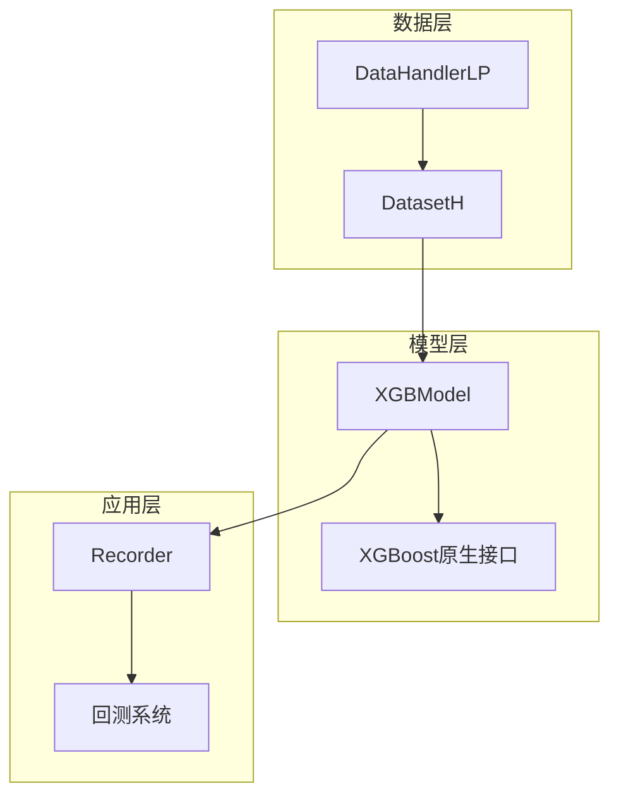
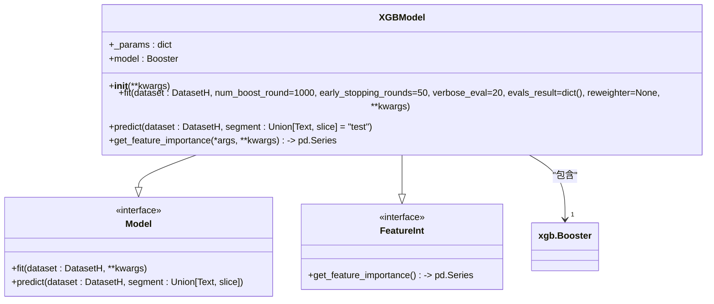
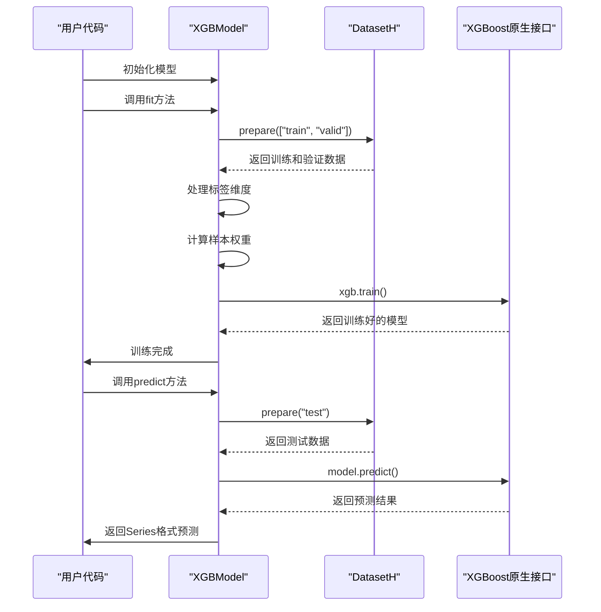
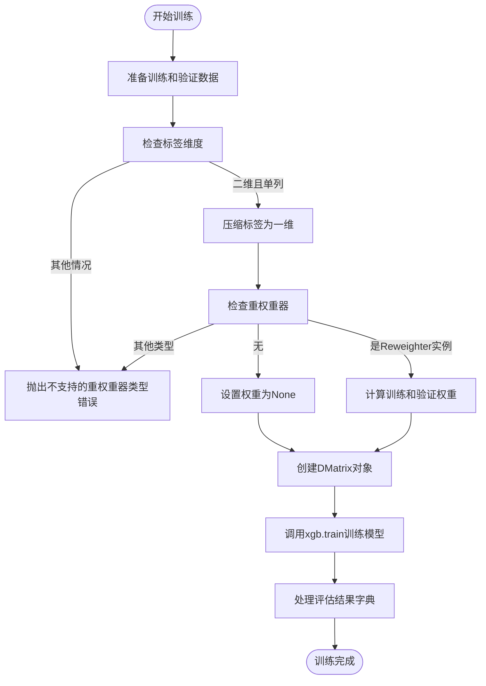
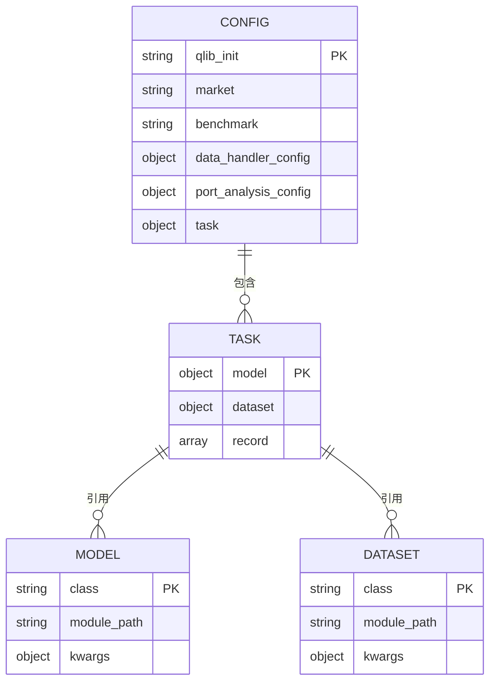

# XGBoost模型

<cite>
**本文档中引用的文件**  
- [xgboost.py](file://qlib/contrib/model/xgboost.py)
- [workflow_config_xgboost_Alpha158.yaml](file://examples/benchmarks/XGBoost/workflow_config_xgboost_Alpha158.yaml)
- [workflow_config_xgboost_Alpha360.yaml](file://examples/benchmarks/XGBoost/workflow_config_xgboost_Alpha360.yaml)
- [gbdt.py](file://qlib/contrib/model/gbdt.py)
- [model.rst](file://docs/component/model.rst)
- [integration.rst](file://docs/start/integration.rst)
- [base.py](file://qlib/model/interpret/base.py)
</cite>

## 目录
1. [简介](#简介)
2. [项目结构](#项目结构)
3. [核心组件](#核心组件)
4. [架构概述](#架构概述)
5. [详细组件分析](#详细组件分析)
6. [依赖分析](#依赖分析)
7. [性能考量](#性能考量)
8. [故障排除指南](#故障排除指南)
9. [结论](#结论)

## 简介
本文档全面文档化Qlib中XGBModel的实现与应用。深入分析`qlib/contrib/model/xgboost.py`中XGBModel类的设计原理，包括其对XGBoost原生接口的封装方式、与Qlib数据流的集成机制。结合workflow_config_xgboost_Alpha158.yaml配置文件，详细说明objective、max_depth、eta、subsample等核心参数的配置方法及其调优策略。描述XGBoost模型在量化因子建模中的典型使用模式，展示如何通过配置文件或代码方式完成模型训练与预测。提供完整的端到端使用示例，涵盖数据集加载、模型训练、预测信号生成等环节。解释模型在处理稀疏特征、控制过拟合（通过gamma、lambda参数）方面的优势，以及特征重要性提取与可视化方法。说明其与Qlib回测系统和实验管理器（R）的集成方式，并对比其与LightGBM在性能和精度上的差异。

## 项目结构
XGBoost模型相关文件主要分布在Qlib项目的`examples/benchmarks/XGBoost/`目录下，包含配置文件和README文档。模型实现位于`qlib/contrib/model/xgboost.py`文件中。该模型作为Qlib框架的一部分，与数据处理、回测和实验管理组件紧密集成。

**中文(中文)**
- [xgboost.py](file://qlib/contrib/model/xgboost.py)
- [workflow_config_xgboost_Alpha158.yaml](file://examples/benchmarks/XGBoost/workflow_config_xgboost_Alpha158.yaml)
- [workflow_config_xgboost_Alpha360.yaml](file://examples/benchmarks/XGBoost/workflow_config_xgboost_Alpha360.yaml)

**Section sources**
- [xgboost.py](file://qlib/contrib/model/xgboost.py#L1-L85)
- [workflow_config_xgboost_Alpha158.yaml](file://examples/benchmarks/XGBoost/workflow_config_xgboost_Alpha158.yaml#L1-L70)
- [workflow_config_xgboost_Alpha360.yaml](file://examples/benchmarks/XGBoost/workflow_config_xgboost_Alpha360.yaml#L1-L77)

## 核心组件
XGBModel类是Qlib框架中XGBoost模型的核心实现，继承自Model和FeatureInt基类。该类通过封装XGBoost原生接口，实现了与Qlib数据流的无缝集成。模型初始化时接收参数字典，训练过程中处理数据集准备、标签转换和权重计算，最终调用XGBoost的train方法完成模型训练。

**中文(中文)**
- [xgboost.py](file://qlib/contrib/model/xgboost.py)
- [base.py](file://qlib/model/interpret/base.py)

**Section sources**
- [xgboost.py](file://qlib/contrib/model/xgboost.py#L15-L85)
- [base.py](file://qlib/model/interpret/base.py#L12-L46)

## 架构概述
XGBoost模型在Qlib框架中的架构体现了模块化设计思想。模型组件与数据集组件通过标准接口交互，利用DatasetH类准备训练、验证和测试数据。训练过程中，模型将Qlib格式的数据转换为XGBoost所需的DMatrix格式，并处理标签维度转换。预测阶段，模型输出被封装为pandas Series，便于后续分析和回测。



**Diagram sources**
- [xgboost.py](file://qlib/contrib/model/xgboost.py#L15-L85)
- [workflow_config_xgboost_Alpha158.yaml](file://examples/benchmarks/XGBoost/workflow_config_xgboost_Alpha158.yaml#L30-L70)

## 详细组件分析

### XGBModel类分析
XGBModel类实现了XGBoost在Qlib框架中的完整生命周期管理，包括模型初始化、训练、预测和特征重要性提取。

#### 对象导向组件


**Diagram sources**
- [xgboost.py](file://qlib/contrib/model/xgboost.py#L15-L85)
- [base.py](file://qlib/model/interpret/base.py#L12-L46)

#### API服务组件


**Diagram sources**
- [xgboost.py](file://qlib/contrib/model/xgboost.py#L23-L75)
- [workflow_config_xgboost_Alpha158.yaml](file://examples/benchmarks/XGBoost/workflow_config_xgboost_Alpha158.yaml#L30-L70)

#### 复杂逻辑组件


**Diagram sources**
- [xgboost.py](file://qlib/contrib/model/xgboost.py#L33-L68)
- [workflow_config_xgboost_Alpha158.yaml](file://examples/benchmarks/XGBoost/workflow_config_xgboost_Alpha158.yaml#L35-L49)

**Section sources**
- [xgboost.py](file://qlib/contrib/model/xgboost.py#L15-L85)
- [workflow_config_xgboost_Alpha158.yaml](file://examples/benchmarks/XGBoost/workflow_config_xgboost_Alpha158.yaml#L30-L70)

### 配置文件分析
workflow_config_xgboost_Alpha158.yaml文件定义了XGBoost模型的完整实验配置，包括数据集、模型参数和回测策略。

**中文(中文)**
- [workflow_config_xgboost_Alpha158.yaml](file://examples/benchmarks/XGBoost/workflow_config_xgboost_Alpha158.yaml)
- [workflow_config_xgboost_Alpha360.yaml](file://examples/benchmarks/XGBoost/workflow_config_xgboost_Alpha360.yaml)



**Diagram sources**
- [workflow_config_xgboost_Alpha158.yaml](file://examples/benchmarks/XGBoost/workflow_config_xgboost_Alpha158.yaml#L1-L70)
- [workflow_config_xgboost_Alpha360.yaml](file://examples/benchmarks/XGBoost/workflow_config_xgboost_Alpha360.yaml#L1-L77)

**Section sources**
- [workflow_config_xgboost_Alpha158.yaml](file://examples/benchmarks/XGBoost/workflow_config_xgboost_Alpha158.yaml#L1-L70)
- [workflow_config_xgboost_Alpha360.yaml](file://examples/benchmarks/XGBoost/workflow_config_xgboost_Alpha360.yaml#L1-L77)

## 依赖分析
XGBoost模型在Qlib框架中依赖多个核心组件，形成了完整的机器学习流水线。模型直接依赖XGBoost库进行底层计算，同时与Qlib的数据处理、特征解释和实验管理组件紧密集成。

```mermaid
graph TD
XGBModel --> xgboost : "依赖"
XGBModel --> DatasetH : "依赖"
XGBModel --> DataHandlerLP : "依赖"
XGBModel --> FeatureInt : "实现"
XGBModel --> Reweighter : "可选依赖"
DatasetH --> DataHandlerLP : "包含"
DataHandlerLP --> Alpha158 : "可配置"
DataHandlerLP --> Alpha360 : "可配置"
XGBModel --> Recorder : "集成"
Recorder --> Backtest : "支持"
Recorder --> SigAnaRecord : "支持"
Recorder --> PortAnaRecord : "支持"
```

**Diagram sources**
- [xgboost.py](file://qlib/contrib/model/xgboost.py#L6-L12)
- [workflow_config_xgboost_Alpha158.yaml](file://examples/benchmarks/XGBoost/workflow_config_xgboost_Alpha158.yaml#L43-L54)

**Section sources**
- [xgboost.py](file://qlib/contrib/model/xgboost.py#L1-L85)
- [workflow_config_xgboost_Alpha158.yaml](file://examples/benchmarks/XGBoost/workflow_config_xgboost_Alpha158.yaml#L1-L70)

## 性能考量
XGBoost模型在量化因子建模中表现出良好的性能特征。通过max_depth、eta、subsample等参数的合理配置，可以在模型复杂度和泛化能力之间取得平衡。模型支持early_stopping机制，有效防止过拟合。多线程训练（nthread参数）充分利用计算资源，提高训练效率。与LightGBM相比，XGBoost在处理稀疏特征时具有优势，但训练速度可能稍慢。通过gamma和lambda参数控制过拟合，前者设置节点分裂所需的最小损失减少值，后者应用L2正则化。

**Section sources**
- [xgboost.py](file://qlib/contrib/model/xgboost.py#L36-L68)
- [workflow_config_xgboost_Alpha158.yaml](file://examples/benchmarks/XGBoost/workflow_config_xgboost_Alpha158.yaml#L37-L49)
- [gbdt.py](file://qlib/contrib/model/gbdt.py#L19-L25)

## 故障排除指南
在使用XGBoost模型时可能遇到的常见问题包括：不支持多标签训练错误，通常由标签维度不正确引起；模型未训练错误，发生在预测前未调用fit方法；数据为空错误，由数据集配置不当导致。解决这些问题需要检查数据预处理流程、确保训练调用完成、验证数据集配置的正确性。通过evals_result参数可以监控训练过程中的损失变化，帮助识别过拟合或欠拟合问题。

**Section sources**
- [xgboost.py](file://qlib/contrib/model/xgboost.py#L45-L46)
- [xgboost.py](file://qlib/contrib/model/xgboost.py#L72-L73)
- [gbdt.py](file://qlib/contrib/model/gbdt.py#L38-L39)

## 结论
XGBoost模型在Qlib框架中提供了强大的量化因子建模能力。通过精心设计的封装，实现了与Qlib生态系统无缝集成。模型配置灵活，支持多种参数调优策略，能够适应不同的量化研究需求。与LightGBM相比，XGBoost在某些场景下可能提供更好的精度，但需要权衡训练效率。特征重要性提取功能为模型解释提供了有力支持，有助于理解因子贡献度。整体而言，XGBoost模型是Qlib中一个成熟、可靠且功能丰富的机器学习组件，适用于各种量化投资研究场景。