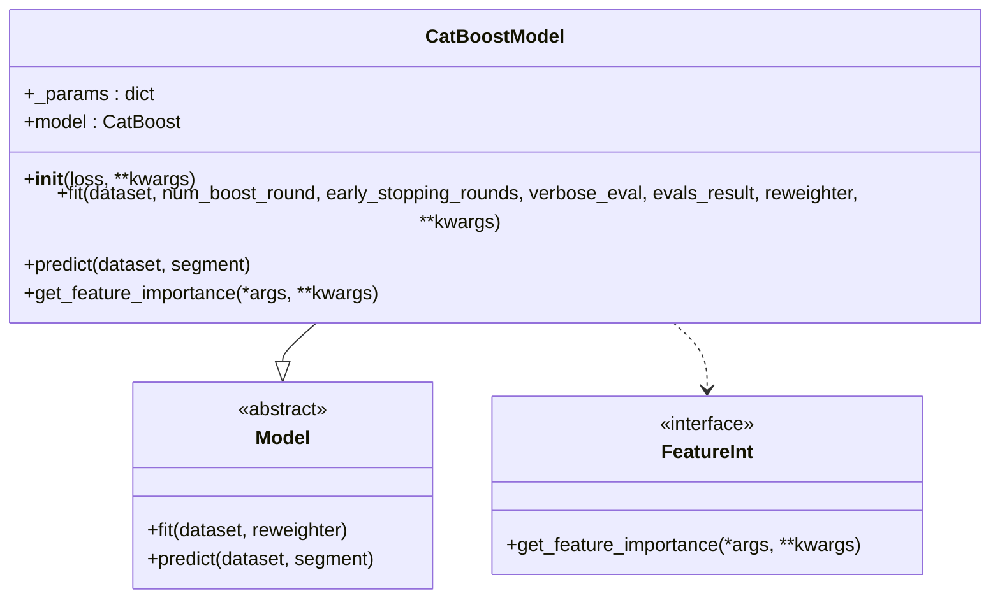

# 监督学习模型

<cite>
**本文档中引用的文件**  
- [LGBModel](file://qlib/contrib/model/gbdt.py)
- [XGBModel](file://qlib/contrib/model/xgboost.py)
- [CatBoostModel](file://qlib/contrib/model/catboost_model.py)
- [LinearModel](file://qlib/contrib/model/linear.py)
- [init_instance_by_config](file://qlib/utils/mod.py)
- [DatasetH](file://qlib/data/dataset/__init__.py)
- [workflow_config_lightgbm_Alpha158.yaml](file://examples/benchmarks/LightGBM/workflow_config_lightgbm_Alpha158.yaml)
- [workflow_config_xgboost_Alpha158.yaml](file://examples/benchmarks/XGBoost/workflow_config_xgboost_Alpha158.yaml)
- [workflow_config_catboost_Alpha158.yaml](file://examples/benchmarks/CatBoost/workflow_config_catboost_Alpha158.yaml)
- [workflow_config_linear_Alpha158.yaml](file://examples/benchmarks/Linear/workflow_config_linear_Alpha158.yaml)
</cite>

## 目录
1. [简介](#简介)
2. [项目结构](#项目结构)
3. [核心组件](#核心组件)
4. [架构概述](#架构概述)
5. [详细组件分析](#详细组件分析)
6. [依赖分析](#依赖分析)
7. [性能考虑](#性能考虑)
8. [故障排除指南](#故障排除指南)
9. [结论](#结论)

## 简介
本文档详细说明了Qlib中基于树模型和线性模型的监督学习实现。重点介绍LGBModel、XGBModel、CatBoostModel和LinearModel的架构设计、参数配置与训练流程。结合examples/benchmarks中的YAML配置文件，展示不同模型在Alpha158和Alpha360特征集上的典型参数设置与调优策略。解释模型如何通过init_instance_by_config从任务配置中实例化，并与DatasetH协同完成训练与预测。提供从数据加载到模型训练、预测输出的完整代码路径，并说明各模型在回归与排序任务中的适用场景。涵盖常见问题如过拟合控制、特征重要性提取及与回测系统的集成方式。

## 项目结构
Qlib的项目结构清晰地组织了其核心功能模块。监督学习模型主要位于`qlib/contrib/model/`目录下，包括`gbdt.py`（包含LGBModel）、`xgboost.py`、`catboost_model.py`和`linear.py`等文件。数据处理和数据集管理由`qlib/data/dataset/`模块负责，其中`DatasetH`类是处理时间序列数据的核心组件。示例配置文件位于`examples/benchmarks/`目录下的各个子目录中，如LightGBM、XGBoost、CatBoost和Linear等。

**图示来源**
- [gbdt.py](file://qlib/contrib/model/gbdt.py)
- [xgboost.py](file://qlib/contrib/model/xgboost.py)
- [catboost_model.py](file://qlib/contrib/model/catboost_model.py)
- [linear.py](file://qlib/contrib/model/linear.py)
- [__init__.py](file://qlib/data/dataset/__init__.py)
- [workflow_config_lightgbm_Alpha158.yaml](file://examples/benchmarks/LightGBM/workflow_config_lightgbm_Alpha158.yaml)

**章节来源**
- [gbdt.py](file://qlib/contrib/model/gbdt.py)
- [xgboost.py](file://qlib/contrib/model/xgboost.py)
- [catboost_model.py](file://qlib/contrib/model/catboost_model.py)
- [linear.py](file://qlib/contrib/model/linear.py)
- [__init__.py](file://qlib/data/dataset/__init__.py)

## 核心组件
Qlib中的监督学习模型实现了统一的接口，继承自`Model`基类，该基类定义了`fit`和`predict`方法。LGBModel、XGBModel、CatBoostModel和LinearModel均遵循这一设计模式，确保了API的一致性。这些模型通过`init_instance_by_config`函数从YAML配置文件中实例化，并与`DatasetH`协同工作以完成数据准备、模型训练和预测。

**章节来源**
- [base.py](file://qlib/model/base.py)
- [gbdt.py](file://qlib/contrib/model/gbdt.py)
- [xgboost.py](file://qlib/contrib/model/xgboost.py)
- [catboost_model.py](file://qlib/contrib/model/catboost_model.py)
- [linear.py](file://qlib/contrib/model/linear.py)

## 架构概述
Qlib的监督学习架构围绕`Model`和`DatasetH`两个核心组件构建。`DatasetH`负责数据的加载、预处理和分段，而`Model`则专注于模型的训练和预测。工作流通过YAML配置文件定义，`init_instance_by_config`函数根据配置动态实例化模型和数据集对象。这种设计实现了配置与代码的解耦，提高了灵活性和可复用性。

**图示来源**
- [mod.py](file://qlib/utils/mod.py)
- [base.py](file://qlib/model/base.py)
- [__init__.py](file://qlib/data/dataset/__init__.py)

**章节来源**
- [mod.py](file://qlib/utils/mod.py)
- [base.py](file://qlib/model/base.py)
- [__init__.py](file://qlib/data/dataset/__init__.py)

## 详细组件分析
### LGBModel 分析
LGBModel是基于LightGBM的梯度提升树模型，继承自`ModelFT`和`LightGBMFInt`。它在`__init__`方法中初始化参数，并在`fit`方法中调用`lgb.train`进行训练。支持均方误差（mse）和二元分类（binary）损失函数。通过`early_stopping_rounds`和`num_boost_round`等参数控制过拟合。

**图示来源**
- [gbdt.py](file://qlib/contrib/model/gbdt.py)

**章节来源**
- [gbdt.py](file://qlib/contrib/model/gbdt.py)

### XGBModel 分析
XGBModel是基于XGBoost的梯度提升树模型，继承自`Model`和`FeatureInt`。它在`__init__`方法中初始化参数字典，并在`fit`方法中使用`xgb.DMatrix`和`xgb.train`进行训练。支持通过`reweighter`进行样本加权，并通过`evals_result`记录训练过程中的评估指标。

**图示来源**
- [xgboost.py](file://qlib/contrib/model/xgboost.py)

**章节来源**
- [xgboost.py](file://qlib/contrib/model/xgboost.py)

### CatBoostModel 分析
CatBoostModel是基于CatBoost的梯度提升树模型，同样继承自`Model`和`FeatureInt`。它在`__init__`方法中初始化参数，并在`fit`方法中使用`Pool`对象和`CatBoost`类进行训练。支持自动检测GPU并使用GPU加速训练。

**图示来源**
- [catboost_model.py](file://qlib/contrib/model/catboost_model.py)

**章节来源**
- [catboost_model.py](file://qlib/contrib/model/catboost_model.py)

### LinearModel 分析
LinearModel实现了多种线性回归模型，包括普通最小二乘法（ols）、非负最小二乘法（nnls）、岭回归（ridge）和套索回归（lasso）。它在`__init__`方法中根据`estimator`参数选择相应的回归器，并在`fit`方法中调用`_fit`或`_fit_nnls`进行训练。

**图示来源**
- [linear.py](file://qlib/contrib/model/linear.py)

**章节来源**
- [linear.py](file://qlib/contrib/model/linear.py)

### 配置文件分析
YAML配置文件定义了模型、数据集和工作流的完整配置。以`workflow_config_lightgbm_Alpha158.yaml`为例，`task.model`部分指定了`LGBModel`类和其参数，`task.dataset`部分指定了`DatasetH`类和其处理器`Alpha158`。

**章节来源**
- [workflow_config_lightgbm_Alpha158.yaml](file://examples/benchmarks/LightGBM/workflow_config_lightgbm_Alpha158.yaml)
- [workflow_config_xgboost_Alpha158.yaml](file://examples/benchmarks/XGBoost/workflow_config_xgboost_Alpha158.yaml)
- [workflow_config_catboost_Alpha158.yaml](file://examples/benchmarks/CatBoost/workflow_config_catboost_Alpha158.yaml)
- [workflow_config_linear_Alpha158.yaml](file://examples/benchmarks/Linear/workflow_config_linear_Alpha158.yaml)

## 依赖分析
Qlib的监督学习模型依赖于多个外部库，如lightgbm、xgboost、catboost和scikit-learn。这些依赖通过`pip`或`conda`安装，并在相应的模型文件中导入。内部依赖关系清晰，`Model`基类定义了接口，具体模型实现类继承并实现这些接口。

**图示来源**
- [go.mod](file://pyproject.toml)
- [gbdt.py](file://qlib/contrib/model/gbdt.py)
- [xgboost.py](file://qlib/contrib/model/xgboost.py)
- [catboost_model.py](file://qlib/contrib/model/catboost_model.py)
- [linear.py](file://qlib/contrib/model/linear.py)

**章节来源**
- [pyproject.toml](file://pyproject.toml)
- [gbdt.py](file://qlib/contrib/model/gbdt.py)
- [xgboost.py](file://qlib/contrib/model/xgboost.py)
- [catboost_model.py](file://qlib/contrib/model/catboost_model.py)
- [linear.py](file://qlib/contrib/model/linear.py)

## 性能考虑
树模型（LGB/XGB/CatBoost）在处理大规模数据时表现出色，尤其是LightGBM和XGBoost支持并行和分布式训练。线性模型计算效率高，适合快速迭代和特征重要性分析。通过合理设置`early_stopping_rounds`和`num_threads`等参数，可以有效控制训练时间和过拟合风险。

## 故障排除指南
常见问题包括数据为空、特征维度不匹配和模型未训练等。确保数据源路径正确，特征处理器配置无误。使用`DatasetH.prepare`方法检查数据是否正确加载。对于模型训练问题，检查`fit`方法的输入数据形状和类型。

**章节来源**
- [base.py](file://qlib/model/base.py)
- [__init__.py](file://qlib/data/dataset/__init__.py)

## 结论
Qlib提供了一套完整且灵活的监督学习框架，支持多种树模型和线性模型。通过统一的API设计和YAML配置驱动，用户可以轻松地进行模型实验和调优。结合强大的数据处理能力和回测系统，Qlib为量化研究提供了坚实的基础。