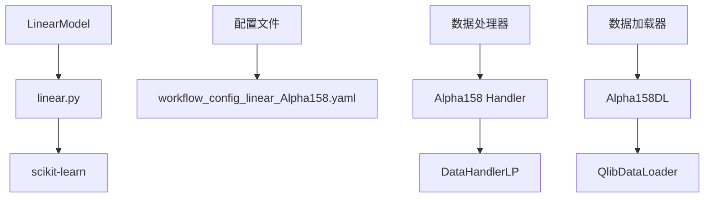
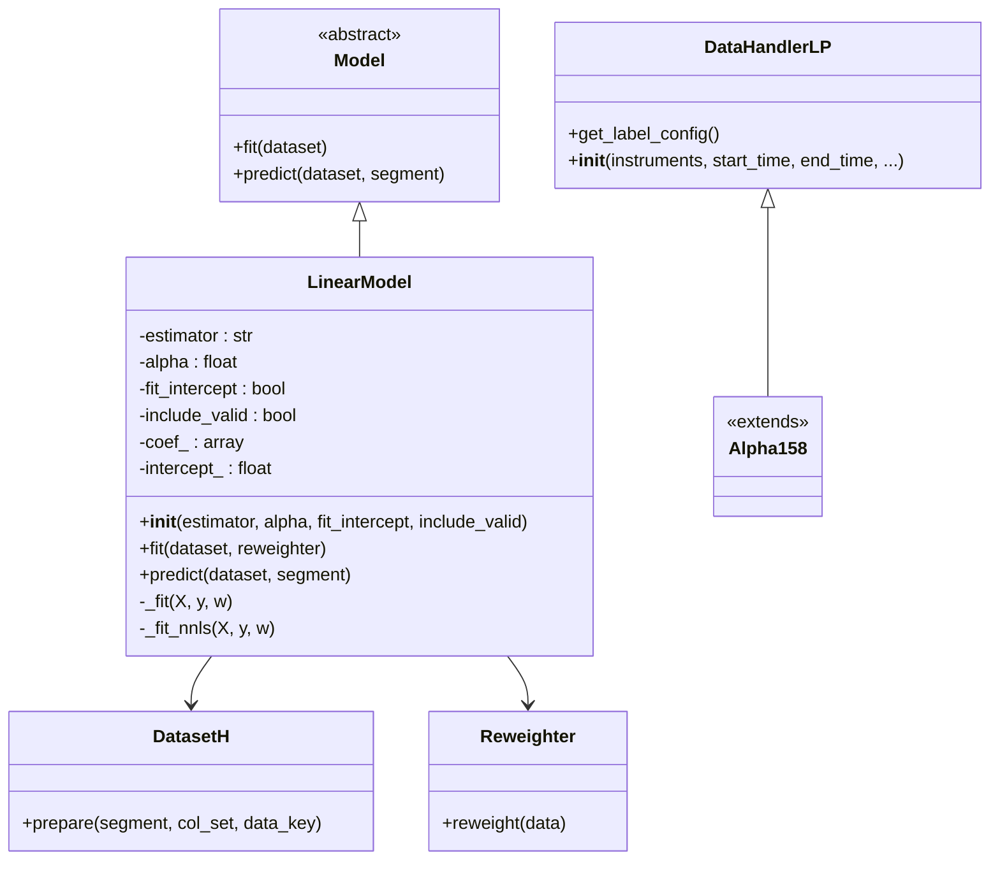
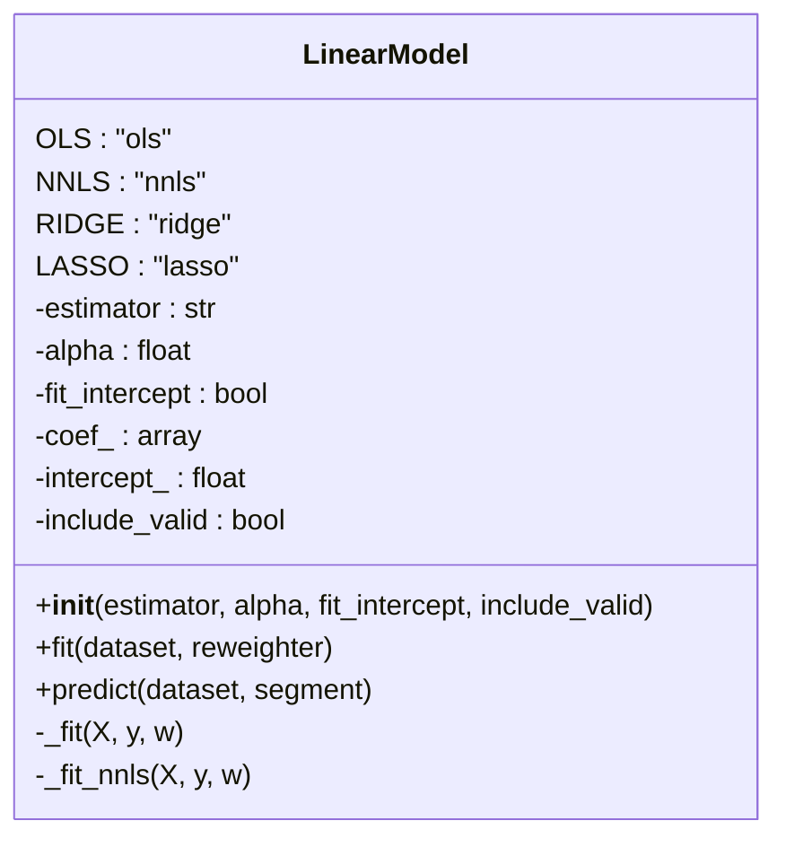
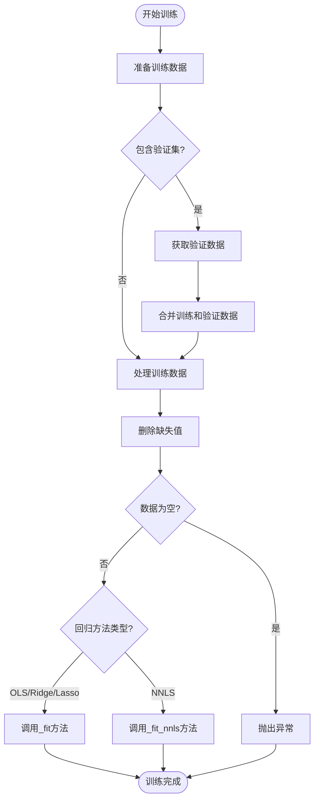
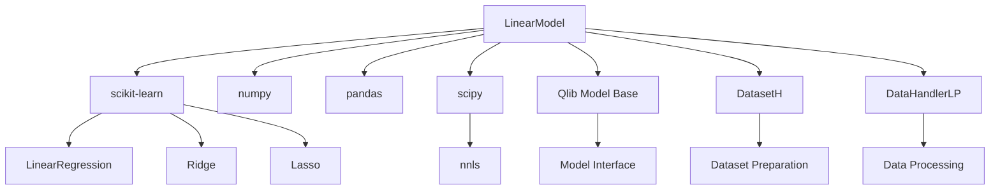

# 线性模型

<cite>
**本文档中引用的文件**   
- [linear.py](file://qlib/contrib/model/linear.py#L1-L113)
- [workflow_config_linear_Alpha158.yaml](file://examples/benchmarks/Linear/workflow_config_linear_Alpha158.yaml#L1-L77)
- [handler.py](file://qlib/contrib/data/handler.py#L98-L115)
- [loader.py](file://qlib/contrib/data/loader.py#L61-L83)
- [model.rst](file://docs/component/model.rst#L1-L123)
</cite>

## 目录
1. [简介](#简介)
2. [项目结构](#项目结构)
3. [核心组件](#核心组件)
4. [架构概述](#架构概述)
5. [详细组件分析](#详细组件分析)
6. [依赖分析](#依赖分析)
7. [性能考虑](#性能考虑)
8. [故障排除指南](#故障排除指南)
9. [结论](#结论)

## 简介
本文档详尽地文档化了Qlib中LinearModel的实现与应用。该模型作为量化投资研究中的基线模型，提供了简单而强大的线性回归能力。LinearModel类基于scikit-learn实现了多种线性回归方法，包括普通最小二乘法(OLS)、非负最小二乘法(NNLS)、岭回归(Ridge)和Lasso回归。该模型与Qlib的数据管道无缝集成，能够处理高维因子数据，并通过正则化技术防止过拟合。作为因子分析的基准工具，LinearModel在模型可解释性方面具有显著优势，其系数直接反映了各因子对预测目标的影响程度。本文档将深入分析其架构设计、参数配置意义以及在实际应用中的价值。

## 项目结构
Qlib框架中的LinearModel实现位于contrib/model目录下，与Alpha158数据处理流程紧密结合。该模型通过标准化的配置文件进行参数设置，实现了从数据预处理到模型训练、预测的完整工作流。

**图表来源**
- [linear.py](file://qlib/contrib/model/linear.py#L1-L113)
- [workflow_config_linear_Alpha158.yaml](file://examples/benchmarks/Linear/workflow_config_linear_Alpha158.yaml#L1-L77)
- [handler.py](file://qlib/contrib/data/handler.py#L98-L115)
- [loader.py](file://qlib/contrib/data/loader.py#L61-L83)

**章节来源**
- [linear.py](file://qlib/contrib/model/linear.py#L1-L113)
- [workflow_config_linear_Alpha158.yaml](file://examples/benchmarks/Linear/workflow_config_linear_Alpha158.yaml#L1-L77)

## 核心组件
LinearModel的核心组件包括模型类本身、数据处理器和配置管理系统。模型类继承自Qlib的Model基类，实现了fit和predict标准接口。Alpha158数据处理器负责特征工程和数据预处理，而YAML配置文件则定义了整个工作流的参数设置。这种模块化设计使得LinearModel既可作为独立组件使用，也可无缝集成到复杂的量化研究工作流中。

**章节来源**
- [linear.py](file://qlib/contrib/model/linear.py#L17-L113)
- [handler.py](file://qlib/contrib/data/handler.py#L98-L115)

## 架构概述
LinearModel的架构设计体现了Qlib框架的模块化和可扩展性原则。该模型通过继承机制与Qlib的核心组件集成，利用scikit-learn的成熟算法实现线性回归功能，同时通过灵活的配置系统支持多种使用场景。

**图表来源**
- [linear.py](file://qlib/contrib/model/linear.py#L17-L113)
- [handler.py](file://qlib/contrib/data/handler.py#L98-L115)

## 详细组件分析

### LinearModel类分析
LinearModel类是Qlib中线性回归模型的核心实现，提供了多种回归方法的选择和灵活的参数配置。

#### 类结构分析

**图表来源**
- [linear.py](file://qlib/contrib/model/linear.py#L17-L113)

#### 模型训练流程

**图表来源**
- [linear.py](file://qlib/contrib/model/linear.py#L58-L83)

**章节来源**
- [linear.py](file://qlib/contrib/model/linear.py#L58-L83)

### 配置文件分析
workflow_config_linear_Alpha158.yaml配置文件定义了LinearModel的完整工作流，包括数据集配置、模型参数和回测设置。

#### 配置参数说明
| 参数 | 说明 | 默认值/示例 |
|------|------|-----------|
| estimator | 回归方法类型 | ols |
| alpha | L1/L2正则化参数 | 0.0 |
| fit_intercept | 是否拟合截距项 | false |
| include_valid | 训练时是否包含验证集 | false |
| provider_uri | 数据存储路径 | ~/.qlib/qlib_data/cn_data |
| region | 市场区域 | cn |
| market | 交易市场 | csi300 |
| benchmark | 基准指数 | SH000300 |

**章节来源**
- [workflow_config_linear_Alpha158.yaml](file://examples/benchmarks/Linear/workflow_config_linear_Alpha158.yaml#L1-L77)

## 依赖分析
LinearModel的实现依赖于多个Qlib核心组件和第三方库，形成了一个完整的依赖网络。

**图表来源**
- [linear.py](file://qlib/contrib/model/linear.py#L4-L14)
- [requirements.txt](file://examples/benchmarks/Linear/requirements.txt#L1-L4)

**章节来源**
- [linear.py](file://qlib/contrib/model/linear.py#L4-L14)

## 性能考虑
LinearModel在设计时考虑了多个性能因素，包括计算效率、内存使用和模型稳定性。通过使用copy_X=False参数，模型避免了不必要的数据复制，提高了内存效率。对于高维因子数据，L2正则化(l2_reg)可以有效防止过拟合，提高模型的泛化能力。fit_intercept参数的设置会影响模型的偏差-方差权衡，需要根据具体数据特征进行选择。在实际应用中，LinearModel作为基线模型具有快速原型验证的优势，其训练速度远快于复杂的非线性模型，适合在研究初期快速验证因子有效性。

## 故障排除指南
在使用LinearModel时可能遇到的常见问题及解决方案：

1. **空数据异常**: 当数据集准备后为空时，会抛出"Empty data from dataset"异常。这通常是由于数据配置错误或数据缺失导致，需要检查数据源和配置参数。

2. **不支持的估计器**: 如果指定的estimator不在支持列表中，会抛出"unsupported estimator"断言错误。确保使用ols、nnls、ridge或lasso之一。

3. **alpha参数错误**: 当estimator为ols时设置alpha>0，会触发断言错误。alpha参数仅在ridge和lasso回归中有效。

4. **权重支持限制**: NNLS方法目前不支持样本权重，尝试使用会抛出NotImplementedError。

5. **模型未训练异常**: 在调用predict前未调用fit，会抛出"model is not fitted yet"异常。

**章节来源**
- [linear.py](file://qlib/contrib/model/linear.py#L47-L68)
- [linear.py](file://qlib/contrib/model/linear.py#L110-L111)

## 结论
LinearModel作为Qlib框架中的基础线性模型，为量化研究提供了可靠且可解释的基准工具。其基于scikit-learn的实现保证了算法的稳定性和准确性，而与Qlib数据管道的深度集成则简化了实际应用的复杂性。通过灵活的配置系统，用户可以轻松调整模型参数以适应不同的研究需求。在因子分析中，LinearModel的系数提供了直观的因子重要性度量，有助于理解市场动态。尽管其预测能力可能不如复杂的非线性模型，但其在模型可解释性、计算效率和稳定性方面的优势，使其成为量化研究不可或缺的工具。未来可以考虑完善NNLS方法的权重支持，进一步提升模型的实用性。