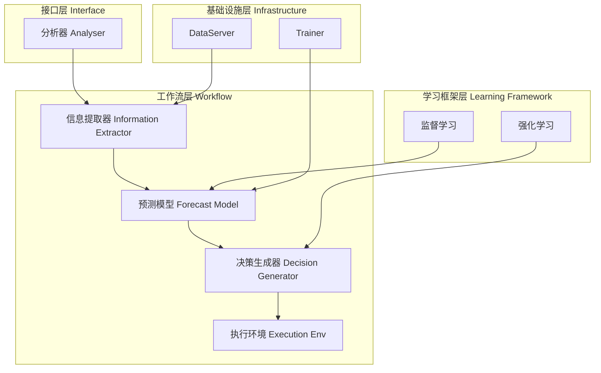
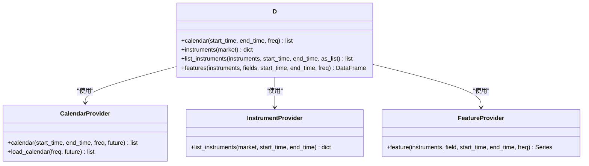
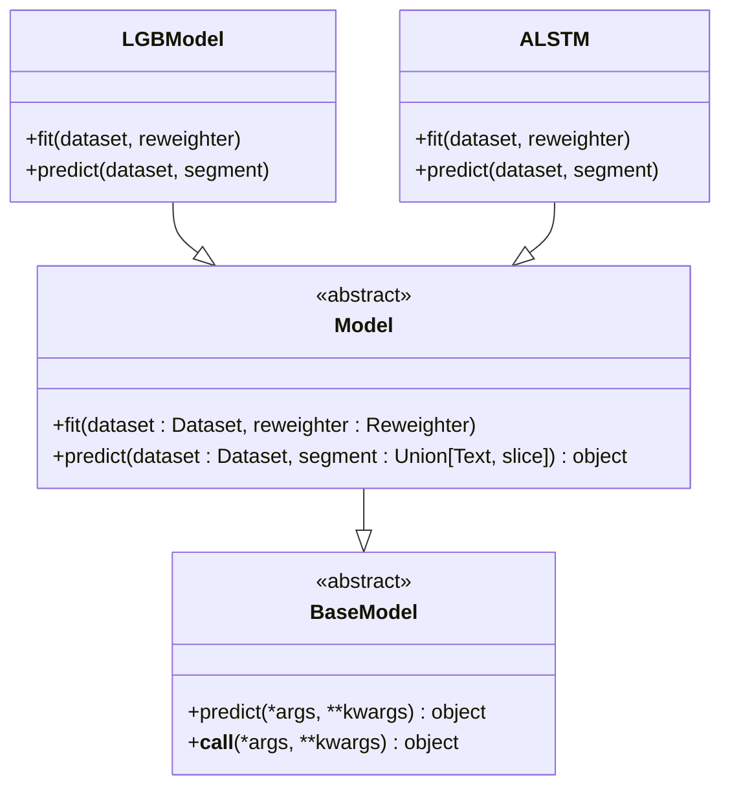
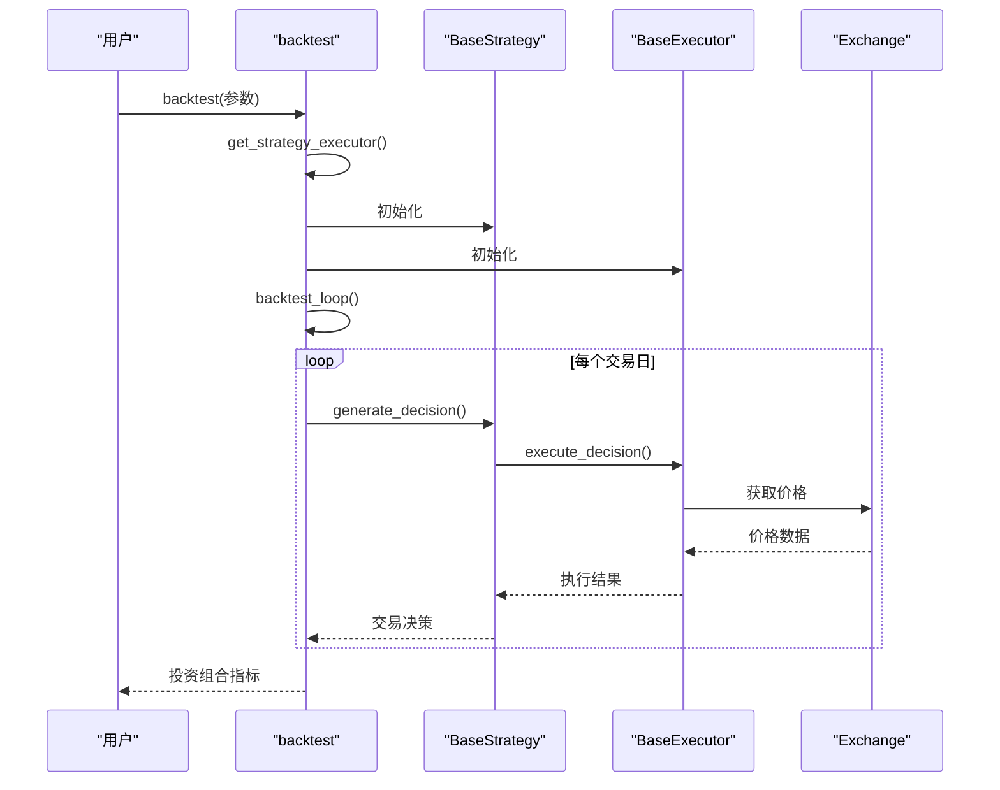
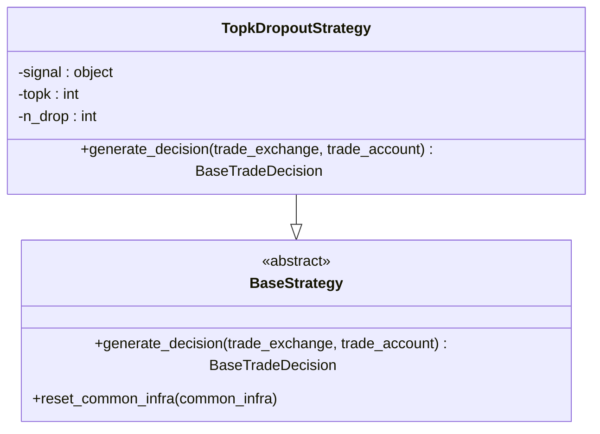
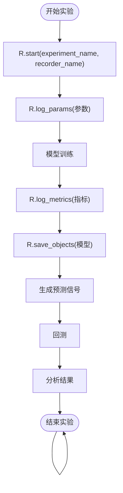

# 项目概述

<cite>
**本文档引用的文件**   
- [README.md](file://README.md)
- [qlib/__init__.py](file://qlib/__init__.py)
- [qlib/config.py](file://qlib/config.py)
- [qlib/data/__init__.py](file://qlib/data/__init__.py)
- [qlib/model/__init__.py](file://qlib/model/__init__.py)
- [qlib/workflow/__init__.py](file://qlib/workflow/__init__.py)
- [qlib/backtest/__init__.py](file://qlib/backtest/__init__.py)
- [qlib/strategy/__init__.py](file://qlib/strategy/__init__.py)
- [examples/benchmarks/LightGBM/workflow_config_lightgbm_Alpha158.yaml](file://examples/benchmarks/LightGBM/workflow_config_lightgbm_Alpha158.yaml)
- [examples/workflow_by_code.py](file://examples/workflow_by_code.py)
- [docs/introduction/introduction.rst](file://docs/introduction/introduction.rst)
</cite>

## 目录
1. [引言](#引言)
2. [核心定位与设计目标](#核心定位与设计目标)
3. [系统架构理念](#系统架构理念)
4. [核心功能模块](#核心功能模块)
5. [工作流管理与配置驱动](#工作流管理与配置驱动)
6. [典型用户场景](#典型用户场景)
7. [与金融分析工具的差异与优势](#与金融分析工具的差异与优势)
8. [发展历程与社区支持](#发展历程与社区支持)
9. [开源协议](#开源协议)

## 引言

Qlib是一个开源的、以人工智能为导向的量化投资平台，旨在实现人工智能技术在量化投资领域的潜力，赋能研究并创造价值。该平台支持多种机器学习建模范式，包括监督学习、市场动态建模和强化学习。Qlib涵盖了从数据处理、模型训练到回测的完整机器学习流水线，以及量化投资的整个链条：Alpha因子挖掘、风险建模、投资组合优化和订单执行。

Qlib的设计目标是为量化研究人员提供一个强大且灵活的基础设施，使其能够轻松地尝试自己的想法，构建更好的量化投资策略。平台通过模块化设计，将复杂的量化研究流程分解为松耦合的组件，每个组件都可以独立使用，从而支持多样化的研究范式和应用场景。

**Section sources**
- [README.md](file://README.md#L82-L87)
- [docs/introduction/introduction.rst](file://docs/introduction/introduction.rst#L11-L13)

## 核心定位与设计目标

Qlib的核心定位是作为一个AI驱动的量化投资研究平台，专注于解决量化投资中的关键挑战。其设计目标包括：

1.  **赋能AI研究**：为研究人员提供一个强大的基础设施，支持监督学习、强化学习等多种AI技术在量化投资中的应用，以挖掘市场中的复杂非线性模式。
2.  **端到端的量化研究流水线**：提供从数据准备、模型训练、回测到结果分析的完整研究流程，覆盖量化投资的全链条。
3.  **高性能与可扩展性**：通过高效的底层数据存储和处理机制，确保在处理大规模金融数据时的高性能，支持高频率数据处理等复杂场景。
4.  **灵活性与可定制性**：采用模块化设计，允许研究人员通过代码构建自定义的研究工作流，满足不同研究需求。
5.  **促进协作与复现**：通过标准化的工作流和实验管理，促进研究成果的共享、复现和协作。

Qlib不仅是一个工具集，更是一个旨在推动量化投资领域AI技术发展的生态系统。

**Section sources**
- [README.md](file://README.md#L82-L87)
- [docs/introduction/introduction.rst](file://docs/introduction/introduction.rst#L11-L13)

## 系统架构理念

Qlib的系统架构采用分层设计，各组件之间松耦合，确保了系统的灵活性和可扩展性。其核心架构理念包括：



**Diagram sources **
- [docs/introduction/introduction.rst](file://docs/introduction/introduction.rst#L19-L20)

- **模块化与松耦合**：系统被设计为多个独立的模块，如数据、模型、回测、策略等。每个模块都有清晰的接口，可以独立开发、测试和替换。
- **配置驱动的工作流**：通过YAML配置文件定义整个研究工作流，包括数据集、模型、回测策略和分析方法，使得实验的复现和共享变得简单。
- **可扩展性**：架构设计允许轻松集成新的数据源、模型算法和回测策略。例如，`contrib`目录下的组件就是社区贡献的可扩展模块。
- **高性能数据服务**：底层的`DataServer`提供了高效的数据管理和检索能力，支持本地和在线两种模式，确保了数据处理的高性能。

这种架构设计使得Qlib既能满足初学者快速上手的需求，也能支持高级研究人员进行复杂和定制化的研究。

**Section sources**
- [README.md](file://README.md#L144-L157)
- [docs/introduction/introduction.rst](file://docs/introduction/introduction.rst#L19-L65)

## 核心功能模块

Qlib的核心功能模块构成了其量化研究的基础，主要包括数据、模型、回测和策略四个部分。

### 数据模块

数据模块是Qlib的基石，负责管理、处理和提供金融数据。它通过`D`对象提供统一的数据访问接口，支持多种数据操作，如获取交易日历、股票池和特征数据。



**Diagram sources **
- [qlib/data/__init__.py](file://qlib/data/__init__.py#L8-L27)
- [qlib/data/data.py](file://qlib/data/data.py#L65-L200)

该模块支持多种数据频率（如日频、分钟频），并内置了`Alpha158`和`Alpha360`等量化因子数据集，方便研究人员快速开始研究。

### 模型模块

模型模块定义了可学习的模型接口，是量化研究的核心。所有模型都继承自`Model`基类，实现了`fit`和`predict`方法。



**Diagram sources **
- [qlib/model/base.py](file://qlib/model/base.py#L10-L111)
- [qlib/model/__init__.py](file://qlib/model/__init__.py#L6-L9)

Qlib内置了多种基准模型，如基于LightGBM、XGBoost的GBDT模型，以及基于PyTorch的LSTM、ALSTM、Transformer等深度学习模型，覆盖了从传统机器学习到前沿深度学习的广泛算法。

### 回测模块

回测模块负责模拟交易过程，评估策略的性能。它通过`backtest`函数提供核心回测功能，可以与策略和执行器协同工作。



**Diagram sources **
- [qlib/backtest/__init__.py](file://qlib/backtest/__init__.py#L33-L277)
- [qlib/backtest/backtest.py](file://qlib/backtest/backtest.py)

该模块模拟了真实的交易环境，考虑了交易成本、涨跌停限制等因素，提供了投资组合收益、信息比率、最大回撤等关键绩效指标。

### 策略模块

策略模块定义了交易决策的生成逻辑。它与回测模块紧密集成，通过`BaseStrategy`基类定义了策略接口。



**Diagram sources **
- [qlib/strategy/base.py](file://qlib/strategy/base.py)
- [qlib/contrib/strategy/signal_strategy.py](file://qlib/contrib/strategy/signal_strategy.py)

典型的策略如`TopkDropoutStrategy`，根据模型预测的信号选择排名靠前的股票构建投资组合，并定期调仓。

**Section sources**
- [qlib/data/__init__.py](file://qlib/data/__init__.py)
- [qlib/model/base.py](file://qlib/model/base.py)
- [qlib/backtest/__init__.py](file://qlib/backtest/__init__.py)
- [qlib/strategy/__init__.py](file://qlib/strategy/__init__.py)

## 工作流管理与配置驱动

Qlib通过`workflow`模块和配置文件实现了对量化研究工作流的全面管理。其核心是`R`（Recorder）对象，它负责实验的生命周期管理。



**Diagram sources **
- [qlib/workflow/__init__.py](file://qlib/workflow/__init__.py#L26-L681)

研究人员可以通过YAML配置文件（如`workflow_config_lightgbm_Alpha158.yaml`）定义整个工作流，包括数据集、模型参数、回测设置和分析方法。然后使用`qrun`命令一键执行整个流程。这种方式极大地简化了实验的配置和执行，确保了研究的可复现性。

**Section sources**
- [examples/benchmarks/LightGBM/workflow_config_lightgbm_Alpha158.yaml](file://examples/benchmarks/LightGBM/workflow_config_lightgbm_Alpha158.yaml)
- [qlib/workflow/__init__.py](file://qlib/workflow/__init__.py)

## 典型用户场景

Qlib支持多种典型的量化研究场景，以下通过`examples`目录中的基准模型进行说明。

### Alpha因子挖掘

这是Qlib最核心的应用场景。研究人员可以使用内置的`Alpha158`或`Alpha360`数据集，训练各种模型来预测股票的未来收益。例如，在`LightGBM`的配置文件中，模型被训练来预测`$close`的未来收益率，生成的预测信号即为一种Alpha因子。

```yaml
task:
    model:
        class: LGBModel
        module_path: qlib.contrib.model.gbdt
    dataset:
        class: DatasetH
        module_path: qlib.data.dataset
        kwargs:
            handler:
                class: Alpha158
                module_path: qlib.contrib.data.handler
```

**Section sources**
- [examples/benchmarks/LightGBM/workflow_config_lightgbm_Alpha158.yaml](file://examples/benchmarks/LightGBM/workflow_config_lightgbm_Alpha158.yaml#L31-L52)

### 投资组合优化

在生成Alpha因子后，需要将其转化为可执行的交易决策。Qlib的`TopkDropoutStrategy`策略就是一个简单的投资组合优化示例，它根据预测信号选择排名前50的股票，并剔除表现最差的5只，从而构建一个动态调整的投资组合。

```yaml
port_analysis_config: &port_analysis_config
    strategy:
        class: TopkDropoutStrategy
        module_path: qlib.contrib.strategy
        kwargs:
            signal: <PRED>
            topk: 50
            n_drop: 5
```

**Section sources**
- [examples/benchmarks/LightGBM/workflow_config_lightgbm_Alpha158.yaml](file://examples/benchmarks/LightGBM/workflow_config_lightgbm_Alpha158.yaml#L12-L19)

### 自定义研究工作流

对于更复杂的研究需求，Qlib支持通过代码构建完全自定义的工作流。`workflow_by_code.py`示例展示了如何通过编程方式初始化组件、启动实验、训练模型、生成信号和进行回测，为高级用户提供了最大的灵活性。

**Section sources**
- [examples/workflow_by_code.py](file://examples/workflow_by_code.py)

## 与金融分析工具的差异与优势

相较于传统的金融分析工具，Qlib具有显著的差异和优势：

1.  **AI原生设计**：Qlib从底层架构到上层应用都围绕AI技术构建，而许多传统工具只是将机器学习作为附加功能。
2.  **端到端的集成**：Qlib将数据、模型、回测和分析无缝集成在一个平台内，避免了在不同工具间切换和数据格式转换的麻烦。
3.  **高性能数据引擎**：Qlib的`DataServer`经过专门优化，其数据处理性能远超通用数据库（如MySQL、HDF5），特别适合处理大规模、高维度的金融时间序列数据。
4.  **先进的研究范式支持**：Qlib不仅支持监督学习，还率先支持了强化学习（用于订单执行）和元学习（用于适应市场动态变化）等前沿研究范式。
5.  **开放的生态系统**：通过`contrib`目录和活跃的社区，Qlib鼓励并支持用户贡献新的模型、数据集和策略，形成了一个不断进化的开源生态。

这些优势使得Qlib成为AI量化投资研究领域的领先平台。

**Section sources**
- [README.md](file://README.md#L562-L571)
- [README.md](file://README.md#L497-L507)

## 发展历程与社区支持

Qlib自2020年9月在GitHub上开源以来，持续快速发展，不断引入新的功能和技术。其发展历程中的一些重要里程碑包括：发布强化学习框架、引入高频率数据处理、支持在线服务和自动模型滚动等。

Qlib拥有一个活跃的社区，通过GitHub Issues、Gitter聊天室和文档等方式提供支持。项目欢迎任何形式的贡献，包括修复bug、改进文档、实现新模型和添加新数据集。社区的贡献是Qlib持续发展的重要动力。

**Section sources**
- [README.md](file://README.md#L45-L75)
- [README.md](file://README.md#L579-L583)
- [README.md](file://README.md#L590-L616)

## 开源协议

Qlib采用MIT许可证发布。该许可证是一种宽松的开源许可证，允许用户在任何项目中自由使用、复制、修改、合并、发布、分发、再许可和销售软件的副本，无论是商业用途还是非商业用途。唯一的条件是，在软件的所有副本或重要部分中都必须包含原始的版权声明和许可声明。

这种宽松的许可协议极大地促进了Qlib的传播和应用，使其能够被广泛地用于学术研究和工业实践。

**Section sources**
- [README.md](file://README.md#L623-L634)