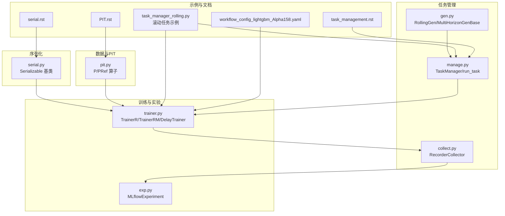
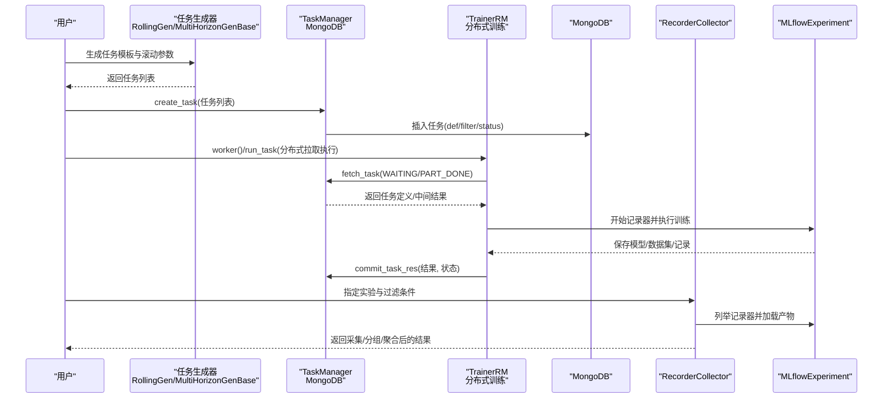
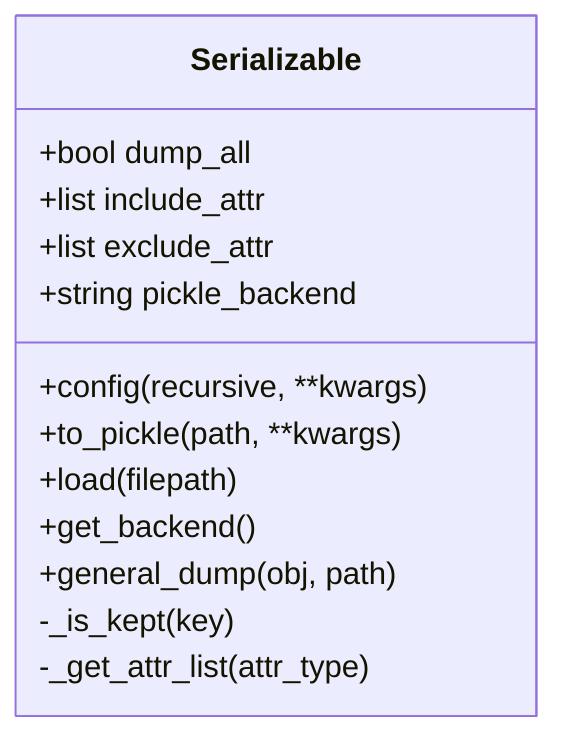
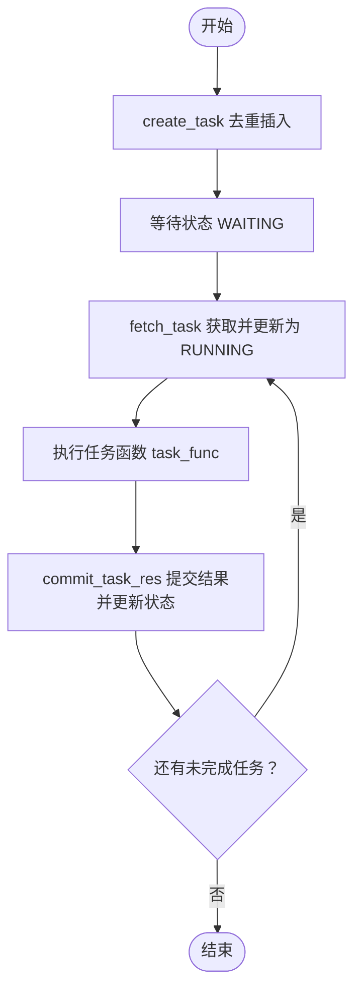
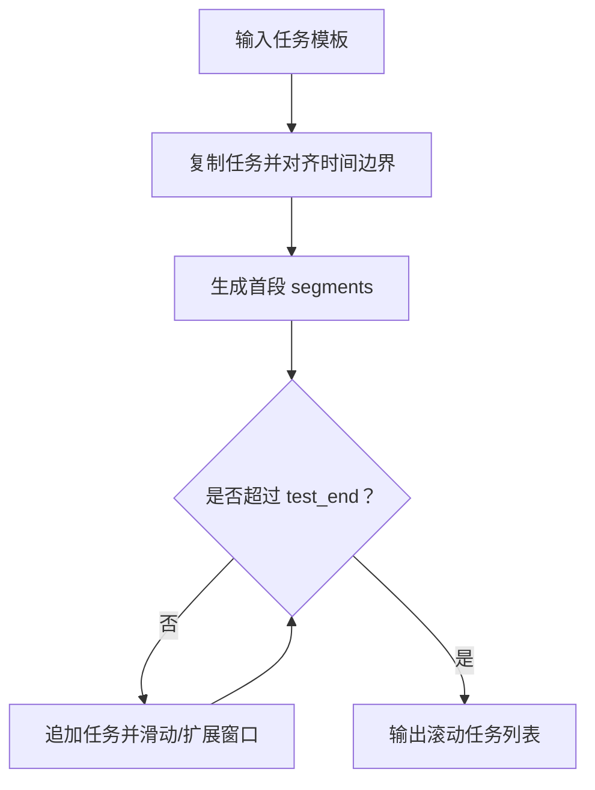
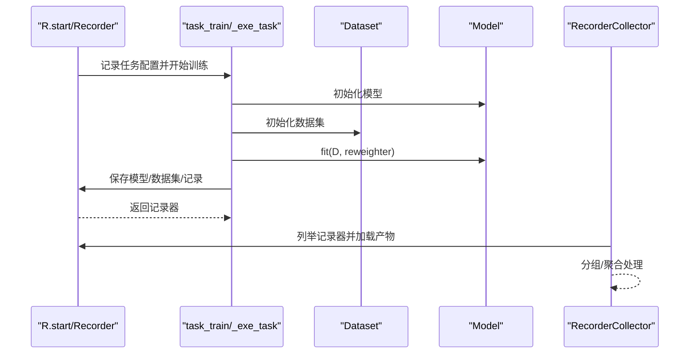
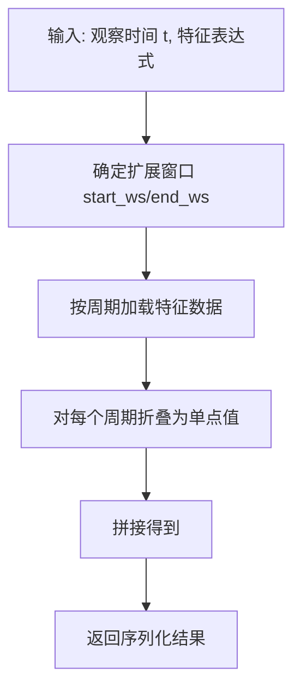
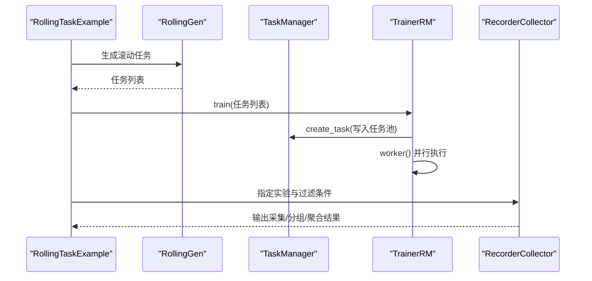
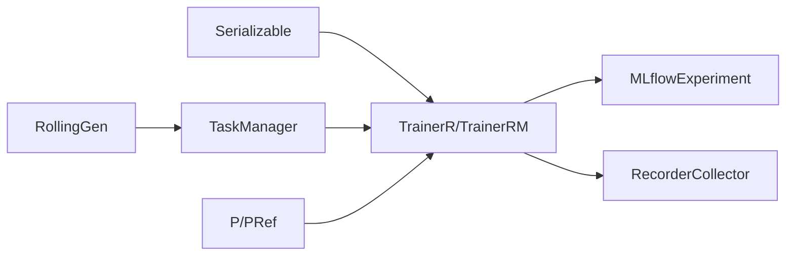

# 任务管理与序列化

<cite>
**本文引用的文件列表**
- [serial.py](file://qlib/utils/serial.py)
- [manage.py](file://qlib/workflow/task/manage.py)
- [gen.py](file://qlib/workflow/task/gen.py)
- [collect.py](file://qlib/workflow/task/collect.py)
- [trainer.py](file://qlib/model/trainer.py)
- [exp.py](file://qlib/workflow/exp.py)
- [pit.py](file://qlib/data/pit.py)
- [task_manager_rolling.py](file://examples/model_rolling/task_manager_rolling.py)
- [serial.rst](file://docs/advanced/serial.rst)
- [task_management.rst](file://docs/advanced/task_management.rst)
- [PIT.rst](file://docs/advanced/PIT.rst)
- [workflow_config_lightgbm_Alpha158.yaml](file://examples/benchmarks/LightGBM/workflow_config_lightgbm_Alpha158.yaml)
</cite>

## 目录
1. [引言](#引言)
2. [项目结构](#项目结构)
3. [核心组件](#核心组件)
4. [架构总览](#架构总览)
5. [详细组件分析](#详细组件分析)
6. [依赖关系分析](#依赖关系分析)
7. [性能考量](#性能考量)
8. [故障排查指南](#故障排查指南)
9. [结论](#结论)
10. [附录](#附录)

## 引言
本技术文档围绕 QLib 的“任务管理与序列化”主题，系统梳理复杂任务的持久化、恢复与分布式执行路径；深入解析 serial.py 中的对象序列化协议及其在模型、数据集等跨进程传递中的应用；结合 task_management.rst 的任务调度策略与 manage.py 的任务收集与生成逻辑；阐明 PIT（Point-in-Time）数据访问模式在回测一致性保障中的作用及 pit.py 的底层实现机制；并通过 model_rolling 中滚动任务管理的实战案例，展示大规模实验的高效执行方案。

## 项目结构
本节聚焦与任务管理、序列化、PIT 数据访问直接相关的模块与文档：
- 序列化：qlib/utils/serial.py 提供通用可序列化基类与通用 dump/load 接口
- 任务管理：qlib/workflow/task/manage.py 提供 TaskManager、run_task 等分布式任务生命周期管理
- 任务生成：qlib/workflow/task/gen.py 提供 RollingGen、MultiHorizonGenBase 等生成器
- 结果采集：qlib/workflow/task/collect.py 提供 RecorderCollector 等采集器
- 训练器：qlib/model/trainer.py 提供 TrainerR、TrainerRM、DelayTrainer 系列
- 实验与记录：qlib/workflow/exp.py 提供 MLflowExperiment 等实验与记录器抽象
- PIT 数据：qlib/data/pit.py 提供 P、PRef 等点时序算子
- 文档：docs/advanced/serial.rst、task_management.rst、PIT.rst
- 示例：examples/model_rolling/task_manager_rolling.py 展示滚动任务全流程
- 配置示例：examples/benchmarks/LightGBM/workflow_config_lightgbm_Alpha158.yaml

图表来源
- [serial.py](file://qlib/utils/serial.py#L1-L190)
- [manage.py](file://qlib/workflow/task/manage.py#L1-L557)
- [gen.py](file://qlib/workflow/task/gen.py#L1-L352)
- [collect.py](file://qlib/workflow/task/collect.py#L1-L259)
- [trainer.py](file://qlib/model/trainer.py#L1-L620)
- [exp.py](file://qlib/workflow/exp.py#L1-L380)
- [pit.py](file://qlib/data/pit.py#L1-L72)
- [task_manager_rolling.py](file://examples/model_rolling/task_manager_rolling.py#L1-L117)
- [serial.rst](file://docs/advanced/serial.rst#L1-L46)
- [task_management.rst](file://docs/advanced/task_management.rst#L1-L101)
- [PIT.rst](file://docs/advanced/PIT.rst#L1-L137)
- [workflow_config_lightgbm_Alpha158.yaml](file://examples/benchmarks/LightGBM/workflow_config_lightgbm_Alpha158.yaml#L1-L72)

章节来源
- [serial.py](file://qlib/utils/serial.py#L1-L190)
- [manage.py](file://qlib/workflow/task/manage.py#L1-L557)
- [gen.py](file://qlib/workflow/task/gen.py#L1-L352)
- [collect.py](file://qlib/workflow/task/collect.py#L1-L259)
- [trainer.py](file://qlib/model/trainer.py#L1-L620)
- [exp.py](file://qlib/workflow/exp.py#L1-L380)
- [pit.py](file://qlib/data/pit.py#L1-L72)
- [task_manager_rolling.py](file://examples/model_rolling/task_manager_rolling.py#L1-L117)
- [serial.rst](file://docs/advanced/serial.rst#L1-L46)
- [task_management.rst](file://docs/advanced/task_management.rst#L1-L101)
- [PIT.rst](file://docs/advanced/PIT.rst#L1-L137)
- [workflow_config_lightgbm_Alpha158.yaml](file://examples/benchmarks/LightGBM/workflow_config_lightgbm_Alpha158.yaml#L1-L72)

## 核心组件
- 可序列化基类 Serializable：定义属性保留规则、配置接口、pickle/dill 后端选择与通用 dump/load
- TaskManager：基于 MongoDB 的任务池，支持任务创建、查询、状态流转、结果提交、重置等待等
- 任务生成器 RollingGen/MultiHorizonGenBase：按滚动窗口或多时长窗口生成任务集合
- 训练器 TrainerR/TrainerRM/DelayTrainer：线性训练、分布式训练与延迟训练流程
- 结果采集 RecorderCollector：从实验记录器中采集产物并进行分组/聚合处理
- PIT 算子 P/PRef：面向季度/年度财务因子的点时序计算，保障回测一致性
- 示例脚本 task_manager_rolling.py：演示滚动任务的生成、训练、收集全流程

章节来源
- [serial.py](file://qlib/utils/serial.py#L1-L190)
- [manage.py](file://qlib/workflow/task/manage.py#L1-L557)
- [gen.py](file://qlib/workflow/task/gen.py#L1-L352)
- [trainer.py](file://qlib/model/trainer.py#L1-L620)
- [collect.py](file://qlib/workflow/task/collect.py#L1-L259)
- [pit.py](file://qlib/data/pit.py#L1-L72)
- [task_manager_rolling.py](file://examples/model_rolling/task_manager_rolling.py#L1-L117)

## 架构总览
下图展示了从任务生成到分布式训练、结果采集与回测一致性的整体流程。

图表来源
- [gen.py](file://qlib/workflow/task/gen.py#L1-L352)
- [manage.py](file://qlib/workflow/task/manage.py#L1-L557)
- [trainer.py](file://qlib/model/trainer.py#L1-L620)
- [collect.py](file://qlib/workflow/task/collect.py#L1-L259)
- [exp.py](file://qlib/workflow/exp.py#L1-L380)

## 详细组件分析

### 组件一：对象序列化协议（serial.py）
- 设计目标：通过统一的可序列化基类，控制属性的保留/丢弃规则，支持 pickle/dill 后端切换，并提供通用 dump/load 接口
- 关键机制
  - 属性保留规则优先级：配置属性列表 > include 列表 > exclude 列表 > 名称不以下划线开头保留 > 其余按 dump_all 决定
  - 配置接口：支持递归配置，避免循环引用
  - 后端选择：pickle_backend 支持 "pickle"/"dill"，默认 "pickle"
  - 通用 dump：对 Serializable 实例调用 to_pickle，否则使用 pickle.dump
- 在模型/数据集传递中的应用
  - 训练器在保存数据集时会设置 dump_all=False 并递归配置，确保仅持久化必要状态而非原始数据
  - 采集器使用 dill 以支持函数序列化，便于自定义处理器

图表来源
- [serial.py](file://qlib/utils/serial.py#L1-L190)

章节来源
- [serial.py](file://qlib/utils/serial.py#L1-L190)
- [serial.rst](file://docs/advanced/serial.rst#L1-L46)
- [trainer.py](file://qlib/model/trainer.py#L1-L620)

### 组件二：任务调度与生命周期（manage.py）
- 任务结构：def（任务定义）、filter（用于去重查询）、status（等待/运行/完成/部分完成）、res（结果）
- 编解码：对 def/res 字段使用 pickle 编码为二进制存入 MongoDB，查询时再解码
- 生命周期管理
  - create_task：去重插入新任务，返回 _id 列表
  - fetch_task/safe_fetch_task：原子获取并更新状态为运行，异常时自动归还
  - commit_task_res：提交结果并更新状态
  - reset_waiting/reset_status：批量重置运行中任务状态
  - prioritize：设置任务优先级
  - wait：进度条等待未完成任务完成
- 分布式执行：run_task 循环从数据库拉取任务，按 before_status/after_status 转换状态，支持强制释放资源的进程池执行

图表来源
- [manage.py](file://qlib/workflow/task/manage.py#L1-L557)

章节来源
- [manage.py](file://qlib/workflow/task/manage.py#L1-L557)
- [task_management.rst](file://docs/advanced/task_management.rst#L1-L101)

### 组件三：任务生成策略（gen.py）
- RollingGen：按固定步长滑动或扩展窗口生成滚动任务，支持调整 handler 结束时间与截断测试段避免未来信息泄露
- MultiHorizonGenBase：按不同预测时长生成任务，同时调整 segments 截断天数避免标签泄漏
- 时间对齐与截断：使用 TimeAdjuster 对齐时间边界，trunc_segments 截断训练/验证段以避免未来信息

图表来源
- [gen.py](file://qlib/workflow/task/gen.py#L1-L352)

章节来源
- [gen.py](file://qlib/workflow/task/gen.py#L1-L352)

### 组件四：分布式训练与结果采集（trainer.py + collect.py + exp.py）
- TrainerR：线性训练，每个任务独立记录器，保存任务配置与模型参数、数据集（仅状态）
- TrainerRM：基于 TaskManager 的分布式训练，支持 worker 并发执行，训练完成后回填记录器引用
- DelayTrainer：两阶段训练，先准备后真实拟合，适合跨机器/异构资源场景
- RecorderCollector：从实验中列举记录器，按过滤函数与键函数采集产物，支持覆盖警告与仅存在产物采集
- MLflowExperiment：基于 MLflow 的实验与记录器管理，支持搜索、删除、状态过滤

图表来源
- [trainer.py](file://qlib/model/trainer.py#L1-L620)
- [collect.py](file://qlib/workflow/task/collect.py#L1-L259)
- [exp.py](file://qlib/workflow/exp.py#L1-L380)

章节来源
- [trainer.py](file://qlib/model/trainer.py#L1-L620)
- [collect.py](file://qlib/workflow/task/collect.py#L1-L259)
- [exp.py](file://qlib/workflow/exp.py#L1-L380)

### 组件五：PIT 数据访问与回测一致性（pit.py + PIT.rst）
- PIT 设计目标：在历史回测中使用正确的时点版本数据，避免“最新版本”导致的数据泄露
- 文件格式：每特征包含 date、period、value、_next 四列，索引文件加速查询
- 点时序算子 P/PRef：按观察时间 t 计算周期内特征值的折叠（collapse），保证表达式引擎在 <period_time, feature> 与 <observe_time, feature> 两种格式下的正确性
- 已知限制：当前主要面向季度/年度因子，且 PIT 计算性能有优化空间

图表来源
- [pit.py](file://qlib/data/pit.py#L1-L72)
- [PIT.rst](file://docs/advanced/PIT.rst#L1-L137)

章节来源
- [pit.py](file://qlib/data/pit.py#L1-L72)
- [PIT.rst](file://docs/advanced/PIT.rst#L1-L137)

### 组件六：滚动任务管理实战（model_rolling）
- 示例流程：初始化、重置、生成滚动任务、分布式训练、结果采集
- 关键点
  - 使用 RollingGen 生成不同日期片段的任务
  - TrainerRM 将任务写入 MongoDB 任务池，worker 并行执行
  - RecorderCollector 按模型与滚动键进行分组与过滤，输出聚合结果

图表来源
- [task_manager_rolling.py](file://examples/model_rolling/task_manager_rolling.py#L1-L117)
- [gen.py](file://qlib/workflow/task/gen.py#L1-L352)
- [manage.py](file://qlib/workflow/task/manage.py#L1-L557)
- [trainer.py](file://qlib/model/trainer.py#L1-L620)
- [collect.py](file://qlib/workflow/task/collect.py#L1-L259)

章节来源
- [task_manager_rolling.py](file://examples/model_rolling/task_manager_rolling.py#L1-L117)

## 依赖关系分析
- 组件耦合
  - TaskManager 依赖 MongoDB 存储与 pickle 编解码，负责任务池的并发安全与状态机
  - TrainerRM 依赖 TaskManager 完成分布式训练，依赖 Recorder 完成结果回填
  - RecorderCollector 依赖 Experiment/Recorder 抽象，依赖 MLflow 实现
  - Serializable 作为通用基类被 Dataset、Model 等广泛继承，贯穿序列化链路
- 外部依赖
  - MongoDB：任务池存储
  - MLflow：实验与记录器管理
  - dill：函数序列化支持
  - tqdm：进度显示

图表来源
- [serial.py](file://qlib/utils/serial.py#L1-L190)
- [gen.py](file://qlib/workflow/task/gen.py#L1-L352)
- [manage.py](file://qlib/workflow/task/manage.py#L1-L557)
- [trainer.py](file://qlib/model/trainer.py#L1-L620)
- [collect.py](file://qlib/workflow/task/collect.py#L1-L259)
- [exp.py](file://qlib/workflow/exp.py#L1-L380)
- [pit.py](file://qlib/data/pit.py#L1-L72)

章节来源
- [serial.py](file://qlib/utils/serial.py#L1-L190)
- [manage.py](file://qlib/workflow/task/manage.py#L1-L557)
- [trainer.py](file://qlib/model/trainer.py#L1-L620)
- [collect.py](file://qlib/workflow/task/collect.py#L1-L259)
- [exp.py](file://qlib/workflow/exp.py#L1-L380)
- [pit.py](file://qlib/data/pit.py#L1-L72)

## 性能考量
- 序列化协议
  - 使用 dill 以支持函数序列化，但注意其体积与兼容性权衡
  - 对大型数据集仅持久化状态而非原始数据，降低 IO 与内存压力
- 任务池与并发
  - MongoDB 的 find_one_and_update 原子更新保证并发安全
  - 通过优先级字段与批量重置等待，提升吞吐与稳定性
- 回测一致性
  - PIT 文件格式与索引设计减少查询开销
  - 表达式折叠与未来信息截断避免数据泄露
- 实践建议
  - 控制任务粒度，避免单任务过大
  - 合理设置 maxtasksperchild 与 joblib 后端
  - 使用滚动生成器时注意 handler 结束时间与截断天数

[本节为通用指导，无需列出具体文件来源]

## 故障排查指南
- 任务无法拉取
  - 检查 MongoDB 连接与任务池名称
  - 确认任务状态为 WAITING 或 PART_DONE，且优先级排序正确
- 任务执行失败回退
  - safe_fetch_task 在异常时自动归还任务，检查日志并确认状态恢复
- 结果提交失败
  - 确认 res 字段已正确 pickle 编码并提交
- 采集不到记录器
  - 检查实验名、记录器状态过滤条件与 artifacts 路径
- PIT 查询异常
  - 确认数据文件命名与索引文件存在，检查 period/date 格式

章节来源
- [manage.py](file://qlib/workflow/task/manage.py#L1-L557)
- [collect.py](file://qlib/workflow/task/collect.py#L1-L259)
- [PIT.rst](file://docs/advanced/PIT.rst#L1-L137)

## 结论
QLib 的任务管理与序列化体系通过“可序列化基类 + 任务池 + 分布式训练 + 结果采集”的闭环，实现了复杂任务的持久化、恢复与跨进程传递；PIT 数据访问模式确保了回测一致性；滚动任务生成器与示例脚本提供了大规模实验的高效执行方案。该体系在工程上具备良好的扩展性与可维护性，适合在多机环境下稳定运行。

[本节为总结性内容，无需列出具体文件来源]

## 附录
- 配置参考
  - YAML 配置示例展示了任务模板、数据处理器与记录器的典型结构
- 文档参考
  - 序列化、任务管理、PIT 的官方文档提供了更详细的 API 与使用说明

章节来源
- [workflow_config_lightgbm_Alpha158.yaml](file://examples/benchmarks/LightGBM/workflow_config_lightgbm_Alpha158.yaml#L1-L72)
- [serial.rst](file://docs/advanced/serial.rst#L1-L46)
- [task_management.rst](file://docs/advanced/task_management.rst#L1-L101)
- [PIT.rst](file://docs/advanced/PIT.rst#L1-L137)