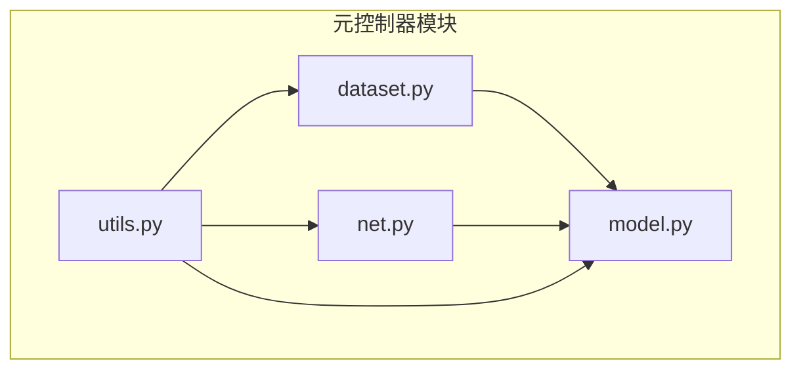
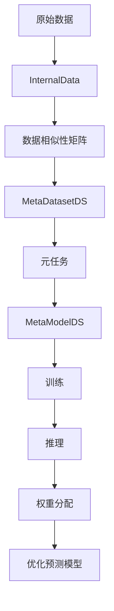
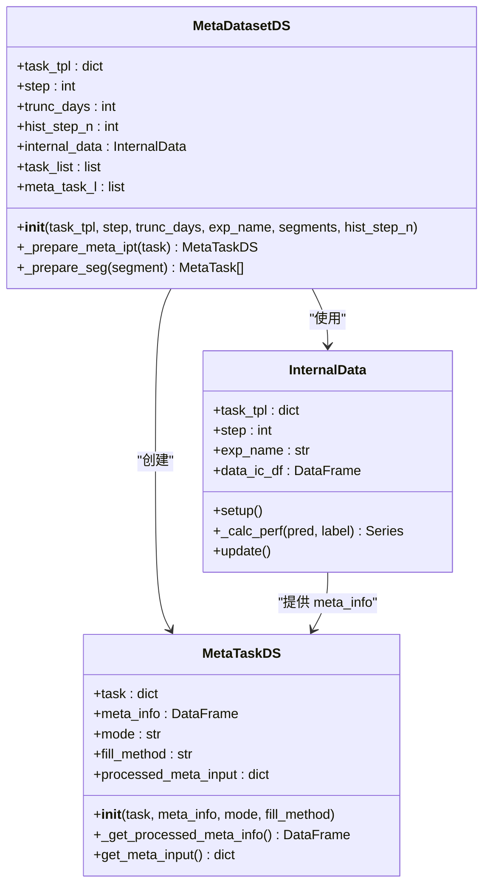
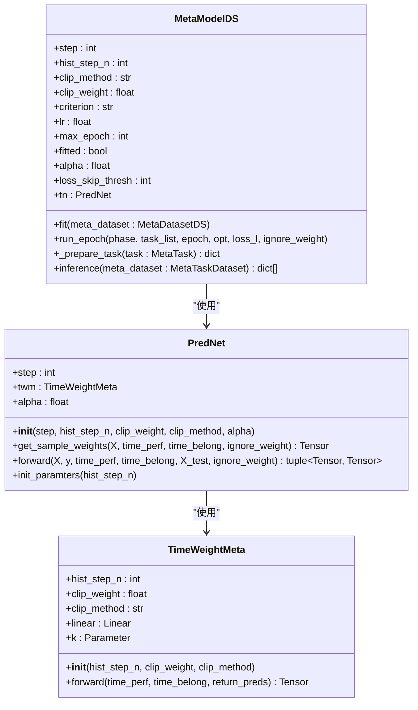
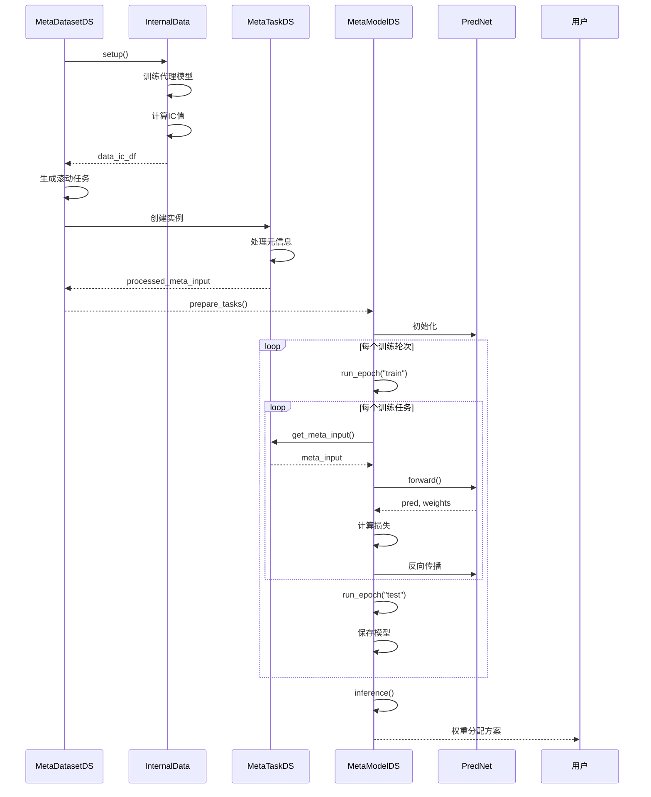
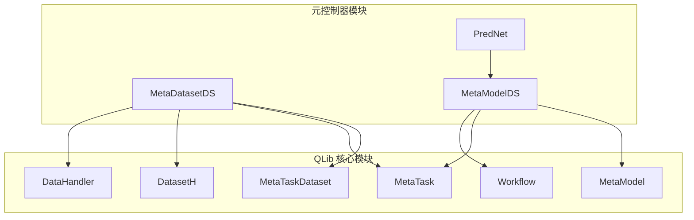

# 元控制器

<cite>
**本文档中引用的文件**  
- [dataset.py](file://qlib/contrib/meta/data_selection/dataset.py)
- [model.py](file://qlib/contrib/meta/data_selection/model.py)
- [net.py](file://qlib/contrib/meta/data_selection/net.py)
- [utils.py](file://qlib/contrib/meta/data_selection/utils.py)
- [MetaTaskDataset.py](file://qlib/model/meta/dataset.py)
- [MetaTask.py](file://qlib/model/meta/task.py)
- [MetaModel.py](file://qlib/model/meta/model.py)
- [workflow.py](file://examples/benchmarks_dynamic/DDG-DA/workflow.py)
- [meta.rst](file://docs/component/meta.rst)
</cite>

## 目录
1. [引言](#引言)
2. [项目结构](#项目结构)
3. [核心组件](#核心组件)
4. [架构概述](#架构概述)
5. [详细组件分析](#详细组件分析)
6. [依赖分析](#依赖分析)
7. [性能考量](#性能考量)
8. [故障排除指南](#故障排除指南)
9. [结论](#结论)

## 引言
元控制器（Meta Controller）是QLib框架中的一个高级组件，旨在通过元学习技术为预测模型提供指导。它能够从一系列预测任务中学习规律模式，并利用这些模式来优化未来的预测任务。在自动化数据选择和模型选择的场景中，元控制器通过分析历史数据的性能表现，动态调整特征集或模型超参数组合，从而提升模型的整体性能。本文档将深入探讨元控制器的实现机制，重点阐述其在data_selection模块中的dataset.py和model.py文件之间的交互逻辑，以及net.py定义的神经网络架构如何驱动元学习过程。此外，还将解释元控制器与主模型训练流程的集成方式，包括输入特征空间构建、决策策略生成和反馈闭环设计，并提供实际使用案例、性能评估指标设计、训练稳定性调优技巧以及与标准机器学习流水线的兼容性说明。

## 项目结构
元控制器相关代码主要位于`qlib/contrib/meta/data_selection/`目录下，该目录包含了实现数据选择功能的核心模块。`dataset.py`文件定义了元任务数据集（MetaDatasetDS）和内部数据（InternalData）类，负责准备和管理用于元学习的数据。`model.py`文件则定义了元模型（MetaModelDS）类，实现了元学习算法的核心逻辑。`net.py`文件定义了神经网络架构（PredNet），用于执行具体的预测任务。`utils.py`文件提供了辅助函数和类，如ICLoss损失函数和权重裁剪方法。这些模块共同构成了元控制器的基础架构，支持从数据预处理到模型训练和推理的完整流程。

**图源**  
- [dataset.py](file://qlib/contrib/meta/data_selection/dataset.py)
- [model.py](file://qlib/contrib/meta/data_selection/model.py)
- [net.py](file://qlib/contrib/meta/data_selection/net.py)
- [utils.py](file://qlib/contrib/meta/data_selection/utils.py)

**节源**  
- [dataset.py](file://qlib/contrib/meta/data_selection/dataset.py)
- [model.py](file://qlib/contrib/meta/data_selection/model.py)
- [net.py](file://qlib/contrib/meta/data_selection/net.py)
- [utils.py](file://qlib/contrib/meta/data_selection/utils.py)

## 核心组件
元控制器的核心组件包括元任务（MetaTask）、元数据集（MetaTaskDataset）和元模型（MetaModel）。元任务是元学习框架中的基本元素，保存了可用于元模型的数据。元数据集负责生成元信息，为元模型的训练提供数据。元模型则是控制工作流的部分，通过`fit`函数进行训练，并通过`inference`函数提供有用的指导信息。在data_selection模块中，`MetaTaskDS`类继承自`MetaTask`，用于处理数据选择任务；`MetaDatasetDS`类继承自`MetaTaskDataset`，负责准备数据选择任务所需的数据；`MetaModelDS`类继承自`MetaTaskModel`，实现了数据选择的元学习算法。

**节源**  
- [dataset.py](file://qlib/contrib/meta/data_selection/dataset.py)
- [model.py](file://qlib/contrib/meta/data_selection/model.py)
- [MetaTask.py](file://qlib/model/meta/task.py)
- [MetaTaskDataset.py](file://qlib/model/meta/dataset.py)
- [MetaModel.py](file://qlib/model/meta/model.py)

## 架构概述
元控制器的架构遵循元学习的基本框架，由元任务、元数据集和元模型三部分组成。元数据集从原始数据中提取元信息，生成一系列元任务。元模型在这些元任务上进行训练，学习如何根据元信息做出决策。训练完成后，元模型可以对新的元任务进行推理，生成指导信息，用于优化预测模型的性能。在data_selection模块中，这一过程具体表现为：首先，通过`InternalData`类计算不同数据片段的性能指标（如IC值），生成数据相似性矩阵；然后，`MetaDatasetDS`类利用这些性能指标，构建包含历史性能信息的元任务；最后，`MetaModelDS`类在这些元任务上进行训练，学习如何根据历史性能信息为不同时间段的数据分配权重，从而实现数据选择的自动化。

**图源**  
- [dataset.py](file://qlib/contrib/meta/data_selection/dataset.py)
- [model.py](file://qlib/contrib/meta/data_selection/model.py)

## 详细组件分析

### MetaDatasetDS 分析
`MetaDatasetDS`类是元数据集的具体实现，负责准备数据选择任务所需的数据。其构造函数接收任务模板（task_tpl）、滚动步长（step）、截断天数（trunc_days）、实验名称（exp_name）等参数。在初始化过程中，如果`exp_name`是字符串，则创建`InternalData`实例并调用其`setup`方法，生成数据性能指标；如果`exp_name`已经是`InternalData`实例，则直接使用。随后，根据任务模板生成一系列滚动任务，并为每个任务创建`MetaTaskDS`实例，最终形成一个包含多个元任务的列表。

**图源**  
- [dataset.py](file://qlib/contrib/meta/data_selection/dataset.py#L237-L417)

**节源**  
- [dataset.py](file://qlib/contrib/meta/data_selection/dataset.py#L237-L417)

### MetaModelDS 分析
`MetaModelDS`类是元模型的具体实现，负责执行数据选择的元学习算法。其构造函数接收滚动步长（step）、历史步数（hist_step_n）、裁剪方法（clip_method）、裁剪权重（clip_weight）、损失函数（criterion）、学习率（lr）、最大训练轮数（max_epoch）等参数。`fit`方法是元模型的训练入口，接收`MetaDatasetDS`实例作为输入，从中获取训练和测试阶段的元任务列表。训练过程分为多个epoch，每个epoch中对训练和测试任务分别执行`run_epoch`方法。`run_epoch`方法遍历任务列表，获取元输入，通过`PredNet`模型进行预测，计算损失并更新模型参数。训练完成后，模型权重会被保存，以便后续推理使用。

**图源**  
- [model.py](file://qlib/contrib/meta/data_selection/model.py#L40-L197)
- [net.py](file://qlib/contrib/meta/data_selection/net.py#L1-L75)

**节源**  
- [model.py](file://qlib/contrib/meta/data_selection/model.py#L40-L197)

### 数据选择交互逻辑
data_selection模块中dataset.py和model.py的交互逻辑是元控制器实现自动化数据选择的核心。`dataset.py`中的`MetaDatasetDS`类负责准备数据，它通过`InternalData`类计算不同数据片段的性能指标，生成数据相似性矩阵，并将其作为元信息传递给`MetaTaskDS`实例。`model.py`中的`MetaModelDS`类则利用这些元信息进行训练，学习如何根据历史性能信息为不同时间段的数据分配权重。在训练过程中，`MetaModelDS`通过`PredNet`模型对每个元任务进行预测，计算损失并更新模型参数。训练完成后，`MetaModelDS`可以对新的元任务进行推理，生成权重分配方案，用于优化预测模型的性能。

**图源**  
- [dataset.py](file://qlib/contrib/meta/data_selection/dataset.py)
- [model.py](file://qlib/contrib/meta/data_selection/model.py)
- [net.py](file://qlib/contrib/meta/data_selection/net.py)

**节源**  
- [dataset.py](file://qlib/contrib/meta/data_selection/dataset.py)
- [model.py](file://qlib/contrib/meta/data_selection/model.py)
- [net.py](file://qlib/contrib/meta/data_selection/net.py)

## 依赖分析
元控制器的实现依赖于QLib框架的多个核心模块。`MetaTask`、`MetaTaskDataset`和`MetaModel`类定义了元学习的基本接口和抽象基类，位于`qlib/model/meta/`目录下。`data_selection`模块中的具体实现类继承并实现了这些接口。此外，元控制器还依赖于`qlib/data/dataset/`模块中的数据处理功能，如`DatasetH`和`DataHandler`，用于加载和预处理原始数据。在神经网络实现方面，`PredNet`类依赖于PyTorch框架，使用`nn.Linear`等模块构建神经网络。整个系统通过`qlib/workflow/`模块进行任务管理和实验记录，确保训练和推理过程的可追溯性和可重复性。

**图源**  
- [MetaTask.py](file://qlib/model/meta/task.py)
- [MetaTaskDataset.py](file://qlib/model/meta/dataset.py)
- [MetaModel.py](file://qlib/model/meta/model.py)
- [dataset.py](file://qlib/contrib/meta/data_selection/dataset.py)
- [model.py](file://qlib/contrib/meta/data_selection/model.py)
- [net.py](file://qlib/contrib/meta/data_selection/net.py)

**节源**  
- [MetaTask.py](file://qlib/model/meta/task.py)
- [MetaTaskDataset.py](file://qlib/model/meta/dataset.py)
- [MetaModel.py](file://qlib/model/meta/model.py)
- [dataset.py](file://qlib/contrib/meta/data_selection/dataset.py)
- [model.py](file://qlib/contrib/meta/data_selection/model.py)
- [net.py](file://qlib/contrib/meta/data_selection/net.py)

## 性能考量
元控制器的性能受到多个因素的影响。首先，`InternalData.setup`方法中的代理模型训练过程可能非常耗时，尤其是在数据量较大时。为了提高效率，可以考虑使用更高效的模型或减少训练数据的规模。其次，`MetaDatasetDS`在初始化时需要处理大量的元任务，这可能导致内存占用过高。可以通过分批处理或使用更高效的数据结构来缓解这一问题。此外，`PredNet`模型的训练过程也可能需要较长时间，尤其是在训练轮数较多时。可以考虑使用更小的学习率或更早的停止条件来加速训练。最后，元控制器的性能还受到元信息质量的影响，如果数据相似性矩阵不够准确，可能会导致元模型学习到错误的模式，从而影响最终的决策效果。

## 故障排除指南
在使用元控制器时，可能会遇到一些常见问题。例如，如果在训练过程中出现NaN损失，可能是由于数据预处理不当或模型参数初始化不合理导致的。可以检查数据中是否存在缺失值或异常值，并确保模型参数的初始化范围合适。如果训练过程非常缓慢，可以检查是否启用了不必要的日志记录或调试信息，并考虑使用更高效的硬件资源。如果推理结果不符合预期，可以检查元信息的生成过程是否正确，并验证元模型的训练效果。此外，还可以通过调整超参数（如学习率、批量大小等）来优化模型性能。

**节源**  
- [model.py](file://qlib/contrib/meta/data_selection/model.py#L106)
- [dataset.py](file://qlib/contrib/meta/data_selection/dataset.py#L160)

## 结论
元控制器是QLib框架中一个强大的工具，能够通过元学习技术实现自动化数据选择和模型选择。它通过分析历史数据的性能表现，动态调整特征集或模型超参数组合，从而提升模型的整体性能。本文档详细介绍了元控制器的实现机制，重点阐述了data_selection模块中dataset.py和model.py的交互逻辑，以及net.py定义的神经网络架构如何驱动元学习过程。通过理解这些核心组件的工作原理，用户可以更好地利用元控制器来优化自己的机器学习流水线，实现更高效、更智能的模型训练和推理。