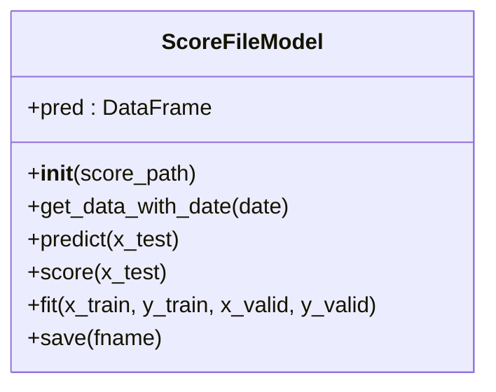
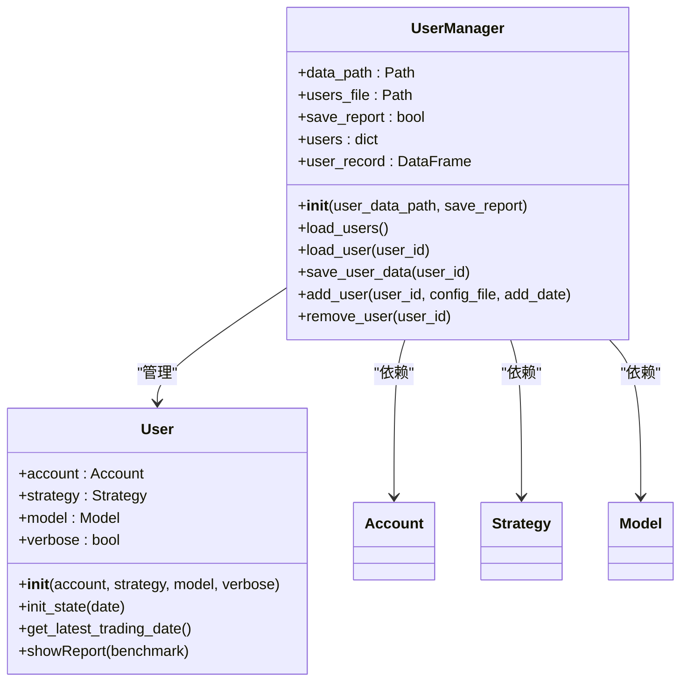
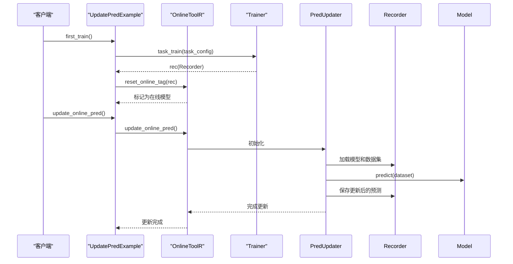
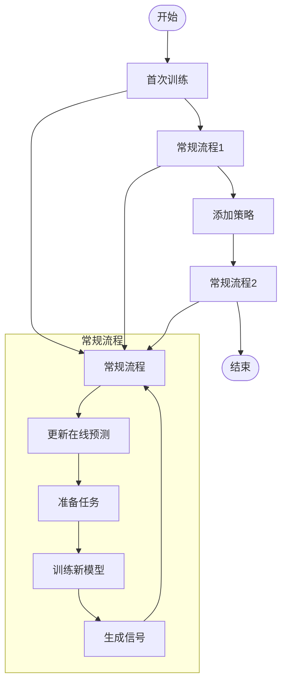
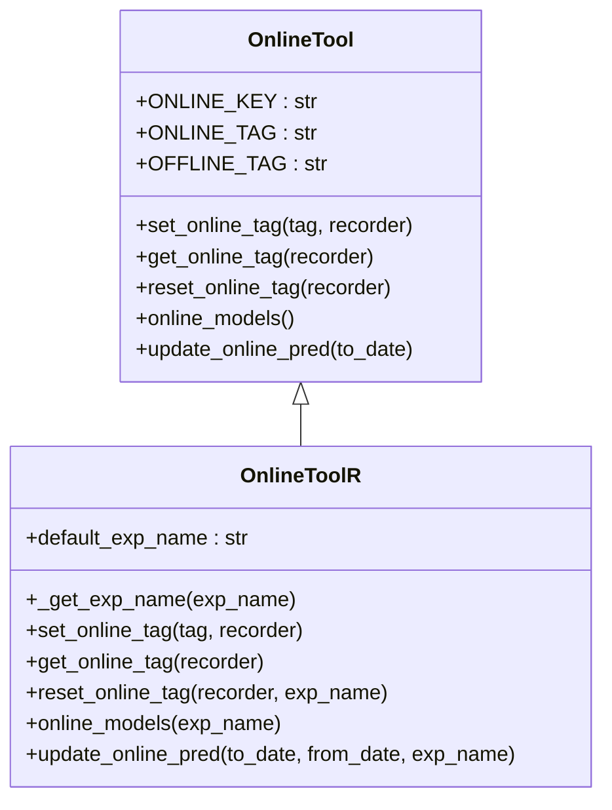
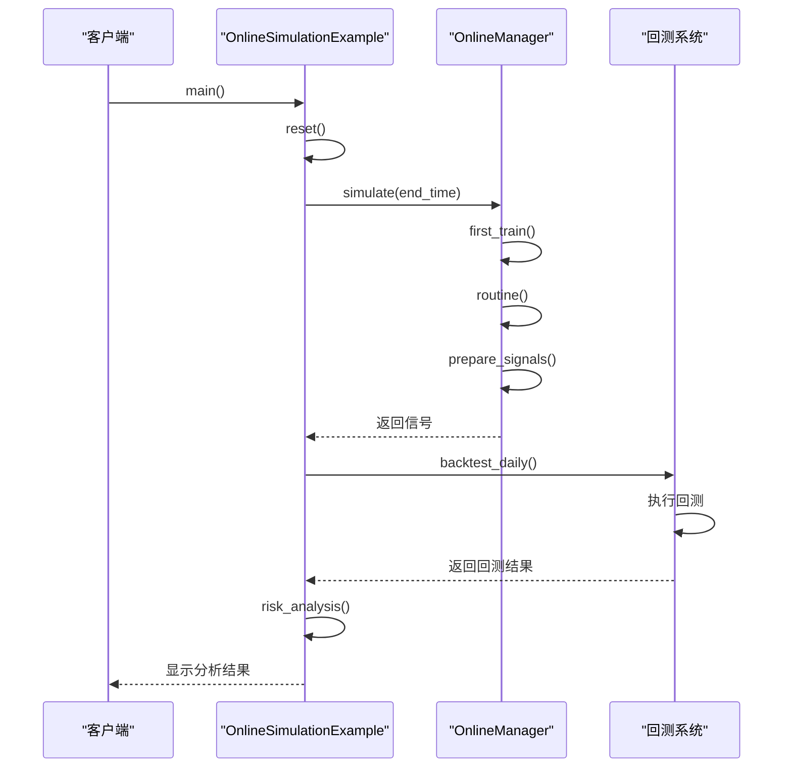

# 在线服务

<cite>
**本文档引用的文件**   
- [online_model.py](file://qlib/contrib/online/online_model.py)
- [manager.py](file://qlib/contrib/online/manager.py)
- [update_online_pred.py](file://examples/online_srv/update_online_pred.py)
- [rolling_online_management.py](file://examples/online_srv/rolling_online_management.py)
- [online_management_simulate.py](file://examples/online_srv/online_management_simulate.py)
- [workflow/online/manager.py](file://qlib/workflow/online/manager.py)
- [workflow/online/strategy.py](file://qlib/workflow/online/strategy.py)
- [workflow/online/utils.py](file://qlib/workflow/online/utils.py)
- [workflow/online/update.py](file://qlib/workflow/online/update.py)
- [user.py](file://qlib/contrib/online/user.py)
- [utils.py](file://qlib/contrib/online/utils.py)
</cite>

## 目录
1. [简介](#简介)
2. [在线模型封装规范](#在线模型封装规范)
3. [服务生命周期管理](#服务生命周期管理)
4. [预测数据更新流程](#预测数据更新流程)
5. [滚动更新策略](#滚动更新策略)
6. [生产级特性说明](#生产级特性说明)
7. [测试环境验证](#测试环境验证)
8. [总结](#总结)

## 简介

本文档详细介绍了QLib框架中在线服务部署与管理的完整体系，涵盖模型上线、预测更新和滚动管理机制。系统通过`online_model.py`实现在线模型的封装规范，利用`manager.py`进行服务生命周期管理，通过`update_online_pred.py`处理预测数据更新流程，并采用`rolling_online_management.py`实现滚动更新策略。

该系统支持服务健康检查、版本控制、灰度发布等生产级特性，为量化交易策略的在线部署提供了完整的解决方案。通过`workflow/online`模块的协同工作机制，实现了从模型训练到在线服务的无缝衔接，确保了生产环境的稳定性和可靠性。

**本文档引用的文件**
- [online_model.py](file://qlib/contrib/online/online_model.py)
- [manager.py](file://qlib/contrib/online/manager.py)
- [update_online_pred.py](file://examples/online_srv/update_online_pred.py)
- [rolling_online_management.py](file://examples/online_srv/rolling_online_management.py)

## 在线模型封装规范

`online_model.py`文件定义了在线模型的封装规范，其中`ScoreFileModel`类实现了基于评分文件的模型加载和预测功能。该模型通过CSV文件加载预计算的评分数据，并在指定日期返回相应的评分结果。

模型的核心功能包括：
- 从CSV文件加载评分数据，支持多索引（股票代码和交易日期）
- 根据指定日期获取评分数据
- 提供标准化的预测接口

该封装规范确保了在线模型的统一接口，便于在不同场景下进行替换和管理。

**图表来源**
- [online_model.py](file://qlib/contrib/online/online_model.py#L13-L40)

**本文档引用的文件**
- [online_model.py](file://qlib/contrib/online/online_model.py)

## 服务生命周期管理

`manager.py`文件实现了在线服务的生命周期管理功能，通过`UserManager`类管理用户数据、模型和策略的生命周期。该系统提供了完整的用户管理功能，包括用户添加、删除、加载和保存等操作。

`UserManager`的核心功能包括：
- 用户数据路径管理
- 用户信息记录（用户ID和添加日期）
- 模型和策略的序列化与反序列化
- 交易账户的管理

系统通过pickle文件保存用户的状态，确保在服务重启后能够恢复用户数据。同时，通过CSV文件记录用户的基本信息，便于快速查询和管理。

**图表来源**
- [manager.py](file://qlib/contrib/online/manager.py#L17-L149)
- [user.py](file://qlib/contrib/online/user.py#L14-L78)

**本文档引用的文件**
- [manager.py](file://qlib/contrib/online/manager.py#L17-L149)
- [user.py](file://qlib/contrib/online/user.py#L14-L78)
- [utils.py](file://qlib/contrib/online/utils.py#L20-L49)

## 预测数据更新流程

`update_online_pred.py`文件展示了在线预测更新的完整流程，通过`UpdatePredExample`类实现了从模型训练到预测更新的自动化工作流。该流程与`workflow/online`模块协同工作，确保预测数据的及时更新。

更新流程分为两个主要阶段：
1. **首次训练**：完成模型训练并将训练好的模型设置为在线模型
2. **预测更新**：定期更新在线模型的预测结果

系统通过`OnlineToolR`工具类管理在线模型的状态，使用`reset_online_tag`方法将训练好的模型标记为在线状态，并通过`update_online_pred`方法更新预测数据。

**图表来源**
- [update_online_pred.py](file://examples/online_srv/update_online_pred.py#L26-L55)
- [workflow/online/utils.py](file://qlib/workflow/online/utils.py#L87-L188)
- [workflow/online/update.py](file://qlib/workflow/online/update.py#L270-L282)

**本文档引用的文件**
- [update_online_pred.py](file://examples/online_srv/update_online_pred.py#L26-L55)
- [workflow/online/utils.py](file://qlib/workflow/online/utils.py#L87-L188)
- [workflow/online/update.py](file://qlib/workflow/online/update.py#L270-L282)

## 滚动更新策略

`rolling_online_management.py`文件实现了滚动更新策略，通过`RollingOnlineExample`类展示了在线管理器与滚动任务的协同工作机制。该策略支持模型的定期重新训练和渐进式更新，确保模型能够适应市场变化。

滚动更新流程包括四个阶段：
1. **首次训练**：完成初始模型的训练并设置为在线模型
2. **常规流程**：更新在线预测、准备任务、训练新模型、生成信号
3. **添加策略**：添加新的策略并完成首次训练
4. **二次常规流程**：更新所有策略

系统通过`RollingStrategy`和`RollingGen`实现滚动训练，支持多种训练器（TrainerR、TrainerRM、DelayTrainerR、DelayTrainerRM）以适应不同的部署场景。

**图表来源**
- [rolling_online_management.py](file://examples/online_srv/rolling_online_management.py#L25-L145)
- [workflow/online/strategy.py](file://qlib/workflow/online/strategy.py#L92-L209)
- [workflow/online/manager.py](file://qlib/workflow/online/manager.py#L101-L383)

**本文档引用的文件**
- [rolling_online_management.py](file://examples/online_srv/rolling_online_management.py#L25-L145)
- [workflow/online/strategy.py](file://qlib/workflow/online/strategy.py#L92-L209)
- [workflow/online/manager.py](file://qlib/workflow/online/manager.py#L101-L383)

## 生产级特性说明

在线服务系统提供了多项生产级特性，确保服务的稳定性和可靠性：

### 服务健康检查
系统通过`UserManager`的`load_users`和`save_user_data`方法实现用户数据的完整性检查，确保用户状态的一致性。同时，通过`prepare`函数验证交易日期的合理性，防止数据错乱。

### 版本控制
系统使用`OnlineTool`的标签机制实现模型版本控制，通过`ONLINE_KEY`和`ONLINE_TAG`标记在线模型，支持模型的版本管理和回滚。

### 灰度发布
通过`RollingStrategy`的滚动更新机制，系统支持渐进式模型更新，可以先在小范围内测试新模型，逐步扩大应用范围，降低更新风险。

### 异常处理
系统在关键操作中实现了完善的异常处理机制，如`add_user`方法中检查配置文件是否存在，`load_user`方法中防止重复加载用户等。

### 数据持久化
使用pickle和CSV格式持久化用户数据，确保服务重启后能够恢复状态。同时，通过`to_pickle`和`load`方法实现在线管理器的状态保存和恢复。

**图表来源**
- [workflow/online/utils.py](file://qlib/workflow/online/utils.py#L19-L188)
- [workflow/online/manager.py](file://qlib/workflow/online/manager.py#L101-L383)

**本文档引用的文件**
- [workflow/online/utils.py](file://qlib/workflow/online/utils.py#L19-L188)
- [workflow/online/manager.py](file://qlib/workflow/online/manager.py#L101-L383)

## 测试环境验证

`online_management_simulate.py`文件提供了测试环境验证的完整示例，通过`OnlineSimulationExample`类演示了如何模拟在线管理器的滚动任务。该示例支持在历史数据上验证策略的有效性，为生产部署提供信心。

模拟流程包括：
1. **重置环境**：清除历史数据，确保测试的纯净性
2. **模拟执行**：在指定时间范围内模拟在线管理器的运行
3. **结果收集**：收集模拟过程中的各项指标
4. **信号生成**：基于模拟结果生成交易信号
5. **回测验证**：对生成的信号进行回测分析

系统支持多种训练器配置，可以根据需要选择合适的训练模式。通过`simulate`方法，可以在历史数据上完整复现在线服务的运行过程，验证策略的稳定性和有效性。

**图表来源**
- [online_management_simulate.py](file://examples/online_srv/online_management_simulate.py#L24-L138)
- [workflow/online/manager.py](file://qlib/workflow/online/manager.py#L302-L347)
- [contrib/evaluate.py](file://qlib/contrib/evaluate.py#L148-L274)

**本文档引用的文件**
- [online_management_simulate.py](file://examples/online_srv/online_management_simulate.py#L24-L138)
- [workflow/online/manager.py](file://qlib/workflow/online/manager.py#L302-L347)
- [contrib/evaluate.py](file://qlib/contrib/evaluate.py#L148-L274)

## 总结

本文档详细介绍了QLib框架中在线服务部署与管理的完整体系。通过`online_model.py`的模型封装规范、`manager.py`的服务生命周期管理、`update_online_pred.py`的预测更新流程以及`rolling_online_management.py`的滚动更新策略，构建了一个完整的在线服务解决方案。

该系统具有以下特点：
- **标准化接口**：通过统一的模型和策略接口，便于组件的替换和管理
- **灵活的更新机制**：支持滚动更新和渐进式发布，降低更新风险
- **完善的生产特性**：提供健康检查、版本控制、灰度发布等生产级功能
- **可靠的测试验证**：提供完整的模拟和回测工具，确保策略的稳定性

通过这些特性，系统能够满足量化交易策略在线部署的严格要求，为生产环境的稳定运行提供了有力保障。

**本文档引用的文件**
- [online_model.py](file://qlib/contrib/online/online_model.py)
- [manager.py](file://qlib/contrib/online/manager.py)
- [update_online_pred.py](file://examples/online_srv/update_online_pred.py)
- [rolling_online_management.py](file://examples/online_srv/rolling_online_management.py)
- [online_management_simulate.py](file://examples/online_srv/online_management_simulate.py)