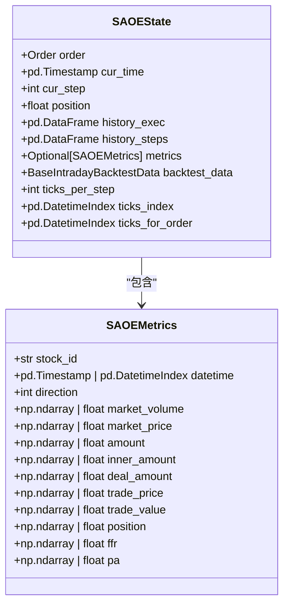
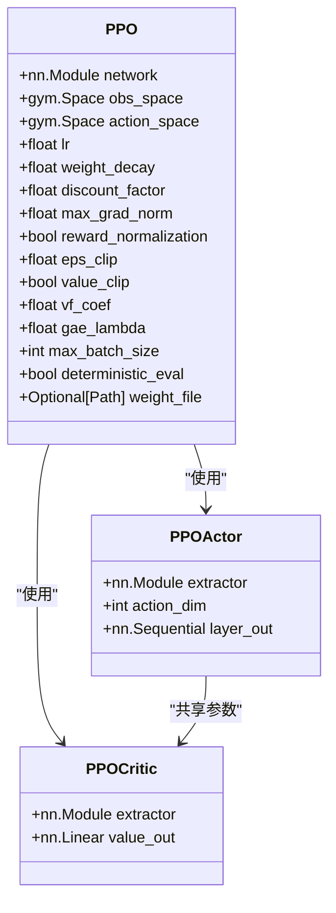
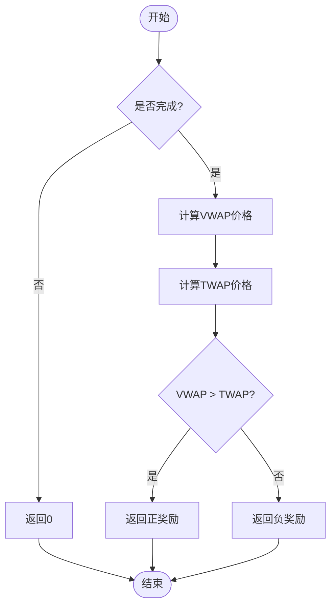
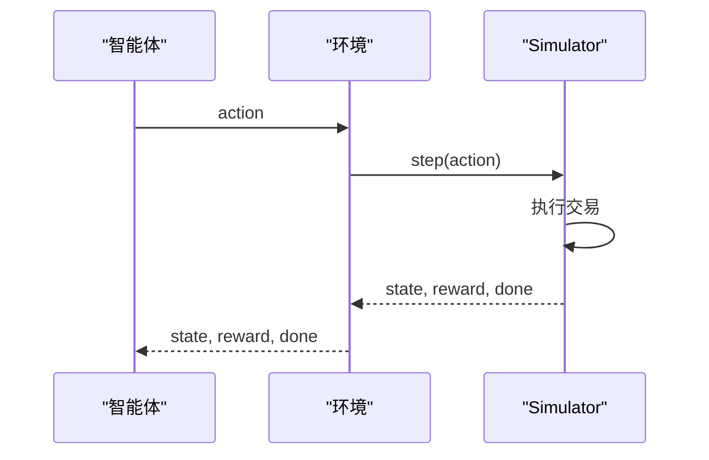
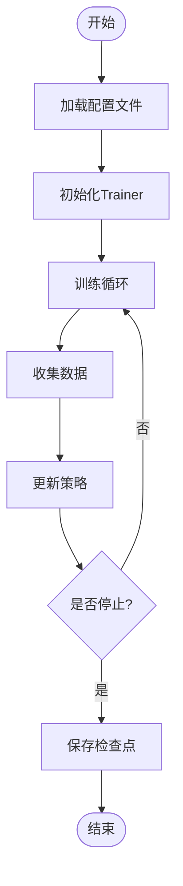
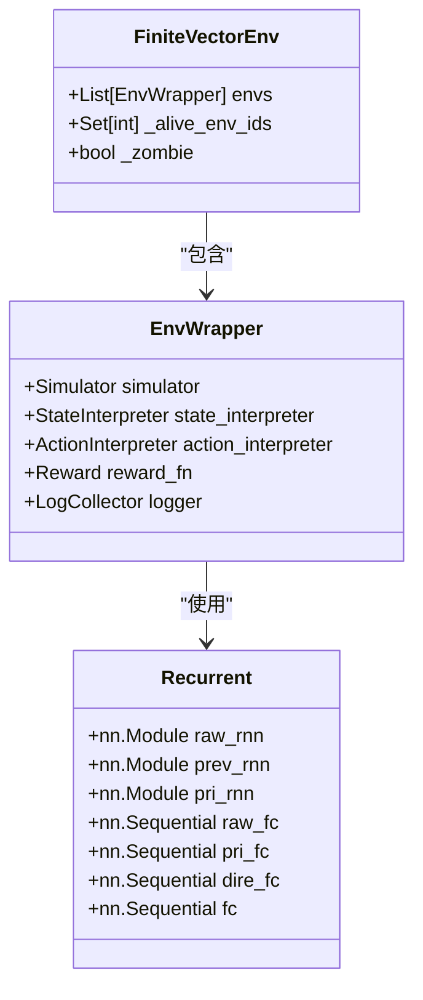

# 强化学习

<cite>
**本文档引用的文件**   
- [state.py](file://qlib/rl/order_execution/state.py)
- [policy.py](file://qlib/rl/order_execution/policy.py)
- [reward.py](file://qlib/rl/order_execution/reward.py)
- [simulator_qlib.py](file://qlib/rl/order_execution/simulator_qlib.py)
- [network.py](file://qlib/rl/order_execution/network.py)
- [env_wrapper.py](file://qlib/rl/utils/env_wrapper.py)
- [finite_env.py](file://qlib/rl/utils/finite_env.py)
- [trainer.py](file://qlib/rl/trainer/trainer.py)
- [interpreter.py](file://qlib/rl/order_execution/interpreter.py)
- [strategy.py](file://qlib/rl/order_execution/strategy.py)
- [train_ppo.yml](file://examples/rl_order_execution/exp_configs/train_ppo.yml)
- [backtest_ppo.yml](file://examples/rl_order_execution/exp_configs/backtest_ppo.yml)
</cite>

## 目录
1. [引言](#引言)
2. [订单执行场景的马尔可夫决策过程建模](#订单执行场景的马尔可夫决策过程建模)
3. [状态空间设计](#状态空间设计)
4. [策略网络与动作空间](#策略网络与动作空间)
5. [奖励函数设计](#奖励函数设计)
6. [与Qlib回测系统的集成](#与qlib回测系统的集成)
7. [训练流程配置](#训练流程配置)
8. [网络结构与环境包装](#网络结构与环境包装)
9. [结论](#结论)

## 引言

本文档全面介绍强化学习框架在量化投资中的应用，重点聚焦于订单执行场景的建模方法。文档深入解析了`order_execution`模块中`state.py`、`policy.py`和`reward.py`的设计原理，阐明了如何构建符合金融交易约束的马尔可夫决策过程（MDP）。同时，文档阐述了`simulator_qlib.py`与Qlib回测系统的集成机制，确保仿真环境的真实性。此外，文档详细说明了`trainer.py`中的训练流程配置，并结合`train_ppo.yml`和`backtest_ppo.yml`展示了从训练到回测的完整工作流。最后，文档提供了网络结构定义（`network.py`）、环境包装（`env_wrapper.py`）和有限环境（`finite_env.py`）的高级用法与调试技巧。

## 订单执行场景的马尔可夫决策过程建模

在量化投资中，订单执行是一个关键环节，其目标是在最小化市场冲击和交易成本的同时，高效地完成大额订单的交易。强化学习提供了一种有效的框架来解决这一问题，通过将订单执行过程建模为马尔可夫决策过程（MDP），可以利用智能体在与环境的交互中学习最优的执行策略。

在Qlib框架中，订单执行的MDP建模主要由以下几个核心组件构成：状态（State）、动作（Action）、奖励（Reward）和环境（Environment）。这些组件共同构成了一个完整的强化学习系统，用于训练和评估订单执行策略。

**Section sources**
- [state.py](file://qlib/rl/order_execution/state.py#L1-L102)
- [policy.py](file://qlib/rl/order_execution/policy.py#L1-L238)
- [reward.py](file://qlib/rl/order_execution/reward.py#L1-L100)

## 状态空间设计

状态空间的设计是构建有效MDP的关键。在订单执行场景中，状态需要包含足够的信息，以便智能体能够做出合理的决策。`state.py`文件定义了`SAOEState`类，该类封装了订单执行过程中所需的所有状态信息。

`SAOEState`类的主要属性包括：
- `order`: 当前处理的订单。
- `cur_time`: 当前时间。
- `cur_step`: 当前步骤。
- `position`: 当前剩余的交易量。
- `history_exec`: 历史执行记录。
- `history_steps`: 历史步骤记录。
- `metrics`: 日度指标，仅在交易完成时可用。
- `backtest_data`: 回测数据，包含时间索引和原始数据。
- `ticks_per_step`: 每个步骤的tick数。
- `ticks_index`: 全天的交易tick。
- `ticks_for_order`: 订单相关的交易tick。

这些属性共同构成了智能体的状态表示，使其能够全面了解当前的市场状况和订单执行进度。

**Diagram sources **
- [state.py](file://qlib/rl/order_execution/state.py#L70-L102)

**Section sources**
- [state.py](file://qlib/rl/order_execution/state.py#L1-L102)

## 策略网络与动作空间

策略网络是强化学习系统的核心，负责根据当前状态生成动作。`policy.py`文件定义了多种策略，包括`AllOne`、`PPO`和`DQN`。其中，`PPO`（Proximal Policy Optimization）是一种常用的策略梯度方法，适用于连续和离散动作空间。

`PPO`类通过封装Tianshou的`PPOPolicy`，提供了自动创建actor和critic网络的功能，并支持加载预训练权重。`PPOActor`和`PPOCritic`分别负责生成动作和评估状态价值，它们共享一个特征提取器（`extractor`），以减少参数冗余。

动作空间的设计同样重要，它决定了智能体可以采取的动作范围。`CategoricalActionInterpreter`类将离散的动作转换为连续的交易量，使得智能体可以在不同的交易比例之间进行选择。例如，如果`values`参数设置为4，则智能体可以选择0%、25%、50%、75%或100%的订单量进行交易。

**Diagram sources **
- [policy.py](file://qlib/rl/order_execution/policy.py#L69-L159)

**Section sources**
- [policy.py](file://qlib/rl/order_execution/policy.py#L1-L238)
- [interpreter.py](file://qlib/rl/order_execution/interpreter.py#L199-L231)

## 奖励函数设计

奖励函数的设计直接影响智能体的学习效果。`reward.py`文件定义了两种奖励函数：`PAPenaltyReward`和`PPOReward`。

`PAPenaltyReward`鼓励更高的价格优势（PA），但同时对短时间内大量交易施加惩罚。具体来说，每个时间步的奖励为：$PA_t * vol_t / target - vol_t^2 * penalty$。这种设计有助于平衡交易速度和市场冲击。

`PPOReward`则基于论文《An End-to-End Optimal Trade Execution Framework based on Proximal Policy Optimization》提出的奖励机制。它在订单执行结束时计算奖励，通过比较VWAP价格和TWAP价格来评估执行效果。如果VWAP价格优于TWAP价格，则给予正奖励；否则给予负奖励。

**Diagram sources **
- [reward.py](file://qlib/rl/order_execution/reward.py#L53-L100)

**Section sources**
- [reward.py](file://qlib/rl/order_execution/reward.py#L1-L100)

## 与Qlib回测系统的集成

为了确保仿真环境的真实性，`simulator_qlib.py`文件实现了与Qlib回测系统的集成。`SingleAssetOrderExecution`类继承自`Simulator`，利用Qlib的回测工具来模拟订单执行过程。

该类通过`reset`方法初始化回测环境，并通过`step`方法执行每一步的交易。`get_state`方法返回当前的状态，`done`方法检查交易是否完成。通过这种方式，强化学习智能体可以在一个高度真实的环境中进行训练和测试。

**Diagram sources **
- [simulator_qlib.py](file://qlib/rl/order_execution/simulator_qlib.py#L19-L142)

**Section sources**
- [simulator_qlib.py](file://qlib/rl/order_execution/simulator_qlib.py#L1-L142)

## 训练流程配置

`trainer.py`文件定义了`Trainer`类，用于管理整个训练过程。`Trainer`类通过`fit`方法启动训练，`test`方法进行测试。训练过程中，`Trainer`会定期保存检查点，并在验证集上评估模型性能。

`train_ppo.yml`和`backtest_ppo.yml`是两个重要的配置文件。`train_ppo.yml`定义了训练参数，如并发数、策略类型、网络结构等。`backtest_ppo.yml`则定义了回测参数，如订单文件、时间范围、数据粒度等。通过这些配置文件，用户可以方便地调整实验设置，进行大规模的实验。

**Diagram sources **
- [trainer.py](file://qlib/rl/trainer/trainer.py#L30-L356)
- [train_ppo.yml](file://examples/rl_order_execution/exp_configs/train_ppo.yml#L1-L68)
- [backtest_ppo.yml](file://examples/rl_order_execution/exp_configs/backtest_ppo.yml#L1-L54)

**Section sources**
- [trainer.py](file://qlib/rl/trainer/trainer.py#L1-L356)
- [train_ppo.yml](file://examples/rl_order_execution/exp_configs/train_ppo.yml#L1-L68)
- [backtest_ppo.yml](file://examples/rl_order_execution/exp_configs/backtest_ppo.yml#L1-L54)

## 网络结构与环境包装

`network.py`文件定义了`Recurrent`类，这是一个基于RNN的网络结构，用于处理序列数据。`Recurrent`类通过`raw_rnn`、`prev_rnn`和`pri_rnn`三个RNN模块分别处理公共变量、私有变量和方向相关特征，最终通过全连接层输出动作。

`env_wrapper.py`文件定义了`EnvWrapper`类，用于包装强化学习环境。`EnvWrapper`类继承自`gym.Env`，将模拟器、状态解释器、动作解释器和奖励函数等组件封装在一起，形成一个标准的强化学习环境。`finite_env.py`文件则定义了`FiniteVectorEnv`类，用于支持有限环境的向量化，确保每个环境只被使用一次。

**Diagram sources **
- [network.py](file://qlib/rl/order_execution/network.py#L19-L120)
- [env_wrapper.py](file://qlib/rl/utils/env_wrapper.py#L51-L251)
- [finite_env.py](file://qlib/rl/utils/finite_env.py#L89-L370)

**Section sources**
- [network.py](file://qlib/rl/order_execution/network.py#L1-L141)
- [env_wrapper.py](file://qlib/rl/utils/env_wrapper.py#L1-L251)
- [finite_env.py](file://qlib/rl/utils/finite_env.py#L1-L370)

## 结论

本文档全面介绍了强化学习框架在量化投资中的应用，特别是订单执行场景的建模方法。通过深入解析`order_execution`模块中的核心组件，我们展示了如何构建符合金融交易约束的马尔可夫决策过程。文档还详细说明了与Qlib回测系统的集成机制，确保了仿真环境的真实性。通过`train_ppo.yml`和`backtest_ppo.yml`配置文件，用户可以轻松地进行从训练到回测的完整工作流。最后，文档提供了网络结构定义、环境包装和有限环境的高级用法与调试技巧，为研究人员和开发者提供了宝贵的参考。