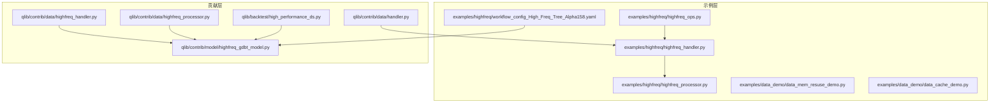
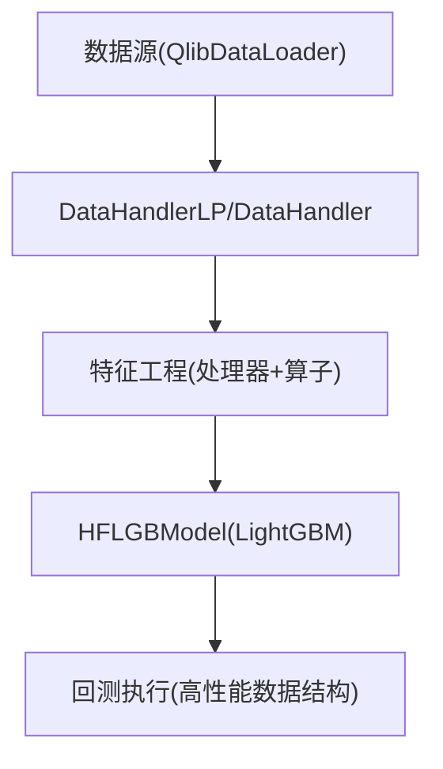
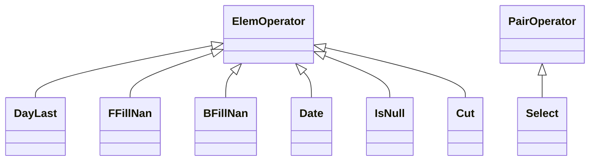
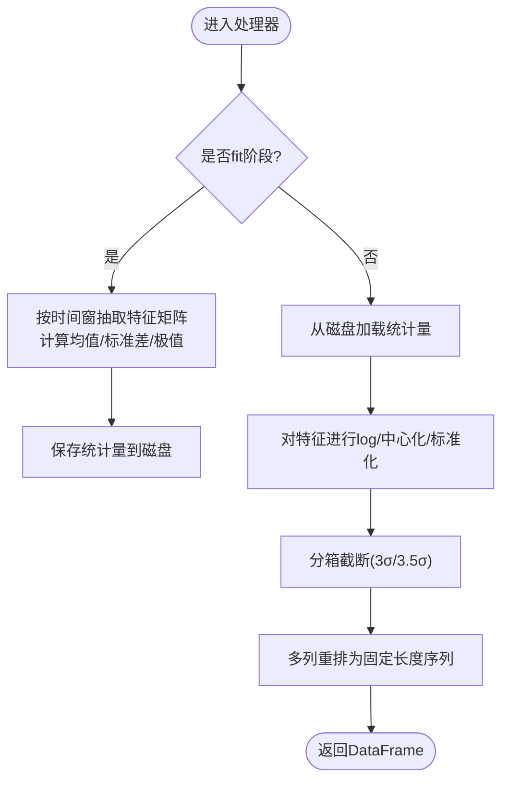
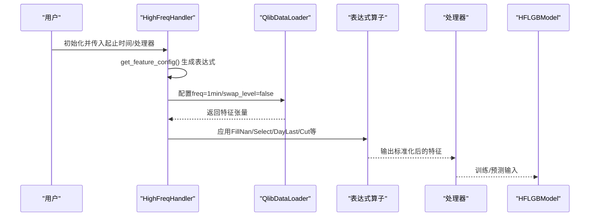
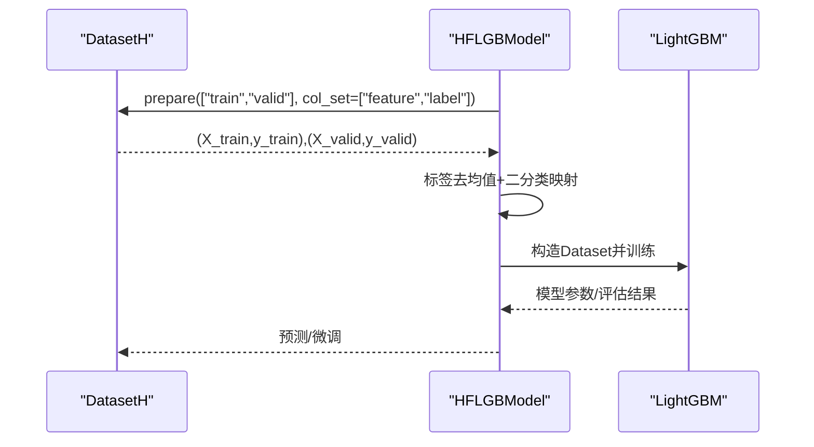
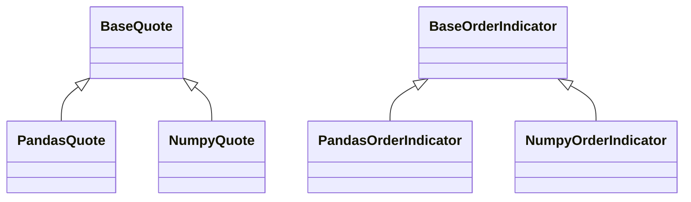
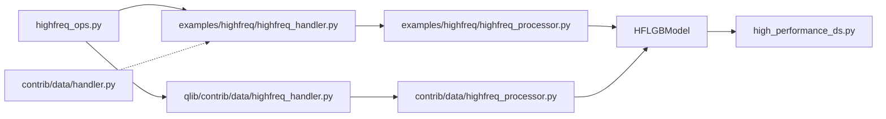

# 高频交易

<cite>
**本文引用的文件**
- [examples/highfreq/highfreq_ops.py](file://examples/highfreq/highfreq_ops.py)
- [examples/highfreq/highfreq_handler.py](file://examples/highfreq/highfreq_handler.py)
- [examples/highfreq/highfreq_processor.py](file://examples/highfreq/highfreq_processor.py)
- [examples/highfreq/workflow_config_High_Freq_Tree_Alpha158.yaml](file://examples/highfreq/workflow_config_High_Freq_Tree_Alpha158.yaml)
- [examples/data_demo/data_mem_resuse_demo.py](file://examples/data_demo/data_mem_resuse_demo.py)
- [examples/data_demo/data_cache_demo.py](file://examples/data_demo/data_cache_demo.py)
- [qlib/contrib/data/highfreq_handler.py](file://qlib/contrib/data/highfreq_handler.py)
- [qlib/contrib/data/highfreq_processor.py](file://qlib/contrib/data/highfreq_processor.py)
- [qlib/contrib/model/highfreq_gdbt_model.py](file://qlib/contrib/model/highfreq_gdbt_model.py)
- [qlib/backtest/high_performance_ds.py](file://qlib/backtest/high_performance_ds.py)
- [qlib/contrib/data/handler.py](file://qlib/contrib/data/handler.py)
</cite>

## 目录
1. [简介](#简介)
2. [项目结构](#项目结构)
3. [核心组件](#核心组件)
4. [架构总览](#架构总览)
5. [详细组件分析](#详细组件分析)
6. [依赖关系分析](#依赖关系分析)
7. [性能考量](#性能考量)
8. [故障排查指南](#故障排查指南)
9. [结论](#结论)
10. [附录](#附录)

## 简介
本文件面向高频交易场景，系统性梳理高频数据处理架构与性能优化技术，重点围绕以下目标展开：
- 深入解析 highfreq_ops.py 中的核心算子（如按日归一、前向填充、反向填充、日期映射、条件选择、空值判断、截断等）在微秒级数据处理中的应用路径与窗口扩展策略。
- 阐述 highfreq_handler.py 与 qlib.contrib.data.highfreq_handler.py 的设计模式与数据流处理机制，包括特征配置生成、标准化与缺失值处理、暂停交易剔除、时间窗口裁剪等。
- 基于 workflow_config_High_Freq_Tree_Alpha158.yaml 展示如何构建高频特征工程流水线，并说明与标准数据模块的集成方式及在回测系统中的特殊处理逻辑。
- 提供常见性能瓶颈的诊断方法与优化建议，结合 data_mem_resuse_demo.py 与 data_cache_demo.py 的内存复用与缓存策略实践。

## 项目结构
高频相关代码主要分布在 examples/highfreq 与 qlib/contrib 两个层次：
- examples/highfreq：提供示例级高频算子、处理器与工作流配置，便于快速上手与演示。
- qlib/contrib：提供生产级高频处理器、高频回测处理器与高频模型适配器，强调可扩展性与工程化。

图表来源
- [examples/highfreq/highfreq_ops.py](file://examples/highfreq/highfreq_ops.py#L1-L168)
- [examples/highfreq/highfreq_handler.py](file://examples/highfreq/highfreq_handler.py#L1-L159)
- [examples/highfreq/highfreq_processor.py](file://examples/highfreq/highfreq_processor.py#L1-L77)
- [examples/highfreq/workflow_config_High_Freq_Tree_Alpha158.yaml](file://examples/highfreq/workflow_config_High_Freq_Tree_Alpha158.yaml#L1-L65)
- [examples/data_demo/data_mem_resuse_demo.py](file://examples/data_demo/data_mem_resuse_demo.py#L1-L60)
- [examples/data_demo/data_cache_demo.py](file://examples/data_demo/data_cache_demo.py#L1-L55)
- [qlib/contrib/data/highfreq_handler.py](file://qlib/contrib/data/highfreq_handler.py#L1-L540)
- [qlib/contrib/data/highfreq_processor.py](file://qlib/contrib/data/highfreq_processor.py#L1-L81)
- [qlib/contrib/model/highfreq_gdbt_model.py](file://qlib/contrib/model/highfreq_gdbt_model.py#L1-L172)
- [qlib/backtest/high_performance_ds.py](file://qlib/backtest/high_performance_ds.py#L1-L659)
- [qlib/contrib/data/handler.py](file://qlib/contrib/data/handler.py#L1-L158)

章节来源
- [examples/highfreq/highfreq_ops.py](file://examples/highfreq/highfreq_ops.py#L1-L168)
- [examples/highfreq/highfreq_handler.py](file://examples/highfreq/highfreq_handler.py#L1-L159)
- [examples/highfreq/highfreq_processor.py](file://examples/highfreq/highfreq_processor.py#L1-L77)
- [examples/highfreq/workflow_config_High_Freq_Tree_Alpha158.yaml](file://examples/highfreq/workflow_config_High_Freq_Tree_Alpha158.yaml#L1-L65)
- [examples/data_demo/data_mem_resuse_demo.py](file://examples/data_demo/data_mem_resuse_demo.py#L1-L60)
- [examples/data_demo/data_cache_demo.py](file://examples/data_demo/data_cache_demo.py#L1-L55)
- [qlib/contrib/data/highfreq_handler.py](file://qlib/contrib/data/highfreq_handler.py#L1-L540)
- [qlib/contrib/data/highfreq_processor.py](file://qlib/contrib/data/highfreq_processor.py#L1-L81)
- [qlib/contrib/model/highfreq_gdbt_model.py](file://qlib/contrib/model/highfreq_gdbt_model.py#L1-L172)
- [qlib/backtest/high_performance_ds.py](file://qlib/backtest/high_performance_ds.py#L1-L659)
- [qlib/contrib/data/handler.py](file://qlib/contrib/data/handler.py#L1-L158)

## 核心组件
- 高频算子库（highfreq_ops.py）
  - DayLast：按日分组取序列末值，用于日基准归一化。
  - FFillNan/BFillNan：前向/后向填充缺失值。
  - Date：从索引提取对应日期。
  - Select：基于条件选择目标序列。
  - IsNull：判断空值。
  - Cut：对序列进行前后截断，控制有效窗口大小。
- 高频处理器（highfreq_processor.py）
  - HighFreqNorm：对价格与成交量进行中位数-MAD标准化与分箱截断，同时将多列重塑为固定长度序列以适配RL执行器。
- 高频处理器（contrib）
  - HighFreqTrans/HighFreqNorm：将特征转换为紧凑类型或持久化统计量并进行在线标准化。
- 高频模型（contrib/model）
  - HFLGBModel：针对高频预测的LightGBM封装，支持二分类目标、按日去均值标签、信号测试与微调。

章节来源
- [examples/highfreq/highfreq_ops.py](file://examples/highfreq/highfreq_ops.py#L1-L168)
- [examples/highfreq/highfreq_processor.py](file://examples/highfreq/highfreq_processor.py#L1-L77)
- [qlib/contrib/data/highfreq_processor.py](file://qlib/contrib/data/highfreq_processor.py#L1-L81)
- [qlib/contrib/model/highfreq_gdbt_model.py](file://qlib/contrib/model/highfreq_gdbt_model.py#L1-L172)

## 架构总览
高频数据处理链路自下而上分为四层：
- 数据源与加载层：通过 DataHandlerLP/DataHandler 配置与加载器，按分钟频率读取特征与标签。
- 特征工程层：由高频处理器与表达式算子共同完成缺失值处理、暂停剔除、日基准归一化、窗口裁剪与重排。
- 训练/推理层：使用 HFLGBModel 进行训练与预测；支持按日去均值标签与信号评估。
- 回测执行层：利用高性能数据结构与指标聚合，支撑分钟级订单执行与指标汇总。

图表来源
- [examples/highfreq/highfreq_handler.py](file://examples/highfreq/highfreq_handler.py#L1-L159)
- [qlib/contrib/data/highfreq_handler.py](file://qlib/contrib/data/highfreq_handler.py#L1-L540)
- [qlib/contrib/model/highfreq_gdbt_model.py](file://qlib/contrib/model/highfreq_gdbt_model.py#L1-L172)
- [qlib/backtest/high_performance_ds.py](file://qlib/backtest/high_performance_ds.py#L1-L659)

## 详细组件分析

### 高频算子（highfreq_ops.py）
- 设计要点
  - 继承 ElemOperator/PairOperator，统一通过 _load_internal 加载底层序列并进行向量化操作。
  - Cut 支持 get_extended_window_size，向上游暴露额外预取窗口，确保滑动窗口计算的完整性。
- 典型流程（以 DayLast 为例）
  - 获取日历映射（按分钟频率划分日边界）。
  - 对当前序列按日分组，取每组最后一个值，形成日级别基准序列。
- 性能特性
  - 分组与重排操作在 pandas/numpy 上高效执行，适合分钟级长序列。
  - Cut 的窗口扩展避免重复加载，减少 IO 与内存拷贝。

图表来源
- [examples/highfreq/highfreq_ops.py](file://examples/highfreq/highfreq_ops.py#L1-L168)

章节来源
- [examples/highfreq/highfreq_ops.py](file://examples/highfreq/highfreq_ops.py#L1-L168)

### 高频处理器（examples vs contrib）
- examples/highfreq/highfreq_processor.py
  - 在 fit 阶段统计价格与成交量的中位数、MAD、极值范围；在 __call__ 阶段进行标准化与分箱截断，并将多列重塑为固定长度序列。
- qlib/contrib/data/highfreq_processor.py
  - HighFreqTrans：将特征转为紧凑类型（布尔/浮点），降低内存占用。
  - HighFreqNorm：将统计量持久化到磁盘，训练时仅需加载统计量，提升可重复性与速度。

图表来源
- [examples/highfreq/highfreq_processor.py](file://examples/highfreq/highfreq_processor.py#L1-L77)
- [qlib/contrib/data/highfreq_processor.py](file://qlib/contrib/data/highfreq_processor.py#L1-L81)

章节来源
- [examples/highfreq/highfreq_processor.py](file://examples/highfreq/highfreq_processor.py#L1-L77)
- [qlib/contrib/data/highfreq_processor.py](file://qlib/contrib/data/highfreq_processor.py#L1-L81)

### 高频处理器（DataHandler 配置与特征生成）
- examples/highfreq/highfreq_handler.py
  - 通过 get_feature_config 生成表达式字符串，组合 If/IsNull/Select/FFillNan/BFillNan/DayLast/Cut 等算子，构造开盘/最高/最低/收盘/VWAP 及滞后版本，以及成交量归一化。
  - HighFreqBacktestHandler 仅保留回测所需字段，避免冗余特征。
- qlib/contrib/data/highfreq_handler.py
  - 提供更通用的 HighFreqGeneralHandler/HighFreqGeneralBacktestHandler，支持自定义 day_length、列集合与 inst_processors。
  - HighFreqOrderHandler/HighFreqBacktestOrderHandler 面向订单簿数据，增加 bid/ask/volume 细分维度。

图表来源
- [examples/highfreq/highfreq_handler.py](file://examples/highfreq/highfreq_handler.py#L1-L159)
- [qlib/contrib/data/highfreq_handler.py](file://qlib/contrib/data/highfreq_handler.py#L1-L540)
- [qlib/contrib/model/highfreq_gdbt_model.py](file://qlib/contrib/model/highfreq_gdbt_model.py#L1-L172)

章节来源
- [examples/highfreq/highfreq_handler.py](file://examples/highfreq/highfreq_handler.py#L1-L159)
- [qlib/contrib/data/highfreq_handler.py](file://qlib/contrib/data/highfreq_handler.py#L1-L540)

### 高频模型（HFLGBModel）
- 关键能力
  - 支持 binary/mse 目标；将标签按日去均值后转为二分类任务。
  - 提供 hf_signal_test 评估正负样本精度与平均alpha。
  - 支持增量微调（finetune）。
- 训练流程
  - 从 DatasetH 准备训练/验证集，构造 LightGBM Dataset 并训练，记录早停与日志。

图表来源
- [qlib/contrib/model/highfreq_gdbt_model.py](file://qlib/contrib/model/highfreq_gdbt_model.py#L1-L172)

章节来源
- [qlib/contrib/model/highfreq_gdbt_model.py](file://qlib/contrib/model/highfreq_gdbt_model.py#L1-L172)

### 回测系统（高并发/低延迟数据结构）
- NumpyQuote
  - 使用 MultiData 结构缓存每个股票的时间序列，支持按时间片切片与聚合。
  - 对单时刻查询启用 LRU 缓存与直接索引访问，显著降低高频查询开销。
- 指标聚合
  - 提供 Pandas/Numpy 两类指标容器，支持按索引求和、平均、计数等操作，便于分钟级回测指标汇总。

图表来源
- [qlib/backtest/high_performance_ds.py](file://qlib/backtest/high_performance_ds.py#L1-L659)

章节来源
- [qlib/backtest/high_performance_ds.py](file://qlib/backtest/high_performance_ds.py#L1-L659)

## 依赖关系分析
- 算子与表达式
  - highfreq_ops.py 中的 ElemOperator/PairOperator 与 qlib.data.ops 中的基础算子保持一致的接口风格，便于统一调度与缓存。
- 处理器与 DataHandler
  - examples/highfreq/highfreq_handler.py 与 qlib/contrib/data/highfreq_handler.py 共同构成高频特征配置生成的两条路径：示例级与贡献级。
  - qlib/contrib.data.handler 提供 Alpha158/Alpha360 等标准数据处理器，作为对比参考。
- 模型与回测
  - HFLGBModel 依赖 DatasetH 与 DataHandlerLP，回测侧依赖 high_performance_ds 的高效数据结构。

图表来源
- [examples/highfreq/highfreq_ops.py](file://examples/highfreq/highfreq_ops.py#L1-L168)
- [examples/highfreq/highfreq_handler.py](file://examples/highfreq/highfreq_handler.py#L1-L159)
- [examples/highfreq/highfreq_processor.py](file://examples/highfreq/highfreq_processor.py#L1-L77)
- [qlib/contrib/data/highfreq_handler.py](file://qlib/contrib/data/highfreq_handler.py#L1-L540)
- [qlib/contrib/data/highfreq_processor.py](file://qlib/contrib/data/highfreq_processor.py#L1-L81)
- [qlib/contrib/model/highfreq_gdbt_model.py](file://qlib/contrib/model/highfreq_gdbt_model.py#L1-L172)
- [qlib/backtest/high_performance_ds.py](file://qlib/backtest/high_performance_ds.py#L1-L659)
- [qlib/contrib/data/handler.py](file://qlib/contrib/data/handler.py#L1-L158)

章节来源
- [examples/highfreq/highfreq_ops.py](file://examples/highfreq/highfreq_ops.py#L1-L168)
- [examples/highfreq/highfreq_handler.py](file://examples/highfreq/highfreq_handler.py#L1-L159)
- [examples/highfreq/highfreq_processor.py](file://examples/highfreq/highfreq_processor.py#L1-L77)
- [qlib/contrib/data/highfreq_handler.py](file://qlib/contrib/data/highfreq_handler.py#L1-L540)
- [qlib/contrib/data/highfreq_processor.py](file://qlib/contrib/data/highfreq_processor.py#L1-L81)
- [qlib/contrib/model/highfreq_gdbt_model.py](file://qlib/contrib/model/highfreq_gdbt_model.py#L1-L172)
- [qlib/backtest/high_performance_ds.py](file://qlib/backtest/high_performance_ds.py#L1-L659)
- [qlib/contrib/data/handler.py](file://qlib/contrib/data/handler.py#L1-L158)

## 性能考量
- 内存复用与缓存
  - data_mem_resuse_demo.py 展示通过 DataHandlerLP 将已处理的数据在内存中复用，避免重复加载与预处理，从而缩短训练时长。
  - data_cache_demo.py 展示将 DataHandler 序列化为文件，后续任务直接以文件路径引用，进一步减少初始化成本。
- 窗口扩展与预取
  - Cut 的 get_extended_window_size 向上游暴露额外窗口，减少边界缺失导致的重复加载。
- 类型与存储优化
  - HighFreqTrans 将布尔/浮点特征转为紧凑类型，降低内存占用。
  - HighFreqNorm 将统计量持久化到磁盘，训练时仅加载统计量，避免重复计算。
- 查询与回测
  - NumpyQuote 的 LRU 缓存与直接索引访问，显著降低高频查询延迟；按日去均值标签与二分类映射减少模型训练复杂度。

章节来源
- [examples/data_demo/data_mem_resuse_demo.py](file://examples/data_demo/data_mem_resuse_demo.py#L1-L60)
- [examples/data_demo/data_cache_demo.py](file://examples/data_demo/data_cache_demo.py#L1-L55)
- [examples/highfreq/highfreq_ops.py](file://examples/highfreq/highfreq_ops.py#L150-L168)
- [examples/highfreq/highfreq_processor.py](file://examples/highfreq/highfreq_processor.py#L1-L77)
- [qlib/contrib/data/highfreq_processor.py](file://qlib/contrib/data/highfreq_processor.py#L1-L81)
- [qlib/backtest/high_performance_ds.py](file://qlib/backtest/high_performance_ds.py#L150-L205)

## 故障排查指南
- 数据加载异常
  - 确认 DataHandlerLP 的起止时间与频率设置正确；检查 QlibDataLoader 的 swap_level 与 freq 是否匹配。
  - 若出现空数据，检查表达式中 If/IsNull/Select 的嵌套顺序与 Cut 的窗口是否合理。
- 标签与特征不一致
  - HFLGBModel 要求标签按日去均值并映射为二分类；若报错提示空数据，请确认标签列存在且非空。
- 回测指标缺失
  - 检查回测期是否覆盖完整交易日；确认 NumpyQuote 的 get_data 方法未被错误地跳过单时刻路径。
- 性能瓶颈定位
  - 使用 data_cache_demo 的方式对比有无缓存的训练耗时差异。
  - 使用 data_mem_resuse_demo 的方式对比重复训练时的耗时差异。
  - 检查 Cut 的窗口是否过大导致预取过多数据；适当缩小窗口或调整 day_length。

章节来源
- [examples/highfreq/highfreq_handler.py](file://examples/highfreq/highfreq_handler.py#L1-L159)
- [qlib/contrib/model/highfreq_gdbt_model.py](file://qlib/contrib/model/highfreq_gdbt_model.py#L1-L172)
- [qlib/backtest/high_performance_ds.py](file://qlib/backtest/high_performance_ds.py#L150-L205)
- [examples/data_demo/data_mem_resuse_demo.py](file://examples/data_demo/data_mem_resuse_demo.py#L1-L60)
- [examples/data_demo/data_cache_demo.py](file://examples/data_demo/data_cache_demo.py#L1-L55)

## 结论
高频交易数据处理的关键在于“表达式驱动的特征工程 + 高效的数据结构 + 工程化的缓存与内存复用”。通过 highfreq_ops.py 的算子体系、highfreq_handler.py 的特征配置与 highfreq_processor.py 的标准化流程，配合 HFLGBModel 的二分类目标与回测执行器的高性能数据结构，可在分钟级数据上实现稳定、可扩展且高效的特征工程与建模流程。

## 附录

### 基于 workflow_config_High_Freq_Tree_Alpha158.yaml 的配置说明
- 数据初始化与市场区间
  - provider_uri 指向分钟级数据目录；market、start_time、end_time 定义全周期范围。
- 数据处理器
  - freq 设置为 1min；infer_processors 包含 RobustZScoreNorm 与 Fillna；learn_processors 包含 DropnaLabel 与 CSRankNorm(label)。
- 标签定义
  - label 使用相对平移比值，作为二分类目标的前置条件。
- 模型与数据集
  - 模型类 HFLGBModel，指定 objective、metric、学习率、树深度、叶子数、正则等超参。
  - DatasetH 使用 Alpha158 处理器，按 train/valid/test 切分时间段。
- 记录器
  - SignalRecord 与 HFSignalRecord 用于输出信号与高频信号记录。

章节来源
- [examples/highfreq/workflow_config_High_Freq_Tree_Alpha158.yaml](file://examples/highfreq/workflow_config_High_Freq_Tree_Alpha158.yaml#L1-L65)
- [qlib/contrib/data/handler.py](file://qlib/contrib/data/handler.py#L98-L158)